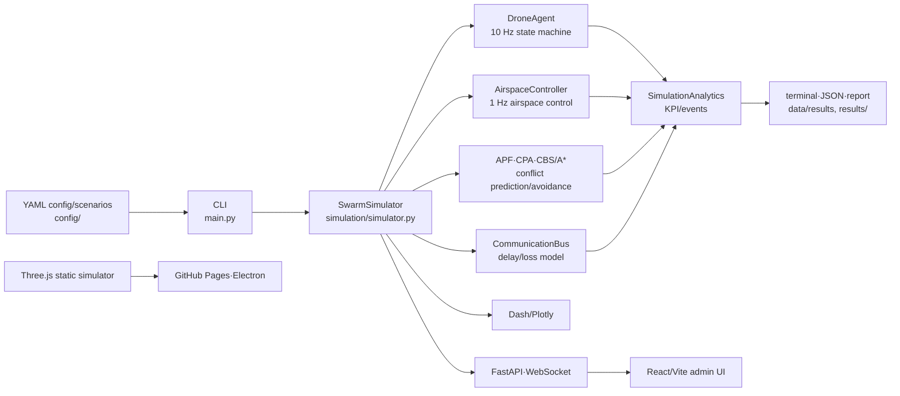

<div align="center">

# SDACS
## Swarm Drone Airspace Control System

A research and education platform for swarm-drone airspace-control simulation · Capstone Design, Dept. of Drone Mechanical Engineering, Mokpo National University

[](https://www.python.org/)
[](VERSION.md)
[](https://github.com/sun475300-sudo/swarm-drone-atc/actions/workflows/ci.yml)
[](https://sun475300-sudo.github.io/swarm-drone-atc/)
[](LICENSE)

[**Launch 3D Simulator**](https://sun475300-sudo.github.io/swarm-drone-atc/simulator.html) · [Maritime Detection Simulator](https://sun475300-sudo.github.io/swarm-drone-atc/maritime_detection_simulator.html) · [Download Web Package](https://github.com/sun475300-sudo/swarm-drone-atc/releases/tag/simulator-web-2026-07-30) · [Documentation Index](docs/INDEX.md) · [한국어](README.md)

</div>


> **Scope and honesty note**: SDACS is a research and education project centred on a SimPy-based discrete-event simulator and browser 3D visualisation tools. All performance figures, scenarios, and regulatory/standards modules here are simulation or prototype validation values. They are **not** the basis for actual flight-safety certification, operational approval, regulatory compliance determination, or a commercial air-traffic-control service.

## Table of Contents

- [Project at a Glance](#project-at-a-glance)
- [Current Status](#current-status)
- [Which Interface Should I Use?](#which-interface-should-i-use)
- [Architecture and Data Flow](#architecture-and-data-flow)
- [Requirements and Installation](#requirements-and-installation)
- [Quick Start](#quick-start)
- [Full CLI Reference](#full-cli-reference)
- [Scenarios and Configuration](#scenarios-and-configuration)
- [Web Simulator](#web-simulator)
- [FastAPI and React Dashboard](#fastapi-and-react-dashboard)
- [Reproducible Benchmarks](#reproducible-benchmarks)
- [Build and Deploy](#build-and-deploy)
- [Outputs and Generated Files](#outputs-and-generated-files)
- [Verification and CI](#verification-and-ci)
- [Repository Map](#repository-map)
- [Maturity and Known Limitations](#maturity-and-known-limitations)
- [Troubleshooting](#troubleshooting)
- [Documentation and Research Assets](#documentation-and-research-assets)
- [Open Work](#open-work)
- [Contributing, Security, and Citation](#contributing-security-and-citation)

## Project at a Glance

SDACS is not a single application but a collection of tools that explore the same domain at multiple depths.

| Capability | Implementation | Current Use |
|---|---|---|
| Discrete-event swarm simulation | SimPy, NumPy, APF, CBS/A*, CPA-based conflict prediction and avoidance | Repeatable research experiments and regression validation |
| Airspace and drone model | Drone state machine, priority, communication bus, weather/fault injection, flight clearance | Algorithm unit and integration experiments |
| Scenario execution | 10 runtime YAML scenarios, quick/full Monte Carlo | Nominal, high-density, comms-loss, weather, and intrusion experiments |
| Public benchmarks | 7 standard + 3 stress scenarios, ORCA/VO/CBS/SDACS adapters | Reproducible cross-method comparison |
| Browser visualisation | Three.js swarm-drone and maritime small-vessel detection simulators | Demo, education, UI and interaction experiments |
| Python visualisation | Dash/Plotly 3D dashboard | Python analysis and demo |
| Service experiment | FastAPI, WebSocket, JWT/RBAC, React/Vite | Service-architecture prototype for airspace managers |
| Desktop packaging | Electron Builder, Windows/macOS/Linux targets | Offline executable production |
| Reproducibility and ops assets | Docker, Helm, monitoring config, CI, canonical hash | Reproducibility and deployment-structure review |
| Auxiliary application | Rule-based/local-vLLM bonded-warehouse chatbot | Separate industry–academia/education demo; isolated from ATC core runtime |

## Current Status

The repository was last audited on **2026-07-30 (KST)**. For the latest source and automated verification results, use [`main`](https://github.com/sun475300-sudo/swarm-drone-atc/commits/main) and [GitHub Actions](https://github.com/sun475300-sudo/swarm-drone-atc/actions) as the primary reference.

| Status | Item | Verified State |
|:---:|---|---|
| ✅ | Project version | `1.5.0` per `pyproject.toml` and `package.json` |
| ✅ | Default branch | `main` — local HEAD and `origin/main` agree at the reference commit |
| ✅ | GitHub Actions | Python 3.10/3.11/3.12 CI, security audit, canonical hash, simulator smoke, and Pages deployment gate running |
| ✅ | GitHub Pages | Root, 3D simulator, and maritime simulator returned HTTP 200 |
| ✅ | Web release | [SDACS Web Simulator (2026-07-30)](https://github.com/sun475300-sudo/swarm-drone-atc/releases/tag/simulator-web-2026-07-30) static ZIP published with verifiable SHA-256 |
| ✅ | Python regression | Python 3.10 / 3.11 / 3.12, limited lint, mypy, 80% coverage gate passed |
| ✅ | Python package | After wheel install: `sdacs --help`, scenario list, 2-drone 0.2 s simulation smoke run succeeded |
| ✅ | JavaScript core package | `packages/core` CPA/APF pure-ESM 8 tests passed; `@sdacs/core` npm tarball dry-run succeeded |
| ✅ | Federated browser E2E | Two `ws_bridge` instances and two Chromium pages rendered LIVE + adjacent-airspace ghost drones (6/4) successfully |
| ✅ | Local static artefacts | Canonical HTML, 3 copies, `build/simulator/` 2 files synchronised; `python scripts/build_simulator.py --check` passed |
| ⏳ | Desktop app | Electron 3-OS build workflow exists, but no installer is yet published in Releases |
| ⏳ | Real-world validation | No Pixhawk, Jetson, RTK, HITL, actual-flight, or regulatory-approval evidence yet |

The status table is a snapshot at a specific point in time. For long-term progress and outdated Phase figures, prefer the current code, CI, and this README's verification section over ROADMAP.md and historical check documents.

## Which Interface Should I Use?

| Goal | Recommended entry point | Default port | Required tools |
|---|---|---:|---|
| Run the algorithm as fast as possible | `python main.py simulate` | — | Python |
| Repeat YAML scenario experiments | `python main.py scenario ...` | — | Python |
| Single cross-method benchmark | `python main.py benchmark ...` | — | Python |
| Most complete visual demo | `python scripts/serve.py` | 8123 | Python + browser |
| Python 3D dashboard | `python main.py visualize` | 8050 | Python |
| API/WebSocket integration dev | `python main.py api` | 8000 | Python API deps |
| React airspace-manager UI | `cd frontend && npm run dev` | 3000 | Node.js |
| Installable desktop app | `npm start` or `npm run dist:*` | — | Node.js + Electron |
| Bonded-warehouse chatbot demo | `python main.py chatbot` | 8051 | Python |
| Full-stack container demo | `docker compose up` | 8050 | Docker |
| Reproduce paper/comparison experiments | `scripts/reproduce/*` or reproducible Docker image | — | Docker or Python |

## Architecture and Data Flow



The core Python execution path is as follows.

1. `main.py` parses command-line arguments.
2. `config/default_simulation.yaml` is read as the base; scenario YAML or CLI values override it.
3. `SwarmSimulator` assembles the SimPy environment, drone agents, airspace controller, path planner, and avoidance/comms/weather/analytics subsystems.
4. Each `DroneAgent` updates state, energy, and flight phase at 10 Hz by default; the airspace controller processes clearances and conflict resolution at 1 Hz by default.
5. Results are serialised as KPIs, events, comms statistics, benchmark metrics, or operations reports.

### Core vs Extension Paths

- **Core runtime**: [`simulation/simulator.py`](simulation/simulator.py), [`simulation/drone_agent.py`](simulation/drone_agent.py), [`src/airspace_control`](src/airspace_control), [`main.py`](main.py)
- **Service prototype**: [`api`](api), [`frontend`](frontend), [`src/storage`](src/storage), [`monitoring`](monitoring)
- **Research/feature experiments**: individual modules in `simulation/` and extension packages in `src/`. File presence alone does not imply integration into the core execution path.
- **Archived code**: [`archive`](archive) is excluded from default install, lint, and runtime judgement.
- **Static web runtime**: The Three.js simulator is a separate implementation from the Python SimPy runtime. Do not assume the two interfaces automatically share model state.

## Requirements and Installation

### Supported Environments

- Python **3.10 or later**; CI validates 3.10, 3.11, 3.12
- Node.js **22 recommended**; Electron and browser E2E CI use Node 22
- Latest Chromium-based browser; E2E uses Playwright Chromium
- Docker Engine 20.10+ and Docker Compose v2 are optional
- GPU acceleration is optional; the CPU path is the default

### Python Development Environment

```bash
git clone https://github.com/sun475300-sudo/swarm-drone-atc.git
cd swarm-drone-atc

python -m venv .venv

# Windows PowerShell
.\.venv\Scripts\Activate.ps1

# Linux/macOS
# source .venv/bin/activate

python -m pip install --upgrade pip
python -m pip install -e ".[dev]"
```

`.[dev]` is a development install tuned for core simulation, Dash, tests, and FastAPI regression. To also cover all API-server and report/visualisation dependencies in one step:

```bash
python -m pip install -r requirements.txt
python -m pip install -e .
```

| Installation goal | Command |
|---|---|
| Core runtime only | `python -m pip install -e .` |
| Development and testing | `python -m pip install -e ".[dev]"` |
| Full Python interfaces and API | `python -m pip install -r requirements.txt && python -m pip install -e .` |
| Optional PyTorch GPU features | `python -m pip install -e ".[gpu]"` |
| Pinned versions for paper reproduction | `python -m pip install -r requirements.lock.txt` |

`requirements.lock.txt` is a version-pinned file for reproduction experiments. Regular developers should use `pyproject.toml` or `requirements.txt`, and regenerate the lock file when updating dependencies.

After an editable or wheel install, the console entry point `sdacs <command>` is equivalent to `python main.py <command>`.

### Node.js Environment

The root `package.json` is for Electron and static-simulator E2E; `frontend/package.json` is for the React admin UI. They are separate installation directories.

```bash
# Electron + Playwright
npm ci

# React/Vite
cd frontend
npm ci
```

## Quick Start

### 1. Python Simulation

```bash
# 60 seconds, 20 drones, seed 42
python main.py simulate --duration 60 --drones 20 --seed 42

# Save KPIs to JSON
python main.py simulate --duration 60 --drones 20 --seed 42 \
  --output data/results/quickstart.json

# List and run a named scenario
python main.py scenario --list
python main.py scenario weather_disturbance --runs 3 --seed 42 --duration 120
```

### 2. Browser Simulator

```bash
# Serve the repository root over HTTP and open the swarm simulator
python scripts/serve.py

# Maritime small-vessel detection simulator
python scripts/serve.py --page maritime

# Suppress automatic browser launch
python scripts/serve.py --no-browser --port 8123
```

Opening the HTML directly with `file://` may prevent Three.js from loading due to ES module and browser CORS policies. Use the HTTP server, GitHub Pages, or the Electron app instead.

The browser simulator uses built-in demo data by default. To receive snapshots from the Python `SwarmSimulator`, run the WebSocket bridge separately and connect with `?live=1`.

```bash
# Terminal 1: default ws://127.0.0.1:8765
python -m pip install websockets
python simulation/ws_bridge.py --drones 50

# Terminal 2: static simulator
python scripts/serve.py --no-browser --port 8123
# Open http://127.0.0.1:8123/swarm_3d_simulator.html?live=1 in a browser
```

The bridge binds to loopback only by default. Do not expose unauthenticated telemetry to external networks.

### 3. Dash Dashboard and API

```bash
python main.py visualize --port 8050 --drones 30
python main.py api --host 127.0.0.1 --port 8000
```

After starting the server, API docs are at `http://127.0.0.1:8000/docs` and the health check at `http://127.0.0.1:8000/healthz`.

## Full CLI Reference

All commands support `python main.py <command> --help` for the latest options.

| Command | Purpose | Representative example |
|---|---|---|
| `simulate` | Single SimPy run with KPI summary | `python main.py simulate --duration 60 --drones 20 --seed 42` |
| `scenario` | List and repeat runtime YAML scenarios | `python main.py scenario high_density --runs 5` |
| `monte-carlo` | Quick/full configuration-combination sweep | `python main.py monte-carlo --mode quick` |
| `benchmark` | Fixed-scenario/method/seed comparison cell | `python main.py benchmark --scenario 01_corridor_crossing --method sdacs_hybrid --seed 0` |
| `visualize` | Dash/Plotly 3D dashboard | `python main.py visualize --port 8050 --drones 30` |
| `visualize-3d` | Open local Three.js simulator | `python main.py visualize-3d` |
| `chatbot` | Bonded-warehouse chatbot Dash app | `python main.py chatbot --engine rule --port 8051` |
| `chatbot-sim` | Chatbot terminal demo | `python main.py chatbot-sim` |
| `api` | FastAPI/WebSocket backend | `python main.py api --host 127.0.0.1 --port 8000` |
| `ops-report` | Delivery/traffic/weather/compliance operations report bundle | `python main.py ops-report --scenario demo --seed 42` |

### Repeated-Experiment Examples

```bash
# Development Monte Carlo sweep
python main.py monte-carlo --mode quick

# Single comparison result saved to an explicit path
python main.py benchmark \
  --scenario 02_dense_intersection \
  --method orca \
  --seed 7 \
  --hard-wall-s 120 \
  --output results/02_dense_intersection-orca-seed7.json

# Generate operations report JSON + Markdown + manifest
python main.py ops-report \
  --scenario seoul-evening \
  --city Seoul \
  --hour 18 \
  --capacity 180 \
  --out-dir data/e2e_reports
```

## Scenarios and Configuration

### 10 Runtime Scenarios

The scenarios read by `python main.py scenario --list` are YAML files in [`config/scenario_params`](config/scenario_params).

| Name | Core experiment |
|---|---|
| `nominal_baseline` | 10-drone low-density nominal baseline |
| `high_density` | 100-drone high-density traffic and throughput limits |
| `emergency_failure` | In-flight motor/battery/GPS/comms failures |
| `mass_takeoff` | 100-drone simultaneous take-off sequencing |
| `route_conflict` | Head-on, orthogonal, overtaking, and multi-convergence conflict geometries |
| `comms_loss` | Lost-link hover → RTL → landing protocol |
| `weather_disturbance` | Headwind, gusts, and altitude-layered wind shear |
| `adversarial_intrusion` | Non-cooperative intruder detection delay and false positives |
| `multi_city` | Parallel Seoul/Busan/Daegu airspace simulation |
| `swarm_autonomous_no_preplan` | Runtime autonomous navigation and avoidance without pre-planned routes |

Each YAML's `success_criteria` is a research acceptance criterion. Whether the code reads that key and whether tests enforce the criterion must be verified per scenario.

### Configuration Priority

1. [`config/default_simulation.yaml`](config/default_simulation.yaml): time, airspace, separation standards, drones, controller, CBS, output defaults
2. [`config/scenario_params`](config/scenario_params): per-scenario overlay overrides
3. CLI arguments: runtime values for duration, seed, drone count, repetitions, etc.

The default airspace is 10 km × 10 km, altitude 0–120 m AGL. Default separation standards are 50 m horizontal and 15 m vertical; conflict-prediction look-ahead is 90 s. These are current simulation defaults, not regulatory declarations.

### Runtime Scenarios vs Research Benchmarks

The two catalogues have different purposes and schemas.

| Category | Path | Count | How to run |
|---|---|---:|---|
| Operational/functional scenarios | `config/scenario_params/*.yaml` | 10 | `main.py scenario` |
| Paper comparison benchmarks | `benchmarks/scenarios/*/manifest.yaml` | 10 | `main.py benchmark`, `scripts/reproduce/*` |

Similar names do not convert automatically. Runtime YAML files are `SwarmSimulator` configuration overrides; benchmark manifests are separate contracts for same-condition cross-method comparison.

## Web Simulator

### Canonical Rule for the Main 3D Simulator

The root [`swarm_3d_simulator.html`](swarm_3d_simulator.html) is the canonical file. The build script synchronises it to the following copies.

- `visualization/swarm_3d_simulator.html`
- `docs/swarm_3d_simulator.html`
- `docs/simulator.html`
- Static deployment artefacts in `build/simulator/`

Always use the following commands instead of manual copying.

```bash
python scripts/build_simulator.py
python scripts/build_simulator.py --check
```

### Available Interfaces

- **Swarm 3D**: multiple drones, airspace layers, CPA/conflict display, weather/fault injection, missions, recording/replay, analysis view
- **Maritime detection**: radar, AIS, EO/IR, COLREG assist, detection tracks and scenarios
- **Public browser API**: `window._sdacs`; per-item maturity (`production`, `beta`, `mock`, `speculative`) is documented in [docs/SDACS_API.md](docs/SDACS_API.md)

A successful call or the mere existence of a function in `window._sdacs` does not imply integration with real sensors, external services, physical devices, or regulatory systems. In particular, `mock` and `speculative` APIs are for UI, contract, and education experiments.

## FastAPI and React Dashboard

### Backend

```bash
python -m pip install -r requirements.txt
python main.py api --host 127.0.0.1 --port 8000
```

| Interface | Role | Auth |
|---|---|---|
| `GET /healthz`, `GET /health` | Liveness, version, backend status | None |
| `POST /auth/token`, `/auth/refresh` | JWT issue and refresh | Credentials / refresh token |
| `GET /auth/me` | Current user and role | viewer or above |
| `GET /auth/audit` | Recent audit log | admin |
| `GET /api/airspace/snapshot` | Latest airspace snapshot | Currently public read |
| `GET /api/scenarios` | Scenario catalogue | Currently public read |
| `POST /api/scenarios/{id}/run` | Start scenario run | operator or above |
| `GET /api/runs/{run_id}` | Run status and metrics | Currently public read |
| `WS /ws/telemetry` | Telemetry send/receive | Development channel |

The role hierarchy is `admin > operator > viewer`. Development mode includes local demo accounts, but production environments must set the following variables.

```text
SDACS_PROD=1
SDACS_JWT_SECRET=<strong random secret>
SDACS_ADMIN_PASSWORD=<strong password>
SDACS_OPERATOR_PASSWORD=<strong password>
SDACS_VIEWER_PASSWORD=<strong password>
SDACS_TOKEN_TTL_S=3600
```

Do not commit secrets to `.env` or source; use the deployment environment's secret store.

### React Frontend

```bash
# Terminal 1
python main.py api --host 127.0.0.1 --port 8000

# Terminal 2
cd frontend
npm ci
npm run dev
```

The Vite dev server opens at `http://localhost:3000` and proxies `/api`, `/auth`, `/health`, and `/ws` to port 8000. Set `VITE_API_TARGET` or `VITE_API_BASE` to use a different backend.

```bash
cd frontend
npm test
npm run build
npm run preview
```

The current backend stores run state in memory; the frontend stores JWTs in `localStorage`. Before a production deployment, design persistent storage, multi-instance synchronisation, httpOnly cookie/CSRF, TLS, rate limiting, WebSocket authentication, and audit-log persistence.

## Reproducible Benchmarks

[`benchmarks`](benchmarks) contains 7 standard and 3 stress scenarios.

| Category | Scenarios |
|---|---|
| Standard | corridor crossing, dense intersection, emergency landing, no-fly zone, weather diversion, priority aircraft, communication loss |
| Stress | high density, failure cascade, adversarial swarm |
| Comparison methods | ORCA, VO, CBS, SDACS hybrid |

### Single Cell Run

```bash
python main.py benchmark \
  --scenario 01_corridor_crossing \
  --method sdacs_hybrid \
  --seed 0 \
  --output results/01_corridor_crossing-sdacs_hybrid-seed0.json
```

### Full Reproduction Sweep

```bash
# Local scripts
bash scripts/reproduce/run_one.sh 01_corridor_crossing sdacs_hybrid 42
bash scripts/reproduce/run_all.sh

# Reproducible container
docker build -t sdacs-repro:0.1.0 -f Dockerfile.reproducible .
docker run --rm -v "$(pwd)/results:/app/results" sdacs-repro:0.1.0 \
  bash scripts/reproduce/run_one.sh 01_corridor_crossing sdacs_hybrid 42
```

Representative metrics are defined in [`src/analytics/metrics.py`](src/analytics/metrics.py) and [Evaluation Metrics documentation](docs/paper/EVALUATION_METRICS.md).

| Metric | Meaning | Preferred direction |
|---|---|---|
| NMR | Near-miss rate per drone pair per hour | Lower is better |
| MSD | Minimum separation distance | Higher is better |
| PE | Path efficiency relative to straight-line path | Closer to 1 is better |
| MS | Total completion makespan | Lower is better |
| FT | Total drone flowtime sum | Lower is better |
| AU | Active aircraft ratio relative to airspace capacity | Interpret by objective |
| RID_CR | Remote ID valid time ratio | Higher is better |
| RTF | Simulation time / wall-clock time | Higher is better |

`config/seeds.yaml` defines canonical seeds 0–29 and a 420-run reference sweep (7 standard scenarios × 2 methods × 30 seeds). Record the commit SHA, configuration, seed, and Python/dependency versions alongside reproduction results.

## Build and Deploy

### Static Web Package

```bash
# Synchronise canonical file + generate build/simulator
python scripts/build_simulator.py

# Validate consistency without writing files
python scripts/build_simulator.py --check

# Local preview
python -m http.server 8123 --directory build/simulator
```

Opening `http://localhost:8123/` in a browser redirects to `simulator.html`. `build/simulator/` contains the main simulator, manifest, service worker, and local Three.js vendor files.

To skip building, download the [static web simulator ZIP](https://github.com/sun475300-sudo/swarm-drone-atc/releases/download/simulator-web-2026-07-30/SDACS-Simulator-Web-2026-07-30.zip), extract it, and serve over HTTP or a static host. SHA-256: `0C16EB7E1B1D75B00B53A126E22B346D3ECDFF2F3ECE4FCC26DD78B6A81666DA`.

GitHub Pages deploys `docs/`. `.github/workflows/deploy-pages.yml` synchronises the canonical simulator and Three.js vendor files to `docs/` before publishing.

### Electron Desktop

```bash
npm ci
npm run build:simulator
npm start

# Validate packaging structure only
npm run pack

# Platform-specific distribution files
npm run dist:win
npm run dist:mac
npm run dist:linux
```

Artefacts are written to `dist-desktop/` and excluded from Git. Pushing a `v*` tag to `origin` triggers the [Desktop Build workflow](.github/workflows/desktop-build.yml) to build Windows, macOS, and Linux packages and upload to a GitHub Release. Validate code signing, notarization, and SmartScreen/Gatekeeper behaviour separately before public release.

### Docker

```bash
docker compose build
docker compose up
# http://localhost:8050
```

The default container runs the Dash dashboard, mounting `config/` read-only and `results/` read-write. Use `Dockerfile.gpu` and `docker-compose.gpu.yml` for GPU, and `Dockerfile.reproducible` and `docker-compose.reproducible.yml` for paper reproduction.

### Deployment Options

| Target | Input | Output/service | Suitable for |
|---|---|---|---|
| GitHub Pages | `docs/` | Public static site | Demo and education |
| Static hosting | `build/simulator/` | HTML/PWA assets | Internal web or offline web |
| Electron | Root web assets + `desktop/` | EXE/DMG/AppImage | Installable demo |
| Docker Compose | Full Python stack | Dash 8050 | Reproducible local run |
| React + FastAPI | `frontend/`, `api/` | Admin UI + API | Service development |
| Helm | `helm/sdacs/` | Kubernetes templates | Infrastructure design review |

Helm, PostgreSQL/TimescaleDB, Redis, and monitoring config exist in the repository, but the default FastAPI run does not automatically use them. Real operational connections and failure recovery require separate integration work.

## Outputs and Generated Files

| Operation | Default or recommended location | Contents |
|---|---|---|
| `simulate --output` | User-specified JSON | Single-run KPIs |
| Monte Carlo | `data/results/` | Sweep results |
| `benchmark --output` | `results/` recommended | Per-method/scenario/seed JSON |
| `ops-report` | `data/e2e_reports/` | JSON, Markdown, manifest JSON |
| Web build | `build/simulator/` | Static deployment package |
| React build | `frontend/dist/` | Vite static bundle |
| Electron build | `dist-desktop/` | Platform packages |
| Python backend bundle | `dist-python/`, `build-python/` | PyInstaller-family artefacts |
| Test coverage | `.coverage`, `htmlcov/`, `coverage.xml` | Local/CI quality data |

`build/`, `dist*`, `data/results/`, caches, environment files, and executables are mostly `.gitignore` targets. In contrast, `data/e2e_reports/` and `results/` may already track baseline assets, so check `git status` and file sizes before committing new run results.

## Verification and CI

### Python Quality Gates

```bash
ruff check src/ simulation/
mypy src/
python -m pytest tests/ -q
```

The default pytest configuration in `pyproject.toml` includes `pytest-xdist` parallel execution, `src` and `simulation` coverage, and an 80% lower bound. For a quick single test, specify the target file.

```bash
python -m pytest tests/test_simulator_scenarios.py -q
python -m pytest tests/test_api_server_smoke.py -q
```

### Web and Frontend

```bash
npm run build:simulator:check
npm run pw:install

# Terminal 1
npm run test-server

# Terminal 2 (PowerShell)
$env:SIM_URL='http://localhost:8123/swarm_3d_simulator.html'
npm run smoke
npm run smoke:maritime
npm run smoke:federation
npm run test:core
npm run pack:core

cd frontend
npm test
npm run build
```

### Key GitHub Actions

| Workflow | Validation scope |
|---|---|
| `ci.yml` | Python 3.10/3.11/3.12 tests, limited lint, mypy, coverage, benchmark |
| `sim-smoke.yml` | Playwright browser E2E and Python E2E |
| `ecosystem-packages.yml` | `@sdacs/core` unit/npm pack and Python wheel isolated install/CLI smoke |
| `canonical_hash.yml` | Benchmark scenario canonical hash |
| `security.yml` | Dependency and static security audit |
| `airgap-audit.yml` | Air-gap policy check |
| `deploy-pages.yml` | Simulator synchronisation and Pages deployment |
| `desktop-build.yml` | 3-OS Electron packaging and tag release |

`pages.yml` and `python-app.yml` are deprecated workflows. Use the replacement workflows as the reference for new deployment and CI documentation.

## Repository Map

| Path | Responsibility | Also review when changing |
|---|---|---|
| [`main.py`](main.py) | CLI entry point | CLI examples, tests, README |
| [`simulation`](simulation) | SimPy execution engine and research modules | `config/`, `tests/`, maturity |
| [`src/airspace_control`](src/airspace_control) | Airspace control core domain | controller, planning, avoidance, comms |
| [`src/analytics`](src/analytics) | Evaluation metrics | Paper metrics docs, benchmark |
| [`config`](config) | Defaults, scenarios, canonical seeds/hashes | Scenario tests, reproducibility |
| [`benchmarks`](benchmarks) | Public comparison suite | Manifest schema, adapters, results |
| [`visualization`](visualization) | Dash and web visualisation copies | Canonical build rules |
| [`api`](api) | FastAPI, JWT/RBAC, WebSocket | `frontend/`, API tests |
| [`frontend`](frontend) | React admin UI | Vite proxy, API contract |
| [`chatbot`](chatbot) | Separate chatbot demo | Knowledge YAML, vLLM fallback |
| [`desktop`](desktop) | Electron shell | Root package, static assets |
| [`scripts`](scripts) | Build, reproduction, check, deployment helpers | CI workflows |
| [`tests`](tests) | Python and E2E regression | pytest markers, Playwright |
| [`docs`](docs) | Design, research, and operations documentation | Document dates and code consistency |
| [`deployment`](deployment), [`helm`](helm/sdacs), [`monitoring`](monitoring) | Deployment and observability templates | Actual environment connection status |
| [`archive`](archive) | Inactive/historical code | Keep isolated from core runtime |

For a large repository, new contributions should first identify which category they belong to: "core runtime", "service prototype", "research experiment", or "archived code".

## Maturity and Known Limitations

### Maturity Levels

| Level | Meaning | Required evidence |
|---|---|---|
| production | Used in the core execution path with CI/regression | Call path + tests + reproducible inputs |
| beta | Real code exists but operational/compatibility/performance boundaries are incomplete | Feature tests and known limitations |
| mock | Simulates contract/UI without external devices/services | Test double or deterministic fake data |
| speculative | Safe call surface for future/conceptual research | No real-world/physical implementation claims |
| archive | Archived code excluded from default execution | No maintenance/compatibility guarantee |

### Currently Known Limitations

- The SimPy Python engine, Three.js web engine, and maritime simulator are separate runtimes; their state and physics models are not automatically synchronised.
- FastAPI state is in-memory by default: it disappears on restart and is not suitable for multiple instances.
- Development JWT accounts and weak default secrets must not be used with `SDACS_PROD=1`; set production variables.
- The React MVP stores JWTs in `localStorage`.
- Electron build configuration exists, but public installers, code signing, and macOS notarization require separate validation.
- The presence of hardware/SITL/HITL/regulatory/standards module files does not imply actual device connection, institutional approval, or certification completion.
- Many extension modules in `simulation/` and `src/` are independent tests/prototypes and are not all called by `SwarmSimulator`.
- The browser `_sdacs` API exposes production, beta, mock, and speculative items together.
- `benchmarks/` has manifests and descriptions, but the per-scenario `expected_results.yaml` and `_template/` mentioned in some historical documents are not in the current tree.
- `pyproject.toml`, `requirements.txt`, and `requirements.lock.txt` serve different purposes. Review the scope and synchronisation of all three when updating dependencies.
- Phase/release/test counts in historical HEALTH_CHECK, ROADMAP, and CHANGELOG entries are snapshots at the time of writing.

## Troubleshooting

### Korean log output is garbled

```powershell
$env:PYTHONIOENCODING='utf-8'
python main.py --help
```

Windows Terminal or PowerShell 7 is recommended. In `cmd.exe`, run `chcp 65001` first if needed.

### HTML opened but Three.js does not display

Serve over HTTP instead of `file://`.

```bash
python scripts/serve.py --no-browser
# or
python -m http.server 8123
```

### `python main.py api` cannot find `uvicorn`

```bash
python -m pip install -r requirements.txt
```

If only the editable development install was used, verify that all API runtime dependencies are installed.

### FastAPI port 8000 conflicts with local vLLM

The chatbot's LLM engine also defaults to `localhost:8000`. Move the API to 8001 or separate the vLLM address in code or configuration. The rule engine runs without vLLM.

### pytest does not recognise the `-n` option

`pyproject.toml` uses parallel execution by default, which requires `pytest-xdist`.

```bash
python -m pip install -e ".[dev]"
```

### Web build consistency check fails

After modifying the canonical root file, rebuild instead of manually editing copies.

```bash
python scripts/build_simulator.py
python scripts/build_simulator.py --check
```

### Cannot connect to Docker dashboard

Check port 8050 availability and container logs.

```bash
docker compose ps
docker compose logs sdacs
```

### Mixed stale dependencies after install

Create a new virtual environment and choose one installation profile for your purpose. Use `requirements.lock.txt` for reproduction experiments and `pyproject.toml` or `requirements.txt` for general development.

## Documentation and Research Assets

| Purpose | Document |
|---|---|
| Full documentation index | [docs/INDEX.md](docs/INDEX.md) |
| System architecture | [docs/architecture.md](docs/architecture.md) |
| Web simulator API and maturity | [docs/SDACS_API.md](docs/SDACS_API.md) |
| Evaluation metrics | [docs/paper/EVALUATION_METRICS.md](docs/paper/EVALUATION_METRICS.md) |
| Reproducibility guide | [docs/REPRODUCIBILITY.md](docs/REPRODUCIBILITY.md) |
| Benchmark dataset | [benchmarks/DATASET_CARD.md](benchmarks/DATASET_CARD.md) |
| Repository health record | [docs/HEALTH_CHECK.md](docs/HEALTH_CHECK.md) |
| Hardware plan | [docs/hardware/README.md](docs/hardware/README.md) |
| Paper contribution and submission preparation | [docs/paper/contribution_outline.md](docs/paper/contribution_outline.md) |
| Commercialisation and industry–academia track | [docs/track_f/README.md](docs/track_f/README.md) |
| Long-term roadmap | [ROADMAP.md](ROADMAP.md) |
| External execution checklist | [docs/EXTERNAL_EXECUTION_CHECKLIST.md](docs/EXTERNAL_EXECUTION_CHECKLIST.md) |
| Changelog | [CHANGELOG.md](CHANGELOG.md) |
| Version policy | [VERSION.md](VERSION.md) |

Prefer actual import paths, tests, CI, and maturity labels over document dates, Phase numbers, and API counts.

## Open Work

The items below are actual follow-up tasks identified from a `main`-branch and GitHub operations audit on 2026-07-30.

| Priority | Work item | Status / reason |
|---|---|---|
| High | Continuous dependency update validation | PRs #512–#518 merged on 2026-07-30. Subsequent Dependabot PRs should be merged after CI, security, and simulator regression pass |
| High | Publish desktop release | Static web ZIP is public, but no desktop installer is yet available. Tag-based 3-OS build and artefact validation required |
| High | Enable `main` branch protection | Branch protection is not configured per GitHub API. Required CI, review, and administrator-bypass policy need a decision |
| High | Unify installation profiles | Scope and automatic synchronisation of API/dev/reproduction dependencies across `pyproject.toml`, requirements, and lock files need cleanup |
| Medium | Complete npm/PyPI publication | `@sdacs/core` CPA/APF package and Python wheel validated with dry-run and isolated install. npm org/provenance, PyPI project name/token, and official tag release are release-manager tasks |
| Medium | Activate community features | Issue/PR/Discussions templates and 20 Good First Issues are prepared in the repository. Activating GitHub Discussions, creating labels, and opening actual issues require admin permissions |
| Medium | English README and gallery automation | `README.en.md` has been fully synchronised with the Korean README. Scenario gallery is implemented; video/screenshot automated publishing pipeline is a follow-up |
| Medium | Productionise FastAPI | Replace in-memory state with Redis/PostgreSQL, add key management, WebSocket auth, observability, and deployment environment, or explicitly limit scope |
| Medium | Strengthen React authentication | Migrate `localStorage` JWT to httpOnly cookie + CSRF structure and add E2E security regression |
| Medium | Complete benchmark contract | Add `expected_results.yaml` and scenario templates expected by documentation, or correct outdated descriptions |
| Medium | Hardware/HITL/field data validation | Hardware planning docs exist, but Pixhawk, Jetson, RTK, real-flight, and external-partner integration cannot be replaced by software CI |
| Medium | Reconcile version and Phase metadata | Unify `package.json` description's `v1.4 / 150 Phase` with actual version `1.5.0` and 500-Phase expression under one standard |
| Medium | Clean up documentation consistency | Review and reconcile supporting documents containing outdated Phase/release/test counts against current code and this README |
| Low | Remove deprecated workflows | Confirm whether `pages.yml` and `python-app.yml` need to be preserved and decide whether to keep only the replacement paths |
| Low | Triage old operations issue | [#409](https://github.com/sun475300-sudo/swarm-drone-atc/issues/409) is a manual-check issue from 2026-06-21; close or update after confirming current state |

## Contributing, Security, and Citation

- Contributing procedure: [CONTRIBUTING.md](CONTRIBUTING.md)
- Security vulnerability reports: [SECURITY.md](SECURITY.md)
- License: [MIT License](LICENSE)
- Project citation metadata: [CITATION.cff](CITATION.cff)
- Benchmark licence and citation: [benchmarks/LICENSE](benchmarks/LICENSE), [benchmarks/CITATION.bib](benchmarks/CITATION.bib)

Minimum recommended steps before contributing:

```bash
git status --short
ruff check src/ simulation/
mypy src/
python -m pytest tests/ -q
python scripts/build_simulator.py --check
```

The automation and simulators in this repository are suitable for research, education, and prototyping. Real-world operation that could affect people, aircraft, or property requires independent safety validation, regulatory approval, security assessment, and an accountable operations model.
