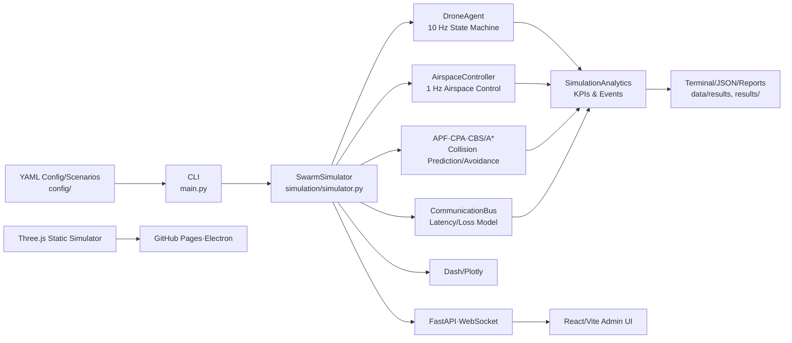

<div align="center">

# SDACS
## Swarm Drone Airspace Control System

Automated Airspace Control System for Swarm Drones · Capstone Design, Dept. of Drone and Mechanical Engineering, Mokpo National University

[](https://www.python.org/)
[](VERSION.md)
[](https://github.com/sun475300-sudo/swarm-drone-atc/actions/workflows/ci.yml)
[](https://sun475300-sudo.github.io/swarm-drone-atc/)
[](LICENSE)

[**Launch 3D Simulator**](https://sun475300-sudo.github.io/swarm-drone-atc/simulator.html) · [Maritime Detection Simulator](https://sun475300-sudo.github.io/swarm-drone-atc/maritime_detection_simulator.html) · [Download Web Package](https://github.com/sun475300-sudo/swarm-drone-atc/releases/tag/v1.5.0) · [Documentation Index](docs/INDEX.md) · [한국어](README.md)

</div>


> **Scope & Nature**: SDACS is a research and educational project centered around a SimPy-based discrete-event simulator and a browser-based 3D visualization tool. The performance metrics, scenarios, and regulatory/standard modules provided here are for simulation or prototype validation purposes only and do not serve as a basis for actual flight safety certification, operational approval, regulatory compliance, or commercial ATC services.

## Table of Contents

- [Project at a Glance](#project-at-a-glance)
- [Current Status](#current-status)
- [Which Interface Should I Choose?](#which-interface-should-i-choose)
- [Architecture & Data Flow](#architecture--data-flow)
- [Requirements & Installation](#requirements--installation)
- [Quick Start](#quick-start)
- [Full CLI Commands](#full-cli-commands)
- [Scenarios & Configuration](#scenarios--configuration)
- [Build & Deployment](#build--deployment)
- [Outputs & Generated Files](#outputs--generated-files)
- [Validation & CI](#validation--ci)
- [Repository Map](#repository-map)
- [Maturity & Known Limitations](#maturity--known-limitations)
- [Troubleshooting](#troubleshooting)
- [Documentation & Research Assets](#documentation--research-assets)
- [Remaining Tasks](#remaining-tasks)
- [Contributing, Security & Citation](#contributing-security--citation)

## Project at a Glance

SDACS is not a single application, but a suite of tools exploring the same domain at different depths.

| Feature | Implementation | Current Use Case |
|---|---|---|
| Discrete-Event Swarm Simulation | SimPy, NumPy, APF, CBS/A*, CPA-based Collision Prediction/Avoidance | Repeatable research experiments and regression validation |
| Airspace & Drone Models | Drone state machine, priority, comms bus, weather/failure injection, flight clearance | Algorithm unit & integration testing |
| Scenario Execution | 10 runtime YAML scenarios, quick/full Monte Carlo | Normal, high-density, comms loss, weather, intrusion experiments |
| Public Benchmarks | 7 standard + 3 stress suites, ORCA/VO/CBS/SDACS adapters | Reproducible comparison between methods |
| Browser Visualization | Three.js Swarm Drone & Maritime Small Vessel Detection Simulator | Demos, education, UI/interaction experiments |
| Python Visualization | Dash/Plotly 3D Dashboard | Python analysis & demos |
| Service Prototyping | FastAPI, WebSocket, JWT/RBAC, React/Vite | Service architecture prototype for airspace managers |
| Desktop Packaging | Electron Builder for Windows/macOS/Linux | Offline executable creation |
| Reproducibility Assets | Docker, Helm, monitoring configs, CI, canonical hash | Reproducibility & deployment architecture review |

## Current Status

The last repository health check date is **2026-07-30 (KST)**. Verify the latest source and automated validation results against [`main`](https://github.com/sun475300-sudo/swarm-drone-atc/commits/main) and [GitHub Actions](https://github.com/sun475300-sudo/swarm-drone-atc/actions).

| Status | Item | Result |
|:---:|---|---|
| ✅ | Project Version | `1.5.0` in `pyproject.toml` and `package.json` |
| ✅ | Default Branch | `main` — Branch consolidation complete |
| ✅ | GitHub Actions | Python 3.10/3.11/3.12 CI, security audit, simulator smoke & Pages deployment gates active |
| ✅ | Design System | v2.0 applied (CSS variable-based Glassmorphism HUD) |
| ✅ | Web Release | Static Web ZIP (`SDACS-Simulator-Web-v1.5.0.zip`) published in [v1.5.0 Release](https://github.com/sun475300-sudo/swarm-drone-atc/releases/tag/v1.5.0) |
| ✅ | Desktop App | Linux AppImage (`SDACS-Simulator-1.5.0-x86_64.AppImage`) published in [v1.5.0 Release](https://github.com/sun475300-sudo/swarm-drone-atc/releases/tag/v1.5.0) |
| ✅ | Python Regression | Python 3.10/3.11/3.12, strict lint, mypy, 80% coverage gates passed |
| ✅ | Federated Browser E2E | Mutual LIVE ghost rendering successful across 2 `ws_bridge` instances and 2 Chromium pages |
| ⏳ | Real-world Validation | Pixhawk, Jetson, RTK, HITL, real-flight, and regulatory approval evidence are future tasks (Phase 261-280) |

## Which Interface Should I Choose?

| Purpose | Recommended Entry Point | Default Port | Required Tools |
|---|---|---:|---|
| Run algorithms fastest | `python main.py simulate` | - | Python |
| Repeat YAML scenarios | `python main.py scenario ...` | - | Python |
| Single benchmark between methods | `python main.py benchmark ...` | - | Python |
| Most complete visual demo | `python scripts/serve.py` | 8123 | Python + Browser |
| Python 3D Dashboard | `python main.py visualize` | 8050 | Python |
| API & WebSocket Integration | `python main.py api` | 8000 | Python API dependencies |
| React Airspace Manager UI | `cd frontend && npm run dev` | 3000 | Node.js |
| Installable Desktop App | `npm start` or `./SDACS-Simulator-*.AppImage` | - | Node.js + Electron |
| Full-stack Container Demo | `docker compose up` | 8050 | Docker |

## Architecture & Data Flow



## Requirements & Installation

### Supported Environments

- Python **3.10 or higher**; CI validation covers 3.10, 3.11, 3.12
- Node.js **22 recommended**; Electron & browser E2E CI uses Node 22
- Latest Chromium-based browser; E2E uses Playwright Chromium

### Python Development Environment

```bash
git clone https://github.com/sun475300-sudo/swarm-drone-atc.git
cd swarm-drone-atc

python -m venv .venv
# Linux/macOS: source .venv/bin/activate
# Windows: .\.venv\Scripts\Activate.ps1

python -m pip install --upgrade pip
python -m pip install -e ".[dev]"
```

## Quick Start

### 1. Python Simulation

```bash
# 60 seconds, 20 drones, seed 42
python main.py simulate --duration 60 --drones 20 --seed 42

# List and run named scenarios
python main.py scenario --list
python main.py scenario weather_disturbance --runs 3 --seed 42 --duration 120
```

### 2. Browser Simulator (Web Version)

```bash
# Serve the repository root via HTTP and open the swarm simulator
python scripts/serve.py
```

The browser simulator uses built-in demo data by default. To receive live snapshots from the Python `SwarmSimulator`, run the WebSocket bridge separately and specify `?live=1` in the URL.

```bash
# Terminal 1: Default ws://127.0.0.1:8765
python -m pip install websockets
python simulation/ws_bridge.py --drones 50

# Terminal 2: Static Simulator
python scripts/serve.py --no-browser --port 8123
# Open http://127.0.0.1:8123/swarm_3d_simulator.html?live=1 in your browser
```

### 3. Desktop App (Linux)

Download `SDACS-Simulator-1.5.0-x86_64.AppImage` from GitHub Releases and run it.
```bash
chmod +x SDACS-Simulator-1.5.0-x86_64.AppImage
./SDACS-Simulator-1.5.0-x86_64.AppImage
```

## Full CLI Commands

Run `python main.py <command> --help` to check the latest options for all commands.

| Command | Purpose | Example |
|---|---|---|
| `simulate` | Single SimPy run & KPI summary | `python main.py simulate --duration 60 --drones 20 --seed 42` |
| `scenario` | List & repeat runtime YAML scenarios | `python main.py scenario high_density --runs 5` |
| `monte-carlo` | Quick/full sweep of config combinations | `python main.py monte-carlo --mode quick` |
| `benchmark` | Fixed scenario/method/seed comparison | `python main.py benchmark --scenario 01_corridor_crossing --method sdacs_hybrid --seed 0` |
| `visualize` | Dash/Plotly 3D Dashboard | `python main.py visualize --port 8050 --drones 30` |
| `visualize-3d` | Open local Three.js simulator | `python main.py visualize-3d` |
| `api` | FastAPI·WebSocket backend | `python main.py api --host 127.0.0.1 --port 8000` |
| `ops-report` | Delivery/traffic/weather/compliance ops report bundle | `python main.py ops-report --scenario demo --seed 42` |

## Scenarios & Configuration

Scenarios are defined in the `config/` directory. Key scenarios include:
- `default`: Default settings (50 drones)
- `high_density`: High-density traffic (150 drones)
- `emergency_failure`: Emergency failure injection (80 drones)
- `weather_disturbance`: Severe weather conditions (100 drones)
- `route_conflict`: Focus on route crossing and collision avoidance (100 drones)

## Build & Deployment

### Static Web Build
```bash
python scripts/build_simulator.py
# Static assets are generated in the build/simulator/ folder
```

### Electron Desktop App Build
```bash
npm ci
npm run dist:linux   # Build Linux AppImage
npm run dist:win     # Build Windows NSIS
npm run dist:mac     # Build macOS DMG
```

## Outputs & Generated Files

| Action | Recommended Location | Content |
|---|---|---|
| `simulate --output` | User-specified JSON | Single run KPIs |
| Monte Carlo | `data/results/` | Sweep results |
| `benchmark --output` | `results/` | JSON by method/scenario/seed |
| `ops-report` | `data/e2e_reports/` | JSON, Markdown, manifest JSON |
| Web Build | `build/simulator/` | Static deployment package |
| Electron Build | `dist-desktop/` | Desktop app packages |

## Validation & CI

### Python Quality Gates
```bash
ruff check src/ simulation/
mypy src/
python -m pytest tests/ -q
```

### Web & Frontend E2E
```bash
npm run pw:install
npm run test-server &
$env:SIM_URL='http://localhost:8123/swarm_3d_simulator.html'
npm run smoke
```

## Repository Map

| Path | Responsibility | See Also |
|---|---|---|
| [`main.py`](main.py) | CLI entry point | CLI examples, tests, README |
| [`simulation`](simulation) | SimPy execution engine & research modules | `config/`, `tests/`, Maturity |
| [`src/airspace_control`](src/airspace_control) | Core airspace control domain | controller, planning, avoidance, comms |
| [`benchmarks`](benchmarks) | Public comparison suite | manifest schema, adapters, results |
| [`api`](api) | FastAPI, JWT/RBAC, WebSocket | `frontend/`, API tests |
| [`frontend`](frontend) | React Admin UI | Vite proxy, API contracts |
| [`desktop`](desktop) | Electron shell | Root package, static assets |
| [`tests`](tests) | Python & E2E regression | pytest markers, Playwright |
| [`docs`](docs) | Design, research, operations documentation | Doc dates vs code consistency |

## Maturity & Known Limitations

- The SimPy Python engine, Three.js web engine, and maritime simulator are separate runtimes; their state and physical models do not synchronize automatically.
- The presence of hardware, SITL, HITL, regulatory, and standard modules does not imply actual equipment connection, institutional approval, or completed certification.
- While `benchmarks/` contains manifests and descriptions, the scenario-specific `expected_results.yaml` mentioned in some older documents is not present in the current tree.

## Troubleshooting

- **HTML opened but Three.js is not displaying**: Serve via HTTP instead of `file://` (`python scripts/serve.py`).
- **Korean logs are garbled**: Set `$env:PYTHONIOENCODING='utf-8'` in Windows Terminal or PowerShell before running.
- **Web build integrity check fails**: Do not manually edit copies after modifying the root master HTML; re-run `python scripts/build_simulator.py`.

## Documentation & Research Assets

| Purpose | Document |
|---|---|
| Full Documentation Index | [docs/INDEX.md](docs/INDEX.md) |
| System Architecture | [docs/architecture.md](docs/architecture.md) |
| Reproducibility Guide | [docs/REPRODUCIBILITY.md](docs/REPRODUCIBILITY.md) |
| Paper Contribution & Submission Prep | [docs/paper/contribution_outline.md](docs/paper/contribution_outline.md) |
| Commercialization & Industry Track | [docs/track_f/README.md](docs/track_f/README.md) |
| Long-term Roadmap | [ROADMAP.md](ROADMAP.md) |

## Remaining Tasks

The following is a list of **incomplete tasks** identified during the repository health check on 2026-07-30.

- [ ] **GitHub Account & Permission Setup**
  - Enable `main` branch protection (require CI and reviews)
  - Enable GitHub Discussions and apply community labels
  - Continuously validate and merge Dependabot PRs
- [ ] **Research Papers & DOI**
  - Complete Zenodo integration and automate GitHub Release DOI issuance
  - Register ORCID and draft K-UTM standardization proposal (TTA)
  - Register for IROS 2026 PaperCept account and prepare submission
- [ ] **Real-world Environment & Hardware (Phase 261-380)**
  - Integrate Pixhawk, Jetson, RTK hardware-in-the-loop (SITL/HITL)
  - Build bi-directional digital twin (link real flight data with simulator)
- [ ] **Commercialization & External Cooperation (Phase 410-499)**
  - Contribute to GUTMA and collaborate with overseas pilot organizations
  - Secure budget and execute 90-day proof-of-concept pilot in Jeonnam islands
  - Prepare for handover to the next generation capstone team

## Contributing, Security & Citation

- Contribution Guidelines: [CONTRIBUTING.md](CONTRIBUTING.md)
- Report Security Vulnerabilities: [SECURITY.md](SECURITY.md)
- License: [MIT License](LICENSE)
- Project Citation Metadata: [CITATION.cff](CITATION.cff)

The automation and simulators in this repository are intended for research, education, and prototyping. Actual operations that may affect people, aircraft, or property require independent safety validation, regulatory approval, security assessment, and operational accountability frameworks.
