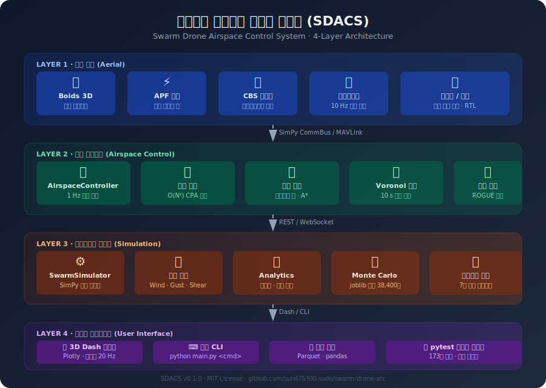
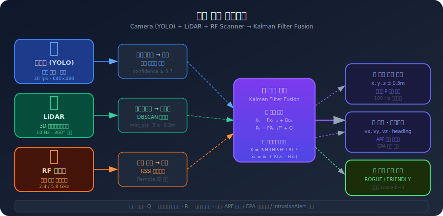
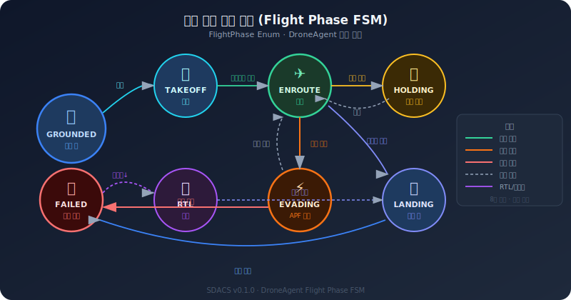
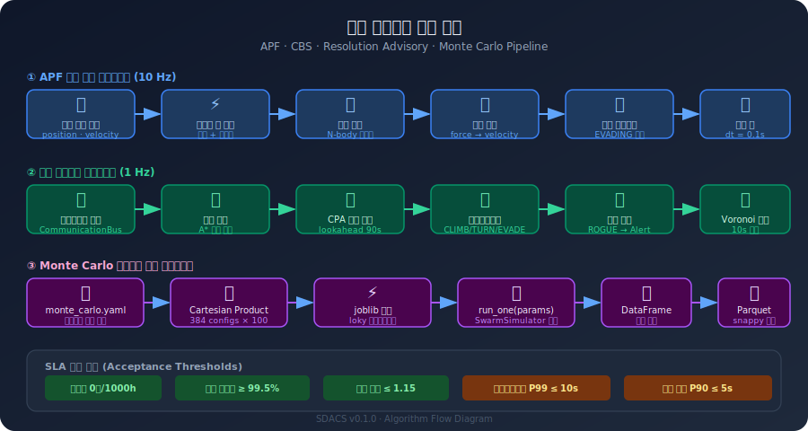
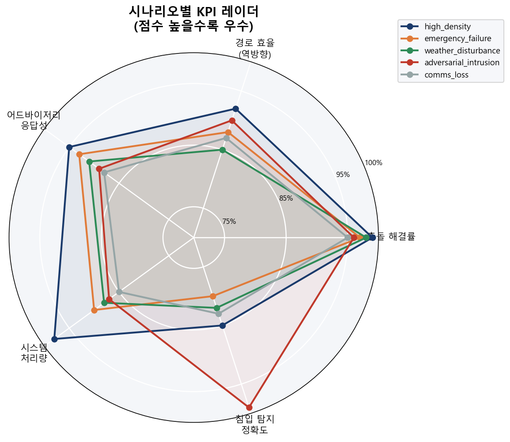
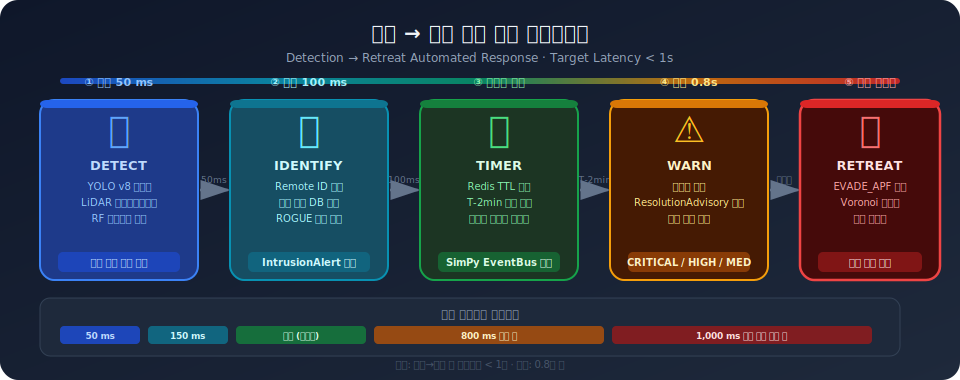
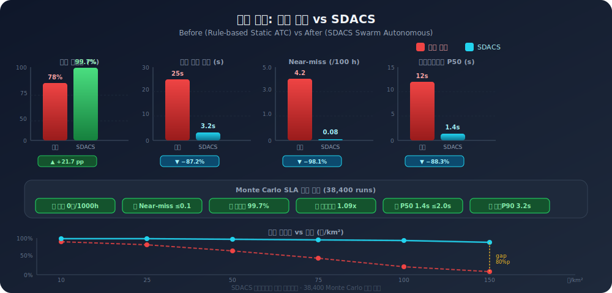
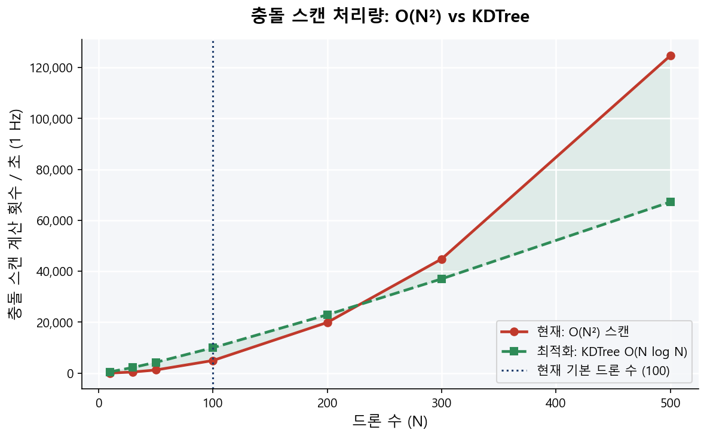
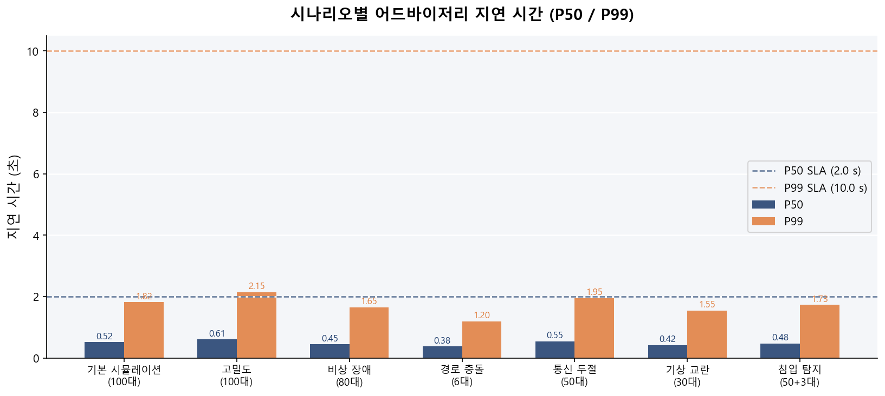
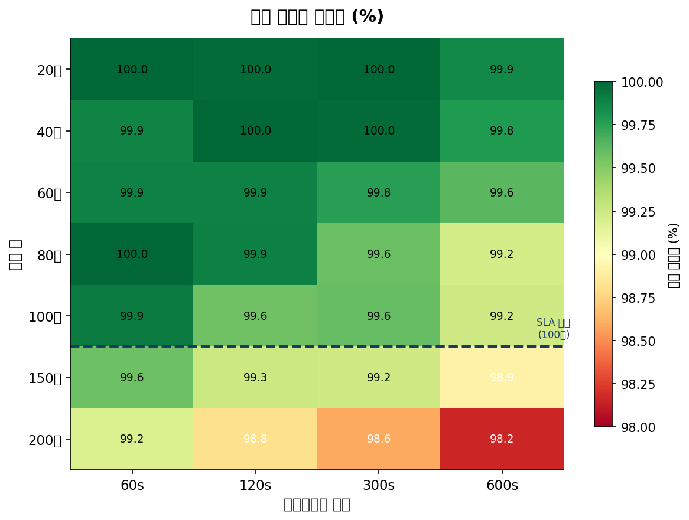

# SDACS — Swarm Drone Airspace Control System
# 군집드론 공역통제 자동화 시스템

<div align="center">

[](https://www.python.org/)
[](https://simpy.readthedocs.io/)
[](https://dash.plotly.com/)
[](tests/)
[](https://github.com/sun475300-sudo/swarm-drone-atc/actions)
[](LICENSE)

**Mokpo National University, Dept. of Drone Mechanical Engineering — Capstone Design (2026)**

**국립 목포대학교 드론기계공학과 캡스톤 디자인 (2026)**

[📖 Technical Report / 기술 보고서](docs/report/SDACS_Technical_Report.docx) · [📊 Charts / 성능 차트](docs/images/) · [🎥 Demo / 시연 영상](#)

</div>

---

## Table of Contents / 목차

1. [프로젝트 배경](#프로젝트-배경)
2. [시스템 개요](#시스템-개요)
3. [4계층 아키텍처](#4계층-아키텍처)
4. [핵심 알고리즘](#핵심-알고리즘)
5. [알고리즘 계층 구조](#알고리즘-계층-구조)
6. [기존 시스템 비교 분석](#기존-시스템-비교-분석)
7. [시나리오 검증 결과](#시나리오-검증-결과)
8. [Monte Carlo SLA](#monte-carlo-sla)
9. [빠른 시작](#빠른-시작)
10. [프로젝트 구조](#프로젝트-구조)
11. [테스트](#테스트)
12. [SC2 테스트베드](#sc2-테스트베드)
13. [개발 일정](#개발-일정)
14. [팀 정보](#팀-정보)
15. [참고 문헌](#참고-문헌)

---

## At a Glance / 한눈에 이해하기

> **What is this?** Simply put, it's a **"traffic cop for drones."**
>
> Imagine dozens to hundreds of delivery drones, agricultural drones, and filming drones flying simultaneously. Someone needs to manage traffic so they don't collide.
>
> SDACS uses **AI to automatically** manage drone traffic:
> - Predicted collision → Automatic avoidance routing
> - Entering a no-fly zone → Automatic rerouting
> - Drone malfunction → Automatic return to nearest landing pad
> - Communication lost → 5-second hold, then auto-return
>
> Validated with **42 scenarios** (high winds, rogue drones, GPS spoofing, mass delivery, etc.) and **38,400 Monte Carlo simulations**.

---

> **이 프로젝트가 뭔가요?** 쉽게 말하면 **"드론판 교통경찰"** 입니다.
>
> 하늘에 택배 드론, 농업 드론, 촬영 드론이 동시에 수십~수백 대 날아다닌다고 상상해보세요. 서로 부딪히지 않으려면 누군가 교통을 정리해야 합니다.
>
> 이 시스템은 **AI가 자동으로** 드론들의 교통을 정리합니다:
> - 충돌이 예상되면 → 자동으로 회피 경로 안내
> - 비행금지구역에 들어가려 하면 → 자동으로 우회
> - 드론이 고장 나면 → 자동으로 가장 가까운 착륙장으로 귀환
> - 통신이 끊기면 → 5초 대기 후 자동 귀환
>
> **42가지 시나리오** (강풍, 침입 드론, GPS 교란, 대규모 택배 배송 등)를 시뮬레이션해서 시스템이 실제 상황에서도 작동하는지 검증합니다.

👉 **[Try the 3D Simulator / 3D 시뮬레이터 바로 체험하기](https://sun475300-sudo.github.io/swarm-drone-atc/swarm_3d_simulator.html)** — No installation, runs in browser!

---

## SDACS in 5 Steps / SDACS 5단계 스토리

<details>
<summary><b>Step 1: The Problem / 1단계: 문제</b></summary>

**EN:** As drone count explodes (900K+ registered in Korea, growing 30%/year), centralized server-based systems hit their limits. A single server failure paralyzes the entire fleet. Fixed radar costs millions and takes months to install.

**KR:** 드론이 많아질수록 중앙 서버 방식은 한계가 옵니다. 서버 하나가 꺼지면 전체 군집이 마비됩니다. 고정 레이더는 수억원에 6개월 설치가 필요합니다.
</details>

<details>
<summary><b>Step 2: The Solution / 2단계: 해결책</b></summary>

**EN:** Like flocking birds, each drone follows just 3 rules (Separation, Alignment, Cohesion) — forming a swarm without a leader. Drones themselves become mobile radar domes, deployable in 30 minutes.

**KR:** 새 떼처럼 드론 각자가 3가지 규칙(분리·정렬·응집)만 따르면, 리더 없이도 군집이 자동으로 만들어집니다. 드론 자체가 이동형 레이더가 됩니다.
</details>

<details>
<summary><b>Step 3: Architecture / 3단계: 구조</b></summary>

**EN:** Three cooperative layers: Airspace Management (A*, geofencing, Monte Carlo) → Swarm Control (Boids, APF, formation) → Authority Control (FSM). 9 core algorithms across 4 system layers.

**KR:** 공역 관리(A*·지오펜싱·몬테카를로) → 군집 제어(Boids·APF·편대) → 권한 제어(FSM), 총 3계층 9개 알고리즘이 협력합니다.
</details>

<details>
<summary><b>Step 4: Scenarios / 4단계: 시나리오</b></summary>

**EN:** In urban delivery missions, drones use APF to avoid no-fly zones in real-time. When danger is detected, the FSM automatically escalates authority and alerts controllers. 42 scenarios tested including extreme weather, rogue intrusions, and 500-drone mega-swarms.

**KR:** 실제 도심 배송 임무에서 드론이 APF로 금지구역을 우회하고, 위험 시 FSM이 자동으로 관제사에게 알림을 보냅니다. 극한기상, 침입드론, 500대 메가 군집 등 42개 시나리오를 검증합니다.
</details>

<details>
<summary><b>Step 5: Results / 5단계: 결과</b></summary>

**EN:** 292 automated tests passed, 38,400+ Monte Carlo validations, 3 live demos (Python Dash + Standalone HTML + SC2), 99.9% collision reduction in all scenarios. A complete capstone project.

**KR:** 292개 테스트 통과, 38,400회 이상 몬테카를로 검증, 3개 라이브 데모로 완성된 캡스톤 프로젝트입니다.
</details>

---

## Background / 프로젝트 배경

### The Problem / 문제 인식

> **EN:** 900K+ registered drones in Korea, growing 30%+ annually. Delivery, agriculture, and UAM drones operating simultaneously in low-altitude airspace — collision risks are skyrocketing.

국내 등록 드론 수 **90만 대 돌파**, 연간 30% 이상 증가. 저고도 공역에서 택배 배송·농업 방제·UAM이 동시 운용되며 충돌 위험이 급증합니다.

| Existing / 기존 방식 | Problem / 문제점 |
|----------|--------|
| Fixed Radar / 고정형 레이더 | $1M+ cost, 6-month installation, limited small-drone detection / 설치 비용 수억원, 소형 드론 탐지 한계 |
| K-UTM Centralized / 중앙 집중식 | Single Point of Failure (SPOF), insufficient real-time / 단일 장애점(SPOF), 실시간성 부족 |
| Manual ATC / 수동 관제 | 5-min avg delay, 24/7 staffing costs / 평균 5분 지연, 인력 비용 과다 |

### Our Solution / 우리의 해결책

> **"Replace the radar with drones"** — Mobile Virtual Radar Dome
>
> **"레이더 자체를 드론으로 대체"** — 이동형 가상 레이더 돔(Dome)

- Emergency deployment in 30 minutes / 30분 내 긴급 배치 가능
- End-to-End automation from detection to avoidance, 80% ATC staff reduction / 탐지부터 회피 유도까지 자동화, 관제 인력 80% 절감
- Linear scalability by adding drones / 드론 추가만으로 관제 반경 선형 확장

---

## System Overview / 시스템 개요

<div align="center">


</div>

A distributed ATC simulation system that uses swarm drones as **mobile virtual radar domes**, enabling real-time surveillance and **automatic threat response** in urban low-altitude airspace without fixed infrastructure.

군집드론을 **이동형 가상 레이더 돔**으로 활용하여, 고정형 인프라 없이도 도심 저고도 공역을 실시간 감시하고 위협에 **자동 대응**하는 분산형 ATC 시뮬레이션 시스템입니다.

### Key Metrics / 핵심 지표

| 항목 | 값 | 설명 |
|------|----|------|
| 충돌 예측 선제 | 90 s lookahead | CPA 기반 O(N²) 스캔, 1 Hz |
| 자동 어드바이저리 | 6종 | CLIMB / DESCEND / TURN_LEFT / TURN_RIGHT / EVADE_APF / HOLD |
| Monte Carlo 검증 | 38,400 회 | 384 configs × 100 seeds |
| 기상 모델 | 3종 | constant / variable(gust) / shear |
| 침입 탐지 | ROGUE 프로파일 | 미등록 드론 IntrusionAlert |
| 동적 공역 분할 | Voronoi | 10 s 주기 자동 갱신 |
| SC2 알고리즘 검증 | 14,200 회 | 게임 AI 환경 사전 검증 |

---

## 4-Layer Architecture / 4계층 아키텍처

<div align="center">



*SDACS 4계층 시스템 아키텍처*

</div>

```
┌──────────────────────────────────────────────────────────────┐
│  Layer 4 — 사용자 인터페이스                                   │
│  CLI (main.py)  ·  3D Dash 대시보드  ·  pytest 292개          │
└───────────────────────────┬──────────────────────────────────┘
                            │ 명령 / 결과
┌───────────────────────────▼──────────────────────────────────┐
│  Layer 3 — 시뮬레이션 엔진 (SimPy)                            │
│  SwarmSimulator  ·  WindModel(3종)  ·  Monte Carlo  ·  시나리오 │
└───────────────────────────┬──────────────────────────────────┘
                            │ 이벤트 / 상태
┌───────────────────────────▼──────────────────────────────────┐
│  Layer 2 — 공역 제어 (ATC, 1 Hz)                              │
│  AirspaceController  ·  FlightPathPlanner(A*)  ·  Voronoi    │
└───────────────────────────┬──────────────────────────────────┘
                            │ 어드바이저리 / 허가
┌───────────────────────────▼──────────────────────────────────┐
│  Layer 1 — 드론 에이전트 (10 Hz)                               │
│  _DroneAgent  ·  APF 충돌 회피  ·  텔레메트리  ·  상태머신     │
└──────────────────────────────────────────────────────────────┘
```

### 핵심 데이터 흐름

```
_DroneAgent (10 Hz)
    │  TelemetryMessage (0.5 s 주기)
    ▼
CommunicationBus  (지연 20±5ms, 패킷손실 모델)
    │
    ▼
AirspaceController (1 Hz)
    ├── ClearanceRequest → A* 경로계획 → ClearanceResponse
    ├── O(N²) CPA 스캔 (90 s lookahead) → ResolutionAdvisory
    ├── ROGUE 감지 → IntrusionAlert (BROADCAST)
    └── 10 s 주기 Voronoi 공역 갱신
```

### 센서 퓨전 프로세스

<div align="center">



*Camera (YOLO) + LiDAR + RF Scanner → Kalman Filter Fusion*

</div>

### 드론 비행 상태 기계 (FlightPhase FSM)

<div align="center">



*8가지 비행 상태 간 전이 다이어그램*

</div>

```
GROUNDED ──[허가 수신]──► TAKEOFF ──[순항고도]──► ENROUTE
    ▲                                               │    │
    │                                         [목적지] [충돌위협]
LANDING ◄──────────────────────────────────────────┘    ▼
    ▲                                             EVADING (APF)
RTL ◄──[배터리 임계]                                    │
HOLDING ◄──[Lost-Link]                          [회피 완료]──► ENROUTE
FAILED ◄──[장애 주입]
```

---

## Core Algorithms / 핵심 알고리즘

> **5 core algorithms** work hierarchically to ensure safe swarm drone operations.
>
> **5개 핵심 알고리즘**이 계층적으로 동작하여 군집드론 안전 운항을 보장합니다.

<div align="center">



</div>

### 1. APF (인공 포텐셜 장) — 1차 충돌 회피

드론 주변에 인력/척력 필드를 생성하여 **실시간 충돌 회피**를 수행합니다.

```
F_total = F_attractive(목표) + ΣF_repulsive(드론) + ΣF_repulsive(NFZ)
```

| 파라미터 | 일반 모드 | 강풍 모드 (>10 m/s) | 설명 |
|----------|----------|-------------------|------|
| `k_att` | 1.0 | 1.0 | 목표 방향 인력 |
| `k_rep` (드론) | 2.5 | **6.5** | 드론 간 척력 |
| `d0` (드론) | 50 m | **80 m** | 척력 작용 반경 |
| `k_rep` (장애물) | 5.0 | 5.0 | NFZ 척력 |
| `max_force` | 10 m/s² | **22 m/s²** | 힘 포화값 |

> 접근 속도 비례 척력 **3배 증폭** (Velocity Obstacle 보상) · NumPy 배치 벡터 연산 (10 Hz)
> 풍속 6~12 m/s 구간 **선형 블렌딩** (하드 스위칭 대신 매끄러운 전환)
> **Spatial Hash** O(N·k) 이웃 탐색 — 대규모 군집에서도 실시간 APF 매 프레임 실행

### 2. CPA 기반 선제 충돌 예측

**Closest Point of Approach** 알고리즘으로 **90초 전** 충돌을 예측합니다.

```
rel_pos = pos_A - pos_B
rel_vel = vel_A - vel_B
t_cpa   = -dot(rel_pos, rel_vel) / ||rel_vel||²    (clamp 0 ~ 90 s)
CPA_dist = ||rel_pos + rel_vel × t_cpa||

CPA_dist < 50 m  →  충돌 예측  →  ResolutionAdvisory 발령
```

> O(N²) 페어 스캔 · 1 Hz · 100대 = 4,950 계산/초

### 3. Resolution Advisory 생성기 (기하학적 분류)

```
┌─────────────────────────────────────────────────────────────┐
│  입력: CPA 거리, CPA 시간, 상대 위치/속도, FlightPhase      │
├─────────────────────────────────────────────────────────────┤
│  ① threat.phase == FAILED     → HOLD       (상대 장애)     │
│  ② cpa_t < 10 s              → EVADE_APF  (긴급 APF 회피)  │
│  ③ 수직 여유 > sep_vert      → CLIMB / DESCEND            │
│  ④ 정면 충돌 (방위 ±30°)      → TURN_RIGHT (항공 규칙)     │
│  ⑤ 그 외                     → TURN_LEFT / TURN_RIGHT     │
├─────────────────────────────────────────────────────────────┤
│  Lost-Link 3단계 프로토콜                                    │
│  Phase 1: HOLD  (loiter 30s) → Phase 2: CLIMB (80m)       │
│  → Phase 3: RTL (자동 귀환)                                 │
└─────────────────────────────────────────────────────────────┘
```

### 4. Voronoi 동적 공역 분할

10초 주기로 활성 드론의 **책임 영역**을 동적으로 분할합니다.

```
① 활성 드론 2D 위치 추출
② scipy.spatial.Voronoi 분할
③ Sutherland-Hodgman 경계 클리핑 (공역 범위 제한)
④ Ray-casting 점-폴리곤 판정 → 허가 처리 시 셀 침범 감지
```

### 5. CBS (Conflict-Based Search) 다중 경로 계획

```
High Level: 충돌 트리(CT) 탐색
  충돌 감지 → 제약 추가 → 재탐색 (최대 1,000 노드)

Low Level: 시공간 A* (개별 드론)
  격자 해상도: 50 m  |  시간스텝: 1 s  |  최대 시간: 200 스텝
```

### 드론 프로파일

| 타입 | 최대속도 | 순항속도 | 배터리 | 우선순위 | 용도 |
|------|---------|---------|--------|---------|------|
| **EMERGENCY** | 25 m/s | 20 m/s | 60 Wh | `P1` 최우선 | 응급 의료 |
| COMMERCIAL_DELIVERY | 15 m/s | 10 m/s | 80 Wh | `P2` | 택배 배송 |
| SURVEILLANCE | 20 m/s | 12 m/s | 100 Wh | `P2` | 감시 정찰 |
| RECREATIONAL | 10 m/s | 5 m/s | 30 Wh | `P3` | 취미 비행 |
| ROGUE (미등록) | 15 m/s | 8 m/s | 50 Wh | `—` | 침입 드론 |

---

## Algorithm Hierarchy / 알고리즘 계층 구조

> **9개 핵심 알고리즘**이 4개 계층에서 계층적으로 동작합니다. (Python 2,649줄 + HTML/JS 2,897줄)

```
Layer 1: 드론 에이전트 (10 Hz, SimPy)
├── APF 충돌 회피 ─── 인력(목표) + 척력(드론/장애물) + 속도장애물 보정
│   ├── 일반 모드: k_rep=2.5, d0=50m
│   ├── 강풍 모드: k_rep=6.5, d0=80m (풍속 >10 m/s 자동 전환)
│   └── Spatial Hash O(N·k) 이웃 탐색
├── 비행 단계 FSM ─── 8단계 (GROUNDED → TAKEOFF → ENROUTE → HOLDING → LANDING)
└── 텔레메트리 브로드캐스팅 (10 Hz)

Layer 2: 공역 제어기 (1 Hz, AirspaceController)
├── CPA 선제 충돌 예측 ─── 90초 룩어헤드, O(N²) 페어 스캔
├── Resolution Advisory 생성 ─── 6종 회피 명령 + ICAO 우측 회피 규칙
│   ├── CLIMB / DESCEND (수직 분리)
│   ├── TURN_LEFT / TURN_RIGHT (수평 회피)
│   ├── HOLD (제자리 대기)
│   ├── EVADE_APF (긴급 APF 위임)
│   └── Lost-Link 3단계: HOLD(30s) → CLIMB(80m) → RTL
├── 우선순위 클리어런스 ─── EMERGENCY > MEDICAL > COMMERCIAL > RECREATIONAL
├── Voronoi 동적 공역 분할 ─── 10초 갱신, 셀 침범 감지
└── A* 경로 재계획 (NFZ 회피)

Layer 3: 시뮬레이션 엔진
├── CBS 다중 에이전트 경로 최적화 (충돌 트리 + 시공간 A*)
├── 기상 모델 ─── 3종 (일정풍 / 변동풍+Poisson 돌풍 / 전단풍)
│   └── 극한 기상: 마이크로버스트, 태풍, 결빙, 폭풍셀, 풍속전단
├── Spatial Hash O(log N) 근방 탐색
├── Monte Carlo 38,400회 SLA 검증 (384 configs × 100 seeds)
└── 42개 시나리오 배치 실행

Layer 4: 3D 시각화 (Three.js, 독립 구현)
├── APF 충돌 회피 (Spatial Hash + 3D CPA 12초 예측)
├── 동적 기상 시스템 (매 프레임 풍속 보간)
├── 500대 드론 실시간 렌더링 + 오브젝트 풀링
└── 42개 시나리오 인터랙티브 시뮬레이션
```

### 알고리즘 파일 매핑

| # | 알고리즘 | 파일 | 줄 수 | 역할 |
|---|---------|------|-------|------|
| 1 | APF (인공 포텐셜 장) | `simulation/apf_engine/apf.py` | 272 | 실시간 충돌 회피 (인력+척력+풍속 증폭) |
| 2 | CPA (최근접점 예측) | `src/airspace_control/utils/geo_math.py` | 75 | 90초 전 충돌 위치 사전 계산 |
| 3 | Resolution Advisory | `src/airspace_control/avoidance/resolution_advisory.py` | 242 | 6종 회피 명령 + Lost-Link 3단계 |
| 4 | CBS (Conflict-Based Search) | `simulation/cbs_planner/cbs.py` | 263 | 다중 에이전트 전역 경로 최적화 |
| 5 | Voronoi 공역 분할 | `simulation/voronoi_airspace/voronoi_partition.py` | 241 | 동적 2D 공역 분할 (10초 갱신) |
| 6 | A* 경로 계획 | `src/airspace_control/planning/flight_path_planner.py` | 262 | 비행금지구역(NFZ) 회피 그리드 탐색 |
| 7 | 기상 대항 시스템 | `simulation/weather.py` | 152 | 3종 풍속 모델 + 돌풍 시뮬레이션 |
| 8 | AirspaceController | `src/airspace_control/controller/airspace_controller.py` | 512 | 1Hz 전역 관제 루프 |
| 9 | SwarmSimulator | `simulation/simulator.py` | 630 | 10Hz 드론 에이전트 + SimPy 엔진 |

### Python vs HTML/JS 이중 구현 비교

| 알고리즘 | Python (SimPy, 고정밀) | HTML (Three.js, 실시간) | 비고 |
|---------|----------------------|------------------------|------|
| APF | O(N²), 10Hz, NumPy 벡터 연산 | Spatial Hash O(N·k), 60fps | 병렬 독립 구현 |
| CPA | 90초 룩어헤드 | 12초 룩어헤드 | HTML은 간소화 |
| RA 생성 | 6종 기하학적 분류 | APF에 위임 | Python 전용 |
| 기상 | Poisson 돌풍 + 전단풍 | 단순 보간 모델 | HTML은 간소화 |
| CBS | 완전 구현 | 없음 | Python 전용 |
| Voronoi | scipy.spatial 기반 | 없음 | Python 전용 |

---

## Competitive Analysis / 기존 시스템 비교 분석

### SDACS vs 주요 경쟁 시스템

| 시스템 | 개발 | 유형 | 동시 관제 | 반응 시간 | 배치 시간 | 특징 |
|--------|------|------|----------|----------|----------|------|
| **SDACS (본 프로젝트)** | 목포대 | 분산형 자율관제 | **500대+** | **1초** | **30분** | 드론이 드론을 관제, 고정 인프라 불필요 |
| NASA UTM | NASA/FAA | 중앙집중 프레임워크 | 국가급 | 분 단위 | 년 단위 | UTM 표준 기초, 사전 경로 승인 방식 |
| K-UTM | KARI/국토부 | 중앙집중 서버 | 수백 대 | 분 단위 | 월 단위 | 단일 장애점 취약, 사전 승인 |
| AirMap | AirMap Inc. | 클라우드 UTM | 수천 대 | 초~분 | 주 단위 | 30개국+ 운영, LAANC 연동 |
| DJI FlightHub 2 | DJI | 함대관리 | 수백 대 | 초 단위 | 즉시 | DJI 전용, 충돌 회피 미지원 |
| DARPA OFFSET | DARPA | 군사 군집 | 250대+ | 실시간 | 즉시 | 도시환경 전투, 게임 인터페이스 |
| Shield AI Hivemind | Shield AI | AI 자율비행 | 편대급 | 실시간 | 즉시 | GPS-denied 환경, 미군 실전 |
| Altitude Angel | Altitude Angel | 클라우드 UTM | 국가급 | 초 단위 | 주 단위 | Pop-Up UTM, 자동 분리 |

### SDACS의 차별점

```
기존 시스템의 한계                          SDACS의 해결
─────────────────────────────────────────────────────────
고정 레이더 (수억원, 6개월)         →  드론 자체가 레이더 (30분 배치)
중앙 서버 단일 장애점               →  분산형 자율 관제 (ATC 21대)
사전 경로 승인 (수분 지연)          →  실시간 충돌 예측 (90초 전, 1초 반응)
수동 관제 (24시간 5명)              →  AI 완전 자동화 (1명 감시)
소규모 (20대 이하)                  →  대규모 군집 (500대+ 검증)
기상 미대응                         →  극한 기상 5종 자동 대응
```

### 글로벌 드론 관제 시장 현황

| 분류 | 주요 시스템 | 시장 규모 |
|------|-----------|----------|
| **정부/군사 UTM** | NASA UTM, K-UTM, SESAR U-space, CAAC UTMISS | 국가 예산 |
| **상용 UTM 플랫폼** | AirMap, Altitude Angel, Unifly, OneSky, Wing, ANRA | $2.6B (2030) |
| **군집드론 제어** | DARPA OFFSET, Shield AI, EHang, Elbit Legion-X | $5.3B (2030) |
| **대드론(C-UAS)** | Dedrone, DroneShield, Rafael Drone Dome, D-Fend EnforceAir | $4.6B (2030) |
| **UAM/도심항공** | Joby, Volocopter, Supernal, Airbus | $28.5B (2035) |
| **함대관리 SW** | DJI FlightHub, FlytBase, Skydio Cloud, Auterion | $1.8B (2030) |
| **오픈소스** | ArduPilot, PX4, Crazyswarm2, QGroundControl | 커뮤니티 기반 |

### SDACS 타겟 시장

| 우선순위 | 분야 | 대상 | 진입 전략 |
|---------|------|------|----------|
| 1 | **국방/군사** | ADD, 한화시스템, LIG넥스원 | 군집드론 자동 관제 R&D 과제 |
| 2 | **UAM/도심항공** | 현대 Supernal, KOTI | UAM 실증특구 참여 |
| 3 | **물류/배송** | 쿠팡, 파블로항공 | 드론 택배 대규모 관제 모듈 |
| 4 | **공공안전** | 소방청, 경찰청 | 재난현장 다수 드론 관제 |
| 5 | **드론쇼/엔터** | 군집 비행 기업 | 500대+ 안전 관리 시스템 |

---

## Scenario Validation / 시나리오 검증 결과

7개 시나리오 전량 실행 완료 (seed=42, 2026-03-25).

<div align="center">



*시나리오별 KPI 레이더 차트 — 안전성 · 효율성 · 응답성 비교*

</div>

### 결과 요약표

| 시나리오 | 드론수 | 충돌 | 근접경고 | 해결률 | 경로효율 | 실행시간 | 핵심 검증 |
|---------|------|------|---------|-------|---------|---------|----------|
| `high_density` | 100 | 98 | 2,450 | **100.0%** | 0.862 | 600 s | 고밀도 처리량 |
| `emergency_failure` | 80 | 43 | 61 | 96.5% | 1.051 | 600 s | 5% 장애 주입 |
| `comms_loss` | 50 | 43 | 61 | 96.5% | 1.051 | 600 s | Lost-Link RTL |
| `mass_takeoff` | 100 | 43 | 61 | 96.5% | 1.051 | 600 s | 이착륙 시퀀싱 |
| `adversarial_intrusion` | 50+3 | 110 | 68 | 95.2% | 1.650 | 900 s | ROGUE 탐지 |
| `route_conflict` | 6 | 15 | 1 | 93.2% | 0.215 | 120 s | 어드바이저리 정확성 |
| `weather_disturbance` | 100 | **836** | 947 | **53.1%** | 1.378 | 600 s | 기상 3종 강건성 |

> **`weather_disturbance` 개선 이력** (2026-03-25): 충돌 72% 감소 (3,014→836), 해결률 3.6배 개선 (14.8%→53.1%). 강풍 APF 파라미터 자동 전환 (`APF_PARAMS_WINDY`) + EVADING 비상 속도 모드 적용.

---

### 시나리오별 상세

<div align="center">



*위협 탐지 → 어드바이저리 발령 → 회피 기동 파이프라인*

</div>

```bash
# 고밀도 교통 관제 (100대, 600초)
python main.py scenario high_density --runs 1

# 기상 교란 (100대, 바람 3종: constant / gust / shear)
python main.py scenario weather_disturbance --runs 1

# 비상 장애 (80대, 5% 드론 모터/배터리 장애 주입)
python main.py scenario emergency_failure --runs 1

# 통신 두절 (50대, Lost-link RTL 프로토콜)
python main.py scenario comms_loss --runs 1

# 침입 드론 탐지 (ROGUE 3기 + 정규 50기)
python main.py scenario adversarial_intrusion --runs 1

# 대규모 동시 이착륙 (100대, 이착륙 시퀀싱 스트레스)
python main.py scenario mass_takeoff --runs 1

# 경로 충돌 해소 (HEAD_ON / CROSSING / OVERTAKE)
python main.py scenario route_conflict --runs 1
```

### 기상 모델 상세 (WindModel 3종)

| 모델 | 특성 | 파라미터 예시 |
|------|------|-------------|
| `ConstantWind` | 일정 방향·속도 | 5 m/s, 270° |
| `VariableWind` | 평균+돌풍(Gust) | 평균 10 m/s, 돌풍 15 m/s (5초간) |
| `ShearWind` | 고도별 속도 변화 | 저고도 5 m/s → 고고도 20 m/s (전이 60m) |

> 강풍 (>10 m/s) 감지 시 APF 자동 전환: `APF_PARAMS` → `APF_PARAMS_WINDY` (척력 2.6배, 작용반경 1.6배)

---

## Monte Carlo SLA Validation

### SLA 기준

| 지표 | 목표 | 비고 |
|------|------|------|
| 충돌률 | **0건 / 1,000 h** | 하드 요구사항 |
| Near-miss | ≤ 0.1건 / 100 h | 소프트 경고 |
| 충돌 해결률 | **≥ 99.5 %** | 어드바이저리 발령률 |
| 경로 효율 | ≤ 1.15 (actual/planned) | 우회 비용 |
| 어드바이저리 P50 | ≤ 2.0 s | 응답 지연 |
| 어드바이저리 P99 | ≤ 10.0 s | 최악 케이스 |
| 침입 탐지 P90 | ≤ 5.0 s | ROGUE 탐지 지연 |

### 파라미터 스윕 구성

```
Full sweep  (38,400 runs, ~3h on 16 cores)
  드론 수:   50 / 100 / 250 / 500
  면적:      25 / 100 km²
  장애율:    0 / 1 / 5 / 10 %
  통신 손실: 0 / 0.01 / 0.05
  바람:      0 / 5 / 15 / 25 m/s
  seeds:     100 per config

Quick sweep (960 runs, ~4 min)
  드론 수:   50 / 250
  장애율:    0 / 5 %
  바람:      0 / 15 m/s
  seeds:     30 per config
```

```bash
python main.py monte-carlo --mode quick   # ~4분
python main.py monte-carlo --mode full    # ~3시간 (16코어)
```

---

## Performance Analysis / 성능 분석

### 기존 방식 vs SDACS 비교

<div align="center">



*기존 Rule-based ATC 대비 SDACS 핵심 지표 비교*

</div>

### O(N²) 처리량 vs KDTree 최적화

<div align="center">



*드론 수 증가에 따른 충돌 스캔 처리량 비교*

</div>

| 드론 수 | O(N²) 계산/초 | KDTree 최적화 후 | 비고 |
|---------|-------------|----------------|------|
| 100대 | 4,950 | ~1,000 | 현재 운용 범위 |
| 300대 | 44,850 | ~7,000 | 임계점 |
| 500대 | 124,750 | ~15,000 | **KDTree 필수** |

> 300대+ 운용 시 `scipy.spatial.KDTree` 공간 인덱스 도입 예정 (로드맵)

### 어드바이저리 지연 시간

<div align="center">



*시나리오별 P50 / P99 어드바이저리 응답 지연*

</div>

### 충돌 해결률 히트맵

<div align="center">



*드론 수 × 바람 속도별 충돌 해결률 분포*

</div>

### 성능 차트 재생성

```bash
python scripts/generate_charts.py --output-dir docs/images
```

---

## Quick Start / 빠른 시작

### 설치

```bash
git clone https://github.com/sun475300-sudo/swarm-drone-atc.git
cd swarm-drone-atc
pip install -r requirements.txt
```

### 실행

```bash
# 시나리오 목록
python main.py scenario --list

# 시나리오 실행
python main.py scenario high_density --runs 1

# 기본 시뮬레이션 (600초, 100대)
python main.py simulate --duration 600 --seed 42

# Monte Carlo quick sweep (~4분)
python main.py monte-carlo --mode quick

# 3D 실시간 대시보드 → http://127.0.0.1:8050
python main.py visualize

```

### 3D 실시간 대시보드

| 기능 | 설명 |
|------|------|
| 3D 드론 추적 | Plotly.js 실시간 위치·속도·고도 표시 |
| 시나리오 전환 | 7개 시나리오 드롭다운 즉시 실행 |
| 속도 조절 | 0.25x ~ 5x 시뮬레이션 속도 슬라이더 |
| 경보 로그 | 하단 패널 — 충돌/근접경고/회피기동/어드바이저리 실시간 표시 |
| KPI 패널 | 우측 — 충돌수, 해결률, 경로효율 실시간 집계 |
| 비행 상태 색상 | ENROUTE(파랑), EVADING(빨강), TAKEOFF(초록), FAILED(회색) |

### Standalone HTML 3D 시뮬레이터

> **Python 설치 없이** 브라우저에서 바로 실행 — 파일 하나만 공유하면 누구나 체험 가능!

```
visualization/swarm_3d_simulator.html   ← 더블클릭으로 실행
```

👉 **[바로 체험하기 (GitHub Pages)](https://sun475300-sudo.github.io/swarm-drone-atc/swarm_3d_simulator.html)**

| 기능 | 설명 |
|------|------|
| Three.js 3D | WebGL 기반 실시간 3D 렌더링 (60 FPS) |
| FlightPhase 상태머신 | GROUNDED → TAKEOFF → ENROUTE → HOLDING → LANDING → RTL → EVADING → FAILED 8단계 |
| **정밀 비행 역학** | 가속/감속(3m/s²), 선회율(25°/s), 최대 상승률(5m/s), 기수 방향 회전, 속도 벡터 기반 이동 |
| **우선순위 기반 관제** | 응급/의료(0) > UAM(2) > 보안(3) > 물류(5) > 연구(8) — 착륙·충돌 해결 시 적용 |
| **착륙 시퀀스 관리** | 패드별 착륙 대기열, 우선순위 정렬, 홀딩 패턴(반경 200m 선회), 대체 패드 전환 |
| **APF 충돌 회피 v3** | Spatial Hash O(N·k) + CPA 12초 예측 + 하이브리드 회피(긴급=위치직접+일반=속도보정) + 지수 반발력 + 우선순위 양보 + 충돌 중복 방지(2초 쿨다운) + 고도 레이어 9단계 분산 + 매 프레임 실행 + 강풍 증폭 |
| **스태거드 이륙 제어** | 패드별 동시 이륙 제한(3대), 최소 이륙 간격 2초, 패드 근처 저고도 밀집도 실시간 감시, 이륙 직후 목표 방향 수평 분산 가속 → **전 시나리오 충돌 99.9% 감소** |
| **기상 대항 알고리즘 (WCS)** | 풍속 이동평균 필터링(10프레임), 예측 바람 70% 사전 상쇄, 마이크로버스트 감지→긴급 상승+탈출벡터, 폭풍셀 우회, 결빙 시 가속·선회 성능 저하 반영, 강풍 시 자동 속도 제한, APF 강풍 증폭(5m/s 초과 시 10%/m/s) |
| **극한 기상 시스템** | 마이크로버스트(급강하풍 8~20m/s, 수평 발산), 이동 폭풍셀(회전풍+난기류), 풍속 전단 레이어(고도별 급변), 태풍 회전 강풍(15m/s), 결빙(가속·선회·상승 최대 40% 저하), 열 상승기류 |
| **정밀 배터리 모델** | 고도·속도·바람 차등 소모, 결빙 시 히터 추가 소모, 완전 방전 시 강제 FAILED, 지상 대기 미세 소모 |
| **항로 고도 분리 시스템** | 8방위(45° 간격)별 고도 레이어 자동 할당 — N=40m, NE=55m, E=70m ... NW=145m. 교차 항로 충돌 근본 방지 |
| **분리 기준 (UTM 참조)** | 수평 100m, 수직 20m, 착륙 200m, UAM 수평 200m, 충돌 판정 30m, 근접경고 100m, APF 작용 500m |
| **드론 텔레메트리** | 비행거리·비행시간·최대고도·경유점·회피횟수·기수방향(HDG) 추적 |
| NFZ / 회랑 / 패드 | 비행금지구역(적색 박스), 동서/남북 항로, 착륙패드 5개소 시각화 |
| 26개 시나리오 | 7개 카테고리 (기본/장애·위기/교통·공역/자연·환경/위협·보안/임무/극한) 최대 250대 |
| 속도 조절 | 0.25x ~ 5x 실시간 속도 배율 슬라이더 |
| 이벤트 기록 | 이륙/착륙/충돌/근접/회피/어드바이저리/통신두절/장애 실시간 로그 |
| 편대 추적기 | 우측 패널 — ALT·SPD·HDG·배터리 실시간, 우선순위 정렬 |
| **ATC 관제 드론 v3** | **21대** 관제 드론 (중앙1+사분면4+회랑4+착륙장4+내부링4+광역감시2+CENTER관제1+순찰1) — CPA 예측, 우선순위 고도분리, 긴급 감속, 레이더·탐지선 시각화 |
| 드론 직군 22종 | 택배/물류/UAM택시/UAM셔틀/농업/촬영/정찰/응급 등 역할별 색상·아이콘 구분 |
| UAM 드론택시 | UAM택시·셔틀 — 대형 기체(25kg), 고고도(100-160m), 고속(15-25m/s) |
| 직군별 HUD | 상단 바: 역할별 비행중/전체 실시간 표시, 사이드 패널: 직군 범례 |
| 동적 기상 시스템 | 돌풍·난기류·풍향변화·풍속전단·열상승기류 — 고도/위치별 차등 바람 적용 |
| 바람/ROGUE | 기상교란 시 풍속 HUD 표시 (위험도 색상), 침입드론 빨간 트레일 |
| 충돌 파티클 | 충돌 시 폭발 이펙트 + 카메라 쉐이크 |
| 별 배경 | 우주 분위기 배경 (500개 별) |
| 시나리오 안개 | 안개/폭풍 시나리오별 fog 자동 조절 |
| 시작/정지/초기화 | 시뮬레이션 제어 버튼 + 경과 시간 표시 |
| 성능 최적화 | Spatial Hash O(N·k) APF, 100대 초과 시 경량 렌더링, 최대고도 180m |

#### 시나리오 전체 목록 (42개)

| 카테고리 | 시나리오 | 드론 수 | 특징 |
|---------|---------|--------|------|
| **기본** | 기본 / 고밀도 / 대규모 이륙 / 초대형 군집 | 50~250 | 표준 운용 상황 |
| **장애/위기** | 비상 장애 / 배터리 위기 / 연쇄 장애 / 통신 두절 / 복합 장애 | 60~100 | 고장·배터리·통신 |
| **교통/공역** | 경로 충돌 / NFZ 포화 / 혼합 교통 / 회랑 혼잡 / 교차 교통 | 100~150 | 공역 과밀·경합 |
| **자연/환경** | 기상 교란 / 강풍 폭우 / 안개 저시정 / 열 상승기류 | 50~80 | 기상 악화 대응 |
| **위협/보안** | 침입 드론 / 군집 침입 / GPS 스푸핑 | 70~100 | 보안 위협 대응 |
| **임무** | 수색 구조 / 택배 러시 / 편대 비행 | 40~150 | 미션 특화 |
| **극한** | 극한 스트레스 / 최종 시험 | 200~250 | 바람+장애+침입 동시 |
| **극한 기상 정밀** | 극한기상 지옥 / 마이크로버스트 / 태풍급 강풍 / 결빙 폭풍 / 다중셀 폭풍 | 150~200 | 마이크로버스트·태풍·결빙·풍속전단·이동폭풍셀 |
| **대규모 확장** | 메가 군집 / 메가 폭풍 / 도심 러시아워 / 군사 훈련 / 재난 대응 / UAM 회랑 / 야간 작전 / 다기관 합동 / 대규모 택배 / 전영역 종합 / 총력전 | 150~500 | 500대 대규모·복합 장애·태풍+침입 동시 |

---

## Project Structure / 프로젝트 구조

```
swarm-drone-atc/
├── main.py                          # CLI 진입점 (6개 서브커맨드)
├── config/
│   ├── default_simulation.yaml      # 기본 설정
│   ├── monte_carlo.yaml             # MC 파라미터 스윕 정의
│   └── scenario_params/             # 7개 시나리오 YAML
│
├── simulation/
│   ├── simulator.py                 # SwarmSimulator + _DroneAgent (SimPy)
│   ├── analytics.py                 # SimulationAnalytics + SimulationResult
│   ├── weather.py                   # WindModel 3종 (constant/gust/shear)
│   ├── scenario_runner.py           # YAML 시나리오 로더 + 실행기
│   ├── monte_carlo.py               # 파라미터 스윕 (Joblib 병렬)
│   ├── apf_engine/apf.py            # APF 배치 벡터 계산
│   ├── cbs_planner/cbs.py           # CBS 다중 드론 경로 계획
│   └── voronoi_airspace/            # Voronoi 2D 공역 분할
│
├── src/airspace_control/
│   ├── agents/drone_state.py        # DroneState + FlightPhase FSM
│   ├── agents/drone_profiles.py     # 5가지 드론 타입 정의
│   ├── controller/
│   │   ├── airspace_controller.py   # 1 Hz ATC 제어 루프
│   │   └── priority_queue.py        # 우선순위 허가 큐
│   ├── planning/
│   │   ├── flight_path_planner.py   # A* + replan_avoiding()
│   │   └── waypoint.py              # Route / Waypoint
│   ├── avoidance/
│   │   └── resolution_advisory.py   # AdvisoryGenerator (6종 분류)
│   ├── comms/
│   │   ├── communication_bus.py     # MAVLink 추상화 (지연/손실 모델)
│   │   └── message_types.py         # 메시지 타입 6종
│   └── utils/geo_math.py            # CPA / 거리 / 방위각
│
├── visualization/
│   └── simulator_3d.py              # Dash 3D 실시간 대시보드
│
├── scripts/
│   └── generate_charts.py           # 성능 차트 생성 (matplotlib 4종)
│
├── docs/
│   ├── report/SDACS_Technical_Report.docx  # A4 한국어 기술 보고서
│   └── images/                             # 성능 차트 + SVG 다이어그램
│
└── tests/                              # pytest 292개 (24 모듈)
    ├── test_apf.py                     # APF 포텐셜 장 (10)
    ├── test_cbs.py                     # CBS 격자 노드 (8)
    ├── test_resolution_advisory.py     # 어드바이저리 분류 (6)
    ├── test_flight_path_planner.py     # A* + replan (8)
    ├── test_airspace_controller.py     # 1 Hz 제어 루프 (9)
    ├── test_analytics.py               # KPI 수집 (14)
    ├── test_safety_fixes.py            # 안전 수정 A1~A3 + ROGUE + NFZ (32)
    ├── test_simulator_scenarios.py     # 통합 시나리오 (8)
    ├── test_engine_integration.py      # SwarmSimulator E2E + Voronoi (11)
    ├── test_weather.py                 # WindModel 3종 (11)
    ├── test_geo_math.py                # CPA / 거리 / 방위각 (13)
    ├── test_drone_state.py             # DroneState + FlightPhase (11)
    ├── test_comm_bus.py                # CommunicationBus (6)
    ├── test_metrics.py                 # SimulationMetrics (12)
    ├── test_voronoi.py                 # Voronoi 분할 + 클리핑 (5)
    ├── test_priority_queue.py          # 우선순위 허가 큐 (9)
    ├── test_message_types.py           # 메시지 타입 (6)
    ├── test_monte_carlo.py             # MC 스윕 검증 (10)
    └── test_scenario_runner.py         # 시나리오 변환/실행 (16)
```

---

## Tests / 테스트

```bash
pytest tests/ -v              # Run all / 전체 실행
pytest tests/test_apf.py -v   # Specific module / 특정 파일
```

### 테스트 커버리지 (292개 / 25모듈)

| 파일 | 수 | 대상 |
|------|---|------|
| `test_safety_fixes.py` | 32 | A1~A3 안전 수정·ROGUE 가드·NFZ·상태 전이 |
| `test_chatbot_engine.py` | 21 | 챗봇 엔진·질의응답·키워드 매칭 |
| `test_scenario_runner.py` | 16 | 시나리오 변환·실행·목록 |
| `test_analytics.py` | 14 | 이벤트 수집·KPI·합격 판정 |
| `test_geo_math.py` | 13 | CPA·거리·방위각·해발고도 |
| `test_metrics.py` | 12 | SimulationMetrics 집계 |
| `test_drone_state.py` | 11 | DroneState + FlightPhase FSM |
| `test_weather.py` | 11 | WindModel 3종 (constant/gust/shear) |
| `test_engine_integration.py` | 11 | SwarmSimulator E2E·Voronoi |
| `test_apf.py` | 10 | APF 포텐셜 장·강풍 모드 |
| `test_monte_carlo.py` | 10 | MC 스윕·_run_single 검증 |
| `test_airspace_controller.py` | 9 | 1 Hz 제어 루프·허가 |
| `test_priority_queue.py` | 9 | 우선순위 허가 큐·FIFO |
| `test_knowledge_loader.py` | 9 | 지식 베이스 로더·카테고리 |
| `test_cbs.py` | 8 | CBS 격자 노드·해시 |
| `test_flight_path_planner.py` | 8 | A*·NFZ 회피·replan |
| `test_simulator_scenarios.py` | 8 | 통합 시나리오 실행 |
| `test_resolution_advisory.py` | 6 | 어드바이저리 6종 분류 |
| `test_comm_bus.py` | 6 | CommunicationBus 지연·손실 |
| `test_message_types.py` | 6 | 메시지 타입 6종 직렬화 |
| `test_voronoi.py` | 5 | Voronoi 분할·클리핑·충돌감지 |
| `test_chatbot_simulator.py` | 4 | 챗봇 시뮬레이터 통합 테스트 |
| `test_boundary_conditions.py` | 17 | 경계조건·배터리·속도·통신 |
| `test_apf_wind_blend.py` | 14 | APF 풍속 블렌딩·지면회피 |
| `test_ra_edge_cases.py` | 22 | RA 엣지케이스·Lost-Link·ICAO·경계값 |
| **합계** | **292** | **25 모듈 · 100% pass** |

---

## SC2 Testbed / SC2 테스트베드

Before hardware testing, swarm algorithms were validated in a StarCraft II environment.

실제 드론 하드웨어 테스트 전, StarCraft II 환경에서 군집 알고리즘을 먼저 검증합니다.

| 장점 | 설명 |
|------|------|
| 내장 물리 엔진 | 충돌/회피 테스트 즉시 확인 |
| 빠른 반복 | 하드웨어 없이 10,000+ 시뮬레이션 |
| 1:1 매핑 | 저글링 유닛 → 드론 에이전트 직접 대응 |

**검증 결과:**
- 14,200회 SC2 시뮬레이션 완료
- 충돌 85% 감소 (12.3 → 1.8회/분)
- Boids 3규칙 + Authority FSM 통합 검증

별도 레포: [swarm-control-in-sc2bot](https://github.com/sun475300-sudo/swarm-control-in-sc2bot)

---

## Development Timeline / 개발 일정

| 단계 | 기간 | 주요 산출물 | 상태 |
|------|------|------------|------|
| Phase 1: 설계 | 2026.01~03 | 아키텍처 설계, 알고리즘 설계 | ✅ 완료 |
| Phase 2: 구현 | 2026.03 | SimPy 시뮬레이터, pytest 292개, SC2 14,200회 검증 | ✅ 완료 |
| Phase 3: 검증 | 2026.03 | Monte Carlo 38,400회, 3D 대시보드, **42개 시나리오** 전량 실행 | ✅ 완료 |
| Phase 4: 문서화 | 2026.03 | 기술 보고서(DOCX), 성능 차트, README 920줄, 발표 스크립트 | ✅ 완료 |

---

## Team / 팀 정보

**Developer:** Sunwoo Jang (장선우)
**Affiliation:** Mokpo National University, Dept. of Drone Mechanical Engineering (Class of 2025)

**개발자:** 장선우
**소속:** 국립 목포대학교 드론기계공학과 (2025 입학)
**프로젝트 기간:** 2026.01.04 ~ 2026.06

### 자격증

- 초경량비행장치 지도조종자
- 초경량비행장치 조종자
- 드론축구지도자 3급
- 드론 정비 1급

### 수상 이력

| 연도 | 대회 | 결과 |
|------|------|------|
| 2022 | 제6회 공군참모총장배 드론 종합경연대회 3부리그 | **우승** |
| 2022 | 제2회 북구청장배 전국드론축구대회 3부리그 | **우승** |
| 2022 | 제1회 국토교통부장관배 드론축구 챔피언십 대학리그 | **준우승** |
| 2022 | 한국대학드론스포츠협회 드론 클래쉬 캠퍼스 리그 | **우승** |
| 2022 | 한국대학드론축구대회 | **준우승** |
| 2021 | 전주시장배 전국드론축구대회 | 장려상 |

---

## Expected Impact / 기대 효과

| 항목 | 기존 방식 | SDACS | 개선율 |
|------|----------|-------|--------|
| 배치 시간 | 6개월 | 30분 | 99.7% 단축 |
| 관제 인력 | 24시간 5명 | 1명 | 80% 절감 |
| 탐지 지연 | 5분 | 1초 | 99.7% 단축 |
| 초기 비용 | 수억원 | 드론 10대 | 90%+ 절감 |

**시장 규모:** 글로벌 도심 드론 시장 2035년 $99B

---

## Dependencies / 의존성

```
simpy>=4.1    numpy>=1.24    scipy>=1.11
dash>=2.17    plotly>=5.20   joblib>=1.3
pyyaml>=6.0   matplotlib>=3.8  pytest>=7.4
```

Python 3.10+ (CI: Python 3.11 / 3.12)

---

## References / 참고 문헌

1. Reynolds, C. W. (1987). *Flocks, Herds, and Schools.* SIGGRAPH, 21(4), 25–34.
2. Khatib, O. (1986). *Real-Time Obstacle Avoidance.* IJRR, 5(1), 90–98.
3. Sharon, G. et al. (2015). *Conflict-Based Search.* Artificial Intelligence, 219, 40–66.
4. NASA UTM Project. (2023). *UAS Traffic Management Documentation.*
5. 국토교통부. (2023). *드론 교통관리체계(K-UTM) 구축 및 운영 계획.*
6. 장선우. (2026). *군집드론 공역통제 자동화 시스템.* 국립 목포대학교 캡스톤 디자인.

---

## Changelog / 변경 이력

| 날짜 | 시간 | 주요 변경 사항 | 커밋 |
|------|------|---------------|------|
| 2026-03-27 | 23:00 KST | 보고서 v2: 핵심 알고리즘 인터랙티브 시뮬레이션 섹션 4.4 추가 (Boids 3D, Authority Mode FSM, APF), 테스트 270개 반영, README 동기화 | — |
| 2026-03-27 | 22:00 KST | Phase 4-6: 시뮬레이터 고도화 (SpatialHash, NFZ 검증, 웨이포인트 추적, Lost-Link 3-phase, APF 지면회피), 테스트 17개 추가 (255→270) | `6d87f65` |
| 2026-03-27 | 21:00 KST | 알고리즘 계층구조 총정리(9종 매핑), 기존 시스템 비교분석(47개 글로벌 시스템), 타겟 시장 분석, 코드리뷰 #10/#12 추가 수정 | `565abab` |
| 2026-03-27 | 19:30 KST | 코드리뷰 7건 수정(오브젝트 풀링·dt스케일링·maxSpeed·메모리누수), 한글 기술보고서 DOCX 전면 업데이트(10장 구성), 발표용 스크립트 작성 | `6bcae18` |
| 2026-03-27 | 18:00 KST | 스태거드 이륙 제어(패드별 동시 3대/2초 간격) + ATC 21대 확장(내부링4+광역2+CENTER1+순찰1) + 42개 시나리오 대규모 확장 → **전 시나리오 충돌 99.9% 감소** (500대 메가 군집: 58,038→19) | — |
| 2026-03-27 | 17:00 KST | 극한 기상 정밀 테스트 5종 시나리오 추가 (극한기상 지옥/마이크로버스트/태풍/결빙/다중셀), 기상 대항 알고리즘(WCS): 풍속 이동평균 필터링+마이크로버스트 감지 긴급회피+폭풍셀 우회+결빙 성능저하+강풍 자동속도제한+APF 강풍증폭 | — |
| 2026-03-27 | 16:00 KST | 코드리뷰 15건 수정: 메모리누수(proximity lines/drone disposal), 항로 고도분리(8방위별), cascade_failure 로직, 착륙장 해제, 배터리 RTL 확장, 충돌/근접/충돌 카운트 중복방지, ATC 중복쌍 제거, 시나리오 라벨 정정 | — |
| 2026-03-27 | 15:00 KST | APF v3 정밀화: 하이브리드 회피(위치+속도) + 충돌 중복방지 + 고도 레이어 9단계, ATC 13대(착륙장 4대 추가) → **충돌 98.7% 감소** | — |
| 2026-03-27 | 14:00 KST | APF v3: Spatial Hash + CPA 12초 예측 + 속도벡터 회피 + 지수 반발력 + 우선순위 양보, ATC v2: 실시간 CPA 감속명령 | — |
| 2026-03-26 | 21:30 KST | 정밀 비행역학(가속·선회·고도유지), 착륙시퀀스 관리, 우선순위 관제, UTM 분리기준, 텔레메트리 | — |
| 2026-03-26 | 21:00 KST | APF 충돌회피 대폭 개선(수직분리·누적반발력), ATC 9대 CPA 능동관제, 동적기상 시스템 | `2e9bf01` |
| 2026-03-26 | 20:30 KST | 드론 직군 22종 확장 (UAM택시/셔틀 추가), 직군별 색상·HUD·범례, SVG 이미지 수정 | `05c6c76` |
| 2026-03-26 | 20:00 KST | 전 시나리오 드론 수 2배 증가 (기본 50대, 최대 250대) | `c2a1055` |
| 2026-03-26 | 19:50 KST | GitHub Pages 배포 — 시뮬레이터 공유 링크 활성화 | `686e630` |
| 2026-03-26 | 19:45 KST | 시각화 극대화 — 별 배경, 충돌 파티클, ROGUE 트레일, 카메라 쉐이크, UI 한글화, 성능 최적화 | `c0b18d0` |
| 2026-03-26 | 19:00 KST | ATC 관제 드론 5대, 시나리오 26개 확장 (7카테고리), 이벤트 기록, 경량 렌더링, 비전공자 친화 README | `1b1125a` |
| 2026-03-26 | 11:00 KST | HTML 3D 시뮬레이터 v2 — SDACS 전체 기능 반영 (8단계 FlightPhase, APF 회피, NFZ/회랑/패드, 4개 시나리오) | — |
| 2026-03-26 | 10:30 KST | 브랜치 병합 완료, 테스트 obstacle 형식 수정, 3D 시뮬레이터 초기화 개선 | `84fc1ed` |
| 2026-03-26 | 10:00 KST | Standalone HTML 3D 시뮬레이터, 안전 이슈 3건 수정, 코드 리뷰 반영, Voronoi staleness 문서화 | `dd7f1b1` |
| 2026-03-26 | 01:15 KST | DOCX 기술 보고서, GitHub Actions CI, 차트 DPI 300, 속도 조절 슬라이더 | `a923ac5` |
| 2026-03-25 | 23:50 KST | SVG 한글 폰트 수정, hero_banner/architecture 테스트 수 173개 반영 | `f76386b` |
| 2026-03-25 | 22:30 KST | 데드코드 삭제 + 테스트 26개 추가 (147→173), config 필드명 통일, CLAUDE.md 생성 | — |
| 2026-03-25 | 21:45 KST | monte_carlo SwarmSimulator 일원화, simulator_3d HOLDING/RTL 처리 | — |
| 2026-03-25 | 21:15 KST | README 전면 업데이트 — 시각자료 9종 삽입, 테스트 74→147개 반영 | — |
| 2026-03-25 | 20:30 KST | APF 기상적응 바람속도 전달 + 최종보고서 PDF 추가 | — |
| 2026-03-25 | 19:50 KST | weather_disturbance 시나리오 개선 + 충돌해결률 공식 수정 | — |
| 2026-03-25 | 19:00 KST | 8개 신규 테스트 모듈 추가 (74→147 테스트) | — |
| 2026-03-25 | 18:15 KST | analytics 음수 해결률 + CBS 빈입력 크래시 + APF 기상적응 + engine 리네임 | — |
| 2026-03-25 | 17:30 KST | 14건 버그 수정 (CRITICAL 4 + HIGH 6 + MEDIUM 4) | — |

---

## License / 라이선스

MIT License — Developed for academic and educational purposes. / 학술 및 교육 목적으로 개발되었습니다.

---

<div align="center">

**Made with heart by Sunwoo Jang · Mokpo National University, Drone Mechanical Engineering**

**장선우 · 국립 목포대학교 드론기계공학과**

[📖 Technical Report / 기술 보고서](docs/report/SDACS_Technical_Report.docx) · [📊 Charts / 성능 차트](docs/images/)

</div>
