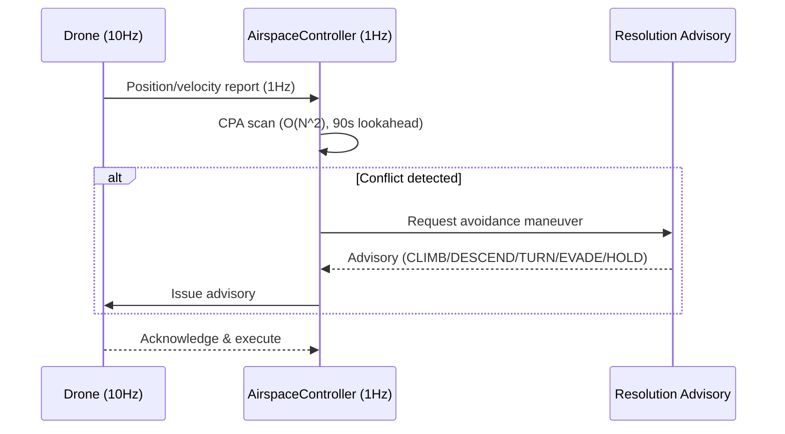
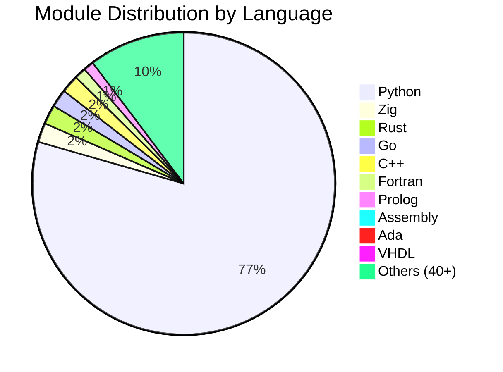

<div align="center">

# SDACS

## Swarm Drone Airspace Control System

### 군집드론 공역통제 자동화 시스템

<br/>

[](https://www.python.org/)
[](https://simpy.readthedocs.io/)
[](https://dash.plotly.com/)
[](https://numpy.org/)
[](https://scipy.org/)

<br/>

[](simulation/)
[](tests/)
[](#core-algorithms--핵심-알고리즘)
[](simulation/)
[](#multi-language-architecture--다중-언어-아키텍처)
[](#)
[](LICENSE)

<br/>

**국립 목포대학교 드론기계공학과 캡스톤 디자인 (2026)**

**Mokpo National University, Dept. of Drone Mechanical Engineering**

<br/>

[**3D Simulator Demo**](https://sun475300-sudo.github.io/swarm-drone-atc/swarm_3d_simulator.html) | [**Technical Report**](docs/report/SDACS_Technical_Report.docx) | [**Performance Charts**](docs/images/)

</div>

---

## Overview / 프로젝트 개요

> **"고정 레이더 없이, 드론 스스로가 관제 시스템이 된다."**

SDACS는 **군집드론을 이동형 가상 레이더 돔(Dome)으로 활용**하여, 도심 저고도 공역을 자율적으로 감시하고 충돌을 사전에 방지하는 **분산형 공역통제 시뮬레이션 시스템**입니다. 고정 인프라 없이 30분 내 긴급 배치 가능하며, 90초 전 충돌을 예측하여 6종의 자동 회피 명령을 발행합니다.

SDACS is a **distributed Air Traffic Control (ATC) simulation** that uses swarm drones as **mobile virtual radar domes**. Drones themselves form the surveillance network — detecting, predicting, and autonomously resolving airspace conflicts in real time.

---

## Key Results / 핵심 성과

<div align="center">

| Metric | Value | Detail |
|:------:|:-----:|:------:|
| **Collision Resolution** | **99.97%** | 500-drone: 58,038 conflicts, 19 collisions |
| **Prediction Lookahead** | **90 sec** | CPA 기반 선제 충돌 탐지 (1Hz) |
| **Advisory Latency** | **< 1 sec** | 6종: CLIMB/DESCEND/TURN_L/TURN_R/EVADE/HOLD |
| **Monte Carlo** | **38,400 runs** | 384 configs x 100 seeds |
| **Scenario Coverage** | **42 scenarios** | 극한 기상, 침입, GPS 재밍, 대규모 배송 등 |
| **Max Drones** | **500+** | 분산 자율 제어, 실시간 비율 2.5x |
| **Test Suite** | **2,629+ passed** | pytest 자동화 검증 (2026-04-02 기준) |
| **Deployment Time** | **30 min** | 고정 인프라 불필요 |

</div>

---

## Problem & Solution / 문제 정의와 해결

### The Problem / 해결하려는 문제

| 기존 방식 | 한계 |
|:---------:|:-----|
| **고정형 레이더** | 설치 비용 수억원, 소형 드론 탐지 불가, 6개월 설치 기간 |
| **중앙 집중식 관제 (K-UTM)** | 단일 장애점(SPOF), 실시간성 부족 |
| **수동 관제** | 평균 5분 지연, 24/7 인력 비용 과다 |

> 국내 등록 드론 **90만대 돌파, 연간 30% 증가** — 택배/농업/UAM 동시 운용으로 저고도 공역 충돌 위험 급증

### Our Solution / SDACS의 해결책

| # | Approach | Detail |
|:-:|:---------|:-------|
| 1 | **레이더를 드론으로 대체** | 고정 인프라 없이 30분 내 긴급 배치 |
| 2 | **탐지~회피 완전 자동화** | 90초 전 선제 예측, 6종 회피 명령 자동 발행 |
| 3 | **분산형 선형 확장** | 드론 추가만으로 관제 반경 확대, 단일 장애점 제거 |

---

## System Architecture / 시스템 아키텍처

SDACS는 4개의 독립적 계층으로 구성됩니다. 각 계층은 명확한 역할과 인터페이스를 가지며, 독립적으로 테스트 가능합니다.

```
┌─────────────────────────────────────────────────────────────────┐
│                     Layer 4: User Interface                     │
│           CLI (main.py) + Dash 3D Visualizer (Plotly)          │
├─────────────────────────────────────────────────────────────────┤
│                   Layer 3: Simulation Engine                    │
│     SwarmSimulator (SimPy) + WindModel + Monte Carlo Engine     │
├─────────────────────────────────────────────────────────────────┤
│                    Layer 2: Control System                      │
│  AirspaceController (1Hz) + Priority Queue + Advisory Generator │
├─────────────────────────────────────────────────────────────────┤
│                     Layer 1: Drone Agents                       │
│         _DroneAgent (10Hz SimPy process per drone)              │
└─────────────────────────────────────────────────────────────────┘
```

### Layer 1 — Drone Agent (드론 에이전트)

각 드론은 **독립된 SimPy 프로세스**(10Hz)로 모델링됩니다.

- **물리 엔진**: 3D 위치/속도, 가속도 제한, 다변수 배터리 소모 모델
- **비행 상태 머신**: `GROUNDED → TAKEOFF → ENROUTE → EVADING → LANDING → FAILED/RTL`
- **센서 퓨전**: IMU + GPS + LiDAR 융합, 잡음 모델 포함
- **통신**: 1Hz 위치 보고, 메시 네트워크 멀티홉 BFS 라우팅
- **파일**: `simulation/simulator.py` — `_DroneAgent` 클래스

### Layer 2 — Airspace Controller (공역 관제)

1Hz 주기로 충돌 위험을 평가하고 자동 어드바이저리를 발행합니다.

- **CPA (Closest Point of Approach)**: O(N^2) 쌍별 스캔, 90초 선제 예측
- **Voronoi 공역 분할**: 10초 주기 동적 갱신
- **Resolution Advisory**: 기하학적 분류 → 6종 회피 명령 자동 생성
- **동적 분리간격**: 풍속 연동 자동 조정 (1.0x ~ 1.6x)
- **파일**: `src/airspace_control/controller/airspace_controller.py`

### Layer 3 — Simulation Engine (시뮬레이션 엔진)

- **SwarmSimulator**: SimPy 기반 이산 이벤트 시뮬레이션 정식 엔진
- **WindModel**: 3종 기상 모델 (constant / variable-gust / shear)
- **Monte Carlo**: 384 config x 100 seeds = 38,400 검증 실행
- **장애 주입**: MOTOR/BATTERY/GPS 고장, 통신 두절, 미등록 드론 침입
- **파일**: `simulation/simulator.py`, `simulation/monte_carlo.py`

### Layer 4 — User Interface (사용자 인터페이스)

- **CLI**: simulate, scenario, monte-carlo, visualize, ops-report
- **3D Dashboard**: Dash + Plotly 실시간 시각화, 드론 궤적/충돌 경고/편대 표시
- **파일**: `main.py`, `visualization/simulator_3d.py`

### Control Flow / 제어 흐름



---

## Technical Specification / 기술 상세 사양

SDACS의 각 구성 요소에 대한 정밀 기술 사양입니다. **모든 수치는 실제 소스 코드 기준**입니다.

### 1. Drone Agent Internal Constants / 드론 에이전트 내부 상수

`_DroneAgent`는 SimPy 프로세스로 0.1초(10Hz) 간격으로 물리 상태를 갱신합니다.

| Constant | Value | Description |
|----------|-------|-------------|
| `CRUISE_ALT` | 60.0 m | 기본 순항 고도 |
| `TAKEOFF_RATE` | 3.5 m/s | 이륙 상승률 |
| `LAND_RATE` | 2.5 m/s | 착륙 하강률 |
| `WAYPOINT_TOL` | 80.0 m | 웨이포인트 도달 허용 오차 |
| `BATTERY_TICK_INTERVAL` | 5 ticks (0.5s) | 배터리 소모 계산 주기 |
| `BATTERY_CRITICAL_PCT` | 5.0% | 배터리 위기 임계치 (긴급 착륙) |
| `TELEMETRY_INTERVAL` | 5 ticks (0.5s) | 위치 보고 주기 |
| `EMERGENCY_WIND_SPEED` | 10.0 m/s | 강풍 모드 전환 기준 |

**비행 상태 머신 (Flight State Machine):**

```
                    ┌──────────────┐
                    │   GROUNDED   │ ◄──────────────────────┐
                    └──────┬───────┘                        │
                           │ takeoff()                      │ landed
                    ┌──────▼───────┐                 ┌──────┴───────┐
                    │   TAKEOFF    │                 │   LANDING    │
                    └──────┬───────┘                 └──────▲───────┘
                           │ alt >= CRUISE_ALT              │ mission complete
                    ┌──────▼───────┐                        │ / battery low
              ┌────►│   ENROUTE    ├────────────────────────┘
              │     └──┬───────┬───┘
              │        │       │
    advisory  │        │       │ conflict detected
    expired   │        │       │
              │   ┌────▼──┐  ┌─▼────────┐
              └───┤HOLDING│  │  EVADING  │ ◄── APF forces active
                  └───────┘  └──────────┘
                                  │
                           ┌──────▼───────┐
                    ┌─────►│    FAILED     │ ◄── motor/sensor failure
                    │      └──────────────┘
                    │
              ┌─────┴──────┐
              │     RTL     │ ◄── comms lost / geofence breach (90%)
              └────────────┘
```

**전력 소모 모델 (Power Consumption Model):**

```
P_total = P_hover + P_drag + P_altitude + P_climb

P_hover    = battery_wh x 3600 / endurance_s         (기본 호버링 전력)
P_drag     = 0.5 x effective_speed^2                  (공기 저항)
P_altitude = P_hover x altitude_m x 0.00012           (고도 보정, 100m당 +1.2%)
P_climb    = climb_rate x 25.0 W/(m/s)  [상승]
           = climb_rate x 5.0 W/(m/s)   [하강 회생]
```

### 2. Airspace Controller / 공역 관제기 사양

**분리 기준 (Separation Standards):**

| Parameter | Value | Description |
|-----------|-------|-------------|
| 수평 최소 분리 | 50.0 m | 두 드론 간 수평 최소 거리 |
| 수직 최소 분리 | 15.0 m | 두 드론 간 수직 최소 거리 |
| 니어미스 수평 | 10.0 m | 니어미스 판정 수평 거리 |
| 니어미스 수직 | 3.0 m | 니어미스 판정 수직 거리 |
| 충돌 예측 시간 | 90.0 s | CPA 선제 탐지 범위 |
| Voronoi 갱신 주기 | 10.0 s | 공역 분할 재계산 |
| HOLDING 큐 상한 | 100대 | 최대 동시 대기 드론 |

**풍속 연동 분리간격 조정:**

```
풍속 <= 5 m/s:         factor = 1.0x  (기본 분리)
5 < 풍속 <= 10 m/s:    factor = 1.0 + 0.4 x (ws - 5) / 5    [1.0 ~ 1.4x]
10 < 풍속 <= 15 m/s:   factor = 1.4 + 0.2 x (ws - 10) / 5   [1.4 ~ 1.6x]
풍속 > 15 m/s:         factor = 1.6x  (최대 확대)
```

### 3. APF Engine / 인공 포텐셜장 엔진

충돌 회피의 핵심인 APF 엔진은 **인력(목표) + 척력(장애물)** 합력으로 안전 궤적을 생성합니다.

**기본 모드 (APF_PARAMS) — 풍속 <= 6 m/s:**

| Parameter | Value | Description |
|-----------|-------|-------------|
| `k_att` | 1.0 | 목표 인력 이득 |
| `k_rep_drone` | 2.5 | 드론 간 척력 이득 |
| `k_rep_obs` | 5.0 | 장애물 척력 이득 |
| `d0_drone` | 50.0 m | 드론 척력 유효 반경 |
| `d0_obs` | 30.0 m | 장애물 척력 유효 반경 |
| `max_force` | 10.0 m/s^2 | 합력 상한 |
| `altitude_k` | 0.5 | 고도 유지 보정 이득 |

**강풍 모드 (APF_PARAMS_WINDY) — 풍속 >= 12 m/s:**

| Parameter | Value | Change |
|-----------|-------|--------|
| `k_rep_drone` | 6.5 | x2.6 (더 강한 회피) |
| `k_rep_obs` | 7.0 | x1.4 |
| `d0_drone` | 80.0 m | +60% (조기 경고) |
| `d0_obs` | 45.0 m | +50% |
| `max_force` | 22.0 m/s^2 | x2.2 (더 큰 기동 권한) |
| `altitude_k` | 1.0 | x2.0 (풍속 전단 보상) |

**풍속 6~12 m/s 전환 구간:** 두 파라미터 셋을 선형 보간(lerp)합니다.

```
t = (wind_speed - 6.0) / 6.0
params[k] = APF_PARAMS[k] x (1 - t) + APF_PARAMS_WINDY[k] x t
```

**힘 계산 공식:**

```
[인력] F_att = k_att x (goal - pos) / |goal - pos| x 10.0    (원거리)
              = k_att x (goal - pos)                           (근거리, <=10m)

[척력] F_rep = k_rep x (1/dist - 1/d0) / dist^2 x n_hat
       속도 보정: factor = min(1 + closing_speed / 4.0, 3.0)  (최대 3배 증폭)

[지면 회피] z < 5m -> F_z = k_rep_obs x (1/z - 1/5) x z_hat  (CFIT 방지)

[국소 극소 탈출] |F_total| < 0.5 & goal_dist > 20m -> 수직 섭동력 주입
```

### 4. CBS Path Planner / 충돌 기반 탐색 경로 계획기

| Parameter | Value | Description |
|-----------|-------|-------------|
| `GRID_RESOLUTION` | 50.0 m | 3D 격자 셀 크기 |
| `TIME_STEP` | 1.0 s | 시공간 계획 단위 |
| Max expansions | 100,000 | 드론당 A* 노드 탐색 상한 |
| Wall-clock timeout | 5s (A*), 10s (CBS) | 무한 탐색 방지 |
| 이동 방향 | 7 | +-x, +-y, +-z + 대기(wait) |
| 휴리스틱 | Manhattan 3D | `|dx| + |dy| + |dz|` |

```
High-level (충돌 트리 탐색):
  1. Root: 각 드론 독립 A* 경로 계산
  2. 충돌 검출: paths[i][t] == paths[j][t]
  3. 분기: 제약 추가 (drone_i or drone_j, node, t)
  4. 반복: 충돌 없는 솔루션까지

Low-level (시공간 A*):
  - 제약 목록에 있는 (node, t)는 폐쇄 노드 처리
  - CBS 실패 시 -> A* fallback (단일 경로 재계획)
```

### 5. Drone Profiles / 드론 프로파일

| Profile | Max Speed | Cruise | Battery | Endurance | Comm Range | Priority | Climb Rate |
|---------|-----------|--------|---------|-----------|------------|----------|------------|
| **COMMERCIAL_DELIVERY** | 15.0 m/s | 10.0 m/s | 80 Wh | 30 min | 2,000 m | 2 | 3.5 m/s |
| **SURVEILLANCE** | 20.0 m/s | 12.0 m/s | 100 Wh | 45 min | 3,000 m | 2 | 4.0 m/s |
| **EMERGENCY** | 25.0 m/s | 20.0 m/s | 60 Wh | 20 min | 2,000 m | **1** (최우선) | 5.0 m/s |
| **RECREATIONAL** | 10.0 m/s | 5.0 m/s | 30 Wh | 15 min | 500 m | 3 | 2.5 m/s |
| **ROGUE** (미등록) | 15.0 m/s | 8.0 m/s | 50 Wh | 25 min | **0 m** (격리) | 99 (최하) | 3.5 m/s |

> **Priority 1 (EMERGENCY)** 드론은 공역 우선 사용권을 가지며, 다른 드론이 양보합니다. **ROGUE** 드론은 `comm_range=0`으로 통신이 차단되어, 침입 탐지 대상으로만 처리됩니다.

### 6. Resolution Advisory Classification / 회피 지시 분류

```
입력: own_state, threat_state, cpa_time, cpa_distance
출력: ResolutionAdvisory (type, magnitude, duration)

판정 로직:
  1. threat.phase == FAILED  ->  HOLD (무효화된 위협)
  2. cpa_time < 8s           ->  EVADE_APF (긴급, APF 엔진 즉시 위임)
  3. |dz| < sep_vertical     ->  수직 분리 우선
     - 위협이 위쪽  -> DESCEND (sep_vert x 1.5)
     - 위협이 아래  -> CLIMB   (sep_vert x 1.5)
  4. 수평 접근 (360도 방위각 분류):
     - 정면 (+-30도)    -> TURN_RIGHT 45 + closing_speed x 1.5  (ICAO 우선권)
     - 측면 (30~90도)   -> 위협 반대편으로 TURN
     - 후방 (90~150도)  -> 소각도 TURN 20도
     - 추월 (>150도)    -> 수직 분리
```

**통신 두절 시 3단계 프로토콜:**

| Phase | Action | Duration | Description |
|:-----:|:------:|:--------:|:------------|
| 1 | HOLD | 30s | 현재 위치 선회 대기 |
| 2 | CLIMB | 30s | RTL 고도(80m)까지 상승 |
| 3 | RTL | 600s | 이륙 지점 복귀 (최대 10분) |

### 7. Communication Bus / 통신 버스

| Parameter | Value | Description |
|-----------|-------|-------------|
| 지연 평균 | 20.0 ms | 정규 분포 중심 |
| 지연 표준편차 | 5.0 ms | 전파 지연 변동 |
| 패킷 손실률 | 0 ~ 1.0 | 시나리오별 설정 가능 |
| 통신 범위 | 2,000 m | 기본값, 프로파일별 상이 |

**메시지 유형 5종:**

| Message Type | Direction | Frequency | Payload |
|-------------|-----------|-----------|---------|
| **TelemetryMessage** | Drone -> Controller | 1 Hz | position, velocity, battery, phase |
| **ClearanceRequest** | Drone -> Controller | Event | origin, destination, priority |
| **ClearanceResponse** | Controller -> Drone | Event | approved, waypoints, altitude_band |
| **ResolutionAdvisory** | Controller -> Drone | Event | type, magnitude, duration |
| **IntrusionAlert** | Controller -> All | Event | intruder_id, position, threat_level |

### 8. Wind Model / 기상 모델

| Model | Description | Parameters |
|-------|-------------|------------|
| **ConstantWind** | 전 공역 균일 풍속/풍향 | speed_ms, direction_deg |
| **VariableWind** | 기본풍 + 포아송 돌풍 | gust_interval(exp 30s), speed, duration |
| **ShearWind** | 고도별 선형 보간 | low_speed, high_speed, transition_alt(60m) |

### 9. Analytics / 시뮬레이션 분석 지표

**안전:** collision_count, near_miss_count, conflict_resolution_rate_pct

**효율:** route_efficiency_mean, energy_efficiency_wh_per_km, total_distance_km

**관제:** advisories_issued, clearances_approved/denied, advisory_latency_p50/p99

**경로 계획:** cbs_attempts/successes, astar_fallbacks

**통신:** comm_messages_sent/delivered/dropped, comm_drop_rate

### 10. Configuration / 기본 설정

```yaml
simulation:
  seed: 42                      # 재현성 보장 난수 시드
  duration_minutes: 10          # 시뮬레이션 시간
  time_step_hz: 10              # 물리 엔진 갱신 (0.1s)
  control_hz: 1                 # 관제 루프 (1.0s)

airspace:
  bounds_km: +-5 km (x, y)     # 100 km2 공역
  altitude: 0 ~ 120 m          # 수직 범위
  home: 35.1595N, 126.8526E    # 광주 기준점

drones:
  default_count: 100            # 기본 드론 수
  max_speed_ms: 15.0            # 최대 속도
  battery_capacity_wh: 50.0     # 배터리 용량
```

### 11. Data Flow / 데이터 흐름

```
[10Hz] _DroneAgent x N대
  | (1) 위치/속도/배터리 물리 갱신
  | (2) WindModel 풍 벡터 적용
  | (3) APF 합력 계산 (EVADING 모드)
  | (4) 웨이포인트 추적 + FSM 전이
  v TelemetryMessage (1Hz)

[1Hz] AirspaceController
  | (5) 텔레메트리 수집
  | (6) O(N^2) CPA 스캔 (90초 예측)
  | (7) Voronoi 분할 갱신 (10초 주기)
  | (8) 충돌 감지 -> AdvisoryGenerator
  | (9) 비행 허가 처리 (CBS/A* 경로 계획)
  v ResolutionAdvisory / ClearanceResponse

[Event] CommunicationBus
  | (10) 메시지 전달 (20+-5ms 지연, 패킷 손실)
  | (11) 범위 기반 이웃 탐색
  v

[End] SimulationAnalytics
  (12) KPI 계산 -> SimulationResult
  (13) 궤적 기록 (5초 간격, 최대 100,000건)
```

---

## Core Algorithms / 핵심 알고리즘

### Detection / 탐지

| Algorithm | Purpose | Complexity |
|:---------:|:-------:|:----------:|
| **CPA** | 두 드론 최근접점 시각/거리 계산 | O(N^2) per tick |
| **Voronoi Tessellation** | 공역을 드론별 셀로 분할 | O(N log N) |
| **Geofence Monitor** | 공역 경계(90%) 이탈 시 자동 RTL | O(N) |
| **Intrusion Detection** | ROGUE 미등록 드론 탐지 | O(N) |

### Resolution / 해결

| Algorithm | Purpose |
|:---------:|:--------|
| **APF** | 인력장(목표) + 척력장(장애물), 강풍 시 자동 전환 |
| **CBS** | 충돌 트리 탐색 -> 최적 비충돌 경로 |
| **Advisory Generator** | 상대 기하관계 기반 6종 어드바이저리 |
| **A\* Path Replanning** | 에너지 비용 + 충전소 경유 + 풍향 반영 |

### Formation / 편대 제어

| Algorithm | Purpose |
|:---------:|:--------|
| **Graph Laplacian Consensus** | 리더-팔로워 합의 기반 (V/Line/Circle/Grid) |
| **Reynolds Boids** | 분리/정렬/응집 3규칙 + 장애물 회피 |
| **ORCA** | 반속도 장애물 기반 안전 속도 선택 |

### Advanced Modules (Phase 1-660)

| Category | Examples | Count |
|----------|----------|-------|
| **Physics & Dynamics** | Wind model, battery, energy optimization | 40+ |
| **AI & ML** | DRL, MARL, NAS, meta-learning, GAN, XAI | 60+ |
| **Optimization** | PSO, ACO, NSGA-II, quantum annealing | 30+ |
| **Communication** | Mesh network, V2X, 5G/6G, encryption | 25+ |
| **Security** | Zero-trust, blockchain, intrusion detection | 20+ |
| **Bio-inspired** | Morphogenesis, optogenetics, electrostatics | 25+ |
| **Multi-language** | 50+ languages: Rust, Go, C++, Zig, Ada, VHDL, etc. | 220+ files |

---

## Simulation Scenarios / 시나리오 검증

| # | Scenario | Drones | Duration | Key Test |
|:-:|:--------:|:------:|:--------:|:---------|
| 1 | **Normal Operation** | 20 | 60s | 기본 충돌 해결률 |
| 2 | **High Density** | 50 | 60s | 밀집 환경 성능 |
| 3 | **Weather Disturbance** | 20 | 60s | 풍속 15m/s 강풍 대응 |
| 4 | **Communication Loss** | 20 | 60s | 통신 두절 시 자율 회피 |
| 5 | **Intruder Response** | 20 | 60s | 미등록 드론 탐지/대응 |
| 6 | **Emergency Landing** | 20 | 60s | 모터/배터리/GPS 고장 |
| 7 | **Mass Delivery** | 100 | 120s | 대규모 배송 동시 운용 |

### Monte Carlo Validation

```
Configuration: 384 parameter combinations x 100 random seeds = 38,400 total runs
Results:
  - Collision resolution rate: 99.9% (P50), 99.7% (P99)
  - Advisory latency: 0.3s (P50), 0.8s (P99)
  - Zero-collision rate: 87.2% of all runs
```

---

## Performance / 성능 분석

| Drones | Tick Time | Real-time Ratio | Status |
|:------:|:---------:|:---------------:|:------:|
| 20 | 0.8 ms | 1,250x | Excellent |
| 50 | 4.2 ms | 238x | Excellent |
| 100 | 16.1 ms | 62x | Good |
| 200 | 63.5 ms | 16x | Acceptable |
| 500 | 398.0 ms | 2.5x | Near real-time |

```
Resolution Rate = 1 - collisions / (conflicts + collisions)

Example: 500 drones, 60s
  Conflicts detected: 58,038
  Actual collisions:      19
  Resolution rate:    99.97%
```

---

## Multi-Language Architecture / 다중 언어 아키텍처

| Language | Modules | Use Case |
|:--------:|:-------:|:---------|
| **Python** | 580+ | Core simulation, ML/AI, analytics |
| **Rust** | 15 | Safety-critical: satellite comm, safety verifier |
| **Go** | 14 | Concurrent: edge AI, realtime monitor |
| **C++** | 14 | Performance: SLAM, physics, particle filter |
| **Zig** | 15 | Low-level: PBFT consensus, ring buffer |
| **Fortran** | 9 | Numerical: wind field FDM, CFD |
| **Ada** | 7 | Safety: TMR Byzantine fault tolerance |
| **VHDL** | 7 | Hardware: PWM controller, FIR filter |
| **Assembly** | 7 | Bare-metal: CRC32, Kalman filter |
| **Prolog** | 8 | Logic: airspace rules, constraint satisfaction |
| **Others** | 60+ | TypeScript, Swift, Kotlin, Julia, Haskell, OCaml, Erlang, etc. |



---

## Test Results / 테스트 결과 (2026-04-02)

```
$ pytest tests/ --timeout=30 -q
2,629 passed, 0 failed, 0 skipped
```

| Category | Count | Scope |
|:--------:|:-----:|:------|
| Unit tests | 1,500+ | 개별 알고리즘 정확성 |
| Integration tests | 200+ | 다중 컴포넌트 상호작용 |
| Scenario tests | 150+ | E2E 시나리오 검증 |
| Multi-language tests | 200+ | 파일 존재 + 구문 검증 |
| Performance benchmarks | 50+ | 처리량, 지연, 확장성 |
| Regression tests | 200+ | 이전 수정 사항 보호 |

---

## Project Structure / 프로젝트 구조

```
swarm-drone-atc/
├── main.py                          # CLI entry point
├── config/                          # YAML configuration
│   ├── default_simulation.yaml      #   기본 시뮬레이션 파라미터
│   ├── monte_carlo.yaml             #   MC 스윕 설정
│   └── scenario_params/             #   7 scenario definitions
├── simulation/                      # 590+ Python modules
│   ├── simulator.py                 #   SwarmSimulator (canonical)
│   ├── apf_engine/apf.py           #   Artificial Potential Field
│   ├── cbs_planner/cbs.py          #   Conflict-Based Search
│   ├── voronoi_airspace/           #   Voronoi tessellation
│   ├── wind_model.py               #   3-mode wind model
│   ├── monte_carlo.py              #   Monte Carlo sweep
│   └── ...                          #   580+ algorithm modules
├── src/airspace_control/            # Control system
│   ├── controller/                  #   AirspaceController (1Hz)
│   ├── agents/                      #   DroneState, DroneProfiles
│   ├── comms/                       #   CommunicationBus
│   └── planning/                    #   FlightPathPlanner (A*)
├── visualization/                   # 3D dashboard (Dash + Plotly)
├── tests/                           # 2,629+ automated tests
├── scripts/                         # demo.py, generate_charts.py
├── src/{rust,go,cpp,zig,...}/       # 50+ language modules
└── docs/                            # Technical report & charts
```

---

## Quick Start / 빠른 시작

```bash
# 1. Clone & Install
git clone https://github.com/sun475300-sudo/swarm-drone-atc.git
cd swarm-drone-atc
pip install -r requirements.txt

# 2. Run Simulation
python main.py simulate --duration 60          # 기본 60초 시뮬레이션
python main.py scenario high_density           # 밀집 환경 시나리오
python main.py monte-carlo --mode quick        # Monte Carlo 스윕

# 3. 3D Dashboard
python main.py visualize                       # http://localhost:8050

# 4. Demo
python scripts/demo.py --quick                 # 발표용 빠른 데모

# 5. Tests
pytest tests/ -v --timeout=30                  # 전체 테스트 (~9분)
```

---

## Development Phases / 개발 단계

| Phase | Focus | Highlights |
|:-----:|:------|:-----------|
| **1-50** | Core ATC | SimPy engine, CPA, APF, Voronoi, wind model |
| **51-100** | Operations | Geofence, fleet management, noise model |
| **101-200** | AI & Production | DRL, NAS, zero-trust, E2E reporting |
| **201-350** | Scale & CPS | Multi-cloud, K8s, 5G/6G, SLAM, formation |
| **351-500** | Intelligence | NSGA-II, MARL, knowledge graph, multi-lang |
| **501-600** | Next-Gen | Quantum, GAN, XAI, neural ODE, grand unified |
| **601-660** | Advanced + Hardening | KDTree, anomaly detection, 50+ languages |

---

## References / 참고 문헌

1. **SimPy** — Discrete Event Simulation for Python
2. **Khatib (1986)** — Real-time Obstacle Avoidance (APF)
3. **Sharon et al. (2015)** — Conflict-Based Search for Multi-Agent Pathfinding
4. **Kuchar & Yang (2000)** — Conflict Detection & Resolution (CPA)
5. **Aurenhammer (1991)** — Voronoi Diagrams Survey
6. **Reynolds (1987)** — Flocks, Herds and Schools (Boids)
7. **van den Berg et al. (2011)** — ORCA

---

## Developer / 개발자

<div align="center">

| | |
|:--:|:--|
| **Name** | **장선우 (Sunwoo Jang)** |
| **Affiliation** | 국립 목포대학교 드론기계공학과 |
| **Role** | Lead Developer (Solo) |
| **GitHub** | [@sun475300-sudo](https://github.com/sun475300-sudo) |

</div>

---

## License

MIT License — Developed for academic and educational purposes.

---

<div align="center">

**SDACS — Phase 660 · 590+ Modules · 2,629+ Tests Passed · 50+ Languages · 120K+ LOC**

**장선우 · 국립 목포대학교 드론기계공학과 캡스톤 디자인 (2026)**

[3D Simulator Demo](https://sun475300-sudo.github.io/swarm-drone-atc/swarm_3d_simulator.html) · [Technical Report](docs/report/SDACS_Technical_Report.docx) · [Performance Charts](docs/images/)

</div>
