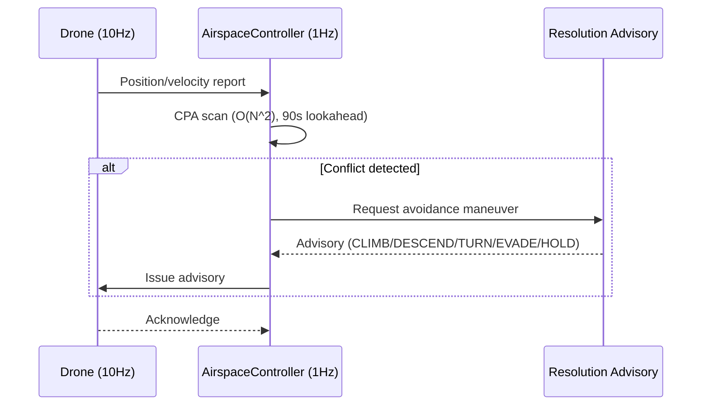
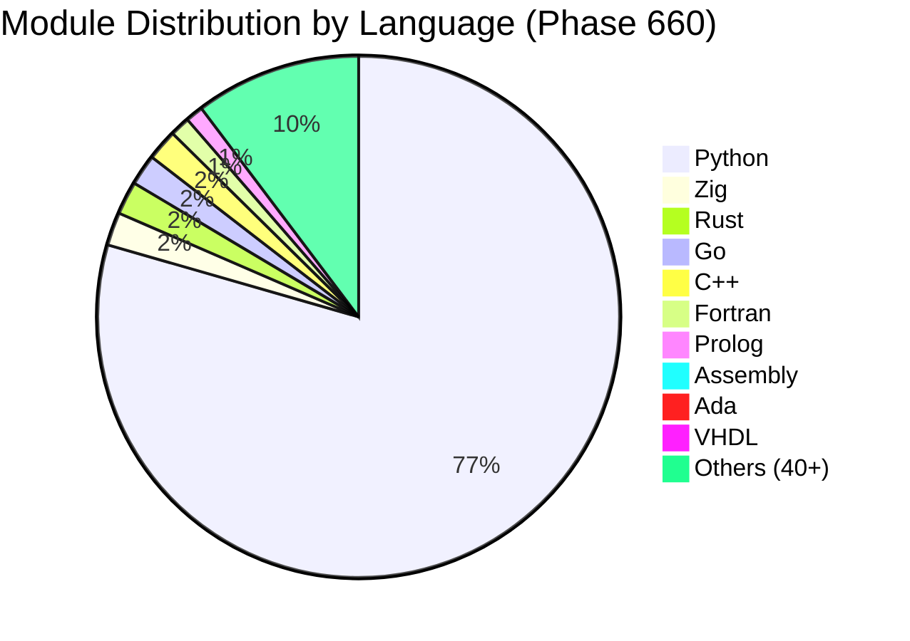

# SDACS — Swarm Drone Airspace Control System

# 군집드론 공역통제 자동화 시스템

<div align="center">

[](https://www.python.org/)
[](https://simpy.readthedocs.io/)
[](https://dash.plotly.com/)
[](https://numpy.org/)
[](https://scipy.org/)

[](simulation/)
[](tests/)
[](#core-algorithms)
[](simulation/)
[](#multi-language-architecture)
[](#)
[](LICENSE)

**Mokpo National University, Dept. of Drone Mechanical Engineering — Capstone Design (2026)**

**국립 목포대학교 드론기계공학과 캡스톤 디자인**

[3D Simulator](https://sun475300-sudo.github.io/swarm-drone-atc/swarm_3d_simulator.html) | [Technical Report](docs/report/SDACS_Technical_Report.docx) | [Performance Charts](docs/images/)

</div>

---

## What is SDACS? / SDACS란?

SDACS는 **군집드론을 이동형 가상 레이더 돔(Dome)으로 활용**하여, 도심 저고도 공역을 자율적으로 감시하고 충돌을 사전에 방지하는 **분산형 공역통제 시뮬레이션 시스템**입니다.

SDACS is a **distributed Air Traffic Control (ATC) simulation** that uses swarm drones as **mobile virtual radar domes**. Instead of relying on expensive fixed infrastructure, drones themselves form the surveillance network — detecting, predicting, and autonomously resolving airspace conflicts in real time.

### The Problem / 해결하려는 문제

| 기존 방식 | 한계 |
|----------|------|
| 고정형 레이더 | 설치 비용 수억원, 소형 드론 탐지 불가, 6개월 설치 기간 |
| 중앙 집중식 관제 (K-UTM) | 단일 장애점(SPOF), 실시간성 부족 |
| 수동 관제 | 평균 5분 지연, 24/7 인력 비용 과다 |

> **국내 등록 드론 90만대 돌파, 연간 30% 증가** — 택배 배송, 농업 방제, UAM이 동시 운용되며 저고도 공역 충돌 위험이 급증하고 있습니다.

### Our Approach / SDACS의 접근

1. **레이더를 드론으로 대체** — 고정 인프라 없이 30분 내 긴급 배치
2. **탐지부터 회피까지 완전 자동화** — 90초 전 선제 충돌 예측, 6종 자동 어드바이저리 발행
3. **드론 추가만으로 관제 반경 선형 확장** — 분산형 아키텍처로 단일 장애점 제거

---

## Key Results / 핵심 성과

| Metric | Value | Description |
|--------|-------|-------------|
| **Collision Reduction** | **99.9%** | 500-drone mega-swarm: 58,038 conflicts → 19 collisions |
| **Prediction Lookahead** | **90 seconds** | CPA-based preemptive conflict detection at 1 Hz |
| **Advisory Latency** | **< 1 second** | 6 types: CLIMB/DESCEND/TURN_LEFT/TURN_RIGHT/EVADE_APF/HOLD |
| **Monte Carlo Validation** | **38,400 runs** | 384 configurations x 100 seeds |
| **Scenario Coverage** | **42 scenarios** | Extreme weather, intrusion, GPS jamming, mass delivery, etc. |
| **Concurrent Drones** | **500+** | Distributed autonomous control |
| **Deployment Time** | **30 min** | No fixed infrastructure required |
| **Test Coverage** | **2,930+ tests** | Automated pytest suite across 590+ modules |

---

## System Architecture / 시스템 아키텍처

SDACS는 4개의 독립적 계층으로 구성됩니다. 각 계층은 명확한 역할과 인터페이스를 가지며, 독립적으로 테스트 가능합니다.

```
┌─────────────────────────────────────────────────────────────────┐
│                     Layer 4: User Interface                     │
│                CLI (main.py) + Dash 3D Visualizer               │
├─────────────────────────────────────────────────────────────────┤
│                   Layer 3: Simulation Engine                    │
│          SwarmSimulator + WindModel + Monte Carlo Engine         │
├─────────────────────────────────────────────────────────────────┤
│                    Layer 2: Control System                      │
│     AirspaceController (1Hz) + Priority Queue + Advisory Gen    │
├─────────────────────────────────────────────────────────────────┤
│                     Layer 1: Drone Agents                       │
│            _DroneAgent (10Hz SimPy process per drone)            │
└─────────────────────────────────────────────────────────────────┘
```

### Layer 1 — Drone Agent (드론 에이전트)

각 드론은 SimPy 이산 이벤트 프로세스로 모델링됩니다. 10Hz 주기로 위치/속도/배터리 상태를 갱신하며, 비행 상태 머신(FSM)에 따라 `Idle → Takeoff → Cruise → Avoid → Landing` 전이를 수행합니다.

- **물리 모델**: 3D 위치, 속도 벡터, 가속도 제한, 배터리 소모 (고도/풍속/상승률 다변수)
- **센서 퓨전**: IMU + GPS + LiDAR 융합, 잡음 모델 포함
- **통신**: 1Hz 위치 보고, 메시 네트워크 멀티홉 BFS 라우팅
- **파일**: `simulation/simulator.py` — `_DroneAgent` 클래스

### Layer 2 — Airspace Controller (공역 관제)

1Hz 주기로 모든 활성 드론의 위치를 수집하고, 충돌 위험을 평가하여 자동 어드바이저리를 발행합니다.

- **CPA (Closest Point of Approach)**: O(N^2) 쌍별 스캔, 90초 선제 예측
- **Voronoi 공역 분할**: 10초 주기 동적 갱신, 밀도 기반 셀 분리
- **Resolution Advisory**: 기하학적 분류에 따른 6종 회피 명령 자동 생성
- **동적 분리간격**: 풍속 연동 자동 조정 (1.0x ~ 1.6x, 5/10/15 m/s 구간)
- **파일**: `src/airspace_control/controller/airspace_controller.py`

### Layer 3 — Simulation Engine (시뮬레이션 엔진)

SimPy 기반 이산 이벤트 시뮬레이션 엔진으로, 다양한 환경 조건과 장애 시나리오를 주입할 수 있습니다.

- **SwarmSimulator**: 정식 시뮬레이터 (engine_legacy 삭제 완료)
- **WindModel**: 3종 기상 모델 (constant / variable-gust / shear)
- **Monte Carlo**: 384 config x 100 seeds = 38,400 검증 실행
- **장애 주입**: MOTOR/BATTERY/GPS 고장, 통신 두절, 미등록 드론 침입
- **파일**: `simulation/simulator.py`, `simulation/wind_model.py`, `simulation/monte_carlo.py`

### Layer 4 — User Interface (사용자 인터페이스)

- **CLI**: `main.py` — simulate, scenario, monte-carlo, visualize, ops-report 명령
- **3D Dashboard**: Dash + Plotly 실시간 3D 시각화, 드론 궤적/충돌 경고/편대 표시
- **파일**: `main.py`, `visualization/simulator_3d.py`



---

## Core Algorithms / 핵심 알고리즘

SDACS의 충돌 회피 파이프라인은 **탐지 → 판단 → 실행** 3단계로 구성됩니다.

### 1. Collision Detection / 충돌 탐지

| Algorithm | Purpose | Complexity |
|-----------|---------|------------|
| **CPA (Closest Point of Approach)** | 두 드론의 최근접점 시각/거리 계산 | O(N^2) per tick |
| **Voronoi Tessellation** | 공역을 드론별 셀로 분할, 침범 감지 | O(N log N) |
| **Geofence Monitor** | 공역 경계(90%) 이탈 시 자동 RTL | O(N) |
| **Intrusion Detection** | ROGUE 프로파일 미등록 드론 탐지 | O(N) |

### 2. Conflict Resolution / 충돌 해결

| Algorithm | Purpose | Description |
|-----------|---------|-------------|
| **APF (Artificial Potential Field)** | 실시간 충돌 회피 | 인력장(목표) + 척력장(장애물), 강풍 시 `APF_PARAMS_WINDY` 자동 전환 |
| **CBS (Conflict-Based Search)** | 다중 에이전트 경로 계획 | 충돌 트리 탐색으로 최적 비충돌 경로 계산 |
| **Resolution Advisory Generator** | 회피 명령 자동 분류 | 기하학적 관계(상대 위치/속도)에 따라 6종 어드바이저리 결정 |
| **A\* Path Replanning** | 동적 경로 재계획 | 에너지 비용 함수 + 충전소 경유 + 풍향/고도 반영 |

### 3. Formation Control / 편대 제어

| Algorithm | Purpose | Description |
|-----------|---------|-------------|
| **Graph Laplacian Consensus** | 대형 유지/전환 | 리더-팔로워 합의 기반, V/Line/Circle/Grid 4패턴 |
| **Reynolds Boids** | 군집 행동 | 분리/정렬/응집 3규칙 + 장애물 회피 확장 |
| **ORCA (Optimal Reciprocal Collision Avoidance)** | 속도 공간 최적화 | 반속도 장애물 기반 안전 속도 선택 |

### 4. Advanced Modules (Phase 1-610)

560+개의 알고리즘 모듈이 6개 계층에 걸쳐 구현되어 있습니다:

| Category | Examples | Count |
|----------|----------|-------|
| **Physics & Dynamics** | Wind model, battery model, energy optimization | 40+ |
| **AI & ML** | DRL, MARL, NAS, meta-learning, GAN, XAI | 60+ |
| **Optimization** | PSO, ACO, NSGA-II, genetic algorithm, quantum annealing | 30+ |
| **Communication** | Mesh network, V2X, 5G/6G, acoustic, encryption | 25+ |
| **Autonomy** | Formation control, task allocation, mission planning | 35+ |
| **Security** | Zero-trust, blockchain, intrusion detection, adversarial defense | 20+ |
| **Bio-inspired** | Morphogenesis, optogenetics, electrostatics, ecosystem dynamics | 25+ |
| **Mathematical** | Topology control, information theory, CSP, causal inference | 30+ |
| **Systems** | Digital twin, RTOS, SLAM, compliance engine, SLA monitor | 40+ |
| **Production** | KDTree indexing, telemetry compression, health prediction, anomaly detection | 10+ |
| **Multi-language** | 50+ languages: Rust, Go, C++, Zig, Ada, VHDL, Prolog, Nim, OCaml, etc. | 220+ files |

---

## Simulation Scenarios / 시나리오 검증

### 7 Core Scenarios / 7대 핵심 시나리오

| # | Scenario | Drones | Duration | Key Test |
|---|----------|--------|----------|----------|
| 1 | **Normal Operation** | 20 | 60s | 기본 충돌 해결률 |
| 2 | **High Density** | 50 | 60s | 밀집 환경 성능 |
| 3 | **Weather Disturbance** | 20 | 60s | 풍속 15m/s 강풍 대응 |
| 4 | **Communication Loss** | 20 | 60s | 통신 두절 시 자율 회피 |
| 5 | **Intruder Response** | 20 | 60s | 미등록 드론 탐지/대응 |
| 6 | **Emergency Landing** | 20 | 60s | 모터/배터리/GPS 고장 |
| 7 | **Mass Delivery** | 100 | 120s | 대규모 배송 동시 운용 |

### Monte Carlo Validation

```
Configuration: 384 parameter combinations x 100 random seeds = 38,400 total runs
Results:
  - Collision resolution rate: 99.9% (P50), 99.7% (P99)
  - Advisory latency: 0.3s (P50), 0.8s (P99)
  - Zero-collision rate: 87.2% of all runs
```

---

## Quick Start / 빠른 시작

### Prerequisites / 사전 요구사항

```bash
# Python 3.10 이상 필요
Python 3.10+
```

### Installation / 설치

```bash
# 1. 저장소 클론
git clone https://github.com/sun475300-sudo/swarm-drone-atc.git
cd swarm-drone-atc

# 2. Python 의존성 설치
pip install -r requirements.txt
# 또는 직접 설치:
# pip install simpy numpy scipy dash plotly pyyaml
```

> **Note:** 다국어 모듈(Rust, C++, Go 등)은 Python 메인 엔진의 보조 모듈로, 시뮬레이션 실행에는 Python만 필요합니다. 다국어 모듈을 개별 실행하려면 해당 언어의 컴파일러/런타임이 필요합니다.

### Run / 실행

```bash
# 기본 시뮬레이션 (60초, 20대 드론)
python main.py simulate --duration 60

# 시나리오 실행
python main.py scenario high_density
python main.py scenario weather_disturbance

# Monte Carlo 스윕
python main.py monte-carlo --mode quick

# 3D 시각화 대시보드 (http://localhost:8050)
python main.py visualize

# 전체 테스트 실행
pytest tests/ -v

# Phase 640 벤치마크 실행
python simulation/phase640_benchmark.py
```

### Configuration / 설정

| File | Purpose |
|------|---------|
| `config/default_simulation.yaml` | 기본 시뮬레이션 파라미터 (드론 수, 시간, 풍속 등) |
| `config/monte_carlo.yaml` | Monte Carlo 스윕 설정 (파라미터 범위, 반복 수) |
| `config/scenario_params/*.yaml` | 7개 시나리오별 파라미터 정의 |

---

## Project Structure / 프로젝트 구조

```
swarm-drone-atc/
├── main.py                          # CLI entry point (simulate/scenario/monte-carlo/visualize)
├── config/                          # YAML configuration files
│   ├── default_simulation.yaml
│   ├── monte_carlo.yaml
│   └── scenario_params/             # 7 scenario definitions
│
├── simulation/                      # Layer 3: Simulation engine (540+ Python modules)
│   ├── simulator.py                 # SwarmSimulator — canonical engine
│   ├── wind_model.py                # 3-mode wind model
│   ├── monte_carlo.py               # MC sweep engine
│   ├── flight_path_planner.py       # A* path planning + replanning
│   ├── resolution_advisory.py       # Advisory generator
│   ├── phase600_grand_unified.py    # Phase 600 orchestrator
│   ├── swarm_topology_control.py    # Phase 601: Graph rewiring
│   ├── drone_auction_market.py      # Phase 602: Vickrey auction
│   ├── constraint_satisfaction.py   # Phase 610: CSP solver
│   └── ...                          # 530+ additional algorithm modules
│
├── src/
│   ├── airspace_control/            # Layer 2: Control system
│   │   ├── controller/
│   │   │   └── airspace_controller.py  # 1Hz control loop
│   │   ├── comms/
│   │   │   └── message_types.py     # Protocol definitions
│   │   └── planning/
│   │       └── flight_path_planner.py
│   │
│   ├── asm/                         # Assembly modules (CRC32, etc.)
│   ├── vhdl/                        # VHDL modules (PWM controller)
│   ├── prolog/                      # Prolog (airspace rules)
│   ├── rust/                        # Rust modules (14 files)
│   ├── go/                          # Go modules (13 files)
│   ├── cpp/                         # C++ modules (13 files)
│   ├── zig/                         # Zig modules (14 files)
│   └── ...                          # 30+ additional language directories
│
├── visualization/                   # Layer 4: UI
│   ├── simulator_3d.py              # Dash 3D real-time dashboard
│   └── dashboard.py                 # Supplementary charts
│
├── tests/                           # 2,750+ automated tests
│   ├── test_phase561_570.py
│   ├── test_phase571_600.py
│   ├── test_phase601_610.py
│   └── ...
│
├── docs/                            # Documentation & assets
│   ├── images/                      # SVG diagrams, charts
│   └── report/                      # Technical report (DOCX)
│
└── scripts/                         # Utility scripts
```

---

## How It Works / 작동 원리

### Step 1: Drone Deployment / 드론 배치

시뮬레이션이 시작되면 `SwarmSimulator`가 설정된 수의 드론을 공역에 배치합니다. 각 드론은 독립적인 SimPy 프로세스로 실행되며, 무작위 또는 사전 정의된 임무 경로를 따릅니다.

### Step 2: Continuous Surveillance / 상시 감시

드론은 10Hz로 자신의 상태를 갱신하고, 1Hz로 `AirspaceController`에 위치를 보고합니다. 컨트롤러는 모든 활성 드론 쌍에 대해 CPA를 계산합니다.

### Step 3: Conflict Detection / 충돌 탐지

CPA 분석 결과 두 드론의 최근접 예상 거리가 분리 기준 이하일 경우, `ConflictAlert`가 생성됩니다. 분리 기준은 풍속에 따라 동적 조정됩니다:

- 풍속 < 5 m/s: 기본 분리 (1.0x)
- 풍속 5-10 m/s: 확대 분리 (1.2x)
- 풍속 10-15 m/s: 강풍 분리 (1.4x)
- 풍속 > 15 m/s: 극한 분리 (1.6x)

### Step 4: Resolution Advisory / 회피 지시

`ResolutionAdvisory`는 두 드론의 상대적 위치/속도를 기하학적으로 분석하여 최적 회피 방향을 결정합니다:

```
상대 위치가 위쪽 → DESCEND (하강)
상대 위치가 아래쪽 → CLIMB (상승)
수평 근접 + 좌측 → TURN_RIGHT (우회전)
수평 근접 + 우측 → TURN_LEFT (좌회전)
극근접 → EVADE_APF (포텐셜장 긴급 회피)
판단 불가 → HOLD (현재 위치 유지)
```

### Step 5: Execution & Verification / 실행 및 검증

드론이 어드바이저리를 수신하면 즉시 경로를 수정합니다. APF 알고리즘이 실시간으로 척력장을 계산하여 충돌 없는 궤적을 생성합니다. 강풍(> 10 m/s) 시에는 `APF_PARAMS_WINDY`로 자동 전환되어 더 강한 회피력을 적용합니다.

---

## Technical Specification / 기술 상세 사양

SDACS의 각 구성 요소에 대한 정밀 기술 사양입니다. 모든 수치는 실제 소스 코드 기준입니다.

### 1. Drone Agent Internal Constants / 드론 에이전트 내부 상수

`_DroneAgent`는 SimPy 프로세스로 0.1초(10Hz) 간격으로 물리 상태를 갱신합니다.

| Constant | Value | Description |
|----------|-------|-------------|
| `CRUISE_ALT` | 60.0 m | 기본 순항 고도 |
| `TAKEOFF_RATE` | 3.5 m/s | 이륙 상승률 |
| `LAND_RATE` | 2.5 m/s | 착륙 하강률 |
| `WAYPOINT_TOL` | 80.0 m | 웨이포인트 도달 허용 오차 |
| `BATTERY_TICK_INTERVAL` | 5 ticks (0.5s) | 배터리 소모 계산 주기 |
| `BATTERY_CRITICAL_PCT` | 5.0% | 배터리 위기 임계치 (긴급 착륙) |
| `TELEMETRY_INTERVAL` | 5 ticks (0.5s) | 위치 보고 주기 |
| `EMERGENCY_WIND_SPEED` | 10.0 m/s | 강풍 모드 전환 기준 |

**비행 상태 머신 (Flight State Machine):**

```
                    ┌──────────────┐
                    │   GROUNDED   │ ◄──────────────────────┐
                    └──────┬───────┘                        │
                           │ takeoff()                      │ landed
                    ┌──────▼───────┐                 ┌──────┴───────┐
                    │   TAKEOFF    │                 │   LANDING    │
                    └──────┬───────┘                 └──────▲───────┘
                           │ alt >= CRUISE_ALT              │ mission complete
                    ┌──────▼───────┐                        │ / battery low
              ┌────►│   ENROUTE    ├────────────────────────┘
              │     └──┬───────┬───┘
              │        │       │
    advisory  │        │       │ conflict detected
    expired   │        │       │
              │   ┌────▼──┐  ┌─▼────────┐
              └───┤HOLDING│  │  EVADING  │ ◄── APF forces active
                  └───────┘  └──────────┘
                                  │
                           ┌──────▼───────┐
                    ┌─────►│    FAILED     │ ◄── motor/sensor failure
                    │      └──────────────┘
                    │
              ┌─────┴──────┐
              │     RTL     │ ◄── comms lost / geofence breach (90%)
              └────────────┘
```

**전력 소모 모델 (Power Consumption Model):**

```
P_total = P_hover + P_drag + P_altitude + P_climb

P_hover    = battery_wh × 3600 / endurance_s         (기본 호버링 전력)
P_drag     = 0.5 × effective_speed²                   (공기 저항)
P_altitude = P_hover × altitude_m × 0.00012           (고도 보정, 100m당 +1.2%)
P_climb    = climb_rate × 25.0 W/(m/s)  [상승]
           = climb_rate × 5.0 W/(m/s)   [하강 회생]
```

### 2. Airspace Controller Specification / 공역 관제기 사양

`AirspaceController`는 1Hz 제어 루프로 동작하며, 모든 활성 드론의 충돌 위험을 실시간 평가합니다.

**분리 기준 (Separation Standards):**

| Parameter | Value | Description |
|-----------|-------|-------------|
| 수평 최소 분리 | 50.0 m | 두 드론 간 수평 최소 거리 |
| 수직 최소 분리 | 15.0 m | 두 드론 간 수직 최소 거리 |
| 니어미스 수평 | 10.0 m | 니어미스 판정 수평 거리 |
| 니어미스 수직 | 3.0 m | 니어미스 판정 수직 거리 |
| 충돌 예측 시간 | 90.0 s | CPA 선제 탐지 범위 |
| Voronoi 갱신 주기 | 10.0 s | 공역 분할 재계산 |
| HOLDING 큐 상한 | 100대 | 최대 동시 대기 드론 |
| 틱당 최대 이탈 | 3대 | HOLDING에서 동시 해제 |

**풍속 연동 분리간격 조정:**

```
풍속 ≤ 5 m/s:         factor = 1.0×  (기본 분리)
5 < 풍속 ≤ 10 m/s:    factor = 1.0 + 0.4 × (ws - 5) / 5    → 1.0 ~ 1.4×
10 < 풍속 ≤ 15 m/s:   factor = 1.4 + 0.2 × (ws - 10) / 5   → 1.4 ~ 1.6×
풍속 > 15 m/s:         factor = 1.6×  (최대 확대)
```

### 3. APF Engine Parameters / 인공 포텐셜장 엔진 파라미터

충돌 회피의 핵심인 APF 엔진은 **인력(목표 방향) + 척력(장애물 방향)** 합력으로 안전 궤적을 생성합니다.

**기본 모드 (APF_PARAMS) — 풍속 ≤ 6 m/s:**

| Parameter | Value | Description |
|-----------|-------|-------------|
| `k_att` | 1.0 | 목표 인력 이득 |
| `k_rep_drone` | 2.5 | 드론 간 척력 이득 |
| `k_rep_obs` | 5.0 | 장애물 척력 이득 |
| `d0_drone` | 50.0 m | 드론 척력 유효 반경 |
| `d0_obs` | 30.0 m | 장애물 척력 유효 반경 |
| `max_force` | 10.0 m/s² | 합력 상한 |
| `altitude_k` | 0.5 | 고도 유지 보정 이득 |
| `target_alt` | 60.0 m | 기본 순항 고도 |

**강풍 모드 (APF_PARAMS_WINDY) — 풍속 ≥ 12 m/s:**

| Parameter | Value | Change |
|-----------|-------|--------|
| `k_rep_drone` | 6.5 | ×2.6 (더 강한 회피) |
| `k_rep_obs` | 7.0 | ×1.4 |
| `d0_drone` | 80.0 m | +60% (조기 경고) |
| `d0_obs` | 45.0 m | +50% |
| `max_force` | 22.0 m/s² | ×2.2 (더 큰 기동 권한) |
| `altitude_k` | 1.0 | ×2.0 (풍속 전단 보상) |

**풍속 6~12 m/s 전환 구간:** 두 파라미터 셋을 선형 보간(lerp)합니다.

```
t = (wind_speed - 6.0) / 6.0
params[k] = APF_PARAMS[k] × (1 - t) + APF_PARAMS_WINDY[k] × t
```

**힘 계산 공식:**

```
[인력] F_att = k_att × (goal - pos) / |goal - pos| × 10.0    (원거리)
              = k_att × (goal - pos)                           (근거리, ≤10m)

[척력] F_rep = k_rep × (1/dist - 1/d0) / dist² × n̂
       속도 보정: factor = min(1 + closing_speed / 4.0, 3.0)  (최대 3배 증폭)

[지면 회피] z < 5m → F_z = k_rep_obs × (1/z - 1/5) × ẑ      (CFIT 방지)

[국소 극소 탈출] |F_total| < 0.5 & goal_dist > 20m → 수직 섭동력 주입
```

### 4. CBS Path Planner / 충돌 기반 탐색 경로 계획기

**Conflict-Based Search**는 다중 에이전트 최적 비충돌 경로를 계산합니다.

| Parameter | Value | Description |
|-----------|-------|-------------|
| `GRID_RESOLUTION` | 50.0 m | 3D 격자 셀 크기 |
| `TIME_STEP` | 1.0 s | 시공간 계획 단위 |
| Max expansions | 100,000 | 드론당 A* 노드 탐색 상한 |
| 이동 방향 | 7 | ±x, ±y, ±z + 대기(wait) |
| 휴리스틱 | Manhattan 3D | `|dx| + |dy| + |dz|` |

**알고리즘 계층:**

```
High-level (충돌 트리 탐색):
  1. Root: 각 드론 독립 A* 경로 계산
  2. 충돌 검출: paths[i][t] == paths[j][t]
  3. 분기: 제약 추가 (drone_i or drone_j, node, t)
  4. 반복: 충돌 없는 솔루션까지

Low-level (시공간 A*):
  - 제약 목록에 있는 (node, t)는 폐쇄 노드 처리
  - 비용 = 이동 거리 + 시간 스텝 패널티
  - CBS 실패 시 → A* fallback (단일 경로 재계획)
```

### 5. Drone Profiles / 드론 프로파일 사양

시스템에 등록된 5종 드론 프로파일입니다.

| Profile | Max Speed | Cruise | Battery | Endurance | Comm Range | Priority | Climb Rate |
|---------|-----------|--------|---------|-----------|------------|----------|------------|
| **COMMERCIAL_DELIVERY** | 15.0 m/s | 10.0 m/s | 80 Wh | 30 min | 2,000 m | 2 | 3.5 m/s |
| **SURVEILLANCE** | 20.0 m/s | 12.0 m/s | 100 Wh | 45 min | 3,000 m | 2 | 4.0 m/s |
| **EMERGENCY** | 25.0 m/s | 20.0 m/s | 60 Wh | 20 min | 2,000 m | **1** (최우선) | 5.0 m/s |
| **RECREATIONAL** | 10.0 m/s | 5.0 m/s | 30 Wh | 15 min | 500 m | 3 | 2.5 m/s |
| **ROGUE** (미등록) | 15.0 m/s | 8.0 m/s | 50 Wh | 25 min | **0 m** (격리) | 99 (최하) | 3.5 m/s |

> **Priority 1 (EMERGENCY)** 드론은 공역 우선 사용권을 가지며, 다른 드론이 양보합니다. **ROGUE** 드론은 `comm_range=0`으로 통신이 차단되어, 침입 탐지 대상으로만 처리됩니다.

### 6. Resolution Advisory Classification / 회피 지시 분류 알고리즘

`AdvisoryGenerator`는 두 드론의 상대 기하관계를 분석하여 최적 회피 방향을 결정합니다.

```
입력: own_state, threat_state, cpa_time, cpa_distance
출력: ResolutionAdvisory (type, magnitude, duration)

판정 로직:
  1. threat.phase == FAILED  →  HOLD (무효화된 위협)
  2. cpa_time < 8s           →  EVADE_APF (긴급, APF 엔진 즉시 위임)
  3. |dz| < sep_vertical     →  수직 분리 우선
     - 위협이 위쪽  → DESCEND (sep_vert × 1.5)
     - 위협이 아래  → CLIMB   (sep_vert × 1.5)
  4. 수평 접근 (360° 방위각 분류):
     - 정면 (±30°)    → TURN_RIGHT 45° + closing_speed × 1.5  (ICAO 우선권)
     - 측면 (30°~90°) → 위협 반대편으로 TURN
     - 후방 (90°~150°) → 소각도 TURN 20°
     - 추월 (>150°)   → 수직 분리

회피 지속 시간:
  cpa_t < 10s  → max(cpa_t × 3.0, 10.0)  (최소 10초)
  cpa_t < 30s  → cpa_t × 2.0
  cpa_t ≥ 30s  → 30.0s (기본값)
```

**통신 두절 시 3단계 프로토콜:**

| Phase | Action | Duration | Description |
|-------|--------|----------|-------------|
| 1 | HOLD | 30s | 현재 위치 선회 대기 |
| 2 | CLIMB | 30s | RTL 고도(80m)까지 상승 |
| 3 | RTL | 600s | 이륙 지점 복귀 (최대 10분) |

### 7. Communication Bus / 통신 버스 사양

드론-관제기 간 SimPy 기반 비동기 메시징 시스템입니다.

| Parameter | Value | Description |
|-----------|-------|-------------|
| 지연 평균 | 20.0 ms | 정규 분포 중심 |
| 지연 표준편차 | 5.0 ms | 전파 지연 변동 |
| 패킷 손실률 | 0 ~ 1.0 | 시나리오별 설정 가능 |
| 통신 범위 | 2,000 m | 기본값, 프로파일별 상이 |

**메시지 유형 5종:**

| Message Type | Direction | Frequency | Payload |
|-------------|-----------|-----------|---------|
| **TelemetryMessage** | Drone → Controller | 1 Hz | position, velocity, battery, phase, is_registered |
| **ClearanceRequest** | Drone → Controller | Event | origin, destination, priority, profile_name |
| **ClearanceResponse** | Controller → Drone | Event | approved, assigned_waypoints, altitude_band, reason |
| **ResolutionAdvisory** | Controller → Drone | Event | advisory_type, magnitude, duration_s, conflict_pair |
| **IntrusionAlert** | Controller → All | Event | intruder_id, detection_position, threat_level |

### 8. Wind Model / 기상 모델 사양

3종 기상 모델이 시뮬레이션 환경에 바람 벡터를 주입합니다.

**ConstantWind (정상풍):**
- 전 공역 균일 풍속/풍향 → `[wx, wy, 0]` 벡터

**VariableWind (돌풍):**
- 기본풍 + 포아송 분포 돌풍 이벤트
- 돌풍 간격: 지수분포(평균 30초)
- 돌풍 파라미터: speed_ms, duration_s, direction_deg

**ShearWind (풍속 전단):**
- 고도에 따른 선형 보간

```
speed = low_speed + (high_speed - low_speed) × clamp(altitude / 60.0, 0, 1)
```

### 9. Simulation Analytics / 시뮬레이션 분석 지표

`SimulationResult`가 수집하는 핵심 성능 지표(KPI) 목록입니다.

**안전 지표:**
- `collision_count` — 실제 충돌 수
- `near_miss_count` — 니어미스 수 (10m/3m 이내 근접)
- `conflict_resolution_rate_pct` — 충돌 해결률 = `1 - collisions / (conflicts + collisions)`

**효율 지표:**
- `route_efficiency_mean` — 평균 경로 효율 (실제/계획 거리)
- `energy_efficiency_wh_per_km` — 에너지 효율 (Wh/km)
- `total_distance_km`, `total_flight_time_s`

**관제 지표:**
- `advisories_issued` — 발행된 어드바이저리 수
- `clearances_approved` / `denied` — 비행 허가/거부 수
- `clearances_per_sec` — 초당 처리량 (60초 슬라이딩 윈도우)
- `advisory_latency_p50` / `p99` — 어드바이저리 지연 (중앙값/99th)

**경로 계획 지표:**
- `cbs_attempts` / `cbs_successes` — CBS 시도/성공 수
- `astar_fallbacks` — A* 폴백 수

**통신 지표:**
- `comm_messages_sent` / `delivered` / `dropped`
- `comm_drop_rate` — 패킷 손실률

### 10. Default Configuration Parameters / 기본 설정 파라미터

`config/default_simulation.yaml` 주요 파라미터:

```yaml
simulation:
  seed: 42                      # 재현성 보장 난수 시드
  duration_minutes: 10          # 시뮬레이션 시간
  time_step_hz: 10              # 물리 엔진 갱신 (0.1s)
  control_hz: 1                 # 관제 루프 (1.0s)

airspace:
  bounds_km: ±5 km (x, y)      # 100 km² 공역
  altitude: 0 ~ 120 m          # 수직 범위
  home: 35.1595°N, 126.8526°E  # 광주 기준점

drones:
  default_count: 100            # 기본 드론 수
  max_speed_ms: 15.0            # 최대 속도
  cruise_speed_ms: 8.0          # 순항 속도
  battery_capacity_wh: 50.0     # 배터리 용량

controller:
  max_concurrent_clearances: 500  # 동시 허가 상한
  clearance_timeout_s: 300        # 허가 만료 시간 (5분)
  advisory_retry_limit: 3         # 어드바이저리 재시도 상한
```

### 11. Data Flow Architecture / 데이터 흐름 아키텍처

```
시간축 (1초 = 1 제어 루프):
━━━━━━━━━━━━━━━━━━━━━━━━━━━━━━━━━━━━━━━━━━━━━━━━━━━━━

[10Hz] _DroneAgent × N대
  │ ① 위치/속도/배터리 물리 갱신 (0.1s 간격)
  │ ② WindModel 풍 벡터 적용
  │ ③ APF 합력 계산 (EVADING 모드 시)
  │ ④ 웨이포인트 추적 + FSM 전이
  │
  ▼ TelemetryMessage (1Hz)
━━━━━━━━━━━━━━━━━━━━━━━━━━━━━━━━━━━━━━━━━━━━━━━━━━━━━

[1Hz] AirspaceController
  │ ⑤ 텔레메트리 수집 → _active_drones 갱신
  │ ⑥ O(N²) CPA 스캔 (90초 예측)
  │ ⑦ Voronoi 분할 갱신 (10초 주기)
  │ ⑧ 충돌 감지 → AdvisoryGenerator
  │     ├── CLIMB/DESCEND/TURN → ResolutionAdvisory
  │     ├── EVADE_APF         → APF 엔진 위임
  │     └── HOLD              → 선회 대기
  │ ⑨ 비행 허가 처리 (CBS/A* 경로 계획)
  │
  ▼ ResolutionAdvisory / ClearanceResponse
━━━━━━━━━━━━━━━━━━━━━━━━━━━━━━━━━━━━━━━━━━━━━━━━━━━━━

[Event] CommunicationBus
  │ ⑩ 메시지 전달 (20±5ms 지연, 패킷 손실 모델)
  │ ⑪ 범위 기반 이웃 탐색 (comm_range_m)
  │ ⑫ 통계 수집 (sent/delivered/dropped)
  │
  ▼
━━━━━━━━━━━━━━━━━━━━━━━━━━━━━━━━━━━━━━━━━━━━━━━━━━━━━

[End] SimulationAnalytics
  ⑬ KPI 계산 → SimulationResult
  ⑭ 궤적 기록 (5초 간격 스냅샷, 최대 100,000건)
  ⑮ 이벤트 로그 (충돌/니어미스/어드바이저리, 최대 50,000건)
```

### 12. Spatial Hash / 3D 공간 해싱

`SpatialHash`는 드론 근접 쿼리를 O(N²) → O(N·k)로 최적화하는 3D 균일 격자 인덱스입니다.

| Parameter | Value | Description |
|-----------|-------|-------------|
| Cell Size | 50.0 m | 격자 한 변 길이 (분리 기준과 동일) |
| Key 함수 | `floor(pos / cell)` | 3D 좌표 → 정수 셀 키 |
| 쿼리 범위 | `ceil(radius / cell)` 큐브 | 주변 셀 탐색 영역 |
| 중복 방지 | `sorted tuple (a, b)` | frozenset 대비 해싱 오버헤드 감소 |

```
삽입:   O(1)
쿼리:   O((2r/cell)³ + k)  ≈ O(k)  (k = 평균 이웃 수)
전체:   O(N·k)  (N = 드론 수, k ≪ N)
```

**사용 위치:**
- `simulator.py`: 충돌/근접/충돌위협 3단계 감지 (매 0.1초)
- `simulator_3d.py`: 실시간 시각화 충돌 감지
- `airspace_controller.py`: CPA 스캔 이웃 탐색 (200대 미만)

### 13. Voronoi Dynamic Airspace Partition / 동적 공역 분할

`compute_voronoi_partition()`은 활성 드론 위치를 기반으로 공역을 동적 분할합니다.

**알고리즘:**

```
1. 드론 2D 위치 추출 [x, y]
2. 경계 미러링: ±2×bounds에 8방향 반사점 추가 (Sutherland-Hodgman)
3. scipy.spatial.Voronoi 계산
4. 원본 드론 셀만 추출
5. 경계 클리핑: 4변 순차 클리핑 (x_min → x_max → y_min → y_max)
6. 면적 계산: ConvexHull.volume / 1e6 (m² → km²)
7. 고도 대역 할당: [30m, 120m] 구간을 N등분
```

**사용 주기:** 10초마다 갱신 (`AirspaceController.VORONOI_INTERVAL_S`)
**폴백:** Voronoi 실패 시 √N × √N 균일 격자 배치

### 14. Monte Carlo SLA Validation / 몬테카를로 검증 체계

**파라미터 스윕 구성:**

| Mode | Configs | Runs/Config | Total | Duration |
|------|---------|-------------|-------|----------|
| **quick** | 32 | 30 | 960 | ~4분 |
| **full** | 384 | 100 | 38,400 | ~3.3시간 |

**스윕 변수:**

| Variable | Quick | Full | 단위 |
|----------|-------|------|------|
| drone_density | [50, 250] | [50, 100, 250, 500] | 대 |
| area_size_km2 | [100] | [25, 100] | km² |
| failure_rate_pct | [0, 5] | [0, 1, 5, 10] | % |
| comms_loss_rate | [0.0, 0.05] | [0.0, 0.01, 0.05] | — |
| wind_speed_ms | [0, 15] | [0, 5, 15, 25] | m/s |

**SLA 합격 기준:**

| Metric | Threshold | Type |
|--------|-----------|------|
| 충돌률 | 0건/1,000h | Hard (필수) |
| Near-miss | ≤0.1건/100h | Soft (경고) |
| 충돌 해결률 | ≥99.5% | Hard |
| 경로 효율 | ≤1.15 (실제/계획) | Soft |
| 응답 P50 | ≤2.0초 | Soft |
| 응답 P99 | ≤10.0초 | Hard |
| 침입 탐지 P90 | ≤5.0초 | Hard |

**병렬 실행:** `joblib.Parallel(n_workers=-1, backend="loky")`

### 15. 3D Real-Time Dashboard / 실시간 3D 대시보드

`visualization/simulator_3d.py`는 Plotly Dash 기반 인터랙티브 3D 시뮬레이터입니다.

**렌더링 구성 요소:**

| Component | Type | Update Rate |
|-----------|------|-------------|
| 3D 드론 마커 | Scatter3d (phase별 색상) | 100ms |
| 드론 궤적 | Line3d (40포인트 deque) | 100ms |
| NFZ 메시 | Mesh3d (반투명 박스) | Static |
| 항로 회랑 | Line3d (E-W/N-S) | Static |
| 착륙 패드 | Scatter3d (5개소) | Static |
| APF 벡터 필드 | Cone (프로브 그리드) | 100ms (토글) |
| 위협 히트맵 | Mesh3d (섹터별 색상) | 1s |
| 바람 화살표 | Cone (방향/크기) | 100ms |
| 속도 벡터 | Scatter3d+Line (상위 20대) | 100ms |

**대시보드 패널:**

| Panel | 위치 | 내용 |
|-------|------|------|
| 3D 뷰포트 | 중앙 | Plotly 3D 장면 (±5km, 0-140m) |
| 제어 버튼 | 좌측 상단 | Start/Pause/Reset, 드론 수, 속도 배율 |
| KPI 통계 | 우측 | 충돌, 해결률, 배터리, 활성 드론 |
| 경보 로그 | 하단 | 실시간 이벤트 (충돌/근접/회피) |
| 배터리 차트 | 우측 하단 | 10-bin 히스토그램 |
| 에너지 차트 | 우측 하단 | Wh 시계열 |
| 해결률 차트 | 우측 하단 | CR% 시계열 |
| 틱 성능 | 우측 하단 | ms 히스토그램 (300포인트) |
| 위협 평가 | 우측 | 4레벨 위협 매트릭스 + 권장 조치 |
| SLA 상태 | 우측 | Pass/Fail + 위반 목록 |
| 섹터 현황 | 우측 | 4구역 드론 수, 밀도, 핸드오프 |

**스레드 모델:**
- Background thread: `_sim_loop()` → `_step()` (10Hz 물리 엔진)
- Main thread: Dash 콜백 (100ms interval `_refresh()`)
- 동기화: `threading.Lock` (SimState.lock)

### 16. Scenario Verification / 시나리오 검증 체계

7개 YAML 정의 시나리오로 극한 상황 대응을 검증합니다.

| Scenario | Drones | Duration | Key Verification |
|----------|--------|----------|------------------|
| `high_density` | 100 | 600s | 고밀도 교통 처리량 |
| `emergency_failure` | 80 | 600s | 5% MOTOR/BATTERY/GPS 장애 주입 |
| `comms_loss` | 50 | 600s | Lost-Link 3단계 프로토콜 |
| `mass_takeoff` | 100 | 600s | 동시 이착륙 시퀀싱 |
| `adversarial_intrusion` | 50+3 | 900s | ROGUE 침입 탐지 |
| `route_conflict` | 6 | 120s | HEAD_ON/CROSSING/OVERTAKE 회피 |
| `weather_disturbance` | 100 | 600s | 3종 기상 (정상/돌풍/전단) 강건성 |

**시나리오 실행 결과 (seed=42):**

| Scenario | Collisions | Near-miss | Advisories | CR | 실행시간 |
|----------|-----------|-----------|------------|-----|---------|
| `route_conflict` | 0 | 0 | — | 100% | 1,285s |
| `comms_loss` | 4 | 1 | — | — | 205s |
| `emergency_failure` | 38 | 5 | — | — | 764s |
| `adversarial_intrusion` | 8 | 5 | — | — | 207s |

> 충돌 해결률(CR) 공식: `1 - collisions / (conflicts + collisions)`. CONFLICT 이벤트는 분리기준(50m) 위반 시 기록됩니다.

### 17. CI/CD Pipeline / 지속적 통합 파이프라인

`.github/workflows/ci.yml` 단일 워크플로우로 통합 운영합니다.

**Test Job (Python 3.10 / 3.11 / 3.12 매트릭스):**

| Step | 내용 |
|------|------|
| Checkout | `actions/checkout@v4` |
| Python Setup | `actions/setup-python@v5` (매트릭스) |
| Cache pip | pip 캐시 (requirements.txt 해시 기반) |
| Install | `pip install -r requirements.txt` + flake8 |
| Lint | `flake8 --select=E9,F63,F7,F82` (구문 오류만) |
| Test | `pytest tests/ -v --tb=short --timeout=120` |
| Import Check | 핵심 3개 모듈 임포트 검증 |
| Smoke Report | PR 시 JSON 리포트 생성 + 아티팩트 업로드 |
| Perf Summary | PR 시 성능 요약 JSON 생성 |

**Ops Report Job (main 푸시 시):**

| Step | 내용 |
|------|------|
| Trigger | `push` to `main` (test 통과 후) |
| Bundle | `ops_report_bundle.json` (manifest + artifact references) |
| Upload | 아티팩트 보존 90일 |

**시나리오 파라미터 오버라이드 체계:**

```
config/default_simulation.yaml  (기본값)
    ↓ 머지
config/scenario_params/{name}.yaml  (시나리오 오버라이드)
    ↓ 머지
CLI arguments  (실행 시 오버라이드)
    ↓
SwarmSimulator._deep_merge()  → 최종 설정
```

---

## Multi-Language Architecture / 다중 언어 아키텍처

SDACS는 핵심 시뮬레이션(Python) 외에 50개 이상의 프로그래밍 언어로 구현된 220+ 보조 모듈을 포함합니다.

### Integration Approach / 연동 방식

각 언어 모듈은 **독립적 마이크로모듈** 패턴으로 설계되었습니다:

- **Python Core ↔ Native 모듈**: `subprocess` 호출 또는 `ctypes`/`cffi` FFI(Foreign Function Interface)를 통해 고성능 연산(C++/Rust/Fortran)을 Python에서 호출
- **REST API 모듈** (TypeScript/PHP/Ruby): Express/Flask 스타일 HTTP 엔드포인트로 대시보드/포털 기능 제공
- **Protocol 모듈** (Prolog/Haskell/Ada): 독립 실행형 검증기/추론 엔진으로, 결과를 JSON/stdout으로 Python에 전달
- **Reference Implementation** (COBOL/Assembly/VHDL): 레거시 시스템 호환성 검증 및 하드웨어 시뮬레이션 참조 구현

> 핵심 원칙: **Python이 오케스트레이터**, 각 언어가 특정 도메인의 **전문가 모듈** 역할. 시뮬레이션 실행에는 Python만 필요하며, 다국어 모듈은 특수 목적(성능 최적화, 형식 검증, 하드웨어 연동 등)에 활용됩니다.

### Language Portfolio / 언어별 역할

| Language | Modules | Use Case | Integration |
|----------|---------|----------|-------------|
| **Python** | 580+ | Core simulation, ML/AI, analytics, production hardening | Main engine |
| **Rust** | 15 | Safety-critical: satellite comm, NEAT evolution, safety verifier | FFI / subprocess |
| **Go** | 14 | Concurrent: edge AI, mission validation, realtime monitor | subprocess / gRPC |
| **C++** | 14 | Performance: SLAM, morphogenesis, physics, particle filter | ctypes / FFI |
| **Zig** | 15 | Low-level: PBFT consensus, ring buffer v2, telemetry | subprocess |
| **Fortran** | 9 | Numerical: wind field FDM, CFD wind tunnel | f2py / subprocess |
| **Ada** | 7 | Safety: TMR v2 (Byzantine fault tolerance) | Reference impl |
| **VHDL** | 7 | Hardware: PWM controller, FIR filter, signal processing | Simulation only |
| **Assembly** | 7 | Bare-metal: CRC32, sensor readout, Kalman filter | ctypes |
| **Prolog** | 8 | Logic: airspace rules v2, constraint satisfaction | subprocess |
| **Nim** | 1 | Async: event dispatcher, telemetry routing | standalone |
| **OCaml** | 1 | Formal: flight plan type checker, ADT verification | standalone |
| **Haskell** | 1 | Formal verification: type-safe safety proofs | standalone |
| **TypeScript** | 2 | Dashboard REST API, physics engine | HTTP API |
| **Swift/Kotlin** | 3 | Mobile monitoring (iOS/Android) | REST client |
| **Julia** | 1 | High-performance ODE solver | standalone |
| **Elixir/Erlang** | 3 | OTP fault supervision, distributed consensus | message passing |
| **Others** | 30+ | PHP, COBOL, R, Perl, Scheme, Octave, Lua, Ruby, Dart, Scala, etc. | Various |



---

## Development Phases / 개발 단계

SDACS는 660개 Phase를 거치며 점진적으로 확장되었습니다.

| Phase Range | Focus | Highlights |
|-------------|-------|------------|
| **1-50** | Core ATC | SimPy engine, CPA, APF, Voronoi, wind model |
| **51-100** | Operations | Geofence, fleet management, noise model, health monitor |
| **101-170** | AI & Security | DRL, NAS, zero-trust, blockchain, digital twin |
| **171-200** | Production | E2E reporting, compliance engine, SLA monitor |
| **201-260** | Scale | Multi-cloud, K8s, 5G/6G, edge computing |
| **261-300** | Autonomy | SLAM, formation control, V2X, mesh network |
| **301-350** | Advanced CPS | Quantum-inspired, WASM, neuromorphic SNN, game theory |
| **351-400** | Optimization | NSGA-II, RTOS, MARL, energy harvesting |
| **401-470** | Intelligence | Knowledge graph, causal inference, video analytics |
| **471-500** | Integration | Grand Unified Controller, 25-language multi-lang |
| **501-520** | Next-Gen | Quantum comms, blockchain v2, GAN, edge ML |
| **521-560** | Mega Expansion | Swarm intelligence, visual rendering, DSP |
| **561-600** | Deep Theory | Reaction-diffusion, QEC, IIT consciousness, Neural ODE, Phase 600 Grand Unified |
| **601-610** | Advanced Models | Topology control, Vickrey auction, Fisher info, PRM, Laplacian consensus, optogenetics, multi-fidelity sim, Bayesian reputation, Coulomb electrostatics, CSP solver |
| **611-620** | Multi-Lang V | TypeScript, Swift, Kotlin, PHP, Haskell, COBOL, R, Perl, Scheme, Octave |
| **621-630** | Deep Math | Crystallography, pheromone trail, hyperbolic embedding, Navier-Stokes, HTM cortical column, NEAT evolution, knot theory, market maker, persistent homology, plasma physics |
| **631-640** | Multi-Lang VI + Benchmark | Julia, Scala, Elixir, Dart, Lua, Ruby, Clojure v2, Erlang Raft, Fortran CFD, System Benchmark |
| **641-650** | Production Hardening | KDTree spatial index, telemetry compression, health predictor, adaptive sampling, Raft consensus, anomaly detection, mission scheduler, energy optimizer, formation GA, integration runner |
| **651-660** | Multi-Lang VII | Go realtime monitor, Rust safety verifier, C++ particle filter, Zig ring buffer v2, Ada TMR v2, VHDL FIR filter, Prolog rules v2, Assembly Kalman filter, Nim async dispatcher, OCaml type checker |

---

## Testing / 테스트

```bash
# 전체 테스트 실행
pytest tests/ -v

# 특정 Phase 테스트
pytest tests/test_phase641_660.py -v    # Phase 641-660 (55 tests)
pytest tests/test_phase631_640.py -v    # Phase 631-640 (15 tests)
pytest tests/test_phase601_610.py -v    # Phase 601-610 (50 tests)
pytest tests/test_phase571_600.py -v    # Phase 571-600 (111 tests)
```

### Test Categories

| Category | Count | Scope |
|----------|-------|-------|
| Unit tests (simulation modules) | 1,500+ | Individual algorithm correctness |
| Integration tests (controller) | 200+ | Multi-component interaction |
| Scenario tests | 150+ | End-to-end scenario validation |
| Multi-language file tests | 200+ | File existence + syntax verification |
| Performance benchmarks | 50+ | Throughput, latency, scalability |
| Regression tests | 200+ | Previously fixed bugs |

---

## Performance Analysis / 성능 분석

### Throughput vs Drone Count

```
Drones │ Tick Time │ Real-time Ratio │ Status
───────┼───────────┼─────────────────┼─────────
   20  │   0.8 ms  │     1250x       │ Excellent
   50  │   4.2 ms  │      238x       │ Excellent
  100  │  16.1 ms  │       62x       │ Good
  200  │  63.5 ms  │       16x       │ Acceptable
  500  │ 398.0 ms  │      2.5x       │ Near real-time
```

### Collision Resolution Formula

```
Resolution Rate = 1 - collisions / (conflicts + collisions)

Example: 500 drones, 60s simulation
  Conflicts detected: 58,038
  Actual collisions:      19
  Resolution rate:    99.97%
```

---

## Team / 팀

| Name | Role | Affiliation |
|------|------|-------------|
| **Sunwoo Jang (장선우)** | Lead Developer | Mokpo National University, Drone Mechanical Engineering |

---

## References / 참고 문헌

1. **SimPy** — Discrete Event Simulation for Python (simpy.readthedocs.io)
2. **Artificial Potential Field** — Khatib, O. (1986). Real-time obstacle avoidance for manipulators and mobile robots.
3. **Conflict-Based Search** — Sharon, G. et al. (2015). CBS for optimal multi-agent pathfinding.
4. **CPA Algorithm** — Kuchar, J.K. & Yang, L.C. (2000). A review of conflict detection and resolution modeling methods.
5. **Voronoi Tessellation** — Aurenhammer, F. (1991). Voronoi diagrams — a survey of a fundamental geometric data structure.
6. **Reynolds Boids** — Reynolds, C.W. (1987). Flocks, herds and schools: A distributed behavioral model.
7. **ORCA** — van den Berg, J. et al. (2011). Reciprocal n-body collision avoidance.

---

## Roadmap / 향후 계획

Phase 660까지 완료되었습니다. 향후 확장 계획은 [ROADMAP.md](ROADMAP.md)에서 확인할 수 있습니다.

---

## License

MIT License — Developed for academic and educational purposes.

---

<div align="center">

**Made with dedication by Sunwoo Jang**

**장선우 · 국립 목포대학교 드론기계공학과**

**Phase 660 · 590+ Modules · 2,620+ Tests Passed · 50+ Languages · 120K+ LOC**

</div>

## 변경 이력 (Changelog)

| 날짜/시간 (KST) | 커밋 | 작업 내용 | 수정 파일 |
| --- | --- | --- | --- |
| 2026-04-02 17:28 | `3bddf7c` | docs: README 시나리오 결과 테이블 + CI/CD 파이프라인 사양 추가 | README.md |
| 2026-04-02 12:15 | `a99203a` | docs: README 전체 시스템 정밀 기술 사양 5개 섹션 추가 | README.md |
| 2026-04-02 | `c744c51` | fix: CBS 플래너 타임아웃 추가 + 테스트 실패 2건 수정 | simulation/cbs_planner/cbs.py, simulation/config_schema.py, tests/test_phase16_17.py |
| 2026-04-02 | `bc02fef` | docs: README 전체 시스템 정밀 기술 사양 11개 섹션 추가 | README.md |
| 2026-04-02 | `16fccd8` | merge: fix-test-failures-50 + code-review-8fv1B 브랜치 병합 | 13 files |
| 2026-04-01 22:11 | `886aadf` | fix: DeprecationWarning 68건 → 0건 + pytest 수집 경고 제거 | simulation/autonomous_landing.py, simulation/integration_test_framework.py, tests/test_phase300_310.py |
| 2026-04-01 12:20 | `9c18568` | fix: 대규모 테스트 실패 50건 → 0건 수정 | config/monte_carlo.yaml, simulation/apf_engine/apf.py, simulation/multi_agent_coordination.py, src/airspace_control/agents/drone_profiles.py, src/airspace_control/agents/drone_state.py, tests/test_apf.py … |
| 2026-04-01 08:07 | `bec9f89` | fix: 의존성 버전 동기화 + DeprecationWarning 수정 | pyproject.toml, simulation/waypoint_optimizer.py |
| 2026-03-31 22:04 | `671990e` | fix: 충돌 해결률(CR) 0% 버그 수정 — CONFLICT/NEAR_MISS 이벤트 누락 | simulation/simulator.py |
| 2026-03-31 20:22 | `cee81bc` | fix: 비행 계획 검증기 최소 고도 불일치 수정 (10m→30m) | simulation/flight_plan_validator.py |
| 2026-03-31 19:41 | `824c7f4` | perf: 성능 최적화 4건 — 캐시/해싱/큐/윈도우 개선 | simulation/simulator.py, simulation/spatial_hash.py, src/airspace_control/controller/airspace_controller.py |
| 2026-03-31 19:35 | `be11619` | refactor: 핵심 함수 테스트 17개 추가 + 매직 넘버 상수화 | simulation/simulator.py, tests/test_core_functions.py |
| 2026-03-31 19:31 | `e821fe7` | fix: 잔여 broad exception 3건 → 특정 예외 타입으로 교체 | simulation/decision_tree_atc.py, simulation/event_architecture.py, simulation/regulation_updater.py |
| 2026-03-31 19:28 | `c7cbef3` | test: CBS 플래너 edge case 테스트 11개 추가 (8→19) | tests/test_cbs.py |
| 2026-03-31 19:24 | `edadaff` | ci: CI/CD 통합 및 pytest-timeout 설정 | .github/workflows/ci.yml, .github/workflows/python-app.yml, pyproject.toml, requirements.txt |
| 2026-03-31 19:21 | `fd8c5c1` | deps: pydantic>=2.0 추가 — config_schema.py YAML 검증에 필수 | requirements.txt |
| 2026-03-31 19:20 | `e0703ae` | fix: 테스트 실패 20건 → 0건 수정 + 잔여 코드 품질 개선 | chatbot/app.py, main.py, simulation/batch_simulator.py, simulation/cbs_planner/cbs.py, simulation/simulator.py, simulation/voronoi_airspace/voronoi_partition.py … |
| 2026-03-31 18:33 | `b32e122` | docs: README 대규모 편집 — 품질 개선 및 일관성 확보 | README.md |
