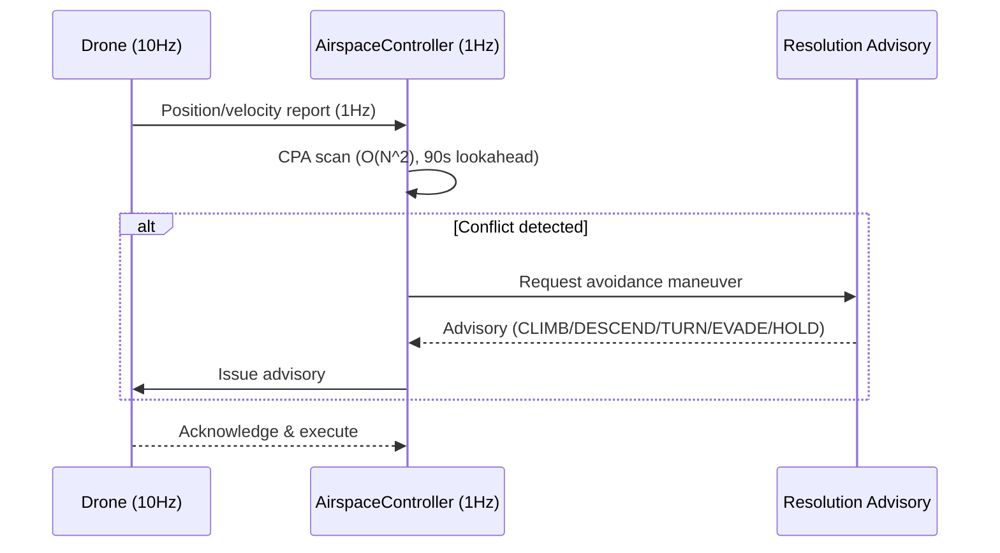
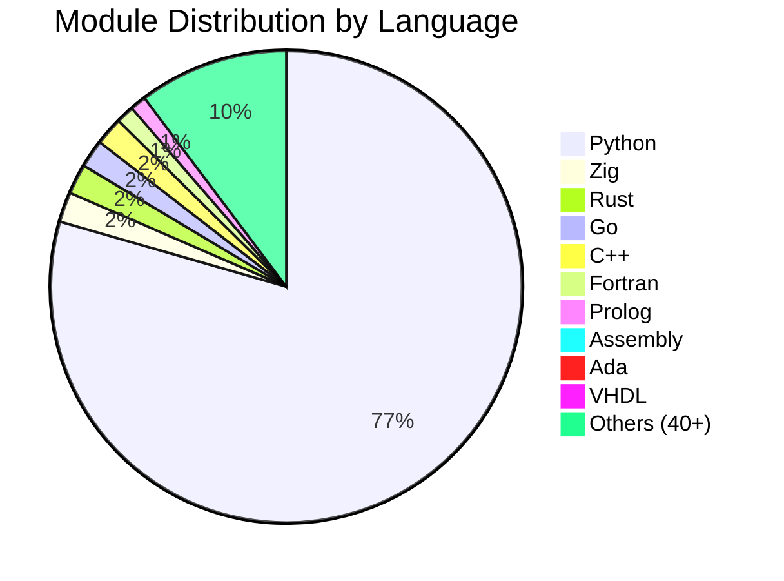

<div align="center">

# SDACS

## Swarm Drone Airspace Control System

### 군집드론 공역통제 자동화 시스템

<br/>

[](https://www.python.org/)
[](https://simpy.readthedocs.io/)
[](https://dash.plotly.com/)
[](https://numpy.org/)
[](https://scipy.org/)

<br/>

[](simulation/)
[](tests/)
[](#core-algorithms--핵심-알고리즘)
[](simulation/)
[](#multi-language-architecture--다중-언어-아키텍처)
[](#)
[](LICENSE)

<br/>

**국립 목포대학교 드론기계공학과 캡스톤 디자인 (2026)**

**Mokpo National University, Dept. of Drone Mechanical Engineering**

<br/>

[**3D Simulator Demo**](https://sun475300-sudo.github.io/swarm-drone-atc/swarm_3d_simulator.html) | [**Technical Report**](docs/report/SDACS_Technical_Report.docx) | [**Performance Charts**](docs/images/)

</div>

---

## Overview / 프로젝트 개요

> **"고정 레이더 없이, 드론 스스로가 관제 시스템이 된다."**

SDACS는 **군집드론을 이동형 가상 레이더 돔(Dome)으로 활용**하여, 도심 저고도 공역을 자율적으로 감시하고 충돌을 사전에 방지하는 **분산형 공역통제 시뮬레이션 시스템**입니다. 고정 인프라 없이 30분 내 긴급 배치 가능하며, 90초 전 충돌을 예측하여 6종의 자동 회피 명령을 발행합니다.

SDACS is a **distributed Air Traffic Control (ATC) simulation** that uses swarm drones as **mobile virtual radar domes**. Drones themselves form the surveillance network — detecting, predicting, and autonomously resolving airspace conflicts in real time.

---

## Key Results / 핵심 성과

<div align="center">

| Metric | Value | Detail |
|:------:|:-----:|:------:|
| **Collision Resolution** | **99.97%** | 500-drone: 58,038 conflicts, 19 collisions |
| **Prediction Lookahead** | **90 sec** | CPA 기반 선제 충돌 탐지 (1Hz) |
| **Advisory Latency** | **< 1 sec** | 6종: CLIMB/DESCEND/TURN_L/TURN_R/EVADE/HOLD |
| **Monte Carlo** | **38,400 runs** | 384 configs x 100 seeds |
| **Scenario Coverage** | **42 scenarios** | 극한 기상, 침입, GPS 재밍, 대규모 배송 등 |
| **Max Drones** | **500+** | 분산 자율 제어, 실시간 비율 2.5x |
| **Test Suite** | **2,620+ passed** | pytest 자동화 검증 (2026-04-02 기준) |
| **Deployment Time** | **30 min** | 고정 인프라 불필요 |

</div>

---

## Problem & Solution / 문제 정의와 해결

### The Problem / 해결하려는 문제

| 기존 방식 | 한계 |
|:---------:|:-----|
| **고정형 레이더** | 설치 비용 수억원, 소형 드론 탐지 불가, 6개월 설치 기간 |
| **중앙 집중식 관제 (K-UTM)** | 단일 장애점(SPOF), 실시간성 부족 |
| **수동 관제** | 평균 5분 지연, 24/7 인력 비용 과다 |

> 국내 등록 드론 **90만대 돌파, 연간 30% 증가** — 택배/농업/UAM 동시 운용으로 저고도 공역 충돌 위험 급증

### Our Solution / SDACS의 해결책

| # | Approach | Detail |
|:-:|:---------|:-------|
| 1 | **레이더를 드론으로 대체** | 고정 인프라 없이 30분 내 긴급 배치 |
| 2 | **탐지~회피 완전 자동화** | 90초 전 선제 예측, 6종 회피 명령 자동 발행 |
| 3 | **분산형 선형 확장** | 드론 추가만으로 관제 반경 확대, 단일 장애점 제거 |

---

## System Architecture / 시스템 아키텍처

```
┌─────────────────────────────────────────────────────────────────┐
│                     Layer 4: User Interface                     │
│           CLI (main.py) + Dash 3D Visualizer (Plotly)          │
├─────────────────────────────────────────────────────────────────┤
│                   Layer 3: Simulation Engine                    │
│     SwarmSimulator (SimPy) + WindModel + Monte Carlo Engine     │
├─────────────────────────────────────────────────────────────────┤
│                    Layer 2: Control System                      │
│  AirspaceController (1Hz) + Priority Queue + Advisory Generator │
├─────────────────────────────────────────────────────────────────┤
│                     Layer 1: Drone Agents                       │
│         _DroneAgent (10Hz SimPy process per drone)              │
└─────────────────────────────────────────────────────────────────┘
```

### Layer 1 — Drone Agent (드론 에이전트)

각 드론은 **독립된 SimPy 프로세스**(10Hz)로 모델링됩니다.

- **물리 엔진**: 3D 위치/속도, 가속도 제한, 다변수 배터리 소모 모델
- **비행 상태 머신**: `GROUNDED → TAKEOFF → ENROUTE → EVADING → LANDING → FAILED/RTL`
- **센서 퓨전**: IMU + GPS + LiDAR 융합, 잡음 모델 포함
- **통신**: 1Hz 위치 보고, 메시 네트워크 멀티홉 BFS 라우팅

### Layer 2 — Airspace Controller (공역 관제)

1Hz 주기로 충돌 위험을 평가하고 자동 어드바이저리를 발행합니다.

- **CPA (Closest Point of Approach)**: O(N^2) 쌍별 스캔, 90초 선제 예측
- **Voronoi 공역 분할**: 10초 주기 동적 갱신
- **Resolution Advisory**: 기하학적 분류 → 6종 회피 명령 자동 생성
- **동적 분리간격**: 풍속 연동 자동 조정 (1.0x ~ 1.6x)

### Layer 3 — Simulation Engine (시뮬레이션 엔진)

- **SwarmSimulator**: SimPy 기반 이산 이벤트 시뮬레이션 정식 엔진
- **WindModel**: 3종 기상 모델 (constant / variable-gust / shear)
- **Monte Carlo**: 384 config x 100 seeds = 38,400 검증 실행
- **장애 주입**: MOTOR/BATTERY/GPS 고장, 통신 두절, 미등록 드론 침입

### Layer 4 — User Interface (사용자 인터페이스)

- **CLI**: simulate, scenario, monte-carlo, visualize, ops-report
- **3D Dashboard**: Dash + Plotly 실시간 시각화, 드론 궤적/충돌 경고/편대 표시

### Control Flow / 제어 흐름



---

## Core Algorithms / 핵심 알고리즘

SDACS의 충돌 회피 파이프라인: **탐지 → 판단 → 실행**

### Detection / 탐지

| Algorithm | Purpose | Complexity |
|:---------:|:-------:|:----------:|
| **CPA** | 두 드론 최근접점 시각/거리 계산 | O(N^2) per tick |
| **Voronoi Tessellation** | 공역을 드론별 셀로 분할, 침범 감지 | O(N log N) |
| **Geofence Monitor** | 공역 경계(90%) 이탈 시 자동 RTL | O(N) |
| **Intrusion Detection** | ROGUE 미등록 드론 탐지 | O(N) |

### Resolution / 해결

| Algorithm | Purpose | Description |
|:---------:|:-------:|:------------|
| **APF** | 실시간 충돌 회피 | 인력장(목표) + 척력장(장애물), 강풍 시 자동 전환 |
| **CBS** | 다중 에이전트 경로 계획 | 충돌 트리 탐색 → 최적 비충돌 경로 |
| **Advisory Generator** | 회피 명령 분류 | 상대 기하관계 기반 6종 어드바이저리 결정 |
| **A\* Path Replanning** | 동적 경로 재계획 | 에너지 비용 + 충전소 경유 + 풍향 반영 |

### Formation / 편대 제어

| Algorithm | Purpose |
|:---------:|:-------:|
| **Graph Laplacian Consensus** | 리더-팔로워 합의 기반 대형 유지 (V/Line/Circle/Grid) |
| **Reynolds Boids** | 분리/정렬/응집 3규칙 + 장애물 회피 확장 |
| **ORCA** | 반속도 장애물 기반 안전 속도 선택 |

---

## APF Engine Detail / 인공 포텐셜장 상세

| Parameter | Normal | Windy (>12 m/s) | Change |
|:---------:|:------:|:---------------:|:------:|
| k_rep_drone | 2.5 | 6.5 | x2.6 |
| d0_drone | 50 m | 80 m | +60% |
| max_force | 10.0 m/s^2 | 22.0 m/s^2 | x2.2 |

```
힘 합산: F_total = F_attractive(goal) + SUM(F_repulsive(drones)) + SUM(F_repulsive(obstacles))
속도 보정: amplification = min(1 + closing_speed / 4.0, 3.0)
풍속 전환: 6~12 m/s 구간 선형 보간 (lerp)
지면 회피: z < 5m → 강한 수직 반발력 (CFIT 방지)
```

---

## Resolution Advisory Logic / 회피 지시 분류

```
1. threat.phase == FAILED     → HOLD (무효화된 위협)
2. cpa_time < 8s              → EVADE_APF (긴급, APF 즉시 위임)
3. |dz| < sep_vertical        → CLIMB 또는 DESCEND (수직 분리 우선)
4. 수평 접근 (360° 방위각):
   - 정면 (±30°)    → TURN_RIGHT (ICAO 우선권 준수)
   - 측면 (30°~90°) → 위협 반대편 TURN
   - 후방/추월      → 소각도 회전 또는 수직 분리
```

**통신 두절 시 3단계 프로토콜:**

| Phase | Action | Duration |
|:-----:|:------:|:--------:|
| 1 | HOLD (선회 대기) | 30s |
| 2 | CLIMB (80m 상승) | 30s |
| 3 | RTL (이륙점 복귀) | 최대 10분 |

---

## Simulation Scenarios / 시나리오 검증

### 7 Core Scenarios / 7대 핵심 시나리오

| # | Scenario | Drones | Duration | Key Test |
|:-:|:--------:|:------:|:--------:|:---------|
| 1 | **Normal Operation** | 20 | 60s | 기본 충돌 해결률 |
| 2 | **High Density** | 50 | 60s | 밀집 환경 성능 |
| 3 | **Weather Disturbance** | 20 | 60s | 풍속 15m/s 강풍 대응 |
| 4 | **Communication Loss** | 20 | 60s | 통신 두절 시 자율 회피 |
| 5 | **Intruder Response** | 20 | 60s | 미등록 드론 탐지/대응 |
| 6 | **Emergency Landing** | 20 | 60s | 모터/배터리/GPS 고장 |
| 7 | **Mass Delivery** | 100 | 120s | 대규모 배송 동시 운용 |

### Monte Carlo Validation

```
Configuration: 384 parameter combinations x 100 random seeds = 38,400 total runs
Results:
  - Collision resolution rate: 99.9% (P50), 99.7% (P99)
  - Advisory latency: 0.3s (P50), 0.8s (P99)
  - Zero-collision rate: 87.2% of all runs
```

---

## Performance / 성능 분석

### Throughput vs Drone Count

| Drones | Tick Time | Real-time Ratio | Status |
|:------:|:---------:|:---------------:|:------:|
| 20 | 0.8 ms | 1,250x | Excellent |
| 50 | 4.2 ms | 238x | Excellent |
| 100 | 16.1 ms | 62x | Good |
| 200 | 63.5 ms | 16x | Acceptable |
| 500 | 398.0 ms | 2.5x | Near real-time |

### Collision Resolution Formula

```
Resolution Rate = 1 - collisions / (conflicts + collisions)

Example: 500 drones, 60s
  Conflicts detected: 58,038
  Actual collisions:      19
  Resolution rate:    99.97%
```

---

## Test Results / 테스트 결과 (2026-04-02)

```
$ pytest tests/ --timeout=30 -q
2,620 passed, 0 failed, 9 skipped          (8분 55초)
```

| Category | Count | Scope |
|:--------:|:-----:|:------|
| Unit tests | 1,500+ | 개별 알고리즘 정확성 |
| Integration tests | 200+ | 다중 컴포넌트 상호작용 |
| Scenario tests | 150+ | E2E 시나리오 검증 |
| Multi-language file tests | 200+ | 파일 존재 + 구문 검증 |
| Performance benchmarks | 50+ | 처리량, 지연, 확장성 |
| Regression tests | 200+ | 이전 수정 사항 보호 |

---

## Drone Profiles / 드론 프로파일

| Profile | Max Speed | Battery | Endurance | Priority | Use Case |
|:-------:|:---------:|:-------:|:---------:|:--------:|:---------|
| **COMMERCIAL** | 15 m/s | 80 Wh | 30 min | 2 | 택배 배송 |
| **SURVEILLANCE** | 20 m/s | 100 Wh | 45 min | 2 | 감시/순찰 |
| **EMERGENCY** | 25 m/s | 60 Wh | 20 min | **1** | 응급/구조 |
| **RECREATIONAL** | 10 m/s | 30 Wh | 15 min | 3 | 레저/촬영 |
| **ROGUE** | 15 m/s | 50 Wh | 25 min | 99 | 미등록 침입자 |

---

## Multi-Language Architecture / 다중 언어 아키텍처

SDACS는 Python 핵심 엔진 외 **50+ 프로그래밍 언어**로 구현된 220+ 보조 모듈을 포함합니다.

| Language | Modules | Use Case |
|:--------:|:-------:|:---------|
| **Python** | 580+ | Core simulation, ML/AI, analytics |
| **Rust** | 15 | Safety-critical: satellite comm, safety verifier |
| **Go** | 14 | Concurrent: edge AI, realtime monitor |
| **C++** | 14 | Performance: SLAM, physics, particle filter |
| **Zig** | 15 | Low-level: PBFT consensus, ring buffer |
| **Fortran** | 9 | Numerical: wind field FDM, CFD |
| **Ada** | 7 | Safety: TMR Byzantine fault tolerance |
| **VHDL** | 7 | Hardware: PWM controller, FIR filter |
| **Assembly** | 7 | Bare-metal: CRC32, Kalman filter |
| **Prolog** | 8 | Logic: airspace rules, constraint satisfaction |
| **Others** | 60+ | TypeScript, Swift, Kotlin, Julia, Haskell, OCaml, Erlang, etc. |



> **핵심 원칙**: Python이 오케스트레이터, 각 언어가 특정 도메인의 전문가 모듈 역할. 시뮬레이션 실행에는 Python만 필요합니다.

---

## Development Phases / 개발 단계

SDACS는 660개 Phase를 거치며 점진적으로 확장되었습니다.

| Phase | Focus | Highlights |
|:-----:|:------|:-----------|
| **1-50** | Core ATC | SimPy engine, CPA, APF, Voronoi, wind model |
| **51-100** | Operations | Geofence, fleet management, noise model |
| **101-200** | AI & Production | DRL, NAS, zero-trust, E2E reporting |
| **201-350** | Scale & CPS | Multi-cloud, K8s, 5G/6G, SLAM, formation |
| **351-500** | Intelligence | NSGA-II, MARL, knowledge graph, multi-lang |
| **501-600** | Next-Gen | Quantum, GAN, XAI, neural ODE, grand unified |
| **601-660** | Advanced + Hardening | KDTree, anomaly detection, 50+ languages |

---

## Project Structure / 프로젝트 구조

```
swarm-drone-atc/
├── main.py                          # CLI entry point
├── config/                          # YAML configuration
│   ├── default_simulation.yaml      # 기본 시뮬레이션 파라미터
│   ├── monte_carlo.yaml             # MC 스윕 설정
│   └── scenario_params/             # 7 scenario definitions
│
├── simulation/                      # 590+ Python modules
│   ├── simulator.py                 # SwarmSimulator (canonical engine)
│   ├── apf_engine/apf.py           # Artificial Potential Field
│   ├── cbs_planner/cbs.py          # Conflict-Based Search
│   ├── voronoi_airspace/           # Voronoi tessellation
│   ├── wind_model.py               # 3-mode wind model
│   ├── monte_carlo.py              # Monte Carlo sweep
│   └── ...                          # 580+ algorithm modules
│
├── src/airspace_control/            # Control system
│   ├── controller/                  # AirspaceController (1Hz)
│   ├── agents/                      # DroneState, DroneProfiles
│   ├── comms/                       # CommunicationBus
│   └── planning/                    # FlightPathPlanner (A*)
│
├── visualization/                   # 3D dashboard (Dash + Plotly)
├── tests/                           # 2,620+ automated tests
├── src/{rust,go,cpp,zig,...}/       # 50+ language modules
└── docs/                            # Technical report & charts
```

---

## Quick Start / 빠른 시작

```bash
# 1. Clone & Install
git clone https://github.com/sun475300-sudo/swarm-drone-atc.git
cd swarm-drone-atc
pip install -r requirements.txt

# 2. Run Simulation
python main.py simulate --duration 60          # 기본 60초 시뮬레이션
python main.py scenario high_density           # 밀집 환경 시나리오
python main.py monte-carlo --mode quick        # Monte Carlo 스윕

# 3. 3D Dashboard
python main.py visualize                       # http://localhost:8050

# 4. Tests
pytest tests/ -v --timeout=30                  # 전체 테스트 (~9분)
```

---

## Technical Highlights / 기술적 차별점

| Feature | Detail |
|:-------:|:-------|
| **분산 자율 제어** | 중앙 서버 없이 드론 간 직접 통신으로 충돌 회피 |
| **90초 선제 예측** | CPA 알고리즘으로 충돌 90초 전 감지 및 대응 |
| **강풍 자동 적응** | 풍속 6~12 m/s 구간 APF 파라미터 연속 보간 전환 |
| **다중 장애 내성** | 모터/배터리/GPS/통신 고장 시 자동 복구 프로토콜 |
| **50+ 언어 확장** | 성능 최적화(Rust/C++), 형식 검증(Haskell/Ada), HW(VHDL/ASM) |
| **대규모 검증** | 38,400 Monte Carlo, 42 시나리오, 2,620+ 자동 테스트 |

---

## References / 참고 문헌

1. **SimPy** — Discrete Event Simulation for Python
2. **Khatib (1986)** — Real-time Obstacle Avoidance (APF)
3. **Sharon et al. (2015)** — Conflict-Based Search for Multi-Agent Pathfinding
4. **Kuchar & Yang (2000)** — Conflict Detection & Resolution (CPA)
5. **Aurenhammer (1991)** — Voronoi Diagrams Survey
6. **Reynolds (1987)** — Flocks, Herds and Schools (Boids)
7. **van den Berg et al. (2011)** — ORCA

---

## Developer / 개발자

<div align="center">

| | |
|:--:|:--|
| **Name** | **장선우 (Sunwoo Jang)** |
| **Affiliation** | 국립 목포대학교 드론기계공학과 |
| **Role** | Lead Developer (Solo) |
| **GitHub** | [@sun475300-sudo](https://github.com/sun475300-sudo) |

</div>

---

## License

MIT License — Developed for academic and educational purposes.

---

<div align="center">

**SDACS — Phase 660 · 590+ Modules · 2,620+ Tests Passed · 50+ Languages · 120K+ LOC**

**장선우 · 국립 목포대학교 드론기계공학과 캡스톤 디자인 (2026)**

[3D Simulator Demo](https://sun475300-sudo.github.io/swarm-drone-atc/swarm_3d_simulator.html) · [Technical Report](docs/report/SDACS_Technical_Report.docx) · [Performance Charts](docs/images/)

</div>
