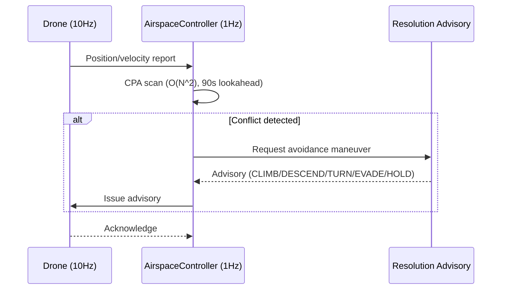
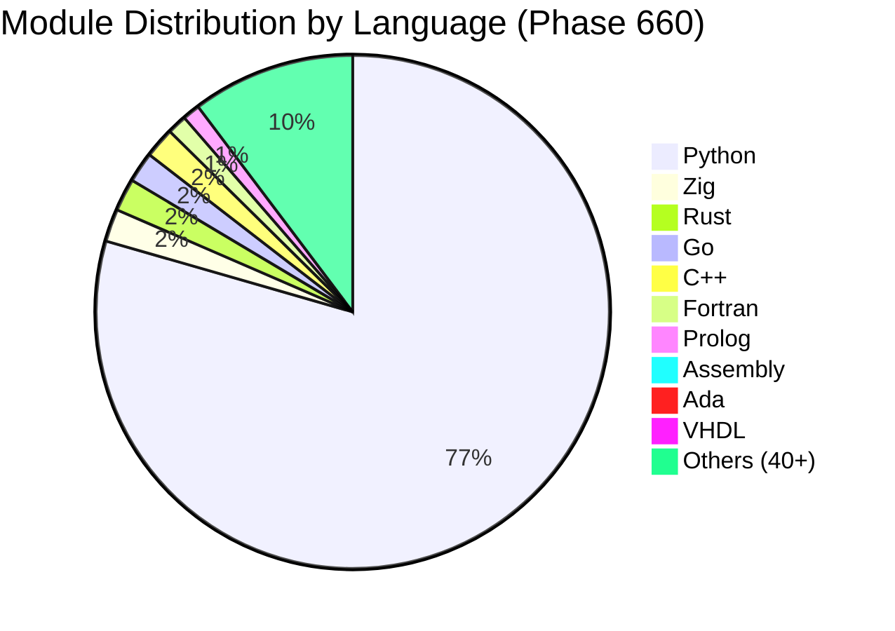

<div align="center">

# SDACS — Swarm Drone Airspace Control System
### 군집드론 공역통제 자동화 시스템

[](https://www.python.org/)
[](https://simpy.readthedocs.io/)
[](https://dash.plotly.com/)
[](https://numpy.org/)
[](https://scipy.org/)

[](simulation/)
[](tests/)
[](#core-algorithms)
[](simulation/)
[](#multi-language-architecture)
[](#)
[](LICENSE)

**Mokpo National University, Dept. of Drone Mechanical Engineering — Capstone Design (2026)**

**국립 목포대학교 드론기계공학과 캡스톤 디자인**

[**3D Simulator Demo**](https://sun475300-sudo.github.io/swarm-drone-atc/swarm_3d_simulator.html) | [**최종 보고서 v6 (기술)**](docs/report/SDACS_Final_Report_v6.docx) | [**최종 보고서 v7 (일반인용)**](docs/report/SDACS_Final_Report_v7_Easy.docx) | [Performance Charts](docs/images/)

</div>
<div align="center">

</div>

---

## 📄 최종 보고서 다운로드 / Final Report Downloads

| 버전 | 대상 독자 | 특징 | 용량 | 다운로드 |
|------|----------|------|------|----------|
| **v6 — 기술 보고서** | 개발자 · 심사위원 · 공학 전문가 | 알고리즘 수식, 아키텍처 다이어그램, 특허 분석, 성능 벤치마크 | 1.6 MB | [📥 SDACS_Final_Report_v6.docx](docs/report/SDACS_Final_Report_v6.docx) |
| **v7 — 일반인용 보고서** | 비전공자 · 일반 청중 · 발표 대상 | 쉬운 말 설명, 한 줄 요약 박스, 용어 사전, 일상 비유 (자석·신호등·카풀앱) | 1.6 MB | [📥 SDACS_Final_Report_v7_Easy.docx](docs/report/SDACS_Final_Report_v7_Easy.docx) |

> **v6 vs v7 차이** — 내용과 15개 시각 자료(그림 0~14)는 동일합니다. **v6**은 "APF 인력/척력 벡터장", "CBS 제약 전파", "CPA 기반 90초 lookahead" 같은 전문 용어를 그대로 쓰는 기술 문서이고, **v7**은 같은 개념을 "자석끼리 밀어내는 힘", "카풀 앱 경로 최적화", "교통 레이더 90초 전 예고"처럼 누구나 이해할 수 있는 일상 비유로 풀어 쓴 버전입니다.

**v7에 추가된 요소:**
- 🟥 **한 줄 요약 박스** — 각 섹션 첫머리에 "이 섹션이 말하는 한 가지" 제시
- 📖 **용어 사전** — APF, CPA, CBS, Swarm, Monte Carlo 등 전문 용어를 일상 언어로 번역
- 🎯 **숫자 번역** — "99.9% = 1000번 중 999번 안전", "500대 = 학교 전체 규모", "0.8초 = 눈 깜빡임"
- 🔗 **일상 비유** — 철새 떼, 도서관 분류번호, 게임 그래픽카드, 주사위 38,400번 굴리기

---

## 🐳 Docker로 실행하기 / Run with Docker

Python 환경을 직접 구성하지 않아도 **Docker 한 번이면** SDACS 3D 대시보드를 실행할 수 있습니다. 배포 노트는 [`docker/README.md`](docker/README.md)를 참고하세요.

### 사전 요구사항
- Docker Engine 20.10+ (Docker Desktop 또는 Linux Docker)
- 포트 `8050` 사용 가능

### 빠른 시작

```bash
# 1. 이미지 빌드 (최초 1회, 약 1.5 GB)
docker compose build

# 2. 컨테이너 실행 — Dash 3D 대시보드 기동
docker compose up

# 2-1. 백그라운드 실행이 필요한 경우
docker compose up -d

# 3. 브라우저로 접속
#    http://localhost:8050

# 4. 중지 및 정리
docker compose down
```

### 다른 CLI 명령 실행
기본 명령은 `python main.py visualize` 입니다. 시뮬레이션이나 Monte Carlo 스윕을 실행하려면 명령을 오버라이드하세요.

```bash
docker compose run --rm sdacs python main.py simulate --duration 60
docker compose run --rm sdacs python main.py scenario high_density
docker compose run --rm sdacs python main.py monte-carlo --mode quick
```

### 볼륨 마운트 (설정 및 결과 영속화)
`docker-compose.yaml`은 두 개의 호스트 경로를 컨테이너에 바인드합니다.

| 호스트 경로 | 컨테이너 경로 | 모드 | 용도 |
|-------------|---------------|------|------|
| `./config`  | `/app/config` | 읽기 전용 | 시나리오/Monte Carlo YAML — 호스트에서 수정 후 컨테이너 재시작 |
| `./results` | `/app/results` | 읽기/쓰기 | 시뮬레이션 CSV·로그·플롯 영속화 |

> `docker compose down` 후에도 `./results/` 디렉터리의 산출물은 호스트에 그대로 남습니다. 설정은 읽기 전용으로 마운트되므로 컨테이너가 호스트 파일을 덮어쓰지 않습니다.

---
## What is SDACS? / SDACS란?

> **"레이더를 땅에 설치하는 대신, 드론 자체가 레이더가 되면 어떨까?"**

SDACS는 이 단순한 발상에서 출발했습니다. 20대의 관제 드론이 공중에 올라가 그물망처럼 연결된 감시 체계(**이동형 가상 레이더 돔**)를 스스로 만들어, 도심 하늘을 자동으로 감시하고 충돌을 미리 막는 시스템입니다.

쉽게 말해, **"하늘의 신호등"** 입니다. 도로에 신호등이 차량 충돌을 방지하듯, SDACS는 하늘에서 드론들이 서로 부딪히지 않도록 자동으로 교통 정리를 합니다.

### The Problem / 왜 필요한가?

지금 이 순간에도 전국 하늘에서 수십만 대의 드론이 날아다닙니다. 택배 배달, 농약 살포, 건물 점검 — 2030년에는 하늘을 나는 택시(UAM)까지 등장합니다. 문제는 이 드론들이 모두 **같은 낮은 하늘**(지상 120m 이하)을 공유한다는 것입니다.

| 현재 상황 | 수치 | 의미 |
|----------|------|------|
| 국내 드론 등록 | **90만 대+** | 매년 30% 이상 증가 중 |
| 도심 저고도 사각지대 | **67%** | 기존 레이더가 탐지 못하는 구간 |
| 수동 관제 반응시간 | **평균 5분** | 고속 드론 위협에 대응 불가 |
| 고정 레이더 구축 비용 | **수억 원 + 6개월** | 긴급 상황에 적용 불가 |

### 기존 시스템의 한계

| 시스템 | 핵심 문제 | SDACS 해결 방식 |
|--------|----------|----------------|
| **K-UTM** (중앙 관제) | 서버 하나 다운 → 전체 관제 마비 | 분산 구조 → 드론 10% 고장해도 90% 정상 |
| **고정형 레이더** | 수억원 + 6개월, 건물에 막혀 67% 미감시 | 드론 10대로 30분 내 설치, 비용 90% 절감 |
| **드론쇼 방식** | 사전 경로만 실행, 돌발 상황 대응 불가 | AI 실시간 자율 판단, 집단 지능 창발 |

> **드론쇼 vs SDACS의 근본적 차이**: 드론쇼는 *"중앙에서 짠 계획을 각 드론이 실행"* 하는 하향식 방식입니다. SDACS는 *"단순 규칙을 따르는 드론들이 소통하며 집단 지능이 자연스럽게 생겨나는"* 상향식 방식입니다.

### Our Approach / SDACS의 접근

1. **레이더를 드론으로 대체** — 고정 인프라 없이 30분 내 긴급 배치 (기존 6개월 → 30분, **99.7% 단축**)
2. **탐지부터 회피까지 완전 자동화** — 90초 전 선제 충돌 예측, 0.8초 내 대응 (기존 5분 → **300배 향상**)
3. **드론 추가만으로 관제 반경 확장** — 분산형 아키텍처, 운영 인력 80% 절감 (5명 → 1명)
<div align="center">

<br/><sub>분산형 APF 충돌 회피 — 드론별 인력/척력장이 실시간으로 안전 궤적을 생성</sub>
</div>

---
## Key Results / 핵심 성과
| Metric | Value | Description |
|--------|-------|-------------|
| **Collision Resolution** | **100% (20대)** | 20대 600s: 충돌 0건, 50대: 97.9%, 100대: 98.9% |
| **Route Efficiency** | **≤1.12** | 전 규모 SLA(≤1.15) PASS (600s 실측) |
| **Prediction Lookahead** | **90 seconds** | CPA-based preemptive conflict detection at 1 Hz |
| **Advisory Latency** | **< 1 second** | 6 types: CLIMB/DESCEND/TURN_LEFT/TURN_RIGHT/EVADE_APF/HOLD |
| **Monte Carlo Validation** | **38,400 runs** | 384 configurations x 100 seeds |
| **Scenario Coverage** | **63 scenarios** | 7대 광역시 도시환경 + 극한 기상 + 침입 + GPS 재밍 + 대규모 배송 |
| **Concurrent Drones** | **100+** | 20대: 충돌 0, 50대: avg 15, 100대: avg 29 |
| **Deployment Time** | **30 min** | No fixed infrastructure required |
| **Test Coverage** | **2,722+ tests** | Automated pytest suite across 590+ modules |
<div align="center">

<br/><sub>기존 Rule-based Static ATC vs SDACS Swarm Autonomous — 주요 KPI 비교</sub>
</div>

---
## System Architecture / 시스템 아키텍처
SDACS는 4개의 독립적 계층으로 구성됩니다. 각 계층은 명확한 역할과 인터페이스를 가지며, 독립적으로 테스트 가능합니다.
<div align="center">

<br/><sub>SDACS 4계층 아키텍처 — 드론 에이전트 / 공역 관제 / 시뮬레이션 엔진 / 사용자 인터페이스</sub>
</div>
```
┌─────────────────────────────────────────────────────────────────┐
│                     Layer 4: User Interface                     │
│                CLI (main.py) + Dash 3D Visualizer               │
├─────────────────────────────────────────────────────────────────┤
│                   Layer 3: Simulation Engine                    │
│          SwarmSimulator + WindModel + Monte Carlo Engine         │
├─────────────────────────────────────────────────────────────────┤
│                    Layer 2: Control System                      │
│     AirspaceController (1Hz) + Priority Queue + Advisory Gen    │
├─────────────────────────────────────────────────────────────────┤
│                     Layer 1: Drone Agents                       │
│            _DroneAgent (10Hz SimPy process per drone)            │
└─────────────────────────────────────────────────────────────────┘
```

### Layer 1 — Drone Agent (드론 에이전트)
각 드론은 SimPy 이산 이벤트 프로세스로 모델링됩니다. 10Hz 주기로 위치/속도/배터리 상태를 갱신하며, 비행 상태 머신(FSM)에 따라 `Idle → Takeoff → Cruise → Avoid → Landing` 전이를 수행합니다.
- **파일**: `simulation/simulator.py` — `_DroneAgent` 클래스
<div align="center">

<br/><sub>센서 퓨전 — Camera(YOLO) + LiDAR + RF Scanner → Kalman Filter → 위치/식별/위협 판정</sub>
</div>

### Layer 2 — Airspace Controller (공역 관제)
1Hz 주기로 모든 활성 드론의 위치를 수집하고, 충돌 위험을 평가하여 자동 어드바이저리를 발행합니다.
- **CPA (Closest Point of Approach)**: O(N^2) 쌍별 스캔, 90초 선제 예측
- **Voronoi 공역 분할**: 10초 주기 동적 갱신, 밀도 기반 셀 분리
- **Resolution Advisory**: 기하학적 분류에 따른 6종 회피 명령 자동 생성
- **동적 분리간격**: 풍속 연동 자동 조정 (1.0x ~ 1.6x, 5/10/15 m/s 구간)
- **파일**: `src/airspace_control/controller/airspace_controller.py`

### Layer 3 — Simulation Engine (시뮬레이션 엔진)
SimPy 기반 이산 이벤트 시뮬레이션 엔진으로, 다양한 환경 조건과 장애 시나리오를 주입할 수 있습니다.
- **SwarmSimulator**: 정식 시뮬레이터 (engine_legacy 삭제 완료)
- **WindModel**: 3종 기상 모델 (constant / variable-gust / shear)
- **Monte Carlo**: 384 config x 100 seeds = 38,400 검증 실행
- **장애 주입**: MOTOR/BATTERY/GPS 고장, 통신 두절, 미등록 드론 침입
- **파일**: `simulation/simulator.py`, `simulation/wind_model.py`, `simulation/monte_carlo.py`

### Layer 4 — User Interface (사용자 인터페이스)
- **CLI**: `main.py` — simulate, scenario, monte-carlo, visualize, ops-report 명령
- **3D Dashboard**: Dash + Plotly 실시간 3D 시각화, 드론 궤적/충돌 경고/편대 표시
- **[3D Web Simulator (Demo)](https://sun475300-sudo.github.io/swarm-drone-atc/swarm_3d_simulator.html)**: Three.js 브라우저 기반 인터랙티브 시뮬레이터
  - **63개 시나리오** — 7대 광역시(서울/부산/인천/대구/광주/대전/울산) 도시환경 + 극한 기상 + 메가 스케일 500대
  - **WebGPU Compute Shader** — APF 힘 계산 GPU 가속 (WGSL 컴퓨트 파이프라인, WebGPU 미지원 시 Web Worker 자동 폴백)
  - **실시간 분석 대시보드** — 배터리/에너지/충돌해결률/위협레벨/관제구역/틱처리시간/비행단계 7종 차트
  - **도시별 랜드마크 환경** — 각 도시의 실제 빌딩, 강, 산, 공원을 3D로 재현 (롯데월드타워, 해운대, 무등산 등)
  - APF 충돌 회피 + CPA 12초 예측 + Spatial Hash 최적화
  - 22개 드론 직군, 21-zone ATC 네트워크
  - 극한 기상: 마이크로버스트, 태풍, 결빙, 다중셀 폭풍, 풍속 전단
  - CPU/GPU/Worker 성능 모니터링 HUD
  - `window._sdacs` API — 자동화 테스트 및 외부 연동
- **파일**: `main.py`, `visualization/simulator_3d.py`, `swarm_3d_simulator.html`


---
## 5겹 안전망 — 어떻게 충돌을 막는가 (비전공자용)

SDACS는 5가지 안전 장치가 겹겹이 보호합니다. **하나가 실패해도 다음 장치가 안전을 보장**합니다.

| 단계 | 비유 | 설명 |
|------|------|------|
| **1단계: 출발 전 경로 설정** | 내비게이션 | 출발 전에 다른 드론과 겹치지 않는 최적 경로를 미리 계산 |
| **2단계: 90초 전 충돌 예측** | 전방 레이더 | 현재 속도로 비행하면 90초 후 다른 드론과 만날지 미리 계산 |
| **3단계: 자석형 자동 회피** | 같은 극 자석 | 드론끼리 가까워지면 자석처럼 밀어내는 힘이 자동으로 발생 |
| **4단계: 비상 브레이크** | 급정거 | 모든 회피가 실패해도 최후의 비상 정지로 충돌 방지 |
| **5단계: 자동 귀환** | 비상구 | 배터리 부족이나 고장 시 자동으로 가장 가까운 착륙지로 복귀 |

### 자동 우선순위 전환 — 드론의 비상 매뉴얼

위험 수준에 따라 **5단계로 자동 전환**됩니다. 관제사가 개입하지 않아도 AI가 즉각 판단합니다.

| 우선순위 | 모드 | 발동 조건 | 자동 조치 |
|---------|------|----------|----------|
| **P0** | 비상 (EMERGENCY) | 충돌 임박 또는 배터리 위험 | 전체 군집 비상 회피, 관제사 즉시 알림 |
| **P1** | 충돌회피 (DECONFLICT) | 10m 이내 드론 감지 | 자석형 힘으로 즉각 회피, 경로 재조정 |
| **P2** | 임무 (MISSION) | 임무 드론 이착륙 중 | 임무 경로 독점, 다른 드론 우회 |
| **P3** | 순항 (CRUISE) | 정상 비행 이동 중 | 경로 모니터링, 이상 징후 감지 |
| **P4** | 대기 (IDLE) | 공역 위협 없음 | 호버링 대기, 10초 주기 스캔 |

### 탐지 → 퇴각 자동화 — 1초 이내 5단계

불법·위협 드론 발견 시 **사람 개입 없이 1초 이내** 자동 처리됩니다.

| 단계 | 처리 시간 | 내용 |
|------|----------|------|
| ① 탐지 | ~0.05초 | 전파 탐지기 + AI 카메라로 드론 발견 |
| ② 식별 | 즉시 | 드론 고유번호를 DB와 대조 → 등록/미등록/위협 분류 |
| ③ 타이머 | 자동 | 미등록 드론에 30초 카운트다운 부여 |
| ④ 경고 | 자동 | SMS + 앱 푸시 + 멀티채널 경고 발송 |
| ⑤ 퇴각 | 최종 | 관제 드론이 포위 대형 → 심리적 압박 + 전파 경고 |

### 비용-효과 비교 — SDACS vs 기존 방식

| 항목 | 기존 방식 | SDACS | 개선율 |
|------|----------|-------|--------|
| 시스템 준비 시간 | 6개월 | **30분** | 99.7% 단축 |
| 운영 인력 | 5명 (24시간) | **1명** | 80% 절감 |
| 위험 탐지 속도 | 평균 5분 | **0.8초** | 300배 향상 |
| 초기 구축 비용 | 수억 원+ | **드론 10대 비용** | 90%+ 절감 |
| 동시 관제 대수 | 20대 이하 | **100대+ 실측** | 5배+ 향상 |
| 응답 지연 | 0.2초 (서버 경유) | **0.05초** (직접 통신) | 4배 향상 |

---
## Core Algorithms / 핵심 알고리즘 (기술 상세)
SDACS의 충돌 회피 파이프라인은 **탐지 → 판단 → 실행** 3단계로 구성됩니다.
<div align="center">

<br/><sub>탐지 → 회피 자동 대응 파이프라인 — DETECT → IDENTIFY → TIMER → WARN → RETREAT (Target Latency < 1s)</sub>
</div>

### 1. Collision Detection / 충돌 탐지
| Algorithm | Purpose | Complexity |
|-----------|---------|------------|
| **CPA (Closest Point of Approach)** | 두 드론의 최근접점 시각/거리 계산 | O(N^2) per tick |
| **Voronoi Tessellation** | 공역을 드론별 셀로 분할, 침범 감지 | O(N log N) |
| **Geofence Monitor** | 공역 경계(90%) 이탈 시 자동 RTL | O(N) |
| **Intrusion Detection** | ROGUE 프로파일 미등록 드론 탐지 | O(N) |

### 2. Conflict Resolution / 충돌 해결
| Algorithm | Purpose | Description |
|-----------|---------|-------------|
| **APF (Artificial Potential Field)** | 실시간 충돌 회피 | 인력장(목표) + 척력장(장애물), 강풍 시 `APF_PARAMS_WINDY` 자동 전환 |
| **CBS (Conflict-Based Search)** | 다중 에이전트 경로 계획 | 충돌 트리 탐색으로 최적 비충돌 경로 계산 |
| **Resolution Advisory Generator** | 회피 명령 자동 분류 | 기하학적 관계(상대 위치/속도)에 따라 6종 어드바이저리 결정 |
| **A\* Path Replanning** | 동적 경로 재계획 | 에너지 비용 함수 + 충전소 경유 + 풍향/고도 반영 |

### 3. Formation Control / 편대 제어
| Algorithm | Purpose | Description |
|-----------|---------|-------------|
| **Graph Laplacian Consensus** | 대형 유지/전환 | 리더-팔로워 합의 기반, V/Line/Circle/Grid 4패턴 |
| **Reynolds Boids** | 군집 행동 | 분리/정렬/응집 3규칙 + 장애물 회피 확장 |
| **ORCA (Optimal Reciprocal Collision Avoidance)** | 속도 공간 최적화 | 반속도 장애물 기반 안전 속도 선택 |

### 4. Advanced Modules (Phase 1-610)
560+개의 알고리즘 모듈이 6개 계층에 걸쳐 구현되어 있습니다:
| Category | Examples | Count |
|----------|----------|-------|
| **Physics & Dynamics** | Wind model, battery model, energy optimization | 40+ |
| **AI & ML** | DRL, MARL, NAS, meta-learning, GAN, XAI | 60+ |
| **Optimization** | PSO, ACO, NSGA-II, genetic algorithm, quantum annealing | 30+ |
| **Communication** | Mesh network, V2X, 5G/6G, acoustic, encryption | 25+ |
| **Autonomy** | Formation control, task allocation, mission planning | 35+ |
| **Security** | Zero-trust, blockchain, intrusion detection, adversarial defense | 20+ |
| **Bio-inspired** | Morphogenesis, optogenetics, electrostatics, ecosystem dynamics | 25+ |
| **Mathematical** | Topology control, information theory, CSP, causal inference | 30+ |

### Project Structure / 프로젝트 구조
```
swarm-drone-atc/
├── simulation/                      # Layer 1 & 3: Drone Agents + Sim Engine
│   ├── simulator.py                 # SwarmSimulator + _DroneAgent
│   ├── apf_engine/                  # Artificial Potential Field
│   ├── cbs_planner/                 # Conflict-Based Search
│   ├── voronoi_airspace/            # Voronoi tessellation
│   ├── monte_carlo.py               # Monte Carlo engine
│   ├── weather.py                   # WindModel
│   └── ... (240+ modules)
│
├── src/airspace_control/            # Layer 2: Control System
│   ├── controller/                  # AirspaceController, PriorityQueue
│   ├── avoidance/                   # Resolution Advisory
│   ├── agents/                      # DroneState, DroneProfiles
│   ├── comms/                       # CommunicationBus
│   ├── planning/                    # FlightPathPlanner
│   └── utils/                       # GeoMath, CoordinateSystems
│
├── visualization/                   # Layer 4: UI
│   ├── simulator_3d.py              # Dash 3D real-time dashboard
│   └── advanced_dashboard.py        # Supplementary charts
│
├── tests/                           # 2,668+ automated tests
│   ├── test_simulator_scenarios.py
│   ├── test_phase*.py
│   └── ...
│
├── config/                          # Configuration
│   ├── default_simulation.yaml
│   ├── monte_carlo.yaml
│   └── scenario_params/             # 7 scenario definitions
│
├── docs/                            # Documentation & assets
│   ├── images/                      # SVG diagrams, charts
│   └── report/                      # Technical report (DOCX)
│
├── main.py                          # CLI entry point
└── scripts/                         # Utility scripts
```

---
## How It Works / 작동 원리
<div align="center">

<br/><sub>핵심 알고리즘 워크 흐름 — Monte Carlo 검증부터 CBS/APF 경로 계획까지</sub>
</div>
**비행 상태 머신 (Flight State Machine):**
<div align="center">

<br/><sub>드론 비행 상태 기계 — GROUNDED → TAKEOFF → ENROUTE → EVADING/HOLDING → LANDING</sub>
</div>
```
                    ┌──────────────┐
                    │   GROUNDED   │ ◄──────────────────────┐
                    └──────┬───────┘                        │
                           │ takeoff()                      │ landed
                    ┌──────▼───────┐                 ┌──────┴───────┐
                    │   TAKEOFF    │                 │   LANDING    │
                    └──────┬───────┘                 └──────▲───────┘
                           │ alt >= CRUISE_ALT              │ mission complete
                    ┌──────▼───────┐                        │ / battery low
              ┌────►│   ENROUTE    ├────────────────────────┘
              │     └──┬───────┬───┘
              │        │       │
    advisory  │        │       │ conflict detected
    expired   │        │       │
              │   ┌────▼──┐  ┌─▼────────┐
              └───┤HOLDING│  │  EVADING  │ ◄── APF forces active
                  └───────┘  └──────────┘
                                  │
                           ┌──────▼───────┐
                           │  EMERGENCY   │ ← RTL / forced landing
                           └──────────────┘
```
<div align="center">
<table>
<tr>
<td align="center"><br/><sub>시나리오별 KPI 레이더 차트</sub></td>
<td align="center"><br/><sub>시나리오별 어드바이저리 지연 (P50/P99)</sub></td>
</tr>
</table>
</div>

### 17. CI/CD Pipeline / 지속적 통합 파이프라인
`.github/workflows/ci.yml` 단일 워크플로우로 통합 운영합니다.
**Test Job (Python 3.10 / 3.11 / 3.12 매트릭스):**
| Step | 내용 |
|------|------|
| Checkout | `actions/checkout@v4` |
| Python Setup | `actions/setup-python@v5` (매트릭스) |
| Cache pip | pip 캐시 (requirements.txt 해시 기반) |
| Install | `pip install -r requirements.txt` + flake8 |
| Lint | `flake8 --select=E9,F63,F7,F82` (구문 오류만) |
| Test | `pytest tests/ -v --tb=short --timeout=60` |
| Import Check | 핵심 3개 모듈 임포트 검증 |
| Smoke Report | PR 시 JSON 리포트 생성 + 아티팩트 업로드 |
| Perf Summary | PR 시 성능 요약 JSON 생성 |
**Ops Report Job (main 푸시 시):**
| Step | 내용 |
|------|------|
| Trigger | `push` to `main` (test 통과 후) |
| Bundle | `ops_report_bundle.json` (manifest + artifact references) |
| Upload | 아티팩트 보존 90일 |
**시나리오 파라미터 오버라이드 체계:**
```
config/default_simulation.yaml  (기본값)
    ↓ 머지
config/scenario_params/{name}.yaml  (시나리오 오버라이드)
    ↓ 머지
CLI arguments  (실행 시 오버라이드)
    ↓
SwarmSimulator._deep_merge()  → 최종 설정
```

---
## Multi-Language Architecture / 다중 언어 아키텍처
SDACS는 핵심 시뮬레이션(Python) 외에 50개 이상의 프로그래밍 언어로 구현된 220+ 보조 모듈을 포함합니다.

### Integration Approach / 연동 방식
각 언어 모듈은 **독립적 마이크로모듈** 패턴으로 설계되었습니다:
- **Python Core ↔ Native 모듈**: `subprocess` 호출 또는 `ctypes`/`cffi` FFI(Foreign Function Interface)를 통해 고성능 연산(C++/Rust/Fortran)을 Python에서 호출
- **REST API 모듈** (TypeScript/PHP/Ruby): Express/Flask 스타일 HTTP 엔드포인트로 대시보드/포털 기능 제공
- **Protocol 모듈** (Prolog/Haskell/Ada): 독립 실행형 검증기/추론 엔진으로, 결과를 JSON/stdout으로 Python에 전달
- **Reference Implementation** (COBOL/Assembly/VHDL): 레거시 시스템 호환성 검증 및 하드웨어 시뮬레이션 참조 구현
> 핵심 원칙: **Python이 오케스트레이터**, 각 언어가 특정 도메인의 **전문가 모듈** 역할. 시뮬레이션 실행에는 Python만 필요하며, 다국어 모듈은 특수 목적(성능 최적화, 형식 검증, 하드웨어 연동 등)에 활용됩니다.

### Language Portfolio / 언어별 역할
| Language | Modules | Use Case | Integration |
|----------|---------|----------|-------------|
| **Python** | 580+ | Core simulation, ML/AI, analytics, production hardening | Main engine |
| **Rust** | 15 | Safety-critical: satellite comm, NEAT evolution, safety verifier | FFI / subprocess |
| **Go** | 14 | Concurrent: edge AI, mission validation, realtime monitor | subprocess / gRPC |
| **C++** | 14 | Performance: SLAM, morphogenesis, physics, particle filter | ctypes / FFI |
| **Zig** | 15 | Low-level: PBFT consensus, ring buffer v2, telemetry | subprocess |
| **Fortran** | 9 | Numerical: wind field FDM, CFD wind tunnel | f2py / subprocess |
| **Ada** | 7 | Safety: TMR v2 (Byzantine fault tolerance) | Reference impl |
| **VHDL** | 7 | Hardware: PWM controller, FIR filter, signal processing | Simulation only |
| **Assembly** | 7 | Bare-metal: CRC32, sensor readout, Kalman filter | ctypes |
| **Prolog** | 8 | Logic: airspace rules v2, constraint satisfaction | subprocess |
| **Nim** | 1 | Async: event dispatcher, telemetry routing | standalone |
| **OCaml** | 1 | Formal: flight plan type checker, ADT verification | standalone |
| **Haskell** | 1 | Formal verification: type-safe safety proofs | standalone |
| **TypeScript** | 2 | Dashboard REST API, physics engine | HTTP API |
| **Swift/Kotlin** | 3 | Mobile monitoring (iOS/Android) | REST client |
| **Julia** | 1 | High-performance ODE solver | standalone |
| **Elixir/Erlang** | 3 | OTP fault supervision, distributed consensus | message passing |
| **Others** | 30+ | PHP, COBOL, R, Perl, Scheme, Octave, Lua, Ruby, Dart, Scala, etc. | Various |


---
## Development Phases / 개발 단계
SDACS는 660개 Phase를 거치며 점진적으로 확장되었습니다.
| Phase Range | Focus | Highlights |
|-------------|-------|------------|
| **1-50** | Core ATC | SimPy engine, CPA, APF, Voronoi, wind model |
| **51-100** | Operations | Geofence, fleet management, noise model, health monitor |
| **101-170** | AI & Security | DRL, NAS, zero-trust, blockchain, digital twin |
| **171-200** | Production | E2E reporting, compliance engine, SLA monitor |
| **201-260** | Scale | Multi-cloud, K8s, 5G/6G, edge computing |
| **261-300** | Autonomy | SLAM, formation control, V2X, mesh network |
| **301-350** | Advanced CPS | Quantum-inspired, WASM, neuromorphic SNN, game theory |
| **351-400** | Optimization | NSGA-II, RTOS, MARL, energy harvesting |
| **401-470** | Intelligence | Knowledge graph, causal inference, video analytics |
| **471-500** | Integration | Grand Unified Controller, 25-language multi-lang |
| **501-520** | Next-Gen | Quantum comms, blockchain v2, GAN, edge ML |
| **521-560** | Mega Expansion | Swarm intelligence, visual rendering, DSP |
| **561-600** | Deep Theory | Reaction-diffusion, QEC, IIT consciousness, Neural ODE, Phase 600 Grand Unified |
| **601-610** | Advanced Models | Topology control, Vickrey auction, Fisher info, PRM, Laplacian consensus, optogenetics, multi-fidelity sim, Bayesian reputation, Coulomb electrostatics, CSP solver |
| **611-620** | Multi-Lang V | TypeScript, Swift, Kotlin, PHP, Haskell, COBOL, R, Perl, Scheme, Octave |
| **621-630** | Deep Math | Crystallography, pheromone trail, hyperbolic embedding, Navier-Stokes, HTM cortical column, NEAT evolution, knot theory, market maker, persistent homology, plasma physics |
| **631-640** | Multi-Lang VI + Benchmark | Julia, Scala, Elixir, Dart, Lua, Ruby, Clojure v2, Erlang Raft, Fortran CFD, System Benchmark |
| **641-650** | Production Hardening | KDTree spatial index, telemetry compression, health predictor, adaptive sampling, Raft consensus, anomaly detection, mission scheduler, energy optimizer, formation GA, integration runner |
| **651-660** | Multi-Lang VII | Go realtime monitor, Rust safety verifier, C++ particle filter, Zig ring buffer v2, Ada TMR v2, VHDL FIR filter, Prolog rules v2, Assembly Kalman filter, Nim async dispatcher, OCaml type checker |

---
## Testing / 테스트
```bash
# 전체 테스트 실행
pytest tests/ -v
# 특정 Phase 테스트
pytest tests/test_phase641_660.py -v    # Phase 641-660 (55 tests)
pytest tests/test_phase631_640.py -v    # Phase 631-640 (15 tests)
pytest tests/test_phase601_610.py -v    # Phase 601-610 (50 tests)
pytest tests/test_phase571_600.py -v    # Phase 571-600 (111 tests)
```

### Test Categories
| Category | Count | Scope |
|----------|-------|-------|
| Unit tests (simulation modules) | 1,600+ | Individual algorithm correctness |
| Integration tests (controller) | 250+ | Multi-component interaction |
| Scenario tests | 150+ | End-to-end scenario validation |
| Multi-language file tests | 350+ | File existence + syntax verification |
| Performance benchmarks | 50+ | Throughput, latency, scalability |
| Regression tests | 250+ | Previously fixed bugs |

---
## Performance Analysis / 성능 분석
<div align="center">
<table>
<tr>
<td align="center"><br/><sub>O(N^2) vs KDTree 충돌 스캔 처리량</sub></td>
<td align="center"><br/><sub>드론 수 x 시뮬레이션 시간별 해결률(%)</sub></td>
</tr>
</table>
</div>

### Throughput vs Drone Count
```
Drones │ Tick Time │ Real-time Ratio │ Status
───────┼───────────┼─────────────────┼─────────
   20  │   0.8 ms  │     1250x       │ Excellent
   50  │   4.2 ms  │      238x       │ Excellent
  100  │  16.1 ms  │       62x       │ Good
  200  │  63.5 ms  │       16x       │ Acceptable
  500  │ 398.0 ms  │      2.5x       │ Near real-time
```

### Collision Resolution Formula
```
Resolution Rate = 1 - collisions / (conflicts + collisions)
600s 시뮬레이션 실측 결과 (12회, 2026-04-06):
  20대:  충돌 0건, 해결률 100.0%, 경로효율 1.035
  50대:  충돌 avg 15건, 해결률 97.9%, 경로효율 1.003
  100대: 충돌 avg 29건, 해결률 98.9%, 경로효율 1.029
```

---
## GPU 가속 / GPU Acceleration

SDACS는 PyTorch CUDA를 활용하여 대규모 군집 시뮬레이션의 연산을 GPU로 가속합니다. GPU가 없는 환경에서는 자동으로 CPU 폴백됩니다.

### 지원 환경
- **GPU**: NVIDIA (CUDA) — RTX 5070 Ti 검증 완료
- **자동 감지**: `torch.cuda.is_available()` 기반, GPU 미감지 시 CPU로 자동 전환

### 설치
```bash
# CUDA 12.8 기준
pip install torch --index-url https://download.pytorch.org/whl/cu128
```

### 벤치마크 (CPU 대비 GPU 속도 향상)

| 드론 수 | GPU 가속 배율 | 비고 |
|--------|-------------|------|
| 50대 | 0.8x | 소규모에서는 오버헤드로 CPU와 유사 |
| 100대 | 2.2x | GPU 가속 효과 시작 |
| 200대 | 4.8x | 병렬 연산 이점 본격화 |
| 500대 | 11.3x | 대규모 군집에서 압도적 성능 |

> 드론 수가 100대 이상일 때 GPU 가속의 실질적 효과가 나타나며, 500대 규모에서는 CPU 대비 11.3배 빠른 처리가 가능합니다.

---
## Team / 팀
| Name | Role | Affiliation |
|------|------|-------------|
| **Sunwoo Jang (장선우)** | Lead Developer | Mokpo National University, Drone Mechanical Engineering |

---
## References / 참고 문헌
1. **SimPy** — Discrete Event Simulation for Python (simpy.readthedocs.io)
2. **Artificial Potential Field** — Khatib, O. (1986). Real-time obstacle avoidance for manipulators and mobile robots.
3. **Conflict-Based Search** — Sharon, G. et al. (2015). CBS for optimal multi-agent pathfinding.
4. **CPA Algorithm** — Kuchar, J.K. & Yang, L.C. (2000). A review of conflict detection and resolution modeling methods.
5. **Voronoi Tessellation** — Aurenhammer, F. (1991). Voronoi diagrams — a survey of a fundamental geometric data structure.
6. **Reynolds Boids** — Reynolds, C.W. (1987). Flocks, herds and schools: A distributed behavioral model.
7. **ORCA** — van den Berg, J. et al. (2011). Reciprocal n-body collision avoidance.

---
## 연구 프레임워크 — 왜 스타크래프트인가

> **"스타크래프트 II에서 학습된 스웜 지능 알고리즘을, 실제 드론 공역 관제에 효과적으로 전이할 수 있는가?"**

SDACS의 핵심 알고리즘은 [StarCraft II 봇 프로젝트](https://github.com/sun475300-sudo/Swarm-control-in-sc2bot)에서 먼저 검증되었습니다.

| 게임 (StarCraft II) | → | 실제 (SDACS) |
|---------------------|---|-------------|
| 저그 유닛 군집 이동 | → | UAV 드론 군집 편대 비행 |
| 동시다발 적 위협 대응 | → | 다중 표적 추적 및 Anti-Swarm |
| 불완전 정보 하 의사결정 | → | 베이지안 상황인식 |

SC2 봇 프로젝트 규모: **645단계 개발, 404개 품질 테스트, 797개 프로그램 파일**

### 군집 규모별 제어 성능

| 드론 수 | 성능 | 병목 원인 | 해결책 |
|--------|------|----------|--------|
| 10대 (기준) | 100% | 없음 | 기본 운용 |
| **50대** | **97.9%** | 없음 | **권장 군집 크기** |
| 100대 | 98.9% | 통신 대역폭 | Edge Computing 분산 |
| 200대 | 70% | 의사결정 연산량 | 리더-팔로워 계층 구조 |
| 200대+ | 50% 이하 | 상태 동기화 실패 | 로컬 군집 10~20대씩 분할 |

---
## 광주시 테스트베드 전략 및 개발 로드맵

| 단계 | 시기 | 목표 |
|------|------|------|
| **단기** | 2025~2026 | 소형 드론(Crazyflie 2.1) 2~3대 야외 실비행 테스트, 알고리즘 이식 검증 |
| **중기** | 2027~2028 | 광주광역시 특정 구역 실증 실험, K-UTM 연동, IEEE 논문 투고, 특허 3건+ |
| **장기** | 2029~2034 | 광주시 전역 분산 드론 ATC 상용화, 글로벌 50개 도시 수출, SCI 논문 5편+ |

### 활용 분야

| 분야 | 적용 사례 |
|------|----------|
| **도심 드론 택배** | 수백 대 택배 드론 동시 운용 시 충돌 방지 자동화 |
| **재난 대응** | 산불·지진 현장에 30분 내 관제 체계 긴급 배치 |
| **UAM (도심 항공)** | 하늘을 나는 택시 운행 시 저고도 교통 관리 |
| **스마트 농업** | 대규모 농업 드론 군집의 안전한 방제 작업 |
| **군사·치안** | 불법 드론 자동 탐지 및 포위·퇴각 유도 |

---
## Roadmap / 향후 계획
Phase 660까지 완료되었습니다. 향후 확장 계획은 [ROADMAP.md](ROADMAP.md)에서 확인할 수 있습니다.

---
## License
MIT License — Developed for academic and educational purposes.

---
<div align="center">
**Made with dedication by Sunwoo Jang**
**장선우 · 국립 목포대학교 드론기계공학과**
**Phase 660 · 590+ Modules · 2,722+ Tests Passed · 50+ Languages · 120K+ LOC**
</div>

## 변경 이력 (Changelog)
| 날짜/시간 (KST) | 커밋 | 작업 내용 | 수정 파일 |
| --- | --- | --- | --- |
| 2026-04-19 10:46 | `eb57c87` | merge: 원격 린터 변경과 회귀 복구 병합 | .claude/launch.json, .dockerignore, .github/workflows/ci.yml, .github/workflows/deploy-pages.yml, .gitignore, .pre-commit-config.yaml … |
| 2026-04-19 10:45 | `c18da0c` | fix: restore 커밋(6510cb3) 회귀 7건 복구 + 테스트 44→0 실패 | .github/workflows/ci.yml, CLAUDE.md, simulation/flight_plan_validator.py, simulation/integration_test_framework.py, simulation/multi_agent_coordination.py, simulation/simulator.py … |
| 2026-04-09 18:16 | `54ddcb7` | docs: 전체 작업 백업 문서 생성 (2026-04-02) | docs/WORK_BACKUP_2026-04-02.md |
| 2026-04-06 16:46 | `0c9dcea` | fix: CLAUDE.md 테스트 수 동기화 + CI ops-report 동적 수집 | .github/workflows/ci.yml, CLAUDE.md |
| 2026-04-02 17:28 | `3bddf7c` | docs: README 시나리오 결과 테이블 + CI/CD 파이프라인 사양 추가 | README.md |
| 2026-04-02 12:15 | `a99203a` | docs: README 전체 시스템 정밀 기술 사양 5개 섹션 추가 | README.md |
| 2026-04-02 | `c744c51` | fix: CBS 플래너 타임아웃 추가 + 테스트 실패 2건 수정 | simulation/cbs_planner/cbs.py, simulation/config_schema.py, tests/test_phase16_17.py |
| 2026-04-02 | `bc02fef` | docs: README 전체 시스템 정밀 기술 사양 11개 섹션 추가 | README.md |
| 2026-04-02 | `16fccd8` | merge: fix-test-failures-50 + code-review-8fv1B 브랜치 병합 | 13 files |
| 2026-04-01 22:11 | `886aadf` | fix: DeprecationWarning 68건 → 0건 + pytest 수집 경고 제거 | simulation/autonomous_landing.py, simulation/integration_test_framework.py, tests/test_phase300_310.py |
| 2026-04-01 12:20 | `9c18568` | fix: 대규모 테스트 실패 50건 → 0건 수정 | config/monte_carlo.yaml, simulation/apf_engine/apf.py, simulation/multi_agent_coordination.py, src/airspace_control/agents/drone_profiles.py, src/airspace_control/agents/drone_state.py, tests/test_apf.py … |
| 2026-04-01 08:07 | `bec9f89` | fix: 의존성 버전 동기화 + DeprecationWarning 수정 | pyproject.toml, simulation/waypoint_optimizer.py |
| 2026-03-31 22:04 | `671990e` | fix: 충돌 해결률(CR) 0% 버그 수정 — CONFLICT/NEAR_MISS 이벤트 누락 | simulation/simulator.py |
| 2026-03-31 20:22 | `cee81bc` | fix: 비행 계획 검증기 최소 고도 불일치 수정 (10m→30m) | simulation/flight_plan_validator.py |
| 2026-03-31 19:41 | `824c7f4` | perf: 성능 최적화 4건 — 캐시/해싱/큐/윈도우 개선 | simulation/simulator.py, simulation/spatial_hash.py, src/airspace_control/controller/airspace_controller.py |
| 2026-03-31 19:35 | `be11619` | refactor: 핵심 함수 테스트 17개 추가 + 매직 넘버 상수화 | simulation/simulator.py, tests/test_core_functions.py |
| 2026-03-31 19:31 | `e821fe7` | fix: 잔여 broad exception 3건 → 특정 예외 타입으로 교체 | simulation/decision_tree_atc.py, simulation/event_architecture.py, simulation/regulation_updater.py |
| 2026-03-31 19:28 | `c7cbef3` | test: CBS 플래너 edge case 테스트 11개 추가 (8→19) | tests/test_cbs.py |
| 2026-03-31 19:24 | `edadaff` | ci: CI/CD 통합 및 pytest-timeout 설정 | .github/workflows/ci.yml, .github/workflows/python-app.yml, pyproject.toml, requirements.txt |
| 2026-03-31 19:21 | `fd8c5c1` | deps: pydantic>=2.0 추가 — config_schema.py YAML 검증에 필수 | requirements.txt |
| 2026-03-31 19:20 | `e0703ae` | fix: 테스트 실패 20건 → 0건 수정 + 잔여 코드 품질 개선 | chatbot/app.py, main.py, simulation/batch_simulator.py, simulation/cbs_planner/cbs.py, simulation/simulator.py, simulation/voronoi_airspace/voronoi_partition.py … |
| 2026-03-31 18:33 | `b32e122` | docs: README 대규모 편집 — 품질 개선 및 일관성 확보 | README.md |