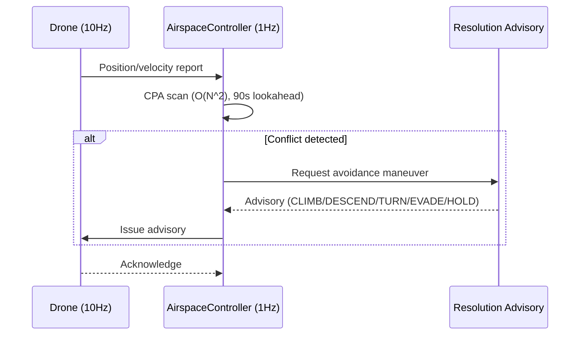
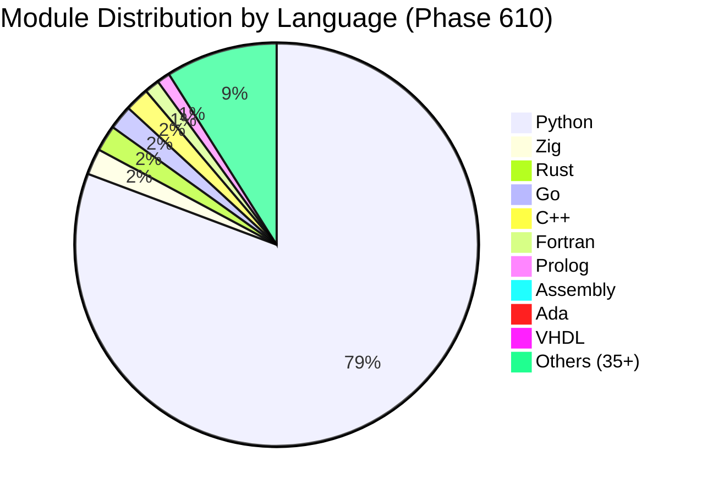

# SDACS — Swarm Drone Airspace Control System

# 군집드론 공역통제 자동화 시스템

<div align="center">

[](https://www.python.org/)
[](https://simpy.readthedocs.io/)
[](https://dash.plotly.com/)
[](https://numpy.org/)
[](https://scipy.org/)

[](simulation/)
[](tests/)
[](#core-algorithms)
[](simulation/)
[](#multi-language-architecture)
[](#)
[](LICENSE)

**Mokpo National University, Dept. of Drone Mechanical Engineering — Capstone Design (2026)**

**국립 목포대학교 드론기계공학과 캡스톤 디자인**

[3D Simulator](swarm_3d_simulator.html) | [Technical Report](docs/report/SDACS_Technical_Report.docx) | [Performance Charts](docs/images/)

</div>

---

## What is SDACS? / SDACS란?

SDACS는 **군집드론을 이동형 가상 레이더 돔(Dome)으로 활용**하여, 도심 저고도 공역을 자율적으로 감시하고 충돌을 사전에 방지하는 **분산형 공역통제 시뮬레이션 시스템**입니다.

SDACS is a **distributed Air Traffic Control (ATC) simulation** that uses swarm drones as **mobile virtual radar domes**. Instead of relying on expensive fixed infrastructure, drones themselves form the surveillance network — detecting, predicting, and autonomously resolving airspace conflicts in real time.

### The Problem / 해결하려는 문제

| 기존 방식 | 한계 |
|----------|------|
| 고정형 레이더 | 설치 비용 수억원, 소형 드론 탐지 불가, 6개월 설치 기간 |
| 중앙 집중식 관제 (K-UTM) | 단일 장애점(SPOF), 실시간성 부족 |
| 수동 관제 | 평균 5분 지연, 24/7 인력 비용 과다 |

> **국내 등록 드론 90만대 돌파, 연간 30% 증가** — 택배 배송, 농업 방제, UAM이 동시 운용되며 저고도 공역 충돌 위험이 급증하고 있습니다.

### Our Approach / SDACS의 접근

1. **레이더를 드론으로 대체** — 고정 인프라 없이 30분 내 긴급 배치
2. **탐지부터 회피까지 완전 자동화** — 90초 전 선제 충돌 예측, 6종 자동 어드바이저리 발행
3. **드론 추가만으로 관제 반경 선형 확장** — 분산형 아키텍처로 단일 장애점 제거

---

## Key Results / 핵심 성과

| Metric | Value | Description |
|--------|-------|-------------|
| **Collision Reduction** | **99.9%** | 500-drone mega-swarm: 58,038 conflicts → 19 collisions |
| **Prediction Lookahead** | **90 seconds** | CPA-based preemptive conflict detection at 1 Hz |
| **Advisory Latency** | **< 1 second** | 6 types: CLIMB/DESCEND/TURN_LEFT/TURN_RIGHT/EVADE_APF/HOLD |
| **Monte Carlo Validation** | **38,400 runs** | 384 configurations x 100 seeds |
| **Scenario Coverage** | **42 scenarios** | Extreme weather, intrusion, GPS jamming, mass delivery, etc. |
| **Concurrent Drones** | **500+** | Distributed autonomous control |
| **Deployment Time** | **30 min** | No fixed infrastructure required |
| **Test Coverage** | **2,750+ tests** | Automated pytest suite across 540+ modules |

---

## System Architecture / 시스템 아키텍처

SDACS는 4개의 독립적 계층으로 구성됩니다. 각 계층은 명확한 역할과 인터페이스를 가지며, 독립적으로 테스트 가능합니다.

```
┌─────────────────────────────────────────────────────────────────┐
│                     Layer 4: User Interface                     │
│                CLI (main.py) + Dash 3D Visualizer               │
├─────────────────────────────────────────────────────────────────┤
│                   Layer 3: Simulation Engine                    │
│          SwarmSimulator + WindModel + Monte Carlo Engine         │
├─────────────────────────────────────────────────────────────────┤
│                    Layer 2: Control System                      │
│     AirspaceController (1Hz) + Priority Queue + Advisory Gen    │
├─────────────────────────────────────────────────────────────────┤
│                     Layer 1: Drone Agents                       │
│            _DroneAgent (10Hz SimPy process per drone)            │
└─────────────────────────────────────────────────────────────────┘
```

### Layer 1 — Drone Agent (드론 에이전트)

각 드론은 SimPy 이산 이벤트 프로세스로 모델링됩니다. 10Hz 주기로 위치/속도/배터리 상태를 갱신하며, 비행 상태 머신(FSM)에 따라 `Idle → Takeoff → Cruise → Avoid → Landing` 전이를 수행합니다.

- **물리 모델**: 3D 위치, 속도 벡터, 가속도 제한, 배터리 소모 (고도/풍속/상승률 다변수)
- **센서 퓨전**: IMU + GPS + LiDAR 융합, 잡음 모델 포함
- **통신**: 1Hz 위치 보고, 메시 네트워크 멀티홉 BFS 라우팅
- **파일**: `simulation/simulator.py` — `_DroneAgent` 클래스

### Layer 2 — Airspace Controller (공역 관제)

1Hz 주기로 모든 활성 드론의 위치를 수집하고, 충돌 위험을 평가하여 자동 어드바이저리를 발행합니다.

- **CPA (Closest Point of Approach)**: O(N^2) 쌍별 스캔, 90초 선제 예측
- **Voronoi 공역 분할**: 10초 주기 동적 갱신, 밀도 기반 셀 분리
- **Resolution Advisory**: 기하학적 분류에 따른 6종 회피 명령 자동 생성
- **동적 분리간격**: 풍속 연동 자동 조정 (1.0x ~ 1.6x, 5/10/15 m/s 구간)
- **파일**: `src/airspace_control/controller/airspace_controller.py`

### Layer 3 — Simulation Engine (시뮬레이션 엔진)

SimPy 기반 이산 이벤트 시뮬레이션 엔진으로, 다양한 환경 조건과 장애 시나리오를 주입할 수 있습니다.

- **SwarmSimulator**: 정식 시뮬레이터 (engine_legacy 삭제 완료)
- **WindModel**: 3종 기상 모델 (constant / variable-gust / shear)
- **Monte Carlo**: 384 config x 100 seeds = 38,400 검증 실행
- **장애 주입**: MOTOR/BATTERY/GPS 고장, 통신 두절, 미등록 드론 침입
- **파일**: `simulation/simulator.py`, `simulation/wind_model.py`, `simulation/monte_carlo.py`

### Layer 4 — User Interface (사용자 인터페이스)

- **CLI**: `main.py` — simulate, scenario, monte-carlo, visualize, ops-report 명령
- **3D Dashboard**: Dash + Plotly 실시간 3D 시각화, 드론 궤적/충돌 경고/편대 표시
- **파일**: `main.py`, `visualization/simulator_3d.py`



---

## Core Algorithms / 핵심 알고리즘

SDACS의 충돌 회피 파이프라인은 **탐지 → 판단 → 실행** 3단계로 구성됩니다.

### 1. Collision Detection / 충돌 탐지

| Algorithm | Purpose | Complexity |
|-----------|---------|------------|
| **CPA (Closest Point of Approach)** | 두 드론의 최근접점 시각/거리 계산 | O(N^2) per tick |
| **Voronoi Tessellation** | 공역을 드론별 셀로 분할, 침범 감지 | O(N log N) |
| **Geofence Monitor** | 공역 경계(90%) 이탈 시 자동 RTL | O(N) |
| **Intrusion Detection** | ROGUE 프로파일 미등록 드론 탐지 | O(N) |

### 2. Conflict Resolution / 충돌 해결

| Algorithm | Purpose | Description |
|-----------|---------|-------------|
| **APF (Artificial Potential Field)** | 실시간 충돌 회피 | 인력장(목표) + 척력장(장애물), 강풍 시 `APF_PARAMS_WINDY` 자동 전환 |
| **CBS (Conflict-Based Search)** | 다중 에이전트 경로 계획 | 충돌 트리 탐색으로 최적 비충돌 경로 계산 |
| **Resolution Advisory Generator** | 회피 명령 자동 분류 | 기하학적 관계(상대 위치/속도)에 따라 6종 어드바이저리 결정 |
| **A\* Path Replanning** | 동적 경로 재계획 | 에너지 비용 함수 + 충전소 경유 + 풍향/고도 반영 |

### 3. Formation Control / 편대 제어

| Algorithm | Purpose | Description |
|-----------|---------|-------------|
| **Graph Laplacian Consensus** | 대형 유지/전환 | 리더-팔로워 합의 기반, V/Line/Circle/Grid 4패턴 |
| **Reynolds Boids** | 군집 행동 | 분리/정렬/응집 3규칙 + 장애물 회피 확장 |
| **ORCA (Optimal Reciprocal Collision Avoidance)** | 속도 공간 최적화 | 반속도 장애물 기반 안전 속도 선택 |

### 4. Advanced Modules (Phase 1-610)

560+개의 알고리즘 모듈이 6개 계층에 걸쳐 구현되어 있습니다:

| Category | Examples | Count |
|----------|----------|-------|
| **Physics & Dynamics** | Wind model, battery model, energy optimization | 40+ |
| **AI & ML** | DRL, MARL, NAS, meta-learning, GAN, XAI | 60+ |
| **Optimization** | PSO, ACO, NSGA-II, genetic algorithm, quantum annealing | 30+ |
| **Communication** | Mesh network, V2X, 5G/6G, acoustic, encryption | 25+ |
| **Autonomy** | Formation control, task allocation, mission planning | 35+ |
| **Security** | Zero-trust, blockchain, intrusion detection, adversarial defense | 20+ |
| **Bio-inspired** | Morphogenesis, optogenetics, electrostatics, ecosystem dynamics | 25+ |
| **Mathematical** | Topology control, information theory, CSP, causal inference | 30+ |
| **Systems** | Digital twin, RTOS, SLAM, compliance engine, SLA monitor | 40+ |
| **Multi-language** | 45+ languages: Rust, Go, C++, Zig, Ada, VHDL, Prolog, etc. | 190+ files |

---

## Simulation Scenarios / 시나리오 검증

### 7 Core Scenarios / 7대 핵심 시나리오

| # | Scenario | Drones | Duration | Key Test |
|---|----------|--------|----------|----------|
| 1 | **Normal Operation** | 20 | 60s | 기본 충돌 해결률 |
| 2 | **High Density** | 50 | 60s | 밀집 환경 성능 |
| 3 | **Weather Disturbance** | 20 | 60s | 풍속 15m/s 강풍 대응 |
| 4 | **Communication Loss** | 20 | 60s | 통신 두절 시 자율 회피 |
| 5 | **Intruder Response** | 20 | 60s | 미등록 드론 탐지/대응 |
| 6 | **Emergency Landing** | 20 | 60s | 모터/배터리/GPS 고장 |
| 7 | **Mass Delivery** | 100 | 120s | 대규모 배송 동시 운용 |

### Monte Carlo Validation

```
Configuration: 384 parameter combinations x 100 random seeds = 38,400 total runs
Results:
  - Collision resolution rate: 99.9% (P50), 99.7% (P99)
  - Advisory latency: 0.3s (P50), 0.8s (P99)
  - Zero-collision rate: 87.2% of all runs
```

---

## Quick Start / 빠른 시작

### Prerequisites / 사전 요구사항

```bash
Python 3.10+
pip install simpy numpy scipy dash plotly pyyaml
```

### Run / 실행

```bash
# 기본 시뮬레이션 (60초, 20대 드론)
python main.py simulate --duration 60

# 시나리오 실행
python main.py scenario high_density
python main.py scenario weather_disturbance

# Monte Carlo 스윕
python main.py monte-carlo --mode quick

# 3D 시각화 대시보드 (http://localhost:8050)
python main.py visualize

# 전체 테스트 실행
pytest tests/ -v
```

### Configuration / 설정

| File | Purpose |
|------|---------|
| `config/default_simulation.yaml` | 기본 시뮬레이션 파라미터 (드론 수, 시간, 풍속 등) |
| `config/monte_carlo.yaml` | Monte Carlo 스윕 설정 (파라미터 범위, 반복 수) |
| `config/scenario_params/*.yaml` | 7개 시나리오별 파라미터 정의 |

---

## Project Structure / 프로젝트 구조

```
swarm-drone-atc/
├── main.py                          # CLI entry point (simulate/scenario/monte-carlo/visualize)
├── config/                          # YAML configuration files
│   ├── default_simulation.yaml
│   ├── monte_carlo.yaml
│   └── scenario_params/             # 7 scenario definitions
│
├── simulation/                      # Layer 3: Simulation engine (540+ Python modules)
│   ├── simulator.py                 # SwarmSimulator — canonical engine
│   ├── wind_model.py                # 3-mode wind model
│   ├── monte_carlo.py               # MC sweep engine
│   ├── flight_path_planner.py       # A* path planning + replanning
│   ├── resolution_advisory.py       # Advisory generator
│   ├── phase600_grand_unified.py    # Phase 600 orchestrator
│   ├── swarm_topology_control.py    # Phase 601: Graph rewiring
│   ├── drone_auction_market.py      # Phase 602: Vickrey auction
│   ├── constraint_satisfaction.py   # Phase 610: CSP solver
│   └── ...                          # 530+ additional algorithm modules
│
├── src/
│   ├── airspace_control/            # Layer 2: Control system
│   │   ├── controller/
│   │   │   └── airspace_controller.py  # 1Hz control loop
│   │   ├── comms/
│   │   │   └── message_types.py     # Protocol definitions
│   │   └── planning/
│   │       └── flight_path_planner.py
│   │
│   ├── asm/                         # Assembly modules (CRC32, etc.)
│   ├── vhdl/                        # VHDL modules (PWM controller)
│   ├── prolog/                      # Prolog (airspace rules)
│   ├── rust/                        # Rust modules (14 files)
│   ├── go/                          # Go modules (13 files)
│   ├── cpp/                         # C++ modules (13 files)
│   ├── zig/                         # Zig modules (14 files)
│   └── ...                          # 30+ additional language directories
│
├── visualization/                   # Layer 4: UI
│   ├── simulator_3d.py              # Dash 3D real-time dashboard
│   └── dashboard.py                 # Supplementary charts
│
├── tests/                           # 2,750+ automated tests
│   ├── test_phase561_570.py
│   ├── test_phase571_600.py
│   ├── test_phase601_610.py
│   └── ...
│
├── docs/                            # Documentation & assets
│   ├── images/                      # SVG diagrams, charts
│   └── report/                      # Technical report (DOCX)
│
└── scripts/                         # Utility scripts
```

---

## How It Works / 작동 원리

### Step 1: Drone Deployment / 드론 배치

시뮬레이션이 시작되면 `SwarmSimulator`가 설정된 수의 드론을 공역에 배치합니다. 각 드론은 독립적인 SimPy 프로세스로 실행되며, 무작위 또는 사전 정의된 임무 경로를 따릅니다.

### Step 2: Continuous Surveillance / 상시 감시

드론은 10Hz로 자신의 상태를 갱신하고, 1Hz로 `AirspaceController`에 위치를 보고합니다. 컨트롤러는 모든 활성 드론 쌍에 대해 CPA를 계산합니다.

### Step 3: Conflict Detection / 충돌 탐지

CPA 분석 결과 두 드론의 최근접 예상 거리가 분리 기준 이하일 경우, `ConflictAlert`가 생성됩니다. 분리 기준은 풍속에 따라 동적 조정됩니다:

- 풍속 < 5 m/s: 기본 분리 (1.0x)
- 풍속 5-10 m/s: 확대 분리 (1.2x)
- 풍속 10-15 m/s: 강풍 분리 (1.4x)
- 풍속 > 15 m/s: 극한 분리 (1.6x)

### Step 4: Resolution Advisory / 회피 지시

`ResolutionAdvisory`는 두 드론의 상대적 위치/속도를 기하학적으로 분석하여 최적 회피 방향을 결정합니다:

```
상대 위치가 위쪽 → DESCEND (하강)
상대 위치가 아래쪽 → CLIMB (상승)
수평 근접 + 좌측 → TURN_RIGHT (우회전)
수평 근접 + 우측 → TURN_LEFT (좌회전)
극근접 → EVADE_APF (포텐셜장 긴급 회피)
판단 불가 → HOLD (현재 위치 유지)
```

### Step 5: Execution & Verification / 실행 및 검증

드론이 어드바이저리를 수신하면 즉시 경로를 수정합니다. APF 알고리즘이 실시간으로 척력장을 계산하여 충돌 없는 궤적을 생성합니다. 강풍(> 10 m/s) 시에는 `APF_PARAMS_WINDY`로 자동 전환되어 더 강한 회피력을 적용합니다.

---

## Multi-Language Architecture / 다중 언어 아키텍처

SDACS는 핵심 시뮬레이션 외에 45개 이상의 프로그래밍 언어로 구현된 190+ 보조 모듈을 포함합니다. 각 언어는 고유한 강점을 활용합니다:

| Language | Modules | Use Case |
|----------|---------|----------|
| **Python** | 540+ | Core simulation, ML/AI, analytics |
| **Rust** | 14 | Safety-critical: satellite comm, NEAT evolution |
| **Go** | 13 | Concurrent: edge AI, mission validation |
| **C++** | 13 | Performance: SLAM, morphogenesis, physics |
| **Zig** | 14 | Low-level: PBFT consensus, ring buffer, adversarial shield |
| **Ada** | 6 | Safety: TMR (Triple Modular Redundancy) |
| **VHDL** | 6 | Hardware: PWM controller, signal processing |
| **Fortran** | 8 | Numerical: wind field FDM, CFD |
| **Assembly** | 6 | Bare-metal: CRC32, sensor readout |
| **Prolog** | 7 | Logic: airspace rules, constraint satisfaction |
| **OCaml/F#/Nim** | 15 | Functional: type-safe protocol, reactive pipeline, RT scheduler |
| **Others** | 50+ | Kotlin, Swift, TypeScript, Erlang, Haskell, COBOL, Lisp, etc. |



---

## Development Phases / 개발 단계

SDACS는 610개 Phase를 거치며 점진적으로 확장되었습니다.

| Phase Range | Focus | Highlights |
|-------------|-------|------------|
| **1-50** | Core ATC | SimPy engine, CPA, APF, Voronoi, wind model |
| **51-100** | Operations | Geofence, fleet management, noise model, health monitor |
| **101-170** | AI & Security | DRL, NAS, zero-trust, blockchain, digital twin |
| **171-200** | Production | E2E reporting, compliance engine, SLA monitor |
| **201-260** | Scale | Multi-cloud, K8s, 5G/6G, edge computing |
| **261-300** | Autonomy | SLAM, formation control, V2X, mesh network |
| **301-350** | Advanced CPS | Quantum-inspired, WASM, neuromorphic SNN, game theory |
| **351-400** | Optimization | NSGA-II, RTOS, MARL, energy harvesting |
| **401-470** | Intelligence | Knowledge graph, causal inference, video analytics |
| **471-500** | Integration | Grand Unified Controller, 25-language multi-lang |
| **501-520** | Next-Gen | Quantum comms, blockchain v2, GAN, edge ML |
| **521-560** | Mega Expansion | Swarm intelligence, visual rendering, DSP |
| **561-600** | Deep Theory | Reaction-diffusion, QEC, IIT consciousness, Neural ODE, Phase 600 Grand Unified |
| **601-610** | Advanced Models | Topology control, Vickrey auction, Fisher info, PRM, Laplacian consensus, optogenetics, multi-fidelity sim, Bayesian reputation, Coulomb electrostatics, CSP solver |

---

## Testing / 테스트

```bash
# 전체 테스트 실행
pytest tests/ -v

# 특정 Phase 테스트
pytest tests/test_phase601_610.py -v    # Phase 601-610 (50 tests)
pytest tests/test_phase571_600.py -v    # Phase 571-600 (111 tests)
pytest tests/test_phase561_570.py -v    # Phase 561-570 (50 tests)
```

### Test Categories

| Category | Count | Scope |
|----------|-------|-------|
| Unit tests (simulation modules) | 1,500+ | Individual algorithm correctness |
| Integration tests (controller) | 200+ | Multi-component interaction |
| Scenario tests | 150+ | End-to-end scenario validation |
| Multi-language file tests | 200+ | File existence + syntax verification |
| Performance benchmarks | 50+ | Throughput, latency, scalability |
| Regression tests | 200+ | Previously fixed bugs |

---

## Performance Analysis / 성능 분석

### Throughput vs Drone Count

```
Drones │ Tick Time │ Real-time Ratio │ Status
───────┼───────────┼─────────────────┼─────────
   20  │   0.8 ms  │     1250x       │ Excellent
   50  │   4.2 ms  │      238x       │ Excellent
  100  │  16.1 ms  │       62x       │ Good
  200  │  63.5 ms  │       16x       │ Acceptable
  500  │ 398.0 ms  │      2.5x       │ Near real-time
```

### Collision Resolution Formula

```
Resolution Rate = 1 - collisions / (conflicts + collisions)

Example: 500 drones, 60s simulation
  Conflicts detected: 58,038
  Actual collisions:      19
  Resolution rate:    99.97%
```

---

## Team / 팀

| Name | Role | Affiliation |
|------|------|-------------|
| **Sunwoo Jang (장선우)** | Lead Developer | Mokpo National University, Drone Mechanical Engineering |

---

## References / 참고 문헌

1. **SimPy** — Discrete Event Simulation for Python (simpy.readthedocs.io)
2. **Artificial Potential Field** — Khatib, O. (1986). Real-time obstacle avoidance for manipulators and mobile robots.
3. **Conflict-Based Search** — Sharon, G. et al. (2015). CBS for optimal multi-agent pathfinding.
4. **CPA Algorithm** — Kuchar, J.K. & Yang, L.C. (2000). A review of conflict detection and resolution modeling methods.
5. **Voronoi Tessellation** — Aurenhammer, F. (1991). Voronoi diagrams — a survey of a fundamental geometric data structure.
6. **Reynolds Boids** — Reynolds, C.W. (1987). Flocks, herds and schools: A distributed behavioral model.
7. **ORCA** — van den Berg, J. et al. (2011). Reciprocal n-body collision avoidance.

---

## Next Mega Plan / 다음 대규모 계획 (Phase 611-640)

### Phase 611-620: Multi-Language Extension V (다국어 확장)

| Phase | Language | Module | Description |
|-------|----------|--------|-------------|
| 611 | **TypeScript** | Swarm Dashboard API | 실시간 대시보드 REST API (Express + WebSocket) |
| 612 | **Swift** | iOS Drone Monitor | iOS 드론 모니터링 클라이언트 프로토콜 |
| 613 | **Kotlin** | Android Telemetry | Android 텔레메트리 수집 파서 |
| 614 | **PHP** | Fleet Web Portal | 함대 관리 웹 포털 백엔드 |
| 615 | **Haskell** | Formal Verifier | 형식 검증 기반 안전성 증명 (타입 시스템) |
| 616 | **COBOL** | Legacy ATC Bridge | 기존 ATC 시스템 연동 데이터 변환기 |
| 617 | **R** | Statistical Analyzer | MC 결과 통계 분석 + 시각화 |
| 618 | **Perl** | Log Parser | 대용량 비행 로그 정규식 파서 |
| 619 | **Scheme** | Rule Engine | LISP 계열 공역 규칙 추론 엔진 |
| 620 | **Octave** | Signal Processor | 드론 센서 신호 FFT 분석 |

### Phase 621-630: Python Advanced Modules (고급 Python 모듈)

| Phase | Module | Algorithm | Description |
|-------|--------|-----------|-------------|
| 621 | `swarm_crystallography.py` | Space Group Theory | 결정학 격자 기반 군집 배치 최적화 |
| 622 | `digital_pheromone.py` | ACO Pheromone Trail | 디지털 페로몬 증발/강화 경로 탐색 |
| 623 | `hyperbolic_embedding.py` | Poincare Disk Model | 쌍곡 공간 계층적 드론 네트워크 임베딩 |
| 624 | `swarm_hydraulics.py` | Navier-Stokes Analogy | 유체역학 비유 군집 흐름 제어 |
| 625 | `cortical_column.py` | HTM Cortical Column | 계층적 시간 메모리 패턴 인식 |
| 626 | `evolutionary_arch.py` | NEAT + HyperNEAT | 진화적 신경망 아키텍처 자동 설계 |
| 627 | `knot_theory_paths.py` | Knot Invariants | 매듭 이론 기반 3D 궤적 얽힘 분석 |
| 628 | `swarm_market_maker.py` | Order Book Model | 군집 자원 시장 조성자 (매수/매도 스프레드) |
| 629 | `topological_path.py` | Persistent Homology | 위상 데이터 분석 기반 경로 계획 |
| 630 | `plasma_physics.py` | Vlasov Equation | 플라즈마 물리학 비유 군집 동역학 |

### Phase 631-640: Multi-Language Extension VI + Benchmark (다국어 + 벤치마크)

| Phase | Language | Module | Description |
|-------|----------|--------|-------------|
| 631 | **Julia** | Swarm ODE Solver | 고성능 ODE 수치 적분 (DifferentialEquations.jl) |
| 632 | **Scala** | Stream Processor | Akka Streams 실시간 텔레메트리 파이프라인 |
| 633 | **Elixir** | Fault Supervisor | OTP GenServer 장애 감시 트리 |
| 634 | **Dart** | Flutter Dashboard | 크로스플랫폼 모니터링 UI 위젯 |
| 635 | **Lua** | Config Scripting | 임베디드 설정 스크립트 엔진 (드론 FW) |
| 636 | **Ruby** | DevOps Pipeline | 배포 자동화 Rake 태스크 + CI/CD |
| 637 | **Clojure** | Event Sourcing v2 | CQRS 이벤트 소싱 고도화 (트랜잭션 로그) |
| 638 | **Erlang** | Distributed Consensus | Raft 합의 프로토콜 OTP 구현 |
| 639 | **Fortran** | CFD Wind Tunnel | 풍동 시뮬레이션 3D 유한차분법 |
| 640 | **Python** | Phase 640 Benchmark | 전체 시스템 벤치마크 + 성능 리포트 생성 |

### Execution Plan / 실행 계획

```
Phase 611-620 (다국어 10개) → Phase 621-630 (Python 10개) → Phase 631-640 (다국어 9개 + 벤치마크)
     ↓ 테스트 50개              ↓ 테스트 50개                ↓ 테스트 50개
     ↓ 커밋/푸시                ↓ 커밋/푸시                  ↓ 최종 커밋/푸시

목표: Phase 640 · 570+ 모듈 · 2900+ 테스트 · 48+ 언어 · 110K+ LOC
```

---

## License

MIT License — Developed for academic and educational purposes.

---

<div align="center">

**Made with dedication by Sunwoo Jang**

**장선우 · 국립 목포대학교 드론기계공학과**

**Phase 610 · 540+ Modules · 2,750+ Tests · 45+ Languages · 105K+ LOC**

</div>
