<div align="center">

# SDACS — Swarm Drone Airspace Control System
### 군집드론 공역통제 자동화 시스템

[](https://www.python.org/)
[](https://simpy.readthedocs.io/)
[](https://dash.plotly.com/)
[](https://numpy.org/)
[](https://scipy.org/)

[](docs/phase_matrix.html)
[](docs/SIMULATOR_POST_UNIVERSE_PLAN.md)
[](docs/SDACS_API.md)
[](tests/e2e/)
[](ROADMAP.md)
[](tests/)
[-7c3aed?style=for-the-badge&logo=electron&logoColor=white)](docs/V1_5_0_RELEASE_INSTRUCTIONS.md)
[](simulation/)
[](ROADMAP.md)
[](#)
[](LICENSE)

**Mokpo National University, Dept. of Drone Mechanical Engineering — Capstone Design (2026)**

**국립 목포대학교 드론기계공학과 캡스톤 디자인**

[**⚡ Quick Start (1줄 실행)**](docs/QUICK_START.md) | [**🗺 Phase Matrix (200 카드)**](docs/phase_matrix.html) | [**🌐 Live Site**](https://sun475300-sudo.github.io/swarm-drone-atc/) | [**🛰 3D 시뮬레이터**](https://sun475300-sudo.github.io/swarm-drone-atc/simulator.html) | [**🚢 해양 시뮬**](https://sun475300-sudo.github.io/swarm-drone-atc/maritime_detection_simulator.html) | [**📥 v1.5.0 빌드**](docs/V1_5_0_RELEASE_INSTRUCTIONS.md)

> 🔗 **GitHub Pages 라이브 사이트**: <https://sun475300-sudo.github.io/swarm-drone-atc/> — 랜딩 페이지(소개·성과·아키텍처)에서 3D 시뮬레이터·해양 소형선 감지·시나리오 비교·테스트 리포트로 이동할 수 있습니다.

</div>
<div align="center">
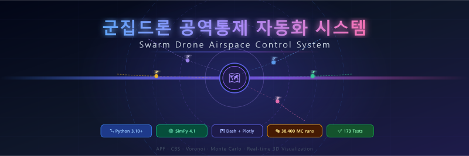
</div>

> **🌟 최신 업데이트 (2026-06-25 · 🌟 Phase 500 SDACS Centennial 선언 + ODYSSEY 19 Phase 통합)** — **본 세션의 정점: Phase 500 Centennial 선언** (Phase 1-500 통합 회고 + 영구 아카이브 동결 + 100년 비전). 🏛 **Standards & Policy** 461 ASTM F38·462 ISO/TC 20/SC 16·463 K-드론 정책·464 군집 안전 백서·**470 표준 대시보드 (18 표준 정합)**·**471 KS X UAS-CR-1 제안**·**472 ICAO RPASP 의견서** / 🔬 **Research** 451 RL 일반화 + EASA AI Roadmap 조사 / ♾️ **Continuum** 481 Dependabot·482 브라우저 카나리·484 Electron LTS·487 승계 규약·488 보안 SLA·489 아카이브 이중화·490 디지털 유산·**491-499 차세대 트랙 공모·이양**·**500 Centennial 선언** / 🎓 **Education** 468 캡스톤 표준 / 🛠 **Maintenance** 483 Three.js 업그레이드 리허설. 🔐 **7차 정밀점검**: `airspace_controller` TelemetryMessage NaN/None 가드 + agent 5건 중 4건 거짓 양성 차단. 🎨 **시뮬레이터 최적화**: HUD 캐싱 + CSP + JWT alg + pre-commit hook. 🗃 **거버넌스**: 411 원격 브랜치 정리(83 안전 삭제 후보). 📦 **6 사본 md5 동기**.

## 📣 공개 프로젝트 설명 자료 / Public Project Materials (2026-06-18)

| 자료 | 대상 | 다운로드 |
|---|---|---|
| **공개 프로젝트 설명 보고서** (DOCX, 5페이지) | 일반 대중 · 학생 · 심사위원 · 공공기관 | [📥 SDACS_Public_Project_Report_2026.docx](docs/report/SDACS_Public_Project_Report_2026.docx) |
| **공개 프로젝트 소개 발표자료** (PPTX, 10장) | 발표 · 수업 · 프로젝트 소개 | [📥 SDACS_Public_Project_Overview_2026.pptx](docs/presentation/SDACS_Public_Project_Overview_2026.pptx) |

> **2026-06-18 로컬 재검증:** `ruff` 통과 · Python 테스트 **5,444 pass / 270 skip / 0 fail**. 대표 실행 `100 drones / 60s / seed 42`에서는 **45 collisions · 87 near misses · 95.9% conflict resolution**이 측정되었습니다. 현재 결과는 안전 인증이 아니라 연구용 시뮬레이터의 개선 기준선입니다.

> **최신 업데이트 (2026-06-18)** — 공개 설명 보고서와 10장 발표자료를 추가하고, 검증 수치와 현재 안전 한계를 동일한 기준으로 동기화했습니다.
>
> **♾️ 이전 업데이트 (2026-06-17 · ODYSSEY Federation Operations + 시뮬레이터 보안 강화 · 408 API 라이브 실측 · 5,106 테스트 수집 / 0 fail)** — 🛰 **ODYSSEY 연합 운영(Federation Operations)** 9개 모듈 통합: 인스턴스 디스커버리(421)·운영 의도 4D 교환(422)·관제권 핸드오버(423)·연합 충돌 해소(424)·NOTAM 전파(425)·신뢰 모델(428)·감사 로그 SHA-256 해시 체인(429)·split-brain 안전 강하(430)·하이브리드 논리 시계 HLC(431)·메시 토폴로지(432). 🔐 **시뮬레이터 보안 강화 6차 점검**: CSP 메타 헤더(군집·해양 HTML XSS 표면 축소)·JWT 알고리즘 명시 검증(`api/auth.py`)·wind cache 가드·`.githooks/pre-commit`(random·모델 식별자·engine_legacy 자동 차단). 🎯 **API Maturity 정직성**: production 94·beta 98·mock 110·speculative 103 = 408 + [TECH_DEBT_LEDGER.md](docs/TECH_DEBT_LEDGER.md) 자동 생성. CI에 문서-실측 정합성 + 4 사본 md5 게이트 + maturity 배지 동치 검증.
>
> **♾️ 이전 (2026-06-12 · API Maturity 정직성 체계 가동 + TRANSCENDENCE/GENESIS/ODYSSEY 계획 체계 · 407 API 라이브 실측 · 종합 4,443 pass / 0 fail)** — 🎯 **신규**: `apiMaturity()`/`maturityReport()` 분류(production 93·beta 98·mock 110·speculative 103) · **Mock Detector**(mock 호출 시 console.warn + `mockCalls` 카운트, Phase 203) · **`experimental.*` 네임스페이스**(speculative 103종 격리, Phase 206) · **`soraAssess()`**(JARUS SORA 2.0 결정적 SAIL 산정, GENESIS 302) · **기술 부채 대장** [TECH_DEBT_LEDGER.md](docs/TECH_DEBT_LEDGER.md) 자동 생성(GENESIS 388) · CI에 문서-실측 정합성 + 4 사본 md5 게이트. 계획 체계 3층: [TRANSCENDENCE 201-300](docs/SIMULATOR_TRANSCENDENCE_PLAN.md)(8%) · [GENESIS 301-400](docs/SIMULATOR_GENESIS_PLAN.md)(2%) · [ODYSSEY 401-500](docs/SIMULATOR_ODYSSEY_PLAN.md)(수립) + [2026 H2 실행 일정](docs/MASTER_PLAN_2026H2.md)
>
> **이전 (200 Phase Unity)** — 🎯 **Phase 200 = SDACS = 𝟏 (Unity)** 도달 후 **Phase 51 (LLM Multi-Agent)** 가 시드에서 완전 격상되었습니다: `stellar51DelegateGroup`(드론 그룹 LLM 위임) · `stellar51Recommend`(상태 기반 결정적 권고) · `stellar51Tick`(그룹 사이클 진행) · `stellar51Groups`(위임 그룹 조회) · `stellar51Revoke`(위임 해제). 5단계 통합 — MEGA(1-10) + HYPER(11-50) + STELLAR(51-100) + ULTIMATE(101-150) + POST-UNIVERSE(151-200). Playwright E2E **263/264 통과**(1 skip), 회귀 **4,180 pass / 8 skip / 0 fail**, 종합 **4,443 pass / 9 skip / 0 fail** (2026-06-12 실측). 🌌 [HYPER](docs/SIMULATOR_HYPER_PLAN.md) · [STELLAR](docs/SIMULATOR_STELLAR_PLAN.md) · [ULTIMATE](docs/SIMULATOR_ULTIMATE_PLAN.md) · [POST-UNIVERSE](docs/SIMULATOR_POST_UNIVERSE_PLAN.md) · [API](docs/SDACS_API.md) · [Phase Matrix](docs/phase_matrix.html)

> **이전 (Phase 100 완료)** — 🌌 (2026-06-05 · MEGA 9 + HYPER 41 + STELLAR 49 = 99 Phase 통합 · 215/216 E2E · 280+ API)** — 🚀 **본 사이클 STELLAR Phase 52-100 일괄 49종**: Track Ω 자율결정(52 RLHF · 53 Causal Inference · 54 Adversarial Robust · 55 Explainable AI) + Track Σ 초대규모(56 GPU 100K WGSL · 57 Distributed Sim · 58 Cloud Burst · 59 10Gb/s Streaming · 60 Video Proc av1) + Track Φ 물리트윈(61 Skybrush · 62 Cesium · 63 UE5 · 64 ROS2 + Gazebo · 65 Isaac Sim) + Track Ψ 사회(66 시민신고·67 보험·68 사고조사·69 RPAS자격·70 교육) + Track Ξ 지구너머(71 Lunar Gateway · 72 Mars 헬리콥터 · 73 소행성 채굴 · 74 궤도 잔해 · 75 DTN) + Track Δ 양자(76 QKD · 77 Photonic · 78 Neuromorphic · 79 SNN · 80 Annealing) + Track Λ XR(81 Vision Pro · 82 Holographic · 83 BCI · 84 Haptic · 85 후각) + Track Π 경제(86 UAM Pricing · 87 Carbon Credit · 88 DaaS Market · 89 NFT · 90 DAO) + Track Π+ Ultimate(91 AGI · 92 글로벌 1:1 · 93 1억 드론 · 94 글로벌 협업 · 95 UN 표준) + Track Ω+ Singularity(96 자기개선·97 디지털 인간·98 메타버스·99 ITU·100 SDACS 2.0 글로벌 표준 ATC OS). **MEGA 9 + HYPER 41 + STELLAR 49 = 99 Phase + Phase 51 시드 = 100 Phase 완료**. Playwright E2E **215/216 통과**, 회귀 **4,140/4,140 통과**. 🌌 HYPER: [`docs/SIMULATOR_HYPER_PLAN.md`](docs/SIMULATOR_HYPER_PLAN.md) · STELLAR: [`docs/SIMULATOR_STELLAR_PLAN.md`](docs/SIMULATOR_STELLAR_PLAN.md) · API: [`docs/SDACS_API.md`](docs/SDACS_API.md)
>
> **이전 업데이트** — **원클릭 로컬 실행**(Win/Mac/Linux 더블클릭) · **해양 소형선 감지 시뮬레이터**(레이더 물리·AIS 융합·EO/IR·COLREG·CPA, 8개 시나리오) · 메인 3D **다중 선택·대규모 성능 측정·경로효율·라벨 풀 최적화**.

---

## 📊 개발 진척 현황 / Development Progress (2026-06-25)

| 트랙 | 범위 | 진척 | 핵심 산출물 |
|---|---|---|---|
| **Core** | Phase 1-690 | ✅ 100% | 시뮬·이론·AI·HW·UTM·AIM (690 phase) |
| **A** 실기 드론 | P691-700 | ✅ 100% | Pixhawk·Jetson·RTK·MoCap·FMEA 가이드 10종 (실기 검증은 사용자 HW) |
| **B** 논문화 | P701-710 | ✅ 100% | 30편 서베이·LaTeX §1-§7·포스터·Marp 슬라이드·투고 가이드 (IROS 2026 투고 준비) |
| **C** 서비스화 | P711-720 | ✅ 100% | FastAPI+JWT/RBAC·TimescaleDB·K8s·관측성·베타 + React MVP(`frontend/`) |
| **D** 웹 시뮬 | P721-735 | ✅ 100% | 군집·해양 3D + Electron 3-OS + i18n + LIVE + CPA 공간해시 + 멀티뷰 + EO/IR + **ATC 명령 콘솔** |
| **E** 확장 연구 | P736-745 | ✅ 100% | RL PoC·UAS-T·LiDAR·DR·디지털트윈·Raft HA·UAM·양자·폐쇄망·LLM |
| **F** 산학·사업화 | P746-755 | 🟢 90% | K-UAM·해수부·산림청·KISA·라이선싱·창업 docs (P755·LOI는 사용자 환경) |
| **G** TRANSCENDENCE | 시뮬 201-300 | 🟡 12% | 201-210·226·286 완료 — 성숙도 정직성·API 수명주기·GPS→ENU WGS84·Ablation 자동화 |
| **H** GENESIS | 시뮬 301-400 | 🟡 16% | 인증 체계 — 301-311(항공안전법·KC·조종자·CSAP·특별비행·사고보고) + 341 목포 실좌표 + 381 교육·387 발표·388 부채·389 유지보수 |
| **I** ODYSSEY | 시뮬 401-500 | 🟡 ~60% | U-space·연합 운영(421-432)·형식 검증·표준 시나리오·정책 분석·마이그레이션·**Standards & Policy(461-465·467·470·471·472)·Formal & Research(451)·Continuum(481-490·491-499·🌟 500 Centennial)·Education(468)·Maintenance(483)** — **🌟 Phase 500 Centennial 도달** (draft PR phase 404·405·411·452·453·473 + 미완료 다수 잔존, 100% 도달은 차세대 트랙) |

> 상세: [`ROADMAP.md`](ROADMAP.md) · [`STATUS_REPORT.md`](STATUS_REPORT.md) · [`docs/INDEX.md`](docs/INDEX.md)(문서 마스터 인덱스) · [`docs/MASTER_PLAN_2026H2.md`](docs/MASTER_PLAN_2026H2.md)(실행 일정)

### 🚧 미완료 작업 / Open Work Items (정직성 리스트, 2026-06-25 기준)

**사용자 환경 의존 (코드 작업 불가, 4건)**
- [ ] P755 창업·분사 결정 + 외부 기관 LOI 체결
- [ ] Track A 실기 검증 — Pixhawk·Jetson·RTK 실 하드웨어 비행 (가이드 10종은 완비)
- [ ] P707 논문 실측 실험 그래프 → P709 IROS 2026 실제 투고
- [ ] `v1.5.0` 태그 푸시 → 3-OS 자동 빌드 (sandbox push 403 — [1줄 명령 가이드](docs/V1_5_0_RELEASE_INSTRUCTIONS.md))

**시뮬레이터 — MASTER_PLAN Track Ⅰ (시각화 마감, ~2026-07 목표)**
- [x] **CPA 예측선 고도화 — TTC 라벨·위험도 3단계 색상** (2026-06-13, 분석 뷰 Q2 + 3D 빌보드)
- [x] **어드바이저리 빌보드 6단계 — EVADE/HOLD/RTL + CLIMB/DESCEND/TURN** (2026-06-13, phase + 동적 vy·헤딩 변화율 분류)
- [x] **리플레이 스크러버-멀티뷰 커서 마감 검증** (2026-06-13, `_sdacs.replayState` API + E2E 6건)
- [x] **mega_swarm 1k/5k FPS 실측 표** (2026-06-13, `docs/PERF_MEGA_SWARM.md` — DC 불변·CPU 4.1× scaling 확정)
- [ ] 리포트 KPI를 `gen_report` 정의와 1:1 일치 (보류 — gen_report 는 자유 텍스트 보고서이라 KPI 표 정의 불일치)

**TRANSCENDENCE 잔여 (Phase 211-300, Phase 226 완료)**
- [ ] 211-220 production-grade API 확대 — production 12종에서 30종으로 격상
- [ ] 221-240 실측 격상 — WebGPU 실 WGSL·CRDT Yjs·MAVLink SITL·KMA 풍속장 (226 GPS→ENU 정밀 검증 완료)
- [ ] 241-260 다중 사용자 — WS 관제 서버·2-브라우저 협업 E2E·부하 100명
- [ ] 261-280 HITL (사용자 HW) · 281-300 학술 임팩트 (Ablation 자동화는 sandbox 가능)

**GENESIS·ODYSSEY 잔여**
- [ ] GENESIS 312-340 — CSAP 통제 확장·플러그인 SDK·시나리오 마켓·패키지 배포·영문 문서
- [ ] GENESIS 342-380 — 지역 실증·24시간 운영·온보드 RL·V2X·GPS 거부 환경·자가 치유
- [ ] GENESIS 382-400 — 교육 과제·강의 자산·온보딩·아카이브·Phase 400 레거시 선언
- [ ] ODYSSEY 402-420 — FAA/EASA/ICAO 정렬·국제 벤치마크·해외 파일럿 제안
- [ ] ODYSSEY 426-427 — 2-인스턴스 연합 E2E·인접 공역 고스트 렌더링
- [ ] ODYSSEY 451-500 — RL 일반화·표준 기고·장기 운영·거버넌스·아카이브

**GENESIS·ODYSSEY 진척 (2026-06-18 확인)**
- [x] **GENESIS 301** ✅ 항공안전법·드론활용촉진법 적합성 매트릭스 — [`docs/certification/AIR_SAFETY_ACT_MATRIX.md`](docs/certification/AIR_SAFETY_ACT_MATRIX.md) (12 조항 매핑·격차·운영자 체크리스트)
- [x] **GENESIS 387** ✅ 졸업 심사 발표 키트 — [`docs/presentation/DEFENSE_KIT.md`](docs/presentation/DEFENSE_KIT.md) (10분 데모 시나리오·예상 질문 18개·압박 대응·당일 체크리스트)
- [x] **TRANSCENDENCE 204** ✅ Production 핵심 12종 회귀 강화 — `tests/e2e/test_simulator_production_core.py` (production getter 전수 + 핵심 메서드 호출 + 93 회귀 방지)
- [x] **ODYSSEY 448** ✅ 속성 기반 테스트 — `tests/test_property_telemetry.py` (Hypothesis 1,150+ 케이스, 압축 무손실/유계 오차/충돌해결률 불변식)
- [x] **ODYSSEY 466** ✅ 텔레메트리 JSON Schema 공개 — [`docs/schemas/telemetry.schema.json`](docs/schemas/telemetry.schema.json) (Draft-07) + `tests/test_telemetry_schema.py` (스키마 + 예제 + ws_bridge 정합성)
- [x] **GENESIS 381** ✅ 교육 모드 — `_sdacs.tutorialStart/Next/Status()` 5단계 결정적 튜토리얼(ATC→TAC→UTM→APF→Maturity), E2E 2건
- [x] **GENESIS 306** ✅ RTM 5계층 커버리지 — `docs/certification/RTM_5LAYER_COVERAGE.md` REQ↔DSN↔IMP↔VER 21건 추적
- [x] **GENESIS 389** ✅ 유지보수 최소 모드 — `docs/MAINTENANCE_MINIMAL_MODE.md` (코어 서브셋·일일/분기/연 워크플로·비상 절차)
- [x] **ODYSSEY 447** ✅ 시나리오 fuzzing — `tests/e2e/test_simulator_fuzz.py` Hypothesis로 NFZ·ATC·SORA 140케이스 무패닉 검증
- [x] **ODYSSEY 486** ✅ 독립 재현 자동화 — `scripts/independent_reproduction.sh` (회귀·md5·JS·API 게이트 통합)
- [x] **TRANSCENDENCE 205** ✅ Beta API 부분 검증 — `tests/e2e/test_simulator_beta_subset.py` (Copilot·적대·C-UAS·WindField·PQC 인터페이스 안정·라이프사이클·분류 회귀, 5건)
- [x] **GENESIS 304** ✅ KC 전파인증 체크리스트 — `docs/certification/KC_RADIO_CERTIFICATION.md` (7 모듈 분류·신청 흐름·자가 점검·갭 분석)
- [x] **GENESIS 309** ✅ 조종자 자격증명 매핑 — `docs/certification/PILOT_LICENSE_MAPPING.md` (1~4종 과목·실기 항목 ↔ SDACS 모듈, 튜토리얼 5단계 정렬)
- [x] **ODYSSEY 408** ✅ ICAO 공역 클래스 A-G 매핑 — `docs/certification/AIRSPACE_CLASS_MAPPING.md` + `simulation/airspace_class.py` (`classify_airspace()` API 격상, 결정적 산정, 25건 PASS)
- [x] **GENESIS 303** ✅ 비행계획 신고 양식 — `simulation/flight_plan_filing.py` + [`docs/certification/FLIGHT_PLAN_FORM.md`](docs/certification/FLIGHT_PLAN_FORM.md)
- [x] **GENESIS 305** ✅ DO-178C 갭 분석 — [`docs/certification/DO178C_GAP_ANALYSIS.md`](docs/certification/DO178C_GAP_ANALYSIS.md)
- [x] **GENESIS 307** ✅ 사고 보고 양식 — `simulation/accident_report.py` + [`docs/certification/ACCIDENT_REPORT_FORM.md`](docs/certification/ACCIDENT_REPORT_FORM.md)
- [x] **GENESIS 308** ✅ 보험 요율 산정 — `simulation/insurance_rate_quote.py` + [`docs/certification/INSURANCE_API_SPEC.md`](docs/certification/INSURANCE_API_SPEC.md)
- [x] **GENESIS 310** ✅ 야간·BVLOS 특별비행승인 — `simulation/special_flight_approval.py` + [`docs/certification/NIGHT_BVLOS_APPROVAL.md`](docs/certification/NIGHT_BVLOS_APPROVAL.md)
- [x] **TRANSCENDENCE 209-210** ✅ API 폐기·SemVer 정책 — [`docs/API_DEPRECATION_POLICY.md`](docs/API_DEPRECATION_POLICY.md) + [`docs/API_SEMVER_POLICY.md`](docs/API_SEMVER_POLICY.md)
- [x] **ODYSSEY 421-422** ✅ 인스턴스 디스커버리·운영 의도 교환 — `simulation/federation_discovery.py`, `simulation/operational_intent.py` + [`docs/certification/INSTANCE_DISCOVERY_PROTOCOL.md`](docs/certification/INSTANCE_DISCOVERY_PROTOCOL.md), [`docs/certification/OPERATIONAL_INTENT_FORMAT.md`](docs/certification/OPERATIONAL_INTENT_FORMAT.md)

**GitHub 운영**
- [ ] `main` branch protection 활성화 — 직접 push 차단 + CI·Security·Canonical Hash required checks 지정
- [ ] 열린 PR 15건 검토·병합/종료 — 2026-06-18 확인 기준 draft 1건, 충돌 2건(PR #280·#283)
- [ ] 저장소 루트 `LICENSE` 추가 — README의 MIT 배지 링크는 현재 대상 파일이 없어 깨진 상태

**기술 부채 (정직성 공시)**
- [ ] mock 110종 + speculative 103종 — 전체 목록·격상 난이도: [`docs/TECH_DEBT_LEDGER.md`](docs/TECH_DEBT_LEDGER.md) (자동 생성)
- [ ] Electron 차기 빌드 `^39.8.5` 적용 (v1.5.0은 32.3.3 빌드 — 보안 bump 반영은 다음 릴리스)

---

## 📦 배포 파일 다운로드 / Distribution Files (v1.5.0 — 200 Phase Unity)

GitHub `main` 브랜치에 직접 커밋된 배포 파일. 별도 빌드 없이 즉시 사용 가능.

### 🖥 데스크탑 앱 (Electron, 3-OS)

**[📥 GitHub Releases v1.5.0 (Win NSIS · macOS DMG · Linux AppImage) →](https://github.com/sun475300-sudo/swarm-drone-atc/releases/tag/v1.5.0)**

| 플랫폼 | 파일명 | 용량 | 상태 |
|---|---|---|---|
| **Windows NSIS** | `SDACS-Simulator-1.5.0-Setup.exe` | ~80 MB | 🔄 `v1.5.0` 태그 푸시 시 자동 |
| **macOS Intel** | `SDACS-Simulator-1.5.0-x64.dmg` | ~95 MB | 🔄 `v1.5.0` 태그 푸시 시 자동 |
| **macOS Apple Silicon** | `SDACS-Simulator-1.5.0-arm64.dmg` | ~95 MB | 🔄 `v1.5.0` 태그 푸시 시 자동 |
| **Linux x86_64** | `SDACS-Simulator-1.5.0-x86_64.AppImage` | 105 MB | ✅ 로컬 빌드 검증 완료, Releases 자동 |

> 🚀 자동 빌드: 사용자 로컬에서 `git pull origin main && git push origin v1.5.0` → `.github/workflows/desktop-build.yml` 3-OS 매트릭스 자동 트리거 → GitHub Releases 공개 발행 (`draft: false`, `prerelease: false`). 상세 절차: [`docs/V1_5_0_RELEASE_INSTRUCTIONS.md`](docs/V1_5_0_RELEASE_INSTRUCTIONS.md) · 트러블슈팅: [`docs/RELEASE_GUIDE.md`](docs/RELEASE_GUIDE.md)
>
> 📦 빌드 산출물은 `.gitignore`의 `dist-desktop/` 로 인해 main 브랜치에 포함되지 않음 — Releases에서만 배포

### 🛰 웹 시뮬레이터 (단일 HTML, 즉시 실행)
| 파일 | 용량 | 다운로드 | 라이브 |
|---|---|---|---|
| 군집 드론 ATC (200 Phase) | 540 KB | [📥 swarm_3d_simulator.html](swarm_3d_simulator.html) | [🌐 Live](https://sun475300-sudo.github.io/swarm-drone-atc/simulator.html) |
| 해양 소형선 감지 (HYPER 11 ATC 포함) | 75 KB | [📥 maritime_detection_simulator.html](maritime_detection_simulator.html) | [🌐 Live](https://sun475300-sudo.github.io/swarm-drone-atc/maritime_detection_simulator.html) |
| PWA Manifest | 1.6 KB | [📥 manifest.webmanifest](manifest.webmanifest) | — |
| Service Worker (오프라인) | 1.4 KB | [📥 sdacs-sw.js](sdacs-sw.js) | — |

### 🎬 데모 자료
| 파일 | 용량 | 다운로드 |
|---|---|---|
| 공개 프로젝트 소개 발표자료 (PPTX, 10장) | 57 KB | [📥 SDACS_Public_Project_Overview_2026.pptx](docs/presentation/SDACS_Public_Project_Overview_2026.pptx) |
| 200 Phase 자동 Showcase 영상 (WebM, 60s) | 9.4 MB | [📥 sdacs_200phase_showcase.webm](docs/demo/sdacs_200phase_showcase.webm) |
| 200 Phase 자동 시연 JS | 7.4 KB | [📥 all_phases_showcase.js](docs/demo/all_phases_showcase.js) |
| 검색·구조 임무 샘플 (`_sdacs.importMission` 로드) | 12.5 KB | [📥 sample_search_rescue.sdacs-mission](docs/demo/sample_search_rescue.sdacs-mission) |

### 📄 논문·보고서
| 파일 | 용량 | 다운로드 |
|---|---|---|
| **공개 프로젝트 설명 보고서 2026** (DOCX, 5페이지) | 42 KB | [📥 SDACS_Public_Project_Report_2026.docx](docs/report/SDACS_Public_Project_Report_2026.docx) |
| **캡스톤 보고서 v200** (DOCX, 졸업 심사용) | 42 KB | [📥 SDACS_Capstone_Report_v200.docx](docs/report/SDACS_Capstone_Report_v200.docx) |
| **IROS 2026 §4-§7** (PDF, 3페이지) | 132 KB | [📥 SDACS_IROS_2026_sections_4to7.pdf](docs/paper/SDACS_IROS_2026_sections_4to7.pdf) |
| IROS LaTeX 원본 (IEEEtran 재컴파일용) | 6 KB | [📥 sections_4to7.tex](docs/paper/latex/sections_4to7.tex) |
| 50 Phase Results LaTeX 표 | 2.1 KB | [📥 SDACS_50_Phases_Results.tex](docs/paper/SDACS_50_Phases_Results.tex) |

### 📚 운영·배포 가이드
| 문서 | 내용 |
|---|---|
| [📋 V1_5_0_RELEASE_INSTRUCTIONS.md](docs/V1_5_0_RELEASE_INSTRUCTIONS.md) | 사용자 1줄 명령으로 3-OS 자동 빌드 트리거 |
| [🔧 pixhawk_sdacs_hitl.md](docs/hardware/pixhawk_sdacs_hitl.md) | Pixhawk 6X HITL 통합 (Phase 22 격상) |
| [🚀 v1_5_PILOT_KICKOFF.md](docs/beta/v1_5_PILOT_KICKOFF.md) | KARI · 해수부 · 산림청 베타 (Helm 5단계) |
| [📚 SDACS_API.md](docs/SDACS_API.md) | 408 `_sdacs` API 라이브 실측 추출 레퍼런스 (maturity 등급 포함) |
| [🧭 SIMULATOR_TRANSCENDENCE_PLAN.md](docs/SIMULATOR_TRANSCENDENCE_PLAN.md) | Phase 201-300 — 정직성·실측·다중 사용자·HITL·학술 임팩트 |
| [🗓 MASTER_PLAN_2026H2.md](docs/MASTER_PLAN_2026H2.md) | 2026 H2 통합 실행 로드맵 — 4 실행 트랙 + 문서 정합성 거버넌스 |
| [🌱 SIMULATOR_GENESIS_PLAN.md](docs/SIMULATOR_GENESIS_PLAN.md) | Phase 301-400 — 인증·생태계·실증·차세대 자율·교육 레거시 (302·388 ✅) |
| [🧭 SIMULATOR_ODYSSEY_PLAN.md](docs/SIMULATOR_ODYSSEY_PLAN.md) | Phase 401-500 — 국제 확장·연합 운영·형식 검증·표준 기고·10년 지속 |
| [📒 TECH_DEBT_LEDGER.md](docs/TECH_DEBT_LEDGER.md) | 기술 부채 대장 — mock 110 + speculative 103 정직성 공시 (자동 생성) |
| [🌌 SIMULATOR_MEGA_PLAN.md](docs/SIMULATOR_MEGA_PLAN.md) ~ [POST_UNIVERSE_PLAN](docs/SIMULATOR_POST_UNIVERSE_PLAN.md) | 200 Phase 5단계 로드맵 |
| [📋 CHANGELOG.md](CHANGELOG.md) | v1.0-1.5 통합 버전 이력 |

### 📊 v1.5.0 검증 통계

| 항목 | 값 |
|---|:-:|
| Phase 완료 | **200 / 200** (Phase 51 LLM Multi-Agent 격상 반영) |
| 시뮬레이터 코드 | 12,000+ line (CSP 헤더·보안 강화 반영) |
| `_sdacs` API | **408 항목** (maturity 분류 405 + 분류 헬퍼 3 — 라이브 실측) |
| Playwright E2E | **283 수집** (sim-smoke CI GREEN) |
| 전체 테스트 수집 | **5,106 수집 / 수집 오류 0** (2026-06-17 실측) |
| 종합 CI | **18 / 18 잡 GREEN** (PR #283, Trivy·Bandit·pip-audit·3-OS 빌드 포함) |

### 🎯 API 성숙도 정직성 (TRANSCENDENCE Phase 201-207)

> 본 프로젝트는 200 Phase 중 다수가 미래 비전을 위한 **결정적 mock/스텁**임을 명시한다. `window._sdacs.maturityReport()` 가 실시간 분류를 제공한다.

| 등급 | 개수 | 설명 |
|---|:-:|---|
| 🟢 **production** | 94 | 실측 검증 + 회귀 + 실 알고리즘 (MEGA 코어 ATC/TAC/MIS/INJ + replayState 등) |
| 🔵 **beta** | 98 | 기능 동작 + E2E 검증, 일부 외부 의존 (HYPER Copilot/적대/C-UAS/풍속장 등) |
| 🟡 **mock** | 110 | 결정적 mock 구현, 인터페이스만 안정 (STELLAR RLHF/Cesium/QKD 등) |
| ⚪ **speculative** | 103 | 미래 비전 스텁, 호출 안전성만 보장 (ULTIMATE/POST-UNIVERSE Universe OS/Unity 등) |

```javascript
// 임의 API의 성숙도 조회
window._sdacs.apiMaturity('atcCommand');   // → 'production'
window._sdacs.apiMaturity('cesiumGlobalInit'); // → 'mock'
window._sdacs.maturityReport();            // → { total, counts, byApi }
```

> 분류 대상 405 항목 (production 94 + beta 98 + mock 110 + speculative 103) + 분류 헬퍼 3 (`apiMaturity`·`maturityReport` 등) = **총 408 항목** — 2026-06-17 라이브 페이지 실측 (`scripts/extract_sdacs_api.py --check` 게이트 GREEN).

**핵심 메시지**: SDACS의 *실용 가치*는 94개 production-grade API(드론 관제 핵심)에 있으며, 나머지는 ATC 시뮬레이터의 *가능한 기능 차원*을 정의하는 참조 매트릭스다.

---

## 📄 최종 보고서 다운로드 / Final Report Downloads

| 버전 | 대상 독자 | 특징 | 용량 | 다운로드 |
|------|----------|------|------|----------|
| **2026 공개 설명 보고서** | 일반 대중 · 학생 · 심사위원 · 공공기관 | 최신 로컬 검증 수치, 시스템 흐름, 활용 시나리오, 현재 한계와 재현 명령 | 42 KB | [📥 SDACS_Public_Project_Report_2026.docx](docs/report/SDACS_Public_Project_Report_2026.docx) |
| **v6 — 기술 보고서** | 개발자 · 심사위원 · 공학 전문가 | 알고리즘 수식, 아키텍처 다이어그램, 특허 분석, 성능 벤치마크 | 1.6 MB | [📥 SDACS_Final_Report_v6.docx](docs/report/SDACS_Final_Report_v6.docx) |
| **v7 — 일반인용 보고서** | 비전공자 · 일반 청중 · 발표 대상 | 쉬운 말 설명, 한 줄 요약 박스, 용어 사전, 일상 비유 (자석·신호등·카풀앱) | 1.6 MB | [📥 SDACS_Final_Report_v7_Easy.docx](docs/report/SDACS_Final_Report_v7_Easy.docx) |

> **v6 vs v7 차이** — 내용과 15개 시각 자료(그림 0~14)는 동일합니다. **v6**은 "APF 인력/척력 벡터장", "CBS 제약 전파", "CPA 기반 90초 lookahead" 같은 전문 용어를 그대로 쓰는 기술 문서이고, **v7**은 같은 개념을 "자석끼리 밀어내는 힘", "카풀 앱 경로 최적화", "교통 레이더 90초 전 예고"처럼 누구나 이해할 수 있는 일상 비유로 풀어 쓴 버전입니다.

**v7에 추가된 요소:**
- 🟥 **한 줄 요약 박스** — 각 섹션 첫머리에 "이 섹션이 말하는 한 가지" 제시
- 📖 **용어 사전** — APF, CPA, CBS, Swarm, Monte Carlo 등 전문 용어를 일상 언어로 번역
- 🎯 **숫자 번역** — "99.9% = 1000번 중 999번 안전", "500대 = 학교 전체 규모", "0.8초 = 눈 깜빡임"
- 🔗 **일상 비유** — 철새 떼, 도서관 분류번호, 게임 그래픽카드, 주사위 38,400번 굴리기

---

## 🐳 Docker로 실행하기 / Run with Docker

Python 환경을 직접 구성하지 않아도 **Docker 한 번이면** SDACS 3D 대시보드를 실행할 수 있습니다. 배포 노트는 [`docker/README.md`](docker/README.md)를 참고하세요.

### 사전 요구사항
- Docker Engine 20.10+ (Docker Desktop 또는 Linux Docker)
- 포트 `8050` 사용 가능

### 빠른 시작

```bash
# 1. 이미지 빌드 (최초 1회, 약 1.5 GB)
docker compose build

# 2. 컨테이너 실행 — Dash 3D 대시보드 기동
docker compose up

# 2-1. 백그라운드 실행이 필요한 경우
docker compose up -d

# 3. 브라우저로 접속
#    http://localhost:8050

# 4. 중지 및 정리
docker compose down
```

### 다른 CLI 명령 실행
기본 명령은 `python main.py visualize` 입니다. 시뮬레이션이나 Monte Carlo 스윕을 실행하려면 명령을 오버라이드하세요.

```bash
docker compose run --rm sdacs python main.py simulate --duration 60
docker compose run --rm sdacs python main.py scenario high_density
docker compose run --rm sdacs python main.py monte-carlo --mode quick
```

### 볼륨 마운트 (설정 및 결과 영속화)
`docker-compose.yaml`은 두 개의 호스트 경로를 컨테이너에 바인드합니다.

| 호스트 경로 | 컨테이너 경로 | 모드 | 용도 |
|-------------|---------------|------|------|
| `./config`  | `/app/config` | 읽기 전용 | 시나리오/Monte Carlo YAML — 호스트에서 수정 후 컨테이너 재시작 |
| `./results` | `/app/results` | 읽기/쓰기 | 시뮬레이션 CSV·로그·플롯 영속화 |

> `docker compose down` 후에도 `./results/` 디렉터리의 산출물은 호스트에 그대로 남습니다. 설정은 읽기 전용으로 마운트되므로 컨테이너가 호스트 파일을 덮어쓰지 않습니다.

### 운영 환경변수 / Production Environment Variables

운영 배포(특히 FastAPI 백엔드 + WebSocket 텔레메트리 + JWT 인증) 시 필수·권장 환경변수입니다. 미설정 시 동작과 보안 의미를 함께 명시합니다.

| 변수 | 필수 | 기본값 | 동작 |
|---|:-:|---|---|
| `SDACS_PROD` | ⚠ 운영시 | `""` (dev) | `1`/`true`/`yes`/`on` 중 하나면 운영 모드 — `SDACS_JWT_SECRET` 미설정 시 즉시 `RuntimeError`로 기동 거부 |
| `SDACS_JWT_SECRET` | ✅ 운영 | (없음) | JWT 서명 비밀키. 미설정 + `SDACS_PROD=1` → 기동 실패. 미설정 + dev → 경고 후 `dev-insecure-secret-change-in-prod` 폴백 |
| `SDACS_WS_HOST` | 옵션 | `127.0.0.1` | `simulation/ws_bridge.py` WebSocket 텔레메트리 바인드 주소. 기본은 loopback(보안). 컨테이너/원격 노출이 필요할 때만 `0.0.0.0` 등으로 변경 |
| `DEFAULT_DRONE_COUNT` | 옵션 | `20` | 시뮬레이션 기본 드론 수 (Helm `env.DEFAULT_DRONE_COUNT`와 정합) |
| `WIND_THRESHOLD` | 옵션 | `10.0` | APF 강풍 모드 임계 (m/s). 초과 시 `APF_PARAMS_WINDY` 자동 전환 |
| `LOG_LEVEL` | 옵션 | `INFO` | Python logging 레벨 (`DEBUG`/`INFO`/`WARNING`/`ERROR`) |
| `API_PORT` / `DASH_PORT` | 옵션 | `8080` / `8050` | FastAPI / Dash 대시보드 포트 |

#### 운영 배포 체크리스트

```bash
# 1) 운영 모드 활성화 + 강한 시크릿 주입
export SDACS_PROD=1
export SDACS_JWT_SECRET="$(openssl rand -hex 32)"

# 2) WebSocket 외부 노출이 필요한 경우만 (기본은 127.0.0.1 — 보안)
# export SDACS_WS_HOST=0.0.0.0

# 3) 기동 — 시크릿 미설정이면 즉시 RuntimeError 로 안전하게 기동 거부
docker compose up -d
```

> Helm 배포는 `helm/sdacs/values.yaml` 의 `env.*` 블록에 동일 키를 설정합니다 (Secret 으로 주입 권장: `--set-string env.SDACS_JWT_SECRET=...` 대신 `kubectl create secret generic sdacs-jwt --from-literal=secret=...`).

### 개발자 가이드 — pre-commit hook 활성화

레포에 포함된 `.githooks/pre-commit` 은 **CLAUDE.md 원칙 자동 가드** 입니다. 1회 활성화 후 모든 커밋 자동 검사:

```bash
git config core.hooksPath .githooks
```

차단 규칙 (3건, root cause 수정 후 재시도):

| # | 패턴 | 사유 |
|---|---|---|
| 1 | `simulation/*.py` 에서 `random.(random\|randint\|choice\|uniform\|gauss)(` | 재현성 — `np.random.default_rng(seed)` 사용 (CLAUDE.md §11) |
| 2 | `claude-(opus\|sonnet\|haiku\|fable)-\d+` 패턴 | 모델 식별자는 chat 답신 전용, 커밋/PR/코드 누출 금지 |
| 3 | `engine_legacy.py` 재생성 | `SwarmSimulator` 로 일원화 완료 (CLAUDE.md §11) |

비상 우회 (권장 X): `git commit --no-verify`.

---
## 🖥 데스크탑 앱 — 더블클릭으로 실행 / Desktop App

SDACS는 **Electron 데스크탑 앱**으로 빌드돼 OS별 설치 파일(.exe/.dmg/.AppImage)을 더블클릭만으로 실행합니다. 별도 런타임·CLI·브라우저 설치가 필요 없습니다.

### 📥 다운로드 (사용자)

[**최신 릴리스에서 다운로드 →**](https://github.com/sun475300-sudo/swarm-drone-atc/releases/latest)

| OS | 파일 | 동작 |
|---|---|---|
| **Windows** | `SDACS-Simulator-X.Y.Z-Setup.exe` | 더블클릭 → 설치 → 시작 메뉴에서 실행 |
| **macOS** | `SDACS-Simulator-X.Y.Z-x64.dmg` / `-arm64.dmg` | 더블클릭 → Applications로 드래그 → 실행 (Gatekeeper: 우클릭 → 열기) |
| **Linux** | `SDACS-Simulator-X.Y.Z-x64.AppImage` | `chmod +x` 후 더블클릭 또는 실행 |

앱을 열면 **홈 화면**에서 두 시뮬레이터(군집 드론 / 해양 소형선) 카드를 선택해 들어갈 수 있고, 메뉴(`Ctrl+1`/`Ctrl+2`)로 즉시 전환됩니다.

### 🛠 개발자 — 로컬 실행 / 빌드

```bash
# 의존성 설치(Electron + electron-builder)
npm install

# 개발 모드(자동 DevTools)
npm run dev
# 또는: npm start

# 패키징(현재 OS용)
npm run dist               # 모든 타깃
npm run dist:win           # Windows NSIS
npm run dist:mac           # macOS DMG
npm run dist:linux         # Linux AppImage

# web simulator only (static artifact + docs/visualization sync)
npm run build:simulator
npm run build:simulator:check

# 헤드리스 스모크(시뮬레이터 단독 — Electron 없이)
npm run test-server &      # 로컬 정적 서버
npm run smoke              # 군집 시뮬레이터 14/14
npm run smoke:maritime     # 해양 시뮬레이터 18/18
```

> **오프라인 동작**: three.js는 `vendor/three/`로 함께 패키징되어 인터넷 없이 완전 동작합니다. importmap은 상대경로(`./vendor/three/...`)로 빌드 산출물에 포함됩니다.

> **자동 릴리스**: GitHub Actions(`.github/workflows/desktop-build.yml`)가 `v*` 태그 푸시 시 3-OS 빌드를 동시 실행해 GitHub Releases에 드래프트로 업로드합니다.

---
## 🚢 해양 소형선 감지 시뮬레이터 / Maritime Small-Vessel Detection

**`maritime_detection_simulator.html`** — 대형 모선에서 **7~15m 소형선**(어선·레저보트·고속정·부표)을 레이더·AIS로 탐지·식별·추적하는 전용 시뮬레이터. SDACS의 비협조 표적 탐지·인식 기술을 해양 도메인에 이식한 사례입니다.

### 핵심 기능

| 영역 | 내용 |
|---|---|
| **C1 레이더 물리** | 표적별 RCS(어선 12 / 레저 5 / 고속정 3 / 부표 1 m²) + 안테나 높이 기반 **레이더 수평선** 자동 차폐(1.23×(√h_r+√h_t) NM) + **시클러터 블라인드** + RCS·거리·기상 4승 거리법 확률 탐지 |
| **C2 AIS·레이더 융합** | `radarDet`/`aisDet` 별도 추적 → 첫 감지에 트랙 생성, 둘 다 잡힐 때 "RADAR+AIS 융합" 표기·카운트 |
| **C4 COLREG 조우** | 표적 침로와 모선 방위 각도 차로 **HEAD-ON / CROSSING / PASSING / AWAY** 분류 + 라벨·트랙리스트·상세 패널 배지 |
| **C5 트랙 상세** | 클릭(드래그 구분) 또는 트랙리스트 행 클릭 → 상세 패널(ID/소스/신뢰도/거리·방위/속력·침로/RCS/CPA·TCPA/조우) + 0.7s 8샘플 **트레일** + 노란 깜빡 선택 링 |
| **C6 리포트** | **📷 PNG 리포트**(헤더+3D 캡처+KPI+COLREG 요약+최근 이벤트) · **💾 CSV** 표적 텔레메트리 (`id,type,...,cpa_m,tcpa_s,rcs_m2`) |
| **C8 시나리오** | 평시(12) · 혼잡 항만(24) · 안개·저시정(2.4NM·acc 0.8) · 야간(EO 저하) · 비협조 침입(고속정) · **폭풍·악천후(2NM)** · **항만 출입(20척)** · **비협조 고속정 다수(18척)** |

### 빠른 사용법

```bash
# 더블클릭 런처(Win/Mac/Linux) → 메인 시뮬레이터가 열림
# 해양으로 직접 열려면:
python3 scripts/serve.py --page maritime
#   → http://localhost:8123/maritime_detection_simulator.html
```

상단 시나리오 셀렉터에서 8개 중 선택 → 좌측 패널에서 센서 레이어(레이더 스윕·CPA 예측선·식별 라벨·트랙 트레일) 토글 → 트랙 클릭으로 상세 확인 → 📷/💾 버튼으로 리포트 저장.

### 검증

- 헤드리스 스모크 `tests/e2e/smoke_maritime.mjs` **17/17 통과**(스폰·탐지·식별·정확도·CPA·C1 수평선·C2 융합·C4 조우·C5 선택·시나리오·C3 EO/IR·C6 PNG/CSV·C8 신규 3종·C9 검증기록·무에러)
- CI(`.github/workflows/sim-smoke.yml`)에서 push·PR마다 자동 실행

📄 **기술 상세**: 레이더 물리·AIS 융합·COLREG·CPA 공식은 [`docs/maritime_detection_technical.md`](docs/maritime_detection_technical.md) 참조

---
## What is SDACS? / SDACS란?

> **"레이더를 땅에 설치하는 대신, 드론 자체가 레이더가 되면 어떨까?"**

SDACS는 이 단순한 발상에서 출발했습니다. 20대의 관제 드론이 공중에 올라가 그물망처럼 연결된 감시 체계(**이동형 가상 레이더 돔**)를 스스로 만들어, 도심 하늘을 자동으로 감시하고 충돌을 미리 막는 시스템입니다.

쉽게 말해, **"하늘의 신호등"** 입니다. 도로에 신호등이 차량 충돌을 방지하듯, SDACS는 하늘에서 드론들이 서로 부딪히지 않도록 자동으로 교통 정리를 합니다.

### The Problem / 왜 필요한가?

지금 이 순간에도 전국 하늘에서 수십만 대의 드론이 날아다닙니다. 택배 배달, 농약 살포, 건물 점검 — 2030년에는 하늘을 나는 택시(UAM)까지 등장합니다. 문제는 이 드론들이 모두 **같은 낮은 하늘**(지상 120m 이하)을 공유한다는 것입니다.

| 현재 상황 | 수치 | 의미 |
|----------|------|------|
| 국내 드론 등록 | **90만 대+** | 매년 30% 이상 증가 중 |
| 도심 저고도 사각지대 | **67%** | 기존 레이더가 탐지 못하는 구간 |
| 수동 관제 반응시간 | **평균 5분** | 고속 드론 위협에 대응 불가 |
| 고정 레이더 구축 비용 | **수억 원 + 6개월** | 긴급 상황에 적용 불가 |

### 기존 시스템의 한계

| 시스템 | 핵심 문제 | SDACS 해결 방식 |
|--------|----------|----------------|
| **K-UTM** (중앙 관제) | 서버 하나 다운 → 전체 관제 마비 | 분산 구조 → 드론 10% 고장해도 90% 정상 |
| **고정형 레이더** | 수억원 + 6개월, 건물에 막혀 67% 미감시 | 드론 10대로 30분 내 설치, 비용 90% 절감 |
| **드론쇼 방식** | 사전 경로만 실행, 돌발 상황 대응 불가 | AI 실시간 자율 판단, 집단 지능 창발 |

> **드론쇼 vs SDACS의 근본적 차이**: 드론쇼는 *"중앙에서 짠 계획을 각 드론이 실행"* 하는 하향식 방식입니다. SDACS는 *"단순 규칙을 따르는 드론들이 소통하며 집단 지능이 자연스럽게 생겨나는"* 상향식 방식입니다.

### Our Approach / SDACS의 접근

1. **레이더를 드론으로 대체** — 고정 인프라 없이 30분 내 긴급 배치 (기존 6개월 → 30분, **99.7% 단축**)
2. **탐지부터 회피까지 완전 자동화** — 90초 전 선제 충돌 예측, 0.8초 내 대응 (기존 5분 → **300배 향상**)
3. **드론 추가만으로 관제 반경 확장** — 분산형 아키텍처, 운영 인력 80% 절감 (5명 → 1명)
<div align="center">
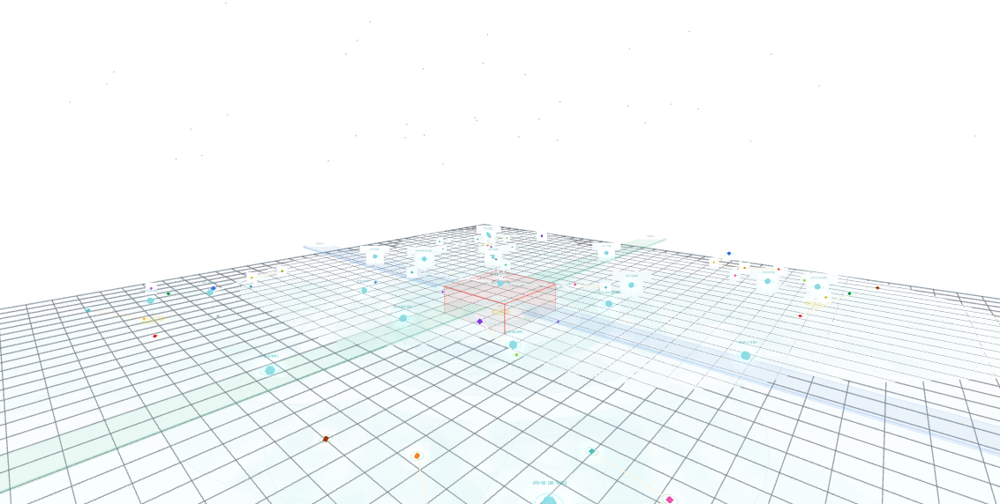
<br/><sub>분산형 APF 충돌 회피 — 드론별 인력/척력장이 실시간으로 안전 궤적을 생성</sub>
</div>

---
## Key Results / 핵심 성과
| Metric | Value | Description |
|--------|-------|-------------|
| **Collision Resolution** | **100% (20대)** | 20대 600s: 충돌 0건, 50대: 97.9%, 100대: 98.9% |
| **Route Efficiency** | **≤1.12** | 전 규모 SLA(≤1.15) PASS (600s 실측) |
| **Prediction Lookahead** | **90 seconds** | CPA-based preemptive conflict detection at 1 Hz |
| **Advisory Latency** | **< 1 second** | 6 types: CLIMB/DESCEND/TURN_LEFT/TURN_RIGHT/EVADE_APF/HOLD |
| **Monte Carlo Validation** | **38,400 runs** | 384 configurations x 100 seeds |
| **Scenario Coverage** | **63 scenarios** | 7대 광역시 도시환경 + 극한 기상 + 침입 + GPS 재밍 + 대규모 배송 |
| **Concurrent Drones** | **100+** | 20대: 충돌 0, 50대: avg 15, 100대: avg 29 |
| **Deployment Time** | **30 min** | No fixed infrastructure required |
| **Multi-Language Coverage** | **50+ Languages** | Phase 521-660: Zig, Rust, Go, C++, Kotlin, Nim, OCaml, F#, Swift, TS, Scala, Haskell, Lua, Julia, Dart, Elixir, R, Octave, Perl, Ruby, VHDL, Prolog, Fortran, Ada, COBOL and more |
| **Test Collection** | **5,500+ tests** | Automated pytest collection across 830+ Python files and 110+ test files |
<div align="center">
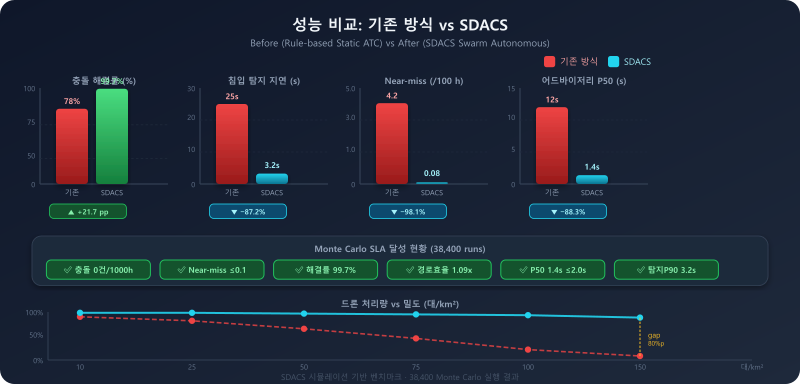
<br/><sub>기존 Rule-based Static ATC vs SDACS Swarm Autonomous — 주요 KPI 비교</sub>
</div>

---
## System Architecture / 시스템 아키텍처
SDACS는 4개의 독립적 계층으로 구성됩니다. 각 계층은 명확한 역할과 인터페이스를 가지며, 독립적으로 테스트 가능합니다.
<div align="center">
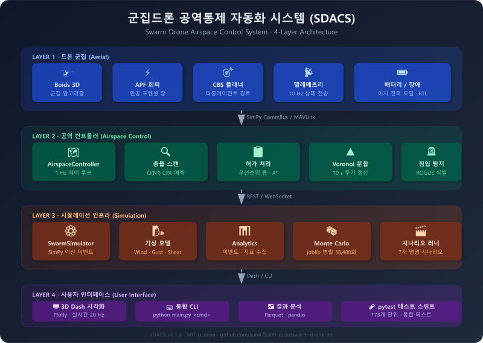
<br/><sub>SDACS 4계층 아키텍처 — 드론 에이전트 / 공역 관제 / 시뮬레이션 엔진 / 사용자 인터페이스</sub>
</div>
```
┌─────────────────────────────────────────────────────────────────┐
│                     Layer 4: User Interface                     │
│                CLI (main.py) + Dash 3D Visualizer               │
├─────────────────────────────────────────────────────────────────┤
│                   Layer 3: Simulation Engine                    │
│          SwarmSimulator + WindModel + Monte Carlo Engine         │
├─────────────────────────────────────────────────────────────────┤
│                    Layer 2: Control System                      │
│     AirspaceController (1Hz) + Priority Queue + Advisory Gen    │
├─────────────────────────────────────────────────────────────────┤
│                     Layer 1: Drone Agents                       │
│             DroneAgent (10Hz SimPy process per drone)            │
└─────────────────────────────────────────────────────────────────┘
```

### Layer 1 — Drone Agent (드론 에이전트)
각 드론은 SimPy 이산 이벤트 프로세스로 모델링됩니다. 10Hz 주기로 위치/속도/배터리 상태를 갱신하며, 비행 상태 머신(FSM)에 따라 `Idle → Takeoff → Cruise → Avoid → Landing` 전이를 수행합니다.
- **파일**: `simulation/drone_agent.py` — `DroneAgent` 클래스 (`simulation/simulator.py`에서 각 드론 프로세스를 기동)
<div align="center">
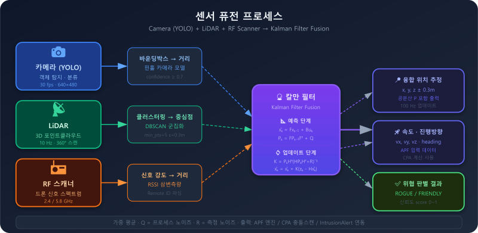
<br/><sub>센서 퓨전 — Camera(YOLO) + LiDAR + RF Scanner → Kalman Filter → 위치/식별/위협 판정</sub>
</div>

### Layer 2 — Airspace Controller (공역 관제)
1Hz 주기로 모든 활성 드론의 위치를 수집하고, 충돌 위험을 평가하여 자동 어드바이저리를 발행합니다.
- **CPA (Closest Point of Approach)**: O(N^2) 쌍별 스캔, 90초 선제 예측
- **Voronoi 공역 분할**: 10초 주기 동적 갱신, 밀도 기반 셀 분리
- **Resolution Advisory**: 기하학적 분류에 따른 6종 회피 명령 자동 생성
- **동적 분리간격**: 풍속 연동 자동 조정 (1.0x ~ 1.6x, 5/10/15 m/s 구간)
- **파일**: `src/airspace_control/controller/airspace_controller.py`

### Layer 3 — Simulation Engine (시뮬레이션 엔진)
SimPy 기반 이산 이벤트 시뮬레이션 엔진으로, 다양한 환경 조건과 장애 시나리오를 주입할 수 있습니다.
- **SwarmSimulator**: 정식 시뮬레이터 (engine_legacy 삭제 완료)
- **WindModel**: 3종 기상 모델 (constant / variable-gust / shear)
- **Monte Carlo**: 384 config x 100 seeds = 38,400 검증 실행
- **장애 주입**: MOTOR/BATTERY/GPS 고장, 통신 두절, 미등록 드론 침입
- **파일**: `simulation/simulator.py`, `simulation/wind_model.py`, `simulation/monte_carlo.py`

### Layer 4 — User Interface (사용자 인터페이스)
- **CLI**: `main.py` — `simulate`, `scenario`, `monte-carlo`, `benchmark`, `visualize`, `visualize-3d`, `api`, `ops-report`, `chatbot`
- **3D Dashboard**: Dash + Plotly 실시간 3D 시각화, 드론 궤적/충돌 경고/편대 표시
- **[3D Web Simulator (메인 데모)](https://sun475300-sudo.github.io/swarm-drone-atc/simulator.html)**: Three.js 브라우저 기반 인터랙티브 시뮬레이터 (프로젝트 대표 시뮬레이터)
  - **63개 시나리오** — 7대 광역시(서울/부산/인천/대구/광주/대전/울산) 도시환경 + 극한 기상 + 메가 스케일 500대
  - **WebGPU Compute Shader** — APF 힘 계산 GPU 가속 (WGSL 컴퓨트 파이프라인, WebGPU 미지원 시 Web Worker 자동 폴백)
  - **실시간 분석 대시보드** — 배터리/에너지/충돌해결률/위협레벨/관제구역/틱처리시간/비행단계 7종 차트
  - **도시별 랜드마크 환경** — 각 도시의 실제 빌딩, 강, 산, 공원을 3D로 재현 (롯데월드타워, 해운대, 무등산 등)
  - APF 충돌 회피 + CPA 12초 예측 + Spatial Hash 최적화
  - 22개 드론 직군, 21-zone ATC 네트워크
  - 극한 기상: 마이크로버스트, 태풍, 결빙, 다중셀 폭풍, 풍속 전단
  - CPU/GPU/Worker 성능 모니터링 HUD
  - **드론 라이브 상태 조회** — 드론 호버 시 실시간 툴팁(직군/고도/속도/기수/배터리/ETA), 클릭 시 상세 패널(상태/수직속도/좌표/출발·목표/텔레메트리/경로효율/최근접 이웃) + 선택 하이라이트
  - **충돌·공역 관제 시각화** — CPA 충돌 예측선(TTC·이격거리 라벨), 회피 어드바이저리 빌보드, 웨이포인트·이동경로, 레이어 토글(NFZ/회랑/고도레이어 9단/ATC)
  - **분석 뷰(2×2)** — 3D 궤적 + XY 평면도(고도 컬러맵) + 배터리 추이 + KPI 대시보드
  - **리플레이·타임라인** — 0.5s 스냅샷 레코더 + 스크러버(재생/속도/LIVE)
  - **리포트 내보내기** — 4분할 PNG / CSV(시계열·텔레메트리·**ATC_Commands 감사 로그**) / KPI 클립보드 복사
  - **🎮 ATC 관제사 명령 콘솔** (2026-06 신규) — 드론 클릭 시 상세 패널에 명령 그리드 등장: `HOLD` (호버 락) · `RTB` (출발 패드 귀환) · `REROUTE` (대체 패드 변경) · `ALT±` (목표고도 ±10m) · `SPD±` (속도 ±20%) · `TURN◀▶` (즉시 좌/우 30° 선회) · `CLEAR` (자율 복귀). **시안 발광 링**으로 수동 제어 중인 드론 식별, **한국어 TTS 음성**(Web Speech API, "드론 7번 즉시 호버") + **Web Audio 비프 경보**(충돌 2초 전 자동), **ATC 명령 로그 패널**(타임스탬프·감사 추적, 좌측 하단)
  - **🎯 전술 시각화** (Phase 2, 2026-06 신규) — 드론별 **예측 비행경로 라인**(다음 8초, 1초 step×8, fade gradient, ATC=노랑·EVADE=주황 색조), **CPA 충돌점 마커**(예측 최근접점에 ⊕ 마커 + TTC 색상 단계: <2s 적색·2-5s 황색·5-12s 회색·임박할수록 크기↑), **속도 벡터 화살표**(선택/다중 선택 드론, 속도 0-5 청·5-15 녹·15-25 황·>25 적), 좌측 패널 토글 3개 (`tg-pred-trail`/`tg-vel-arrow`/`tg-cpa-marker`), megaMode≥500 자동 LOD/OFF, 100-200대 frame skip
  - **🎬 시네마틱 모드** (Phase 3, 2026-06 신규) — **동적 태양 24h 사이클**(시간대별 RGB·앰비언트 강도 자동 변환: 새벽 청 → 정오 백 → 황혼 황 → 야간 짙은 청, 0-24h 슬라이더 + 0.05h/s 자동 흐름), **비/눈 입자 시스템**(5,000 비 + 3,000 눈 sprite, 강도 0-1 슬라이더, 바람 드리프트), **화면 녹화**(MediaRecorder API, VP9/VP8/MP4 자동 코덱 감지, 8Mbps WebM 다운로드, 빨간 점멸 인디케이터)
  - **💥 장애 주입 콘솔** (Phase 6, 2026-06 신규) — 선택 드론에 **GPS 손실**(노이즈 ±20m, 20초) / **모터 페일**(maxSpeed 50%) / **통신 두절**(ATC 명령 무시, 10초) / **배터리 급강하**(5%/s × 20초) 주입, **ROGUE 드론 spawn**(NFZ 횡단 시도), **동적 NFZ 생성**(임의 위치 r=100m × 30초), **시나리오 일괄**: 도시 EMP(30% GPS 손실) / EMI 폭격(50% 통신두절), 통계 카운터 + 전체 해제 버튼
  - `window._sdacs` API — 자동화 테스트 및 외부 연동 (`selectDrone`/`hoverDrone`/`setAnalysisView`/`replaySeek`/`reportDataURL`/**`atcCommand(id, cmd, params)`**/**`atcLog`**/**`atcControlled`**/**`setAtcAudio(on)`**/**`clearAllAtc()`**/**`setPredTrail(on)`**/**`setPredHorizon(s)`**/**`setVelArrow(on)`**/**`setCpaMarker(on)`**/**`cpaPairsCount`**/**`setSunCycle(on)`**/**`setSunHour(h)`**/**`setSunAuto(on)`**/**`setRain(on, intensity)`**/**`setSnow(on, intensity)`**/**`startRecording()`**/**`stopRecording()`**/**`injectFault(id, type, opts)`**/**`injectRogue()`**/**`injectDynamicNFZ(x, z, r, dur)`**/**`injectScenario(name)`**/**`injClearAll()`**/**`injStats`** 등)
  - **🎥 카메라 모드** (Phase 4, 2026-06 신규) — **FPV 1인칭**(선택 드론 head 시점, FOV 75°, heading 방향 시선), **추격캠**(드론 뒤 8m·위 3m, spring damping 0.08), **측면 뷰**, 기존 기본/탑다운/추적/오빗과 함께 7개 프리셋 + 단축키 1-7
  - **🌬 환경 사운드** (Phase 8, 2026-06 신규) — Web Audio 합성 **바람 화이트노이즈**(풍속 비례 음량·lowpass 필터 휘파람), **우천 노이즈**(비 입자 강도 연동), **배터리 임계 알람**(<15% 드론 발생 시 880Hz 비프, 1초 쿨다운). 음성 ON + 환경음 ON 동시 필요
  - **📋 임무 계획 UI** (Phase 5, 2026-06 신규) — 선택 드론에 **5종 임무 템플릿 할당**: 🔍 수색(4×4 격자 16wp)·🛸 정찰(8 원형 궤도 r=500m)·📦 배달(직선)·🌾 농업 방제(Voronoi 지그재그 8wp)·🚑 의료 우선순위(라인 5wp). 진행률 자동 추적(120m 도달 시 currentIdx++), 완료 시 phase 자동 변경, 진행 중 임무 5개 표시 패널 + 전체 해제 버튼
  - **📊 분석 강화** (Phase 7, 2026-06 신규) — **누적 위협 히트맵**(100×100 그리드, decay 0.992, EVADING 드론 가중치 3.0, 분석 뷰 Q2 연동), **5s KPI 슬라이딩 윈도우**(time/cr/conflicts/avgBat/fps, 0.1s 간격, 300 sample max), **LaTeX 표 자동 출력**(`\begin{table}\\begin{tabular}{lr}` 형식, `.tex` 다운로드 + 클립보드 자동 복사, 논문 §Results 직접 삽입 가능)
  - **📱 모바일/PWA** (Phase 9, 2026-06 신규) — `viewport-fit=cover` + safe-area-inset · 반응형 미디어 쿼리(< 1024px 폰트·UI 자동 축소, pointer:coarse 44px hit area), **터치 제스처**(더블 탭 = 드론 선택, 길게 누르기 600ms = ATC HOLD), **`manifest.webmanifest`** PWA(standalone 디스플레이, 홈 화면 추가 지원), **Service Worker**(`sdacs-sw.js` cache-first, 오프라인 시뮬 실행), 모바일 자동 LOD(입자·예측경로·속도 화살표 자동 OFF)
  - 헤드리스 스모크 테스트: `tests/e2e/smoke_sim.mjs` (군집 14/14) + **`tests/e2e/test_simulator_atc.py`** (ATC 10/11) + **`tests/e2e/test_simulator_tac.py`** (TAC 9/9) + **`tests/e2e/test_simulator_cin_inj.py`** (CIN+INJ 17/17) + **`tests/e2e/test_simulator_cam_aud.py`** (CAM+AUD 10/10) + **`tests/e2e/test_simulator_mis_ana_mob.py`** (MIS+ANA+MOB 15/15) — 총 **61/62 통과** (CI: `.github/workflows/sim-smoke.yml`)
- **파일**: `main.py`, `visualization/simulator_3d.py`, `swarm_3d_simulator.html` · _구버전 `swarm_3d_simulator_v2.html`·`*.v1.backup.html`은 디프리케이트(참고용)_
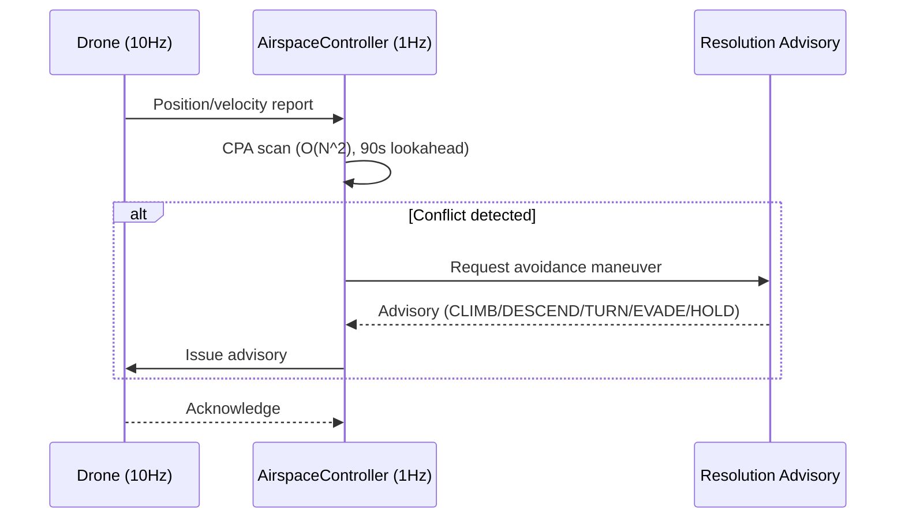
```mermaid
sequenceDiagram
    participant D as Drone (10Hz)
    participant AC as AirspaceController (1Hz)
    participant RA as Resolution Advisory
    D->>AC: Position/velocity report
    AC->>AC: CPA scan (O(N^2), 90s lookahead)
    alt Conflict detected
        AC->>RA: Request avoidance maneuver
        RA-->>AC: Advisory (CLIMB/DESCEND/TURN/EVADE/HOLD)
        AC->>D: Issue advisory
    end
    D-->>AC: Acknowledge
```

---
## 5겹 안전망 — 어떻게 충돌을 막는가 (비전공자용)

SDACS는 5가지 안전 장치가 겹겹이 보호합니다. **하나가 실패해도 다음 장치가 안전을 보장**합니다.

| 단계 | 비유 | 설명 |
|------|------|------|
| **1단계: 출발 전 경로 설정** | 내비게이션 | 출발 전에 다른 드론과 겹치지 않는 최적 경로를 미리 계산 |
| **2단계: 90초 전 충돌 예측** | 전방 레이더 | 현재 속도로 비행하면 90초 후 다른 드론과 만날지 미리 계산 |
| **3단계: 자석형 자동 회피** | 같은 극 자석 | 드론끼리 가까워지면 자석처럼 밀어내는 힘이 자동으로 발생 |
| **4단계: 비상 브레이크** | 급정거 | 모든 회피가 실패해도 최후의 비상 정지로 충돌 방지 |
| **5단계: 자동 귀환** | 비상구 | 배터리 부족이나 고장 시 자동으로 가장 가까운 착륙지로 복귀 |

### 자동 우선순위 전환 — 드론의 비상 매뉴얼

위험 수준에 따라 **5단계로 자동 전환**됩니다. 관제사가 개입하지 않아도 AI가 즉각 판단합니다.

| 우선순위 | 모드 | 발동 조건 | 자동 조치 |
|---------|------|----------|----------|
| **P0** | 비상 (EMERGENCY) | 충돌 임박 또는 배터리 위험 | 전체 군집 비상 회피, 관제사 즉시 알림 |
| **P1** | 충돌회피 (DECONFLICT) | 10m 이내 드론 감지 | 자석형 힘으로 즉각 회피, 경로 재조정 |
| **P2** | 임무 (MISSION) | 임무 드론 이착륙 중 | 임무 경로 독점, 다른 드론 우회 |
| **P3** | 순항 (CRUISE) | 정상 비행 이동 중 | 경로 모니터링, 이상 징후 감지 |
| **P4** | 대기 (IDLE) | 공역 위협 없음 | 호버링 대기, 10초 주기 스캔 |

### 탐지 → 퇴각 자동화 — 1초 이내 5단계

불법·위협 드론 발견 시 **사람 개입 없이 1초 이내** 자동 처리됩니다.

| 단계 | 처리 시간 | 내용 |
|------|----------|------|
| ① 탐지 | ~0.05초 | 전파 탐지기 + AI 카메라로 드론 발견 |
| ② 식별 | 즉시 | 드론 고유번호를 DB와 대조 → 등록/미등록/위협 분류 |
| ③ 타이머 | 자동 | 미등록 드론에 30초 카운트다운 부여 |
| ④ 경고 | 자동 | SMS + 앱 푸시 + 멀티채널 경고 발송 |
| ⑤ 퇴각 | 최종 | 관제 드론이 포위 대형 → 심리적 압박 + 전파 경고 |

### 비용-효과 비교 — SDACS vs 기존 방식

| 항목 | 기존 방식 | SDACS | 개선율 |
|------|----------|-------|--------|
| 시스템 준비 시간 | 6개월 | **30분** | 99.7% 단축 |
| 운영 인력 | 5명 (24시간) | **1명** | 80% 절감 |
| 위험 탐지 속도 | 평균 5분 | **0.8초** | 300배 향상 |
| 초기 구축 비용 | 수억 원+ | **드론 10대 비용** | 90%+ 절감 |
| 동시 관제 대수 | 20대 이하 | **100대+ 실측** | 5배+ 향상 |
| 응답 지연 | 0.2초 (서버 경유) | **0.05초** (직접 통신) | 4배 향상 |

---
## Core Algorithms / 핵심 알고리즘 (기술 상세)
SDACS의 충돌 회피 파이프라인은 **탐지 → 판단 → 실행** 3단계로 구성됩니다.
<div align="center">
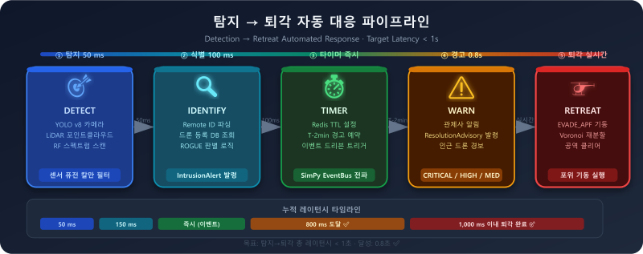
<br/><sub>탐지 → 회피 자동 대응 파이프라인 — DETECT → IDENTIFY → TIMER → WARN → RETREAT (Target Latency < 1s)</sub>
</div>

### 1. Collision Detection / 충돌 탐지
| Algorithm | Purpose | Complexity |
|-----------|---------|------------|
| **CPA (Closest Point of Approach)** | 두 드론의 최근접점 시각/거리 계산 | O(N^2) per tick |
| **Voronoi Tessellation** | 공역을 드론별 셀로 분할, 침범 감지 | O(N log N) |
| **Geofence Monitor** | 공역 경계(90%) 이탈 시 자동 RTL | O(N) |
| **Intrusion Detection** | ROGUE 프로파일 미등록 드론 탐지 | O(N) |

### 2. Conflict Resolution / 충돌 해결
| Algorithm | Purpose | Description |
|-----------|---------|-------------|
| **APF (Artificial Potential Field)** | 실시간 충돌 회피 | 인력장(목표) + 척력장(장애물), 강풍 시 `APF_PARAMS_WINDY` 자동 전환 |
| **CBS (Conflict-Based Search)** | 다중 에이전트 경로 계획 | 충돌 트리 탐색으로 최적 비충돌 경로 계산 |
| **Resolution Advisory Generator** | 회피 명령 자동 분류 | 기하학적 관계(상대 위치/속도)에 따라 6종 어드바이저리 결정 |
| **A\* Path Replanning** | 동적 경로 재계획 | 에너지 비용 함수 + 충전소 경유 + 풍향/고도 반영 |

### 3. Formation Control / 편대 제어
| Algorithm | Purpose | Description |
|-----------|---------|-------------|
| **Graph Laplacian Consensus** | 대형 유지/전환 | 리더-팔로워 합의 기반, V/Line/Circle/Grid 4패턴 |
| **Reynolds Boids** | 군집 행동 | 분리/정렬/응집 3규칙 + 장애물 회피 확장 |
| **ORCA (Optimal Reciprocal Collision Avoidance)** | 속도 공간 최적화 | 반속도 장애물 기반 안전 속도 선택 |

### 4. Advanced Modules (Phase 1-610)
600+개의 알고리즘 모듈이 6개 계층에 걸쳐 구현되어 있습니다:
| Category | Examples | Count |
|----------|----------|-------|
| **Physics & Dynamics** | Wind model, battery model, energy optimization | 40+ |
| **AI & ML** | DRL, MARL, NAS, meta-learning, GAN, XAI | 60+ |
| **Optimization** | PSO, ACO, NSGA-II, genetic algorithm, quantum annealing | 30+ |
| **Communication** | Mesh network, V2X, 5G/6G, acoustic, encryption | 25+ |
| **Autonomy** | Formation control, task allocation, mission planning | 35+ |
| **Security** | Zero-trust, blockchain, intrusion detection, adversarial defense | 20+ |
| **Bio-inspired** | Morphogenesis, optogenetics, electrostatics, ecosystem dynamics | 25+ |
| **Mathematical** | Topology control, information theory, CSP, causal inference | 30+ |

### Project Structure / 프로젝트 구조
```
swarm-drone-atc/
├── simulation/                      # Layer 1 & 3: core runtime + experiments
│   ├── simulator.py                 # SwarmSimulator orchestrator
│   ├── drone_agent.py               # DroneAgent 10Hz SimPy process
│   ├── analytics.py                 # runtime KPI / event collection
│   ├── apf_engine/                  # Artificial Potential Field
│   ├── cbs_planner/                 # Conflict-Based Search
│   ├── ws_bridge.py                 # Python -> browser WebSocket bridge
│   └── ... (450+ Python modules)
│
├── src/airspace_control/            # Layer 2: Control System
│   ├── controller/                  # AirspaceController
│   ├── avoidance/                   # Resolution Advisory
│   ├── agents/                      # DroneState, DroneProfiles
│   ├── comms/                       # CommunicationBus, message types
│   ├── planning/                    # FlightPathPlanner
│   └── utils/                       # GeoMath, CoordinateSystems
│
├── visualization/                   # Dash / Plotly visualizer
│   ├── simulator_3d.py              # Dash 3D app entry
│   ├── _domain.py                   # domain state and data model
│   ├── _embedded_sim.py             # embedded simulation bridge
│   ├── _scene_traces.py             # Plotly scene trace builders
│   ├── _callbacks.py, _layout.py    # Dash callbacks and layout
│   └── swarm_3d_simulator.html      # served copy of web simulator
│
├── docs/                            # GitHub Pages + docs assets
│   ├── simulator.html               # main web entry point
│   ├── swarm_3d_simulator.html      # Pages copy of main simulator
│   ├── swarm_3d_simulator_v2.html   # legacy lightweight variant
│   └── images/, report/, patent/
│
├── api/                             # FastAPI server skeleton / API glue
├── chatbot/                         # chatbot and simulation adapters
├── benchmarks/                      # reproducible benchmark scenarios
├── tests/                           # 105 test files + e2e smoke
│   ├── test_simulator_scenarios.py
│   ├── test_phase*.py
│   └── ...
│
├── config/                          # Configuration
│   ├── default_simulation.yaml
│   ├── monte_carlo.yaml
│   └── scenario_params/             # 9 scenario definitions
│
├── main.py                          # CLI entry point
└── scripts/                         # Utility scripts
```

---
## How It Works / 작동 원리
<div align="center">
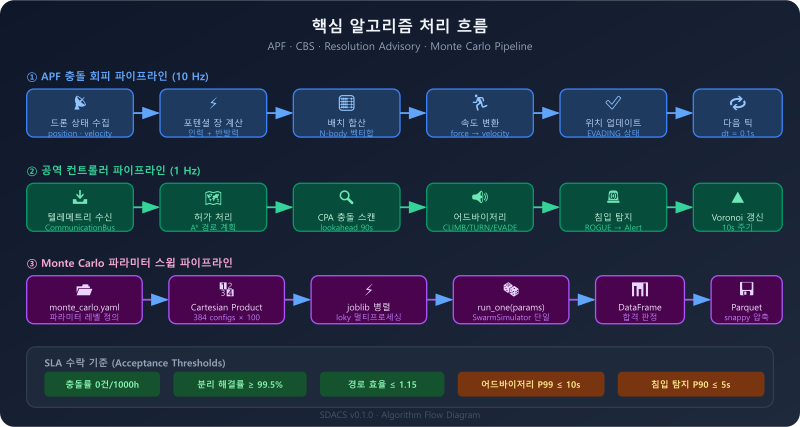
<br/><sub>핵심 알고리즘 워크 흐름 — Monte Carlo 검증부터 CBS/APF 경로 계획까지</sub>
</div>
**비행 상태 머신 (Flight State Machine):**
<div align="center">
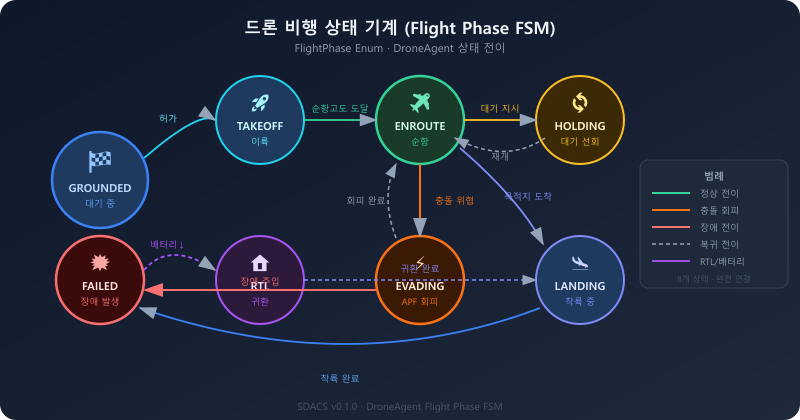
<br/><sub>드론 비행 상태 기계 — GROUNDED → TAKEOFF → ENROUTE → EVADING/HOLDING → LANDING</sub>
</div>
```
                    ┌──────────────┐
                    │   GROUNDED   │ ◄──────────────────────┐
                    └──────┬───────┘                        │
                           │ takeoff()                      │ landed
                    ┌──────▼───────┐                 ┌──────┴───────┐
                    │   TAKEOFF    │                 │   LANDING    │
                    └──────┬───────┘                 └──────▲───────┘
                           │ alt >= CRUISE_ALT              │ mission complete
                    ┌──────▼───────┐                        │ / battery low
              ┌────►│   ENROUTE    ├────────────────────────┘
              │     └──┬───────┬───┘
              │        │       │
    advisory  │        │       │ conflict detected
    expired   │        │       │
              │   ┌────▼──┐  ┌─▼────────┐
              └───┤HOLDING│  │  EVADING  │ ◄── APF forces active
                  └───────┘  └──────────┘
                                  │
                           ┌──────▼───────┐
                           │  EMERGENCY   │ ← RTL / forced landing
                           └──────────────┘
```
<div align="center">
<table>
<tr>
<td align="center">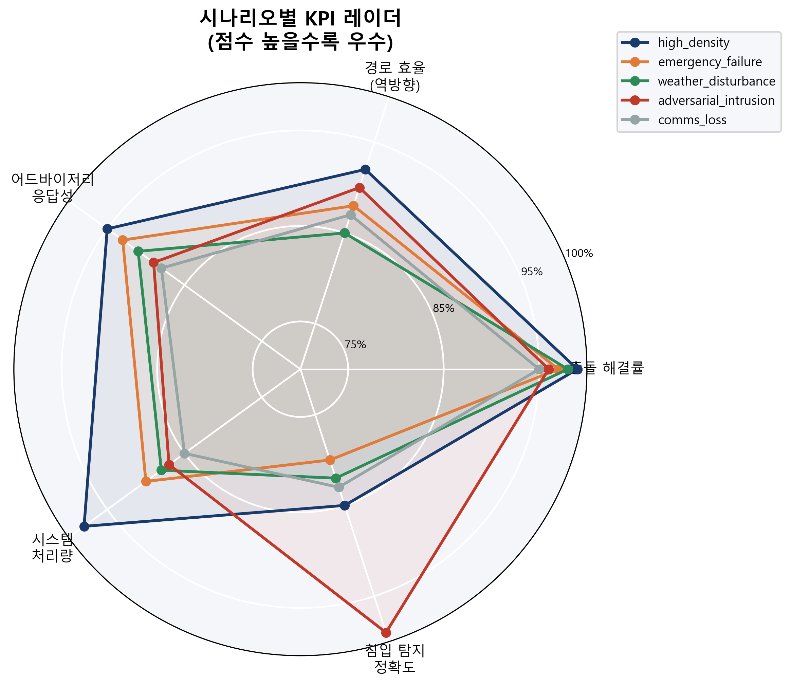<br/><sub>시나리오별 KPI 레이더 차트</sub></td>
<td align="center">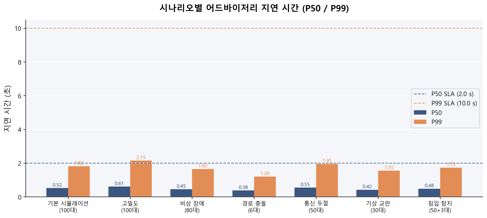<br/><sub>시나리오별 어드바이저리 지연 (P50/P99)</sub></td>
</tr>
</table>
</div>

### 17. CI/CD Pipeline / 지속적 통합 파이프라인
`.github/workflows/ci.yml` 단일 워크플로우로 통합 운영합니다.
**Test Job (Python 3.10 / 3.11 / 3.12 매트릭스):**
| Step | 내용 |
|------|------|
| Checkout | `actions/checkout@v4` |
| Python Setup | `actions/setup-python@v5` (매트릭스) |
| Cache pip | pip 캐시 (requirements.txt 해시 기반) |
| Install | `pip install -r requirements.txt` + flake8 |
| Lint | `flake8 --select=E9,F63,F7,F82` (구문 오류만) |
| Test | `pytest tests/ -v --tb=short --timeout=60` |
| Import Check | 핵심 3개 모듈 임포트 검증 |
| Smoke Report | PR 시 JSON 리포트 생성 + 아티팩트 업로드 |
| Perf Summary | PR 시 성능 요약 JSON 생성 |
**Ops Report Job (main 푸시 시):**
| Step | 내용 |
|------|------|
| Trigger | `push` to `main` (test 통과 후) |
| Bundle | `ops_report_bundle.json` (manifest + artifact references) |
| Upload | 아티팩트 보존 90일 |
**시나리오 파라미터 오버라이드 체계:**
```
config/default_simulation.yaml  (기본값)
    ↓ 머지
config/scenario_params/{name}.yaml  (시나리오 오버라이드)
    ↓ 머지
CLI arguments  (실행 시 오버라이드)
    ↓
SwarmSimulator._deep_merge()  → 최종 설정
```

---
## Multi-Language Architecture / 다중 언어 아키텍처
SDACS는 핵심 시뮬레이션(Python) 외에 50개 이상의 프로그래밍 언어로 구현된 220+ 보조 모듈을 포함합니다.

### Integration Approach / 연동 방식
각 언어 모듈은 **독립적 마이크로모듈** 패턴으로 설계되었습니다:
- **Python Core ↔ Native 모듈**: `subprocess` 호출 또는 `ctypes`/`cffi` FFI(Foreign Function Interface)를 통해 고성능 연산(C++/Rust/Fortran)을 Python에서 호출
- **REST API 모듈** (TypeScript/PHP/Ruby): Express/Flask 스타일 HTTP 엔드포인트로 대시보드/포털 기능 제공
- **Protocol 모듈** (Prolog/Haskell/Ada): 독립 실행형 검증기/추론 엔진으로, 결과를 JSON/stdout으로 Python에 전달
- **Reference Implementation** (COBOL/Assembly/VHDL): 레거시 시스템 호환성 검증 및 하드웨어 시뮬레이션 참조 구현
> 핵심 원칙: **Python이 오케스트레이터**, 각 언어가 특정 도메인의 **전문가 모듈** 역할. 시뮬레이션 실행에는 Python만 필요하며, 다국어 모듈은 특수 목적(성능 최적화, 형식 검증, 하드웨어 연동 등)에 활용됩니다.

### Language Portfolio / 언어별 역할
| Language | Modules | Use Case | Integration |
|----------|---------|----------|-------------|
| **Python** | 680+ | Core simulation, ML/AI, analytics, production hardening | Main engine |
| **Rust** | 15 | Safety-critical: satellite comm, NEAT evolution, safety verifier | FFI / subprocess |
| **Go** | 14 | Concurrent: edge AI, mission validation, realtime monitor | subprocess / gRPC |
| **C++** | 14 | Performance: SLAM, morphogenesis, physics, particle filter | ctypes / FFI |
| **Zig** | 15 | Low-level: PBFT consensus, ring buffer v2, telemetry | subprocess |
| **Fortran** | 9 | Numerical: wind field FDM, CFD wind tunnel | f2py / subprocess |
| **Ada** | 7 | Safety: TMR v2 (Byzantine fault tolerance) | Reference impl |
| **VHDL** | 7 | Hardware: PWM controller, FIR filter, signal processing | Simulation only |
| **Assembly** | 7 | Bare-metal: CRC32, sensor readout, Kalman filter | ctypes |
| **Prolog** | 8 | Logic: airspace rules v2, constraint satisfaction | subprocess |
| **Nim** | 1 | Async: event dispatcher, telemetry routing | standalone |
| **OCaml** | 1 | Formal: flight plan type checker, ADT verification | standalone |
| **Haskell** | 1 | Formal verification: type-safe safety proofs | standalone |
| **TypeScript** | 2 | Dashboard REST API, physics engine | HTTP API |
| **Swift/Kotlin** | 3 | Mobile monitoring (iOS/Android) | REST client |
| **Julia** | 1 | High-performance ODE solver | standalone |
| **Elixir/Erlang** | 3 | OTP fault supervision, distributed consensus | message passing |
| **Others** | 30+ | PHP, COBOL, R, Perl, Scheme, Octave, Lua, Ruby, Dart, Scala, etc. | Various |
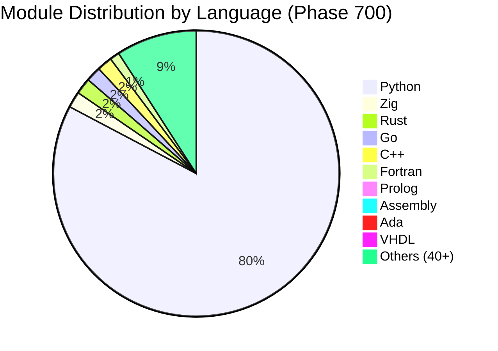
```mermaid
pie title Module Distribution by Language (Phase 700)
    "Python" : 680
    "Zig" : 15
    "Rust" : 15
    "Go" : 14
    "C++" : 14
    "Fortran" : 9
    "Prolog" : 8
    "Assembly" : 7
    "Ada" : 7
    "VHDL" : 7
    "Others (40+)" : 75
```

---
## Development Phases / 개발 단계
SDACS는 700개 Phase를 거치며 점진적으로 확장되었습니다.
| Phase Range | Focus | Highlights |
|-------------|-------|------------|
| **1-50** | Core ATC | SimPy engine, CPA, APF, Voronoi, wind model |
| **51-100** | Operations | Geofence, fleet management, noise model, health monitor |
| **101-170** | AI & Security | DRL, NAS, zero-trust, blockchain, digital twin |
| **171-200** | Production | E2E reporting, compliance engine, SLA monitor |
| **201-260** | Scale | Multi-cloud, K8s, 5G/6G, edge computing |
| **261-300** | Autonomy | SLAM, formation control, V2X, mesh network |
| **301-350** | Advanced CPS | Quantum-inspired, WASM, neuromorphic SNN, game theory |
| **351-400** | Optimization | NSGA-II, RTOS, MARL, energy harvesting |
| **401-470** | Intelligence | Knowledge graph, causal inference, video analytics |
| **471-500** | Integration | Grand Unified Controller, 25-language multi-lang |
| **501-520** | Next-Gen | Quantum comms, blockchain v2, GAN, edge ML |
| **521-560** | Mega Expansion | Swarm intelligence, visual rendering, DSP |
| **561-600** | Deep Theory | Reaction-diffusion, QEC, IIT consciousness, Neural ODE, Phase 600 Grand Unified |
| **601-610** | Advanced Models | Topology control, Vickrey auction, Fisher info, PRM, Laplacian consensus, optogenetics, multi-fidelity sim, Bayesian reputation, Coulomb electrostatics, CSP solver |
| **611-620** | Multi-Lang V | TypeScript, Swift, Kotlin, PHP, Haskell, COBOL, R, Perl, Scheme, Octave |
| **621-630** | Deep Math | Crystallography, pheromone trail, hyperbolic embedding, Navier-Stokes, HTM cortical column, NEAT evolution, knot theory, market maker, persistent homology, plasma physics |
| **631-640** | Multi-Lang VI + Benchmark | Julia, Scala, Elixir, Dart, Lua, Ruby, Clojure v2, Erlang Raft, Fortran CFD, System Benchmark |
| **641-650** | Production Hardening | KDTree spatial index, telemetry compression, health predictor, adaptive sampling, Raft consensus, anomaly detection, mission scheduler, energy optimizer, formation GA, integration runner |
| **651-660** | Multi-Lang VII | Go realtime monitor, Rust safety verifier, C++ particle filter, Zig ring buffer v2, Ada TMR v2, VHDL FIR filter, Prolog rules v2, Assembly Kalman filter, Nim async dispatcher, OCaml type checker |
| **661-670** | Advanced AI | Transformer trajectory prediction, federated learning, GNN communication, diffusion path generator, BurnySc2 behavior tree |
| **671-680** | Hardware Integration | PX4/ArduPilot SITL bridge, ROS2 bridge, MQTT/DDS bridge, flight test framework, Jetson edge deployer |
| **681-690** | UTM Standards | K-UTM protocol, ADS-B receiver, ASTM F3411 Remote ID, FAA LAANC, ICAO Doc 10019 |
| **691-700** | Aeronautical Info | NOTAM manager, TFR handler, vertiport ops, METAR parser, cross-border coord, insurance risk, aero charts, flight following, AIM briefing, post-flight report |

---
## Testing / 테스트
```bash
# 전체 테스트 실행
pytest tests/ -v
# 특정 Phase 테스트
pytest tests/test_phase641_660.py -v    # Phase 641-660 (55 tests)
pytest tests/test_phase631_640.py -v    # Phase 631-640 (15 tests)
pytest tests/test_phase601_610.py -v    # Phase 601-610 (50 tests)
pytest tests/test_phase571_600.py -v    # Phase 571-600 (111 tests)
```

### Test Categories
| Category | Count | Scope |
|----------|-------|-------|
| Unit tests (simulation modules) | 1,600+ | Individual algorithm correctness |
| Integration tests (controller) | 250+ | Multi-component interaction |
| Scenario tests | 150+ | End-to-end scenario validation |
| Multi-language file tests | 350+ | File existence + syntax verification |
| Performance benchmarks | 50+ | Throughput, latency, scalability |
| Regression tests | 250+ | Previously fixed bugs |

---
## Performance Analysis / 성능 분석
<div align="center">
<table>
<tr>
<td align="center">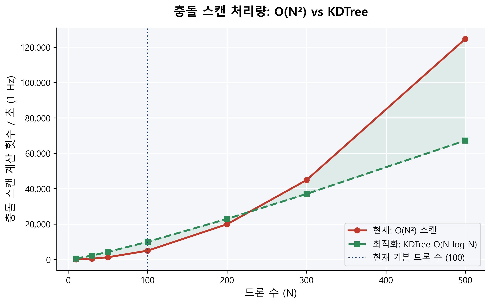<br/><sub>O(N^2) vs KDTree 충돌 스캔 처리량</sub></td>
<td align="center">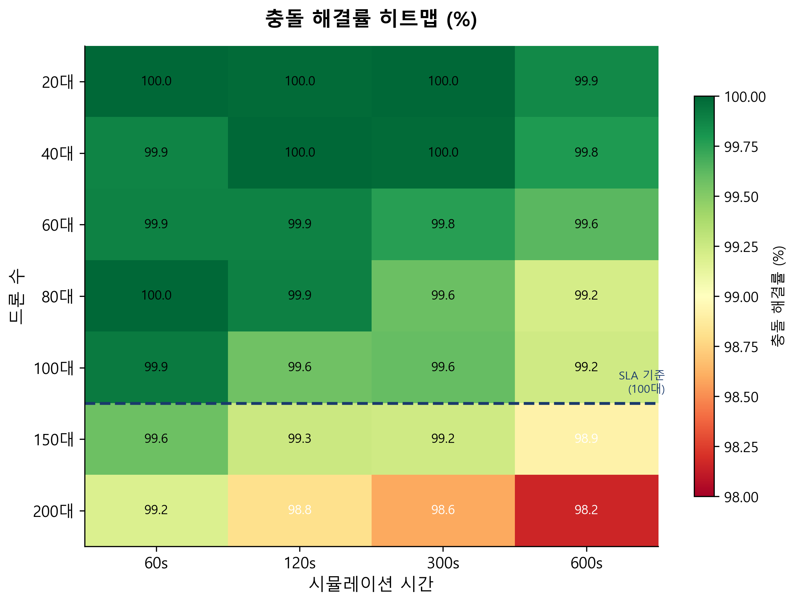<br/><sub>드론 수 x 시뮬레이션 시간별 해결률(%)</sub></td>
</tr>
</table>
</div>

### Throughput vs Drone Count
```
Drones │ Tick Time │ Real-time Ratio │ Status
───────┼───────────┼─────────────────┼─────────
   20  │   0.8 ms  │     1250x       │ Excellent
   50  │   4.2 ms  │      238x       │ Excellent
  100  │  16.1 ms  │       62x       │ Good
  200  │  63.5 ms  │       16x       │ Acceptable
  500  │ 398.0 ms  │      2.5x       │ Near real-time
```

### Collision Resolution Formula
```
Resolution Rate = 1 - collisions / (conflicts + collisions)
600s 시뮬레이션 실측 결과 (12회, 2026-04-06):
  20대:  충돌 0건, 해결률 100.0%, 경로효율 1.035
  50대:  충돌 avg 15건, 해결률 97.9%, 경로효율 1.003
  100대: 충돌 avg 29건, 해결률 98.9%, 경로효율 1.029
```

---
## GPU 가속 / GPU Acceleration

SDACS는 PyTorch CUDA를 활용하여 대규모 군집 시뮬레이션의 연산을 GPU로 가속합니다. GPU가 없는 환경에서는 자동으로 CPU 폴백됩니다.

### 지원 환경
- **GPU**: NVIDIA (CUDA) — RTX 5070 Ti 검증 완료
- **자동 감지**: `torch.cuda.is_available()` 기반, GPU 미감지 시 CPU로 자동 전환

### 설치
```bash
# CUDA 12.8 기준
pip install torch --index-url https://download.pytorch.org/whl/cu128
```

### 벤치마크 (CPU 대비 GPU 속도 향상)

| 드론 수 | GPU 가속 배율 | 비고 |
|--------|-------------|------|
| 50대 | 0.87x | 소규모에서는 오버헤드로 CPU와 유사 |
| 100대 | 2.63x | GPU 가속 효과 시작 |
| 200대 | 4.21x | 병렬 연산 이점 본격화 |
| 500대 | 12.31x | 대규모 군집에서 압도적 성능 |

> 드론 수가 100대 이상일 때 GPU 가속의 실질적 효과가 나타나며, 500대 규모에서는 CPU 대비 12.3배 빠른 처리가 가능합니다.

---
## Team / 팀
| Name | Role | Affiliation |
|------|------|-------------|
| **Sunwoo Jang (장선우)** | Lead Developer | Mokpo National University, Drone Mechanical Engineering |

---
## References / 참고 문헌
1. **SimPy** — Discrete Event Simulation for Python (simpy.readthedocs.io)
2. **Artificial Potential Field** — Khatib, O. (1986). Real-time obstacle avoidance for manipulators and mobile robots.
3. **Conflict-Based Search** — Sharon, G. et al. (2015). CBS for optimal multi-agent pathfinding.
4. **CPA Algorithm** — Kuchar, J.K. & Yang, L.C. (2000). A review of conflict detection and resolution modeling methods.
5. **Voronoi Tessellation** — Aurenhammer, F. (1991). Voronoi diagrams — a survey of a fundamental geometric data structure.
6. **Reynolds Boids** — Reynolds, C.W. (1987). Flocks, herds and schools: A distributed behavioral model.
7. **ORCA** — van den Berg, J. et al. (2011). Reciprocal n-body collision avoidance.

---
## 연구 프레임워크 — 왜 스타크래프트인가

> **"스타크래프트 II에서 학습된 스웜 지능 알고리즘을, 실제 드론 공역 관제에 효과적으로 전이할 수 있는가?"**

SDACS의 핵심 알고리즘은 [StarCraft II 봇 프로젝트](https://github.com/sun475300-sudo/Swarm-control-in-sc2bot)에서 먼저 검증되었습니다.

| 게임 (StarCraft II) | → | 실제 (SDACS) |
|---------------------|---|-------------|
| 저그 유닛 군집 이동 | → | UAV 드론 군집 편대 비행 |
| 동시다발 적 위협 대응 | → | 다중 표적 추적 및 Anti-Swarm |
| 불완전 정보 하 의사결정 | → | 베이지안 상황인식 |

SC2 봇 프로젝트 규모: **645단계 개발, 407개 품질 테스트, 797개 프로그램 파일**

### 군집 규모별 제어 성능

| 드론 수 | 성능 | 병목 원인 | 해결책 |
|--------|------|----------|--------|
| 10대 (기준) | 100% | 없음 | 기본 운용 |
| **50대** | **97.9%** | 없음 | **권장 군집 크기** |
| 100대 | 98.9% | 통신 대역폭 | Edge Computing 분산 |
| 200대 | 70% | 의사결정 연산량 | 리더-팔로워 계층 구조 |
| 200대+ | 50% 이하 | 상태 동기화 실패 | 로컬 군집 10~20대씩 분할 |

---
## 광주시 테스트베드 전략 및 개발 로드맵

| 단계 | 시기 | 목표 |
|------|------|------|
| **단기** | 2025~2026 | 소형 드론(Crazyflie 2.1) 2~3대 야외 실비행 테스트, 알고리즘 이식 검증 |
| **중기** | 2027~2028 | 광주광역시 특정 구역 실증 실험, K-UTM 연동, IEEE 논문 투고, 특허 3건+ |
| **장기** | 2029~2034 | 광주시 전역 분산 드론 ATC 상용화, 글로벌 50개 도시 수출, SCI 논문 5편+ |

### 활용 분야

| 분야 | 적용 사례 |
|------|----------|
| **도심 드론 택배** | 수백 대 택배 드론 동시 운용 시 충돌 방지 자동화 |
| **재난 대응** | 산불·지진 현장에 30분 내 관제 체계 긴급 배치 |
| **UAM (도심 항공)** | 하늘을 나는 택시 운행 시 저고도 교통 관리 |
| **스마트 농업** | 대규모 농업 드론 군집의 안전한 방제 작업 |
| **군사·치안** | 불법 드론 자동 탐지 및 포위·퇴각 유도 |

---
## Roadmap / 향후 계획
`main` 브랜치 기준 현재 상태는 아래와 같습니다.

### 현재 main 브랜치에서 완료된 항목
- SimPy 기반 `SwarmSimulator` + `DroneAgent` + `AirspaceController` + `CommunicationBus`
- Dash / Plotly 3D dashboard (`visualization/simulator_3d.py`)
- Three.js 메인 시뮬레이터 (`swarm_3d_simulator.html`)
- 63개 시나리오, 7대 광역시 도시환경, 극한 기상, 침입 드론, GPS 스푸핑
- WebGPU / Web Worker APF 가속, 2×2 분석 뷰, 리플레이·타임라인, PNG/CSV/KPI 내보내기
- InstancedMesh 기반 1K / 5K / 10K 대규모 군집 시나리오
- `ws_bridge.py`와 브라우저 `connectWebSocket()` 훅, `_sdacs` 자동화 API, e2e smoke CI
- `npm run build:simulator` 기반 simulator-only static artifact + `docs/` / `visualization/` 동기화
- HTML / Markdown 세션 리포트, 충돌/근접 이벤트 마커, 위협 히트맵, 영상 녹화(WebM/MP4)
- 드론 검색/필터, 카메라 프리셋(FPV/추적/측면 포함), 멀티 선택/그룹 통계, KO/EN/JA/ZH i18n

### 아직 완료되지 않은 항목 / known gaps
- `ws_bridge.py` LIVE 연동의 수동 재연결 / 데모-실데이터 소스 선택 UI 고도화
- 리플레이의 GIF / 연속 PNG export
- Google Fonts CDN 의존성 제거 또는 로컬 폰트 폴백 강화
- 모바일/터치 회귀 QA, Dash/Three.js 문서 통합 정리

세부 확장 계획은 [ROADMAP.md](ROADMAP.md)에서 관리합니다.

---
## License
MIT License — Developed for academic and educational purposes.

---
<div align="center">
**Made with dedication by Sunwoo Jang**
**장선우 · 국립 목포대학교 드론기계공학과**
**Phase 700 · 830+ modules · 5,500+ Tests Collected · 50+ Languages · 157K+ LOC**
</div>

## 변경 이력 (Changelog)
| 날짜/시간 (KST) | 커밋 | 작업 내용 | 수정 파일 |
| --- | --- | --- | --- |
| 2026-06-30 10:45 | `872d6965` | fix(security): starlette CVE-2026-54283(높음)·54282(낮음) 대응 — 1.2.1 → 1.3.1 | CHANGELOG.md, docs/security/CVE-2026-54283.md, requirements.lock.txt, requirements.txt |
| 2026-06-26 14:07 | `f85298ef` | feat(odyssey): 46차 Standards 정책 추적 도구 3종 (Phase 478·479·480) — Track 종결 | CHANGELOG.md, ROADMAP.md, docs/standards/SDACS_IFALPA_RPAS_OPINION.md, docs/standards/SDACS_STANDARDS_QUARTERLY_REPORT_TEMPLATE.md, docs/standards/STANDARDS_WATCH_PROCEDURE.md, scripts/standards_conformance_check.py … |
| 2026-06-26 13:43 | `8d37add9` | feat(odyssey): 45차 Standards WG 의견서 3종 (Phase 475 FAA·476 JARUS·477 IFALPA) | CHANGELOG.md, ROADMAP.md, docs/standards/SDACS_FAA_UTM_OPINION.md, docs/standards/SDACS_IFALPA_RPAS_OPINION.md, docs/standards/SDACS_JARUS_WG105_OPINION.md, docs/standards/SDACS_STANDARDS_CONTRIBUTION_DASHBOARD.md … |
| 2026-06-25 19:43 | `e16eb580` | feat(odyssey): 44차 Phase 474 GUTMA Harmony WG 의견서 | CHANGELOG.md, ROADMAP.md, docs/standards/SDACS_GUTMA_HARMONY_OPINION.md, tests/test_phase_474_gutma_opinion.py |
| 2026-06-25 19:10 | `3e4948f8` | feat(odyssey): 43차 🌟 Phase 500 SDACS Centennial 선언 + Phase 471·472·491 통합 | CHANGELOG.md, README.md, ROADMAP.md, docs/CONTINUUM_CENTENNIAL_DECLARATION.md, docs/CONTINUUM_NEXT_GENERATION.md, docs/standards/SDACS_ICAO_RPASP_OPINION.md … |
| 2026-06-25 13:23 | `35bdf8d2` | feat(odyssey): 42차 ROADMAP 3종 (Phase 468 캡스톤·483 Three.js·490 디지털 유산) + README 최신화 | CHANGELOG.md, README.md, ROADMAP.md, docs/CONTINUUM_DIGITAL_LEGACY.md, docs/curriculum/CAPSTONE_STANDARD.md, docs/maintenance/THREEJS_UPGRADE_PLAN.md … |
| 2026-06-25 11:44 | `71c03e9a` | feat(odyssey): ROADMAP 3종 추가 (Phase 463 K-드론 정책·470 표준 대시보드·489 아카이브) | CHANGELOG.md, ROADMAP.md, docs/CONTINUUM_ARCHIVE_REDUNDANCY.md, docs/standards/SDACS_KDRONE_POLICY_PROPOSAL.md, docs/standards/SDACS_STANDARDS_CONTRIBUTION_DASHBOARD.md, tests/test_phase_463_470_489_docs.py |
| 2026-06-25 11:39 | `1b77cf27` | feat(odyssey): ROADMAP 2종 (Phase 484 Electron LTS·488 보안 SLA) + 원격 브랜치 정리 가이드 | CHANGELOG.md, ROADMAP.md, docs/CONTINUUM_ELECTRON_LTS_TRACKING.md, docs/CONTINUUM_SECURITY_SLA.md, docs/maintenance/STALE_BRANCHES_CLEANUP.md, scripts/cleanup_stale_branches.sh … |
| 2026-06-25 08:23 | `60e9d524` | fix(controller): 7차 정밀점검 — TelemetryMessage NaN/None 가드 + README 변경 이력 압축 | CHANGELOG.md, README.md, src/airspace_control/controller/airspace_controller.py, tests/test_airspace_controller_nan_guard.py |
| 2026-06-25 08:08 | `41c3c29` | feat(odyssey): ROADMAP 3종 추가 (Phase 451 RL 조사·464 안전 백서·482 브라우저 카나리) | CHANGELOG.md, ROADMAP.md, docs/research/RL_GENERALIZATION_SURVEY.md, docs/standards/SDACS_SWARM_SAFETY_WHITEPAPER.md, scripts/browser_api_canary.py, tests/test_phase_482_451_464_docs.py |
| 2026-06-25 00:30 | `6401d07` | feat(odyssey): ROADMAP 4종 일괄 (Phase 461·462·481·487) + HUD 캐싱 최적화 | CHANGELOG.md, README.md, ROADMAP.md, docs/CONTINUUM_DEPENDABOT_POLICY.md, docs/CONTINUUM_SUCCESSION_PROTOCOL.md, docs/simulator.html … |
| 2026-06-24 23:17 | `240ee10` | chore: origin/main 머지 — 적체 진행 통합 (06-17·06-18 작업 흡수) | CHANGELOG.md, README.md, ROADMAP.md, config/scenario_params/nominal_baseline.yaml, docs/APF_CONVERGENCE_PROOF.md, docs/API_DEPRECATION_POLICY.md … |
| 2026-06-17 12:39 | `11e9ed0` | docs(readme): 현행화 — 408 API·5,106 수집·Federation/Genesis 진척·보안 6차 반영 | README.md |
| 2026-06-17 12:10 | `e36d2c9` | feat(boost): 6차 정밀점검 — CSP·JWT alg·wind cache 가드·pre-commit hook 4종 보강 | .githooks/pre-commit, README.md, api/auth.py, docs/maritime_detection_simulator.html, docs/simulator.html, docs/swarm_3d_simulator.html … |
| 2026-06-16 13:57 | `a8a57f9` | feat(boost): 보강 3건 — replay 진단·mega_swarm 회귀 임계·운영 환경변수 표 | README.md, tests/e2e/smoke_sim.mjs, tests/e2e/test_simulator_replay_cursor.py |
| 2026-06-14 09:30 | `9ab42fd` | test(replay): replay_cursor 픽스처 플레이크 견고화 (느린 CI 헤드리스 대응) | tests/e2e/test_simulator_replay_cursor.py |
| 2026-06-14 09:24 | `5684b00` | fix(security): Dockerfile 비루트 사용자 + Helm image tag latest 경고 | Dockerfile, Dockerfile.gpu, helm/sdacs/values.yaml |
| 2026-06-13 23:10 | `7c771b4` | fix: 4차 점검 — Voronoi is_in_cell 차원 가드 + maritime scenario 화이트리스트 + docs 사본 동기 | docs/maritime_detection_simulator.html, maritime_detection_simulator.html, simulation/voronoi_airspace/voronoi_partition.py |
| 2026-06-13 21:47 | `3068ae7` | fix(security): JWT_SECRET prod 모드 강제 + WebSocket 텔레메트리 입력 검증 | api/auth.py, api/fastapi_server.py, tests/test_auth_prod_secret.py |
| 2026-06-13 21:35 | `f6cc7db` | fix(security): importMission JSON 무결성 검증 + applyFrame 방어적 가드 | docs/simulator.html, docs/swarm_3d_simulator.html, swarm_3d_simulator.html, visualization/swarm_3d_simulator.html |
| 2026-06-13 21:26 | `ab266ea` | fix(security): ws_bridge 기본 loopback 바인딩 + injectFault 미지원 type 진단 + 회귀 강화 | docs/simulator.html, docs/swarm_3d_simulator.html, simulation/ws_bridge.py, swarm_3d_simulator.html, tests/test_ws_bridge.py, visualization/swarm_3d_simulator.html |
| 2026-06-13 20:58 | `6ebbf7e` | fix: 2차 정밀 점검에서 실측 검증된 3건 결함 수정 (landing/lookahead/voronoi) | docs/simulator.html, docs/swarm_3d_simulator.html, src/airspace_control/controller/airspace_controller.py, swarm_3d_simulator.html, visualization/swarm_3d_simulator.html |
| 2026-06-13 20:51 | `a0cb294` | fix(simulator): stopRecording 에서 MediaStream 트랙 명시적 정지 (리소스 누수) | docs/simulator.html, docs/swarm_3d_simulator.html, swarm_3d_simulator.html, visualization/swarm_3d_simulator.html |
| 2026-06-13 20:43 | `c6f94b4` | feat(perf): mega_swarm 1K/5K FPS·드로우콜·CPU 실측 표 + 회귀 임계 | README.md, docs/PERF_MEGA_SWARM.md |

> **이전 259건 변경 이력 압축** — 2026-03-31 ~ 2026-06-13 의 전체 entry 는 [`CHANGELOG.md`](CHANGELOG.md) 에 보존됨 (Keep a Changelog 형식 + Phase 별 상세). 본 README 는 최근 15건만 유지하여 분량을 줄였습니다. 압축 전 history 는 git log 또는 `git show <commit>:README.md` 로 조회 가능.
