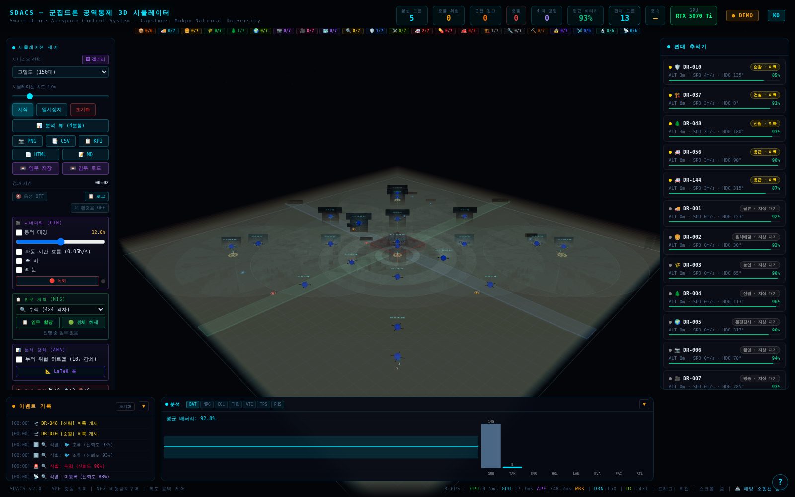
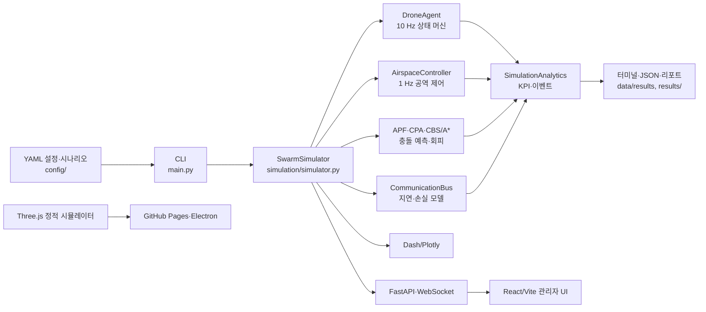

<div align="center">

# SDACS
## Swarm Drone Airspace Control System

군집드론 공역통제 자동화 시스템 · 국립목포대학교 드론기계공학과 캡스톤 디자인

[](https://www.python.org/)
[](VERSION.md)
[](https://github.com/sun475300-sudo/swarm-drone-atc/actions/workflows/ci.yml)
[](https://sun475300-sudo.github.io/swarm-drone-atc/)
[](LICENSE)

[**3D 시뮬레이터 실행**](https://sun475300-sudo.github.io/swarm-drone-atc/simulator.html) · [해양 탐지 시뮬레이터](https://sun475300-sudo.github.io/swarm-drone-atc/maritime_detection_simulator.html) · [웹 패키지 다운로드](https://github.com/sun475300-sudo/swarm-drone-atc/releases/tag/simulator-web-2026-07-30) · [문서 색인](docs/INDEX.md) · [English](README.en.md)

</div>



> **성격과 범위**: SDACS는 SimPy 기반 이산 이벤트 시뮬레이터와 브라우저 3D 시각화 도구를 중심으로 한 연구·교육용 프로젝트입니다. 여기의 성능 수치, 시나리오, 규제·표준 모듈은 시뮬레이션 또는 프로토타입 검증값이며 실제 비행 안전 인증, 운항 승인, 규제 적합성 판정, 상용 관제 서비스의 근거가 아닙니다.

## 목차

- [프로젝트 한눈에 보기](#프로젝트-한눈에-보기)
- [현재 상태](#현재-상태)
- [어떤 실행 화면을 선택할까?](#어떤-실행-화면을-선택할까)
- [아키텍처와 데이터 흐름](#아키텍처와-데이터-흐름)
- [요구 사항과 설치](#요구-사항과-설치)
- [빠른 시작](#빠른-시작)
- [CLI 명령 전체](#cli-명령-전체)
- [시나리오와 설정](#시나리오와-설정)
- [웹 시뮬레이터](#웹-시뮬레이터)
- [FastAPI와 React 대시보드](#fastapi와-react-대시보드)
- [재현 가능한 벤치마크](#재현-가능한-벤치마크)
- [빌드와 배포](#빌드와-배포)
- [출력물과 생성 파일](#출력물과-생성-파일)
- [검증과 CI](#검증과-ci)
- [저장소 지도](#저장소-지도)
- [성숙도와 알려진 한계](#성숙도와-알려진-한계)
- [문제 해결](#문제-해결)
- [문서와 연구 자산](#문서와-연구-자산)
- [현재 남은 작업](#현재-남은-작업)
- [기여, 보안, 인용](#기여-보안-인용)

## 프로젝트 한눈에 보기

SDACS는 단일 애플리케이션이 아니라 같은 도메인을 여러 깊이에서 탐색하는 도구 모음입니다.

| 기능 | 구현 | 현재 용도 |
|---|---|---|
| 이산 이벤트 군집 시뮬레이션 | SimPy, NumPy, APF, CBS/A*, CPA 기반 충돌 예측·회피 | 반복 가능한 연구 실험과 회귀 검증 |
| 공역·드론 모델 | 드론 상태 머신, 우선순위, 통신 버스, 기상·고장 주입, 비행 허가 | 알고리즘 단위 및 통합 실험 |
| 시나리오 실행 | 10개 런타임 YAML 시나리오, quick/full Monte Carlo | 정상·고밀도·통신 두절·기상·침입 실험 |
| 공개 벤치마크 | 표준 7종 + 스트레스 3종, ORCA/VO/CBS/SDACS 어댑터 | 방법 간 재현 가능한 비교 |
| 브라우저 시각화 | Three.js 군집드론 및 해양 소형선 탐지 시뮬레이터 | 데모, 교육, UI·상호작용 실험 |
| Python 시각화 | Dash/Plotly 3D 대시보드 | Python 분석·데모 |
| 서비스 실험 | FastAPI, WebSocket, JWT/RBAC, React/Vite | 공역 관리자용 서비스 아키텍처 프로토타입 |
| 데스크톱 패키징 | Electron Builder, Windows/macOS/Linux 대상 | 오프라인 실행 파일 제작 |
| 재현·운영 자산 | Docker, Helm, 모니터링 설정, CI, canonical hash | 재현성·배포 구조 검토 |
| 보조 애플리케이션 | 규칙 기반/로컬 vLLM 보세전시장 상담 챗봇 | 별도 산학·교육 데모; ATC 핵심 런타임과 분리 |

## 현재 상태

마지막 저장소 점검일은 **2026-07-30 (KST)** 이며 당시 최신 커밋은 [`ecb20059`](https://github.com/sun475300-sudo/swarm-drone-atc/commit/ecb2005919e0a360feeb607bb878d8a31d50e0e1)입니다. 이후 커밋은 `git log -1 --oneline origin/main`으로 확인합니다.

| 상태 | 항목 | 확인 결과 |
|:---:|---|---|
| ✅ | 프로젝트 버전 | `pyproject.toml`과 `package.json` 기준 `1.5.0` |
| ✅ | 기본 브랜치 | `main` — 로컬 HEAD와 `origin/main`이 기준 커밋에서 일치 |
| 🔄 | GitHub Actions | 최신 커밋의 CI, Security Audit, Canonical Hash Verification, Pages 배포가 점검 시점에 진행 중. 직전 완료 기준 `8832407e`는 모두 성공 |
| ✅ | GitHub Pages | 루트, 3D 시뮬레이터, 해양 시뮬레이터 HTTP 200 확인 |
| ✅ | 웹 릴리스 | [SDACS Web Simulator (2026-07-30)](https://github.com/sun475300-sudo/swarm-drone-atc/releases/tag/simulator-web-2026-07-30)에 검증 가능한 정적 ZIP 공개 |
| ✅ | Python 회귀 | Python 3.10 / 3.11 / 3.12, 제한 린트, mypy, 커버리지 80% 게이트 통과 |
| ✅ | Python 패키지 | wheel 설치 후 `sdacs --help`, 시나리오 목록, 2대·0.2초 시뮬레이션 스모크 실행 성공 |
| ✅ | 로컬 정적 산출물 | 정본 HTML, 사본 3개, `build/simulator/` 2개의 동기화 및 `python scripts/build_simulator.py --check` 성공 |
| ⏳ | 데스크톱 앱 | Electron 3-OS 빌드 워크플로는 있으나 Releases에 설치 파일은 아직 없음 |
| ⏳ | 실환경 검증 | Pixhawk·Jetson·RTK·HITL·실비행·규제 승인 근거는 아직 없음 |

상태표는 특정 시점의 스냅샷입니다. 장기 진행률과 오래된 Phase 수치는 [ROADMAP.md](ROADMAP.md) 및 과거 점검 문서보다 현재 코드, CI, 이 README의 검증 절을 우선해 판단하세요.

## 어떤 실행 화면을 선택할까?

| 목적 | 권장 진입점 | 기본 포트 | 필요한 도구 |
|---|---|---:|---|
| 알고리즘을 가장 빨리 실행 | `python main.py simulate` | - | Python |
| YAML 시나리오 반복 실험 | `python main.py scenario ...` | - | Python |
| 방법 간 단일 벤치마크 | `python main.py benchmark ...` | - | Python |
| 가장 완성된 시각 데모 | `python scripts/serve.py` | 8123 | Python + 브라우저 |
| Python 3D 대시보드 | `python main.py visualize` | 8050 | Python |
| API·WebSocket 통합 개발 | `python main.py api` | 8000 | Python API 의존성 |
| React 공역 관리자 UI | `cd frontend && npm run dev` | 3000 | Node.js |
| 설치형 데스크톱 앱 | `npm start` 또는 `npm run dist:*` | - | Node.js + Electron |
| 보세전시장 상담 데모 | `python main.py chatbot` | 8051 | Python |
| 전체 스택 컨테이너 데모 | `docker compose up` | 8050 | Docker |
| 논문·비교 실험 재현 | `scripts/reproduce/*` 또는 재현 Docker 이미지 | - | Docker 또는 Python |

## 아키텍처와 데이터 흐름


```mermaid
flowchart LR
    CFG["YAML 설정·시나리오<br/>config/"] --> CLI["CLI<br/>main.py"]
    CLI --> SIM["SwarmSimulator<br/>simulation/simulator.py"]
    SIM --> AGENT["DroneAgent<br/>10 Hz 상태 머신"]
    SIM --> CTRL["AirspaceController<br/>1 Hz 공역 제어"]
    SIM --> APF["APF·CPA·CBS/A*<br/>충돌 예측·회피"]
    SIM --> COMMS["CommunicationBus<br/>지연·손실 모델"]
    AGENT --> ANALYTICS["SimulationAnalytics<br/>KPI·이벤트"]
    CTRL --> ANALYTICS
    APF --> ANALYTICS
    COMMS --> ANALYTICS
    ANALYTICS --> OUT["터미널·JSON·리포트<br/>data/results, results/"]
    SIM --> DASH["Dash/Plotly"]
    SIM --> API["FastAPI·WebSocket"]
    API --> REACT["React/Vite 관리자 UI"]
    WEB["Three.js 정적 시뮬레이터"] --> PAGES["GitHub Pages·Electron"]
```

핵심 Python 실행 경로는 다음과 같습니다.

1. `main.py`가 명령행 인자를 파싱합니다.
2. `config/default_simulation.yaml`을 기본값으로 읽고 시나리오 YAML 또는 CLI 값을 덮어씁니다.
3. `SwarmSimulator`가 SimPy 환경, 드론 에이전트, 공역 컨트롤러, 경로 계획기, 회피·통신·기상·분석 서브시스템을 구성합니다.
4. 각 `DroneAgent`는 기본 10 Hz로 상태·에너지·비행 단계를 갱신하고, 공역 컨트롤러는 기본 1 Hz로 허가와 충돌 해결을 처리합니다.
5. 실행 결과는 KPI, 이벤트, 통신 통계, 벤치마크 메트릭 또는 운영 리포트로 직렬화됩니다.

### 핵심 경로와 확장 경로의 구분

- **핵심 런타임**: [`simulation/simulator.py`](simulation/simulator.py), [`simulation/drone_agent.py`](simulation/drone_agent.py), [`src/airspace_control`](src/airspace_control), [`main.py`](main.py)
- **서비스 프로토타입**: [`api`](api), [`frontend`](frontend), [`src/storage`](src/storage), [`monitoring`](monitoring)
- **연구·기능 실험**: `simulation/`의 개별 모듈과 `src/`의 확장 패키지. 파일 존재만으로 핵심 실행 경로 통합을 의미하지 않습니다.
- **보관 코드**: [`archive`](archive)는 기본 설치, 린트, 런타임 판단에서 제외합니다.
- **정적 웹 런타임**: Three.js 시뮬레이터는 Python SimPy 런타임과 별도 구현입니다. 두 화면이 동일한 모델 상태를 자동 공유한다고 가정하지 마세요.

## 요구 사항과 설치

### 지원 환경

- Python **3.10 이상**; CI 검증 범위는 3.10, 3.11, 3.12
- Node.js **22 권장**; Electron·브라우저 E2E CI가 Node 22 사용
- 최신 Chromium 계열 브라우저; E2E는 Playwright Chromium 사용
- Docker Engine 20.10+ 및 Docker Compose v2는 선택 사항
- GPU 가속은 선택 사항이며 CPU 경로가 기본

### Python 개발 환경

```bash
git clone https://github.com/sun475300-sudo/swarm-drone-atc.git
cd swarm-drone-atc

python -m venv .venv

# Windows PowerShell
.\.venv\Scripts\Activate.ps1

# Linux/macOS
# source .venv/bin/activate

python -m pip install --upgrade pip
python -m pip install -e ".[dev]"
```

`.[dev]`는 핵심 시뮬레이션, Dash, 테스트, FastAPI 회귀에 맞춘 개발 설치입니다. API 서버 실행에 필요한 `uvicorn`, 보고서·시각화의 전체 의존성까지 한 번에 맞추려면 다음 프로필을 사용합니다.

```bash
python -m pip install -r requirements.txt
python -m pip install -e .
```

| 설치 목적 | 명령 |
|---|---|
| 핵심 런타임 | `python -m pip install -e .` |
| 개발·테스트 | `python -m pip install -e ".[dev]"` |
| 전체 Python 화면·API | `python -m pip install -r requirements.txt && python -m pip install -e .` |
| 선택적 PyTorch GPU 기능 | `python -m pip install -e ".[gpu]"` |
| 논문 재현용 고정 버전 | `python -m pip install -r requirements.lock.txt` |

`requirements.lock.txt`는 재현 실험용 버전 고정 파일입니다. 일반 개발자는 `pyproject.toml` 또는 `requirements.txt`를 사용하고, 의존성을 갱신할 때 잠금 파일도 함께 재생성해야 합니다.

editable 또는 wheel 설치 후에는 `python main.py <command>`와 같은 콘솔 진입점인 `sdacs <command>`도 사용할 수 있습니다.

### Node.js 환경

루트 `package.json`은 Electron·정적 시뮬레이터 E2E용이고, `frontend/package.json`은 React 관리자 UI용입니다. 서로 다른 설치 디렉터리입니다.

```bash
# Electron + Playwright
npm ci

# React/Vite
cd frontend
npm ci
```

## 빠른 시작

### 1. Python 시뮬레이션

```bash
# 60초, 20대, 시드 42
python main.py simulate --duration 60 --drones 20 --seed 42

# KPI를 JSON으로 저장
python main.py simulate --duration 60 --drones 20 --seed 42 \
  --output data/results/quickstart.json

# 명명된 시나리오 확인·실행
python main.py scenario --list
python main.py scenario weather_disturbance --runs 3 --seed 42 --duration 120
```

### 2. 브라우저 시뮬레이터

```bash
# 저장소 루트를 HTTP로 서빙하고 군집드론 시뮬레이터 열기
python scripts/serve.py

# 해양 소형선 감지 시뮬레이터
python scripts/serve.py --page maritime

# 브라우저를 자동으로 열지 않기
python scripts/serve.py --no-browser --port 8123
```

`file://`로 HTML을 직접 열면 ES module과 브라우저 CORS 정책 때문에 Three.js가 로드되지 않을 수 있습니다. HTTP 서버, GitHub Pages, 또는 Electron 앱으로 실행하세요.

브라우저 시뮬레이터는 기본적으로 내장 데모 데이터를 사용합니다. Python `SwarmSimulator`의 스냅샷을 받으려면 WebSocket 브리지를 별도 실행하고 `?live=1`로 연결을 명시하세요.

```bash
# 터미널 1: 기본 ws://127.0.0.1:8765
python -m pip install websockets
python simulation/ws_bridge.py --drones 50

# 터미널 2: 정적 시뮬레이터
python scripts/serve.py --no-browser --port 8123
# 브라우저에서 http://127.0.0.1:8123/swarm_3d_simulator.html?live=1 열기
```

브리지는 기본적으로 loopback에만 바인딩됩니다. 인증 없는 텔레메트리를 외부 네트워크에 노출하지 마세요.

### 3. Dash 대시보드와 API

```bash
python main.py visualize --port 8050 --drones 30
python main.py api --host 127.0.0.1 --port 8000
```

API 문서는 서버 실행 후 `http://127.0.0.1:8000/docs`, 상태 확인은 `http://127.0.0.1:8000/healthz`에서 볼 수 있습니다.

## CLI 명령 전체

모든 명령은 `python main.py <command> --help`로 최신 옵션을 확인할 수 있습니다.

| 명령 | 목적 | 대표 예시 |
|---|---|---|
| `simulate` | 단일 SimPy 실행과 KPI 요약 | `python main.py simulate --duration 60 --drones 20 --seed 42` |
| `scenario` | 런타임 YAML 시나리오 목록·반복 실행 | `python main.py scenario high_density --runs 5` |
| `monte-carlo` | 설정 조합 quick/full 스윕 | `python main.py monte-carlo --mode quick` |
| `benchmark` | 시나리오·방법·시드가 고정된 비교 셀 | `python main.py benchmark --scenario 01_corridor_crossing --method sdacs_hybrid --seed 0` |
| `visualize` | Dash/Plotly 3D 대시보드 | `python main.py visualize --port 8050 --drones 30` |
| `visualize-3d` | 로컬 Three.js 시뮬레이터 열기 | `python main.py visualize-3d` |
| `chatbot` | 보세전시장 상담 Dash 앱 | `python main.py chatbot --engine rule --port 8051` |
| `chatbot-sim` | 상담 챗봇 터미널 데모 | `python main.py chatbot-sim` |
| `api` | FastAPI·WebSocket 백엔드 | `python main.py api --host 127.0.0.1 --port 8000` |
| `ops-report` | 배송·교통·기상·컴플라이언스 운영 리포트 번들 | `python main.py ops-report --scenario demo --seed 42` |

### 반복 실험 예시

```bash
# 개발용 Monte Carlo 스윕
python main.py monte-carlo --mode quick

# 단일 비교 결과를 명시적 경로에 저장
python main.py benchmark \
  --scenario 02_dense_intersection \
  --method orca \
  --seed 7 \
  --hard-wall-s 120 \
  --output results/02_dense_intersection-orca-seed7.json

# 운영 리포트 JSON + Markdown + manifest 생성
python main.py ops-report \
  --scenario seoul-evening \
  --city Seoul \
  --hour 18 \
  --capacity 180 \
  --out-dir data/e2e_reports
```

## 시나리오와 설정

### 런타임 시나리오 10종

`python main.py scenario --list`가 읽는 시나리오는 [`config/scenario_params`](config/scenario_params)의 YAML 파일입니다.

| 이름 | 핵심 실험 |
|---|---|
| `nominal_baseline` | 10대 저밀도 공칭 기준선 |
| `high_density` | 100대 고밀도 교통과 처리량 한계 |
| `emergency_failure` | 비행 중 모터·배터리·GPS·통신 장애 |
| `mass_takeoff` | 100대 동시 이착륙 시퀀싱 |
| `route_conflict` | 정면·직교·추월·다중 수렴 충돌 기하 |
| `comms_loss` | lost-link 호버링 → RTL → 착륙 프로토콜 |
| `weather_disturbance` | 정풍·돌풍·고도별 wind shear |
| `adversarial_intrusion` | 비협조 침입 드론 탐지 지연과 오탐 |
| `multi_city` | 서울·부산·대구 공역 병렬 시뮬레이션 |
| `swarm_autonomous_no_preplan` | 사전 경로 없이 런타임 자율 탐색·회피 |

각 YAML의 `success_criteria`는 연구용 수락 기준입니다. 코드가 해당 키를 읽는지와 실제 테스트가 기준을 강제하는지는 시나리오별 테스트를 함께 확인해야 합니다.

### 설정 우선순위

1. [`config/default_simulation.yaml`](config/default_simulation.yaml): 시간, 공역, 분리 기준, 드론, 컨트롤러, CBS, 출력 기본값
2. [`config/scenario_params`](config/scenario_params): 시나리오별 중첩 덮어쓰기
3. CLI 인자: 실행 시간, 시드, 드론 수, 반복 횟수 등 최종 실행값

기본 공역은 10 km × 10 km, 고도 0~120 m AGL이고, 기본 분리 기준은 수평 50 m·수직 15 m, 충돌 예측 look-ahead는 90초입니다. 이 값은 규제 기준 선언이 아니라 현재 시뮬레이션 기본값입니다.

### 런타임 시나리오와 연구 벤치마크의 차이

두 카탈로그는 목적과 스키마가 다릅니다.

| 구분 | 경로 | 개수 | 실행 방법 |
|---|---|---:|---|
| 운영·기능 시나리오 | `config/scenario_params/*.yaml` | 10 | `main.py scenario` |
| 논문 비교 벤치마크 | `benchmarks/scenarios/*/manifest.yaml` | 10 | `main.py benchmark`, `scripts/reproduce/*` |

서로 이름이 비슷해도 자동 변환되지 않습니다. 런타임 YAML은 `SwarmSimulator` 설정 오버라이드이고, 벤치마크 manifest는 방법 간 동일 조건 비교를 위한 별도 계약입니다.

## 웹 시뮬레이터

### 메인 3D 시뮬레이터의 정본 규칙

루트의 [`swarm_3d_simulator.html`](swarm_3d_simulator.html)이 정본입니다. 아래 파일은 빌드 스크립트가 정본과 동기화합니다.

- `visualization/swarm_3d_simulator.html`
- `docs/swarm_3d_simulator.html`
- `docs/simulator.html`
- `build/simulator/`의 정적 배포 산출물

수동 복사 대신 항상 다음 명령을 사용합니다.

```bash
python scripts/build_simulator.py
python scripts/build_simulator.py --check
```

### 제공 화면

- **군집드론 3D**: 다중 드론, 공역 레이어, CPA·충돌 표시, 기상·고장 주입, 임무, 녹화·리플레이, 분석 뷰
- **해양 탐지**: 레이더, AIS, EO/IR, COLREG 보조, 탐지 트랙과 시나리오
- **공개 브라우저 API**: `window._sdacs`; 항목별 `production`, `beta`, `mock`, `speculative` 성숙도는 [docs/SDACS_API.md](docs/SDACS_API.md) 참조

`window._sdacs`에서 호출이 성공하거나 함수가 존재한다는 사실만으로 실제 센서, 외부 서비스, 물리 장치 또는 규제 시스템과 연동됐다고 판단하면 안 됩니다. 특히 mock·speculative API는 UI·계약·교육 실험용입니다.

## FastAPI와 React 대시보드

### 백엔드 실행

```bash
python -m pip install -r requirements.txt
python main.py api --host 127.0.0.1 --port 8000
```

| 인터페이스 | 역할 | 인증 |
|---|---|---|
| `GET /healthz`, `GET /health` | liveness·버전·백엔드 상태 | 없음 |
| `POST /auth/token`, `/auth/refresh` | JWT 발급·갱신 | 자격증명/refresh token |
| `GET /auth/me` | 현재 사용자와 역할 | viewer 이상 |
| `GET /auth/audit` | 최근 감사 로그 | admin |
| `GET /api/airspace/snapshot` | 최신 공역 스냅샷 | 현재 공개 읽기 |
| `GET /api/scenarios` | 시나리오 카탈로그 | 현재 공개 읽기 |
| `POST /api/scenarios/{id}/run` | 시나리오 실행 시작 | operator 이상 |
| `GET /api/runs/{run_id}` | 실행 상태와 메트릭 | 현재 공개 읽기 |
| `WS /ws/telemetry` | 텔레메트리 송수신 | 개발용 채널 |

역할 계층은 `admin > operator > viewer`입니다. 개발 모드에는 로컬 데모 계정이 있지만 운영 환경에서는 다음 변수를 명시해야 합니다.

```text
SDACS_PROD=1
SDACS_JWT_SECRET=<강한 임의 비밀>
SDACS_ADMIN_PASSWORD=<강한 비밀번호>
SDACS_OPERATOR_PASSWORD=<강한 비밀번호>
SDACS_VIEWER_PASSWORD=<강한 비밀번호>
SDACS_TOKEN_TTL_S=3600
```

비밀은 `.env`나 소스에 커밋하지 말고 배포 환경의 secret store를 사용하세요.

### React 프론트엔드 실행

```bash
# 터미널 1
python main.py api --host 127.0.0.1 --port 8000

# 터미널 2
cd frontend
npm ci
npm run dev
```

Vite 개발 서버는 `http://localhost:3000`에서 열리고 `/api`, `/auth`, `/health`, `/ws`를 8000 포트로 프록시합니다. 다른 백엔드를 사용할 때는 `VITE_API_TARGET` 또는 `VITE_API_BASE`를 설정합니다.

```bash
cd frontend
npm test
npm run build
npm run preview
```

현재 백엔드는 실행 상태를 메모리에 보관하고, 프론트엔드는 JWT를 `localStorage`에 저장합니다. 운영 배포 전에는 영속 저장소, 다중 인스턴스 동기화, httpOnly cookie/CSRF, TLS, rate limiting, WebSocket 인증, 감사 로그 영속화를 설계해야 합니다.

## 재현 가능한 벤치마크

[`benchmarks`](benchmarks)는 표준 7종과 스트레스 3종을 포함합니다.

| 범주 | 시나리오 |
|---|---|
| 표준 | corridor crossing, dense intersection, emergency landing, no-fly zone, weather diversion, priority aircraft, communication loss |
| 스트레스 | high density, failure cascade, adversarial swarm |
| 비교 방법 | ORCA, VO, CBS, SDACS hybrid |

### 단일 셀 실행

```bash
python main.py benchmark \
  --scenario 01_corridor_crossing \
  --method sdacs_hybrid \
  --seed 0 \
  --output results/01_corridor_crossing-sdacs_hybrid-seed0.json
```

### 전체 재현 스윕

```bash
# 로컬 스크립트
bash scripts/reproduce/run_one.sh 01_corridor_crossing sdacs_hybrid 42
bash scripts/reproduce/run_all.sh

# 재현 컨테이너
docker build -t sdacs-repro:0.1.0 -f Dockerfile.reproducible .
docker run --rm -v "$(pwd)/results:/app/results" sdacs-repro:0.1.0 \
  bash scripts/reproduce/run_one.sh 01_corridor_crossing sdacs_hybrid 42
```

대표 메트릭은 [`src/analytics/metrics.py`](src/analytics/metrics.py)와 [평가 메트릭 문서](docs/paper/EVALUATION_METRICS.md)에 정의됩니다.

| 메트릭 | 의미 | 선호 방향 |
|---|---|---|
| NMR | 드론 쌍·시간당 near-miss rate | 낮을수록 좋음 |
| MSD | 최소 분리 거리 | 높을수록 좋음 |
| PE | 실제 경로 대비 직선 경로 효율 | 1에 가까울수록 좋음 |
| MS | 전체 완료 makespan | 낮을수록 좋음 |
| FT | 전체 드론 flowtime 합 | 낮을수록 좋음 |
| AU | 공역 용량 대비 활성 기체 비율 | 목적에 따라 해석 |
| RID_CR | Remote ID 유효 시간 비율 | 높을수록 좋음 |
| RTF | 시뮬레이션 시간 / 실제 실행 시간 | 높을수록 좋음 |

`config/seeds.yaml`은 0~29 canonical seed와 7개 표준 시나리오 × 2개 방법 × 30개 시드의 420-run reference sweep을 정의합니다. 재현 결과에는 커밋 SHA, 설정, 시드, Python·의존성 버전을 함께 기록하세요.

## 빌드와 배포

### 정적 웹 패키지

```bash
# 정본 동기화 + build/simulator 생성
python scripts/build_simulator.py

# 파일을 쓰지 않고 정합성 검증
python scripts/build_simulator.py --check

# 로컬 미리보기
python -m http.server 8123 --directory build/simulator
```

브라우저에서 `http://localhost:8123/`를 열면 `simulator.html`로 이동합니다. `build/simulator/`는 메인 시뮬레이터, manifest, service worker, 로컬 Three.js vendor 파일을 포함합니다.

직접 빌드하지 않으려면 [정적 웹 시뮬레이터 ZIP](https://github.com/sun475300-sudo/swarm-drone-atc/releases/download/simulator-web-2026-07-30/SDACS-Simulator-Web-2026-07-30.zip)을 다운로드해 HTTP 서버나 정적 호스팅에 압축 해제합니다. 검증 SHA-256은 `ECE0F076F0A54D6A4204148CA8B6E5D09855AA40324EFB008859A7B473D081F6`입니다.

GitHub Pages는 `main`의 `docs/`를 배포합니다. `.github/workflows/deploy-pages.yml`이 정본 시뮬레이터와 Three.js vendor 파일을 `docs/`에 동기화한 뒤 배포합니다.

### Electron 데스크톱

```bash
npm ci
npm run build:simulator
npm start

# 패키징 구조만 검증
npm run pack

# 플랫폼별 배포 파일
npm run dist:win
npm run dist:mac
npm run dist:linux
```

산출물은 `dist-desktop/`에 생성되며 Git에서 제외됩니다. `v*` 태그를 `origin`에 푸시하면 [Desktop Build workflow](.github/workflows/desktop-build.yml)가 Windows·macOS·Linux 빌드와 GitHub Release 업로드를 수행하도록 구성돼 있습니다. 공개 전 코드 서명, notarization, SmartScreen·Gatekeeper 동작을 별도 검증하세요.

### Docker

```bash
docker compose build
docker compose up
# http://localhost:8050
```

기본 컨테이너는 Dash 대시보드를 실행하고 `config/`를 읽기 전용, `results/`를 읽기·쓰기로 마운트합니다. GPU는 `Dockerfile.gpu`와 `docker-compose.gpu.yml`, 논문 재현은 `Dockerfile.reproducible`과 `docker-compose.reproducible.yml`을 사용합니다.

### 배포 선택표

| 대상 | 입력 | 산출물·서비스 | 적합한 용도 |
|---|---|---|---|
| GitHub Pages | `docs/` | 공개 정적 사이트 | 데모·교육 |
| 정적 호스팅 | `build/simulator/` | HTML/PWA 자산 | 사내 웹·오프라인 웹 |
| Electron | 루트 웹 자산 + `desktop/` | EXE/DMG/AppImage | 설치형 데모 |
| Docker Compose | Python 전체 스택 | Dash 8050 | 재현 가능한 로컬 실행 |
| React + FastAPI | `frontend/`, `api/` | 관리자 UI + API | 서비스 개발 |
| Helm | `helm/sdacs/` | Kubernetes 템플릿 | 인프라 설계 검토 |

Helm, PostgreSQL/TimescaleDB, Redis, 모니터링 설정이 저장소에 존재하지만 기본 FastAPI 실행이 이를 자동 사용하지는 않습니다. 실제 운영 연결과 장애 복구는 별도 통합 작업입니다.

## 출력물과 생성 파일

| 작업 | 기본 또는 권장 위치 | 내용 |
|---|---|---|
| `simulate --output` | 사용자가 지정한 JSON | 단일 실행 KPI |
| Monte Carlo | `data/results/` | sweep 결과 |
| `benchmark --output` | `results/` 권장 | 방법·시나리오·시드별 JSON |
| `ops-report` | `data/e2e_reports/` | JSON, Markdown, manifest JSON |
| 웹 빌드 | `build/simulator/` | 정적 배포 패키지 |
| React 빌드 | `frontend/dist/` | Vite 정적 번들 |
| Electron 빌드 | `dist-desktop/` | 플랫폼 패키지 |
| Python 백엔드 번들 | `dist-python/`, `build-python/` | PyInstaller 계열 산출물 |
| 테스트 커버리지 | `.coverage`, `htmlcov/`, `coverage.xml` | 로컬·CI 품질 자료 |

`build/`, `dist*`, `data/results/`, 캐시, 환경 파일, 실행 파일은 대부분 `.gitignore` 대상입니다. 반면 `data/e2e_reports/`와 `results/`에는 기준 자산이 이미 추적될 수 있으므로 새 실행 결과를 커밋하기 전 `git status`와 파일 크기를 확인하세요.

## 검증과 CI

### Python 품질 게이트

```bash
ruff check src/ simulation/
mypy src/
python -m pytest tests/ -q
```

`pyproject.toml`의 기본 pytest 설정은 `pytest-xdist` 병렬 실행, `src`·`simulation` 커버리지, 80% 하한을 포함합니다. 빠른 단일 테스트가 필요하면 대상 파일을 명시하세요.

```bash
python -m pytest tests/test_simulator_scenarios.py -q
python -m pytest tests/test_api_server_smoke.py -q
```

### 웹·프론트엔드

```bash
npm run build:simulator:check
npm run pw:install

# 터미널 1
npm run test-server

# 터미널 2, PowerShell
$env:SIM_URL='http://localhost:8123/swarm_3d_simulator.html'
npm run smoke
npm run smoke:maritime

cd frontend
npm test
npm run build
```

### 주요 GitHub Actions

| 워크플로 | 검증 범위 |
|---|---|
| `ci.yml` | Python 3.10/3.11/3.12 테스트, 제한 린트, mypy, 커버리지, benchmark |
| `sim-smoke.yml` | Playwright 브라우저 E2E와 Python E2E |
| `canonical_hash.yml` | 벤치마크 시나리오 canonical hash |
| `security.yml` | 의존성·정적 보안 감사 |
| `airgap-audit.yml` | 폐쇄망 정책 점검 |
| `deploy-pages.yml` | 시뮬레이터 동기화와 Pages 배포 |
| `desktop-build.yml` | 3-OS Electron 패키징과 태그 릴리스 |

`pages.yml`과 `python-app.yml`은 deprecated 워크플로입니다. 새 배포·CI 문서에서는 대체 워크플로를 기준으로 삼으세요.

## 저장소 지도

| 경로 | 책임 | 변경 시 함께 볼 것 |
|---|---|---|
| [`main.py`](main.py) | CLI 진입점 | CLI 예시, 테스트, README |
| [`simulation`](simulation) | SimPy 실행 엔진과 연구 모듈 | `config/`, `tests/`, 성숙도 |
| [`src/airspace_control`](src/airspace_control) | 공역 제어 핵심 도메인 | controller·planning·avoidance·comms |
| [`src/analytics`](src/analytics) | 평가 메트릭 | 논문 메트릭 문서, benchmark |
| [`config`](config) | 기본값, 시나리오, canonical seed/hash | 시나리오 테스트, 재현성 |
| [`benchmarks`](benchmarks) | 공개 비교 스위트 | manifest schema, adapters, 결과 |
| [`visualization`](visualization) | Dash 및 웹 시각화 사본 | 정본 빌드 규칙 |
| [`api`](api) | FastAPI, JWT/RBAC, WebSocket | `frontend/`, API 테스트 |
| [`frontend`](frontend) | React 관리자 UI | Vite proxy, API 계약 |
| [`chatbot`](chatbot) | 별도 상담 데모 | 지식 YAML, vLLM fallback |
| [`desktop`](desktop) | Electron shell | 루트 package, 정적 자산 |
| [`scripts`](scripts) | 빌드, 재현, 점검, 배포 보조 | CI 워크플로 |
| [`tests`](tests) | Python 및 E2E 회귀 | pytest marker, Playwright |
| [`docs`](docs) | 설계·연구·운영 문서 | 문서 날짜와 코드 정합성 |
| [`deployment`](deployment), [`helm`](helm/sdacs), [`monitoring`](monitoring) | 배포·관측 템플릿 | 실제 환경 연결 여부 |
| [`archive`](archive) | 비활성·역사적 코드 | 핵심 런타임과 분리 유지 |

대형 저장소이므로 새 기여는 먼저 “핵심 런타임”, “서비스 프로토타입”, “연구 실험”, “보관 코드” 중 어느 범주인지 명시하는 것이 좋습니다.

## 성숙도와 알려진 한계

### 성숙도 판단 기준

| 등급 | 의미 | 요구 근거 |
|---|---|---|
| 검증 우선 | 핵심 실행 경로에서 사용되고 CI·회귀가 있음 | 호출 경로 + 테스트 + 재현 입력 |
| beta | 실제 코드가 있으나 운영·호환성·성능 경계가 미완 | 기능 테스트와 알려진 제한 |
| mock | 외부 장치·서비스 없이 계약·UI를 모사 | 테스트 double 또는 결정적 가짜 데이터 |
| speculative | 미래·개념 연구용 안전한 호출 표면 | 실운용·물리 구현 주장 금지 |
| archive | 기본 실행에서 제외된 보관 코드 | 유지보수·호환성 보장 없음 |

### 현재 알려진 한계

- SimPy Python 엔진, Three.js 웹 엔진, 해양 시뮬레이터는 서로 다른 런타임이며 상태와 물리 모델이 자동 동기화되지 않습니다.
- FastAPI 상태는 기본적으로 인메모리이므로 재시작 시 사라지고 다중 인스턴스에 적합하지 않습니다.
- 개발용 JWT 계정과 약한 기본 secret은 `SDACS_PROD=1`에서 사용할 수 없도록 운영 변수를 설정해야 합니다.
- React MVP는 JWT를 `localStorage`에 저장합니다.
- Electron 빌드 구성은 있으나 공개 설치 파일, 코드 서명, macOS notarization은 별도 검증이 필요합니다.
- 하드웨어·SITL·HITL·규제·표준 모듈의 파일 존재는 실제 장비 연결, 기관 승인, 인증 완료를 의미하지 않습니다.
- `simulation/`과 `src/`의 많은 확장 모듈은 독립 테스트·프로토타입이며 `SwarmSimulator`가 모두 호출하지 않습니다.
- 브라우저 `_sdacs` API에는 production, beta, mock, speculative 항목이 함께 노출됩니다.
- `benchmarks/`에는 manifest와 설명이 있지만 일부 과거 문서가 언급하는 시나리오별 `expected_results.yaml`과 `_template/`은 현재 트리에 없습니다.
- `pyproject.toml`, `requirements.txt`, `requirements.lock.txt`는 목적이 다릅니다. 의존성 변경 시 세 파일의 범위와 동기화를 검토해야 합니다.
- 과거 HEALTH_CHECK, ROADMAP, CHANGELOG의 통과 수·Phase 수·릴리스 상태는 작성 시점의 스냅샷입니다.

## 문제 해결

### 한글 로그가 깨짐

```powershell
$env:PYTHONIOENCODING='utf-8'
python main.py --help
```

Windows Terminal 또는 PowerShell 7을 권장합니다. `cmd.exe`에서는 필요하면 `chcp 65001`을 먼저 실행합니다.

### HTML을 열었는데 Three.js가 표시되지 않음

`file://` 대신 HTTP로 서빙합니다.

```bash
python scripts/serve.py --no-browser
# 또는
python -m http.server 8123
```

### `python main.py api`에서 `uvicorn`을 찾지 못함

```bash
python -m pip install -r requirements.txt
```

개발 editable 설치만 사용했다면 API 런타임 의존성이 모두 설치됐는지 확인합니다.

### FastAPI 8000 포트와 로컬 vLLM이 충돌함

상담 챗봇의 LLM 엔진 기본 주소도 `localhost:8000`입니다. API를 8001로 옮기거나 vLLM 주소를 코드·구성에서 분리하세요. 규칙 엔진은 vLLM 없이 실행됩니다.

### pytest가 `-n` 옵션을 인식하지 못함

`pyproject.toml`이 병렬 실행을 기본 사용하므로 `pytest-xdist`가 필요합니다.

```bash
python -m pip install -e ".[dev]"
```

### 웹 빌드 정합성 검사가 실패함

루트 정본을 수정한 뒤 사본을 수동 편집하지 말고 다시 빌드합니다.

```bash
python scripts/build_simulator.py
python scripts/build_simulator.py --check
```

### Docker 대시보드에 접속할 수 없음

8050 포트 사용 여부와 컨테이너 로그를 확인합니다.

```bash
docker compose ps
docker compose logs sdacs
```

### 설치 후 오래된 의존성이 섞임

새 가상환경을 만들고 목적에 맞는 한 가지 설치 프로필을 선택하세요. 재현 실험에서는 `requirements.lock.txt`, 일반 개발에서는 `pyproject.toml` 또는 `requirements.txt`를 사용합니다.

## 문서와 연구 자산

| 목적 | 문서 |
|---|---|
| 전체 문서 색인 | [docs/INDEX.md](docs/INDEX.md) |
| 시스템 아키텍처 | [docs/architecture.md](docs/architecture.md) |
| 웹 시뮬레이터 API와 성숙도 | [docs/SDACS_API.md](docs/SDACS_API.md) |
| 평가 메트릭 | [docs/paper/EVALUATION_METRICS.md](docs/paper/EVALUATION_METRICS.md) |
| 재현성 가이드 | [docs/REPRODUCIBILITY.md](docs/REPRODUCIBILITY.md) |
| 벤치마크 데이터셋 | [benchmarks/DATASET_CARD.md](benchmarks/DATASET_CARD.md) |
| 저장소 점검 기록 | [docs/HEALTH_CHECK.md](docs/HEALTH_CHECK.md) |
| 실기 하드웨어 계획 | [docs/hardware/README.md](docs/hardware/README.md) |
| 논문 기여와 투고 준비 | [docs/paper/contribution_outline.md](docs/paper/contribution_outline.md) |
| 사업화·산학 트랙 | [docs/track_f/README.md](docs/track_f/README.md) |
| 장기 로드맵 | [ROADMAP.md](ROADMAP.md) |
| 변경 이력 | [CHANGELOG.md](CHANGELOG.md) |
| 버전 정책 | [VERSION.md](VERSION.md) |

문서의 날짜, Phase 번호, API 개수보다 실제 import 경로, 테스트, CI, 성숙도 표기를 우선하세요.

## 현재 남은 작업

아래 항목은 2026-07-30 기준 `main`과 GitHub 운영 상태를 점검해 정리한 실제 후속 작업입니다.

| 우선순위 | 작업 | 상태·이유 |
|---|---|---|
| 높음 | 의존성 업데이트 PR 검토·병합 | Dependabot PR [#512](https://github.com/sun475300-sudo/swarm-drone-atc/pull/512)~[#518](https://github.com/sun475300-sudo/swarm-drone-atc/pulls?q=is%3Aopen%20is%3Apr) 대기. `numpy`·Playwright·GitHub Actions는 CI/E2E 재검증 후 병합 필요 |
| 높음 | 데스크톱 공개 릴리스 발행 | 정적 웹 ZIP은 공개됐지만 데스크톱 설치 파일은 아직 없음. 태그 기반 3-OS 빌드와 산출물 검증 필요 |
| 높음 | `main` 브랜치 보호 설정 | GitHub API 기준 branch protection 미설정. 필수 CI·리뷰·관리자 우회 정책을 결정해야 함 |
| 높음 | 설치 프로필 일원화 | `pyproject.toml`, requirements, lock의 API·개발·재현 의존성 범위를 정리하고 자동 동기화 필요 |
| 중간 | Python 패키지 공개 마무리 | 로컬 휠에 `main.py`·런타임 패키지·시나리오 YAML을 포함하고 독립 환경에서 `sdacs --help`·시나리오 목록·짧은 시뮬레이션을 검증함. PyPI 실제 발행, 버전 정책, `visualize-3d` 정적 웹 자산의 휠 포함 방식은 아직 결정 필요 |
| 중간 | FastAPI 운영화 | 인메모리 상태를 Redis/PostgreSQL, 인증 키 관리, WebSocket 인증, 관측성, 배포 환경으로 교체하거나 범위를 제한해야 함 |
| 중간 | React 인증 강화 | `localStorage` JWT를 httpOnly cookie + CSRF 구조로 전환하고 E2E 보안 회귀 추가 필요 |
| 중간 | 벤치마크 계약 완성 | 문서가 기대하는 `expected_results.yaml`과 시나리오 템플릿을 추가하거나 오래된 설명을 정정해야 함 |
| 중간 | 실기·HITL·현장 데이터 검증 | 하드웨어 계획 문서는 있으나 Pixhawk·Jetson·RTK·실비행·외부 기관 연동은 소프트웨어 CI로 대체할 수 없음 |
| 중간 | 버전·Phase 메타데이터 정합화 | `package.json` 설명의 `v1.4 / 150 Phase`와 실제 버전 `1.5.0`, 200-Phase E2E 표현을 하나의 기준으로 통일해야 함 |
| 중간 | 문서 정합성 정리 | 오래된 Phase/릴리스/테스트 수치를 포함한 보조 문서를 현재 코드와 README 기준으로 검토·정리해야 함 |
| 낮음 | deprecated 워크플로 제거 | `pages.yml`, `python-app.yml`의 보존 필요성을 확인하고 대체 경로만 남길지 결정 필요 |
| 낮음 | 오래된 운영 이슈 정리 | [#409](https://github.com/sun475300-sudo/swarm-drone-atc/issues/409)는 2026-06-21의 수동 점검 이슈로, 현재 상태 확인 후 종료 또는 갱신 필요 |

## 기여, 보안, 인용

- 기여 절차: [CONTRIBUTING.md](CONTRIBUTING.md)
- 보안 취약점 신고: [SECURITY.md](SECURITY.md)
- 라이선스: [MIT License](LICENSE)
- 프로젝트 인용 메타데이터: [CITATION.cff](CITATION.cff)
- 벤치마크 라이선스·인용: [benchmarks/LICENSE](benchmarks/LICENSE), [benchmarks/CITATION.bib](benchmarks/CITATION.bib)

기여 전 최소 권장 절차:

```bash
git status --short
ruff check src/ simulation/
mypy src/
python -m pytest tests/ -q
python scripts/build_simulator.py --check
```

이 저장소의 자동화와 시뮬레이터는 연구·교육·프로토타이핑에 적합합니다. 사람, 항공기, 재산에 영향을 줄 수 있는 실제 운용에는 독립적인 안전성 검증, 규제 승인, 보안 평가, 운영 책임 체계가 필요합니다.
