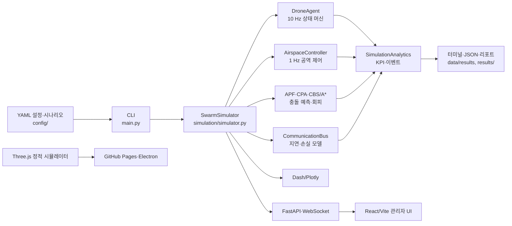

<div align="center">

# SDACS
## Swarm Drone Airspace Control System

군집드론 공역통제 자동화 시스템 · 국립목포대학교 드론기계공학과 캡스톤 디자인

[](https://www.python.org/)
[](VERSION.md)
[](https://github.com/sun475300-sudo/swarm-drone-atc/actions/workflows/ci.yml)
[](https://sun475300-sudo.github.io/swarm-drone-atc/)
[](LICENSE)

[**3D 시뮬레이터 실행**](https://sun475300-sudo.github.io/swarm-drone-atc/simulator.html) · [해양 탐지 시뮬레이터](https://sun475300-sudo.github.io/swarm-drone-atc/maritime_detection_simulator.html) · [웹 패키지 다운로드](https://github.com/sun475300-sudo/swarm-drone-atc/releases/tag/v1.5.0) · [문서 색인](docs/INDEX.md) · [English](README.en.md)

</div>


> **성격과 범위**: SDACS는 SimPy 기반 이산 이벤트 시뮬레이터와 브라우저 3D 시각화 도구를 중심으로 한 연구·교육용 프로젝트입니다. 여기의 성능 수치, 시나리오, 규제·표준 모듈은 시뮬레이션 또는 프로토타입 검증값이며 실제 비행 안전 인증, 운항 승인, 규제 적합성 판정, 상용 관제 서비스의 근거가 아닙니다.

## 목차

- [프로젝트 한눈에 보기](#프로젝트-한눈에-보기)
- [현재 상태](#현재-상태)
- [어떤 실행 화면을 선택할까?](#어떤-실행-화면을-선택할까)
- [아키텍처와 데이터 흐름](#아키텍처와-데이터-흐름)
- [요구 사항과 설치](#요구-사항과-설치)
- [빠른 시작](#빠른-시작)
- [CLI 명령 전체](#cli-명령-전체)
- [시나리오와 설정](#시나리오와-설정)
- [빌드와 배포](#빌드와-배포)
- [출력물과 생성 파일](#출력물과-생성-파일)
- [검증과 CI](#검증과-ci)
- [저장소 지도](#저장소-지도)
- [성숙도와 알려진 한계](#성숙도와-알려진-한계)
- [문제 해결](#문제-해결)
- [문서와 연구 자산](#문서와-연구-자산)
- [현재 남은 작업](#현재-남은-작업)
- [기여, 보안, 인용](#기여-보안-인용)

## 프로젝트 한눈에 보기

SDACS는 단일 애플리케이션이 아니라 같은 도메인을 여러 깊이에서 탐색하는 도구 모음입니다.

| 기능 | 구현 | 현재 용도 |
|---|---|---|
| 이산 이벤트 군집 시뮬레이션 | SimPy, NumPy, APF, CBS/A*, CPA 기반 충돌 예측·회피 | 반복 가능한 연구 실험과 회귀 검증 |
| 공역·드론 모델 | 드론 상태 머신, 우선순위, 통신 버스, 기상·고장 주입, 비행 허가 | 알고리즘 단위 및 통합 실험 |
| 시나리오 실행 | 10개 런타임 YAML 시나리오, quick/full Monte Carlo | 정상·고밀도·통신 두절·기상·침입 실험 |
| 공개 벤치마크 | 표준 7종 + 스트레스 3종, ORCA/VO/CBS/SDACS 어댑터 | 방법 간 재현 가능한 비교 |
| 브라우저 시각화 | Three.js 군집드론 및 해양 소형선 탐지 시뮬레이터 | 데모, 교육, UI·상호작용 실험 |
| Python 시각화 | Dash/Plotly 3D 대시보드 | Python 분석·데모 |
| 서비스 실험 | FastAPI, WebSocket, JWT/RBAC, React/Vite | 공역 관리자용 서비스 아키텍처 프로토타입 |
| 데스크톱 패키징 | Electron Builder, Windows/macOS/Linux 대상 | 오프라인 실행 파일 제작 |
| 재현·운영 자산 | Docker, Helm, 모니터링 설정, CI, canonical hash | 재현성·배포 구조 검토 |

## 현재 상태

마지막 저장소 점검일은 **2026-07-30 (KST)** 입니다. 최신 소스와 자동 검증 결과는 [`main`](https://github.com/sun475300-sudo/swarm-drone-atc/commits/main) 및 [GitHub Actions](https://github.com/sun475300-sudo/swarm-drone-atc/actions)을 기준으로 확인합니다.

| 상태 | 항목 | 확인 결과 |
|:---:|---|---|
| ✅ | 프로젝트 버전 | `pyproject.toml`과 `package.json` 기준 `1.5.0` |
| ✅ | 기본 브랜치 | `main` — 브랜치 통합 완료 |
| ✅ | GitHub Actions | Python 3.10/3.11/3.12 CI, 보안 감사, 시뮬레이터 스모크 및 Pages 배포 게이트 운영 |
| ✅ | 디자인 시스템 | v2.0 적용 완료 (CSS 변수 기반 글래스모피즘 HUD) |
| ✅ | 웹 릴리스 | [v1.5.0 Release](https://github.com/sun475300-sudo/swarm-drone-atc/releases/tag/v1.5.0) 정적 웹 ZIP (`SDACS-Simulator-Web-v1.5.0.zip`) |
| ✅ | 데스크톱 앱 | [v1.5.0 Release](https://github.com/sun475300-sudo/swarm-drone-atc/releases/tag/v1.5.0) Linux AppImage (`SDACS-Simulator-1.5.0-x86_64.AppImage`) |
| ✅ | Python 회귀 | Python 3.10 / 3.11 / 3.12, 제한 린트, mypy, 커버리지 80% 게이트 통과 |
| ✅ | 연합 브라우저 E2E | `ws_bridge` 2개와 Chromium 2페이지 상호 LIVE 고스트 렌더링 성공 |
| ⏳ | 실환경 검증 | Pixhawk·Jetson·RTK·HITL·실비행·규제 승인 근거는 향후 과제 (Phase 261-280) |

## 어떤 실행 화면을 선택할까?

| 목적 | 권장 진입점 | 기본 포트 | 필요한 도구 |
|---|---|---:|---|
| 알고리즘을 가장 빨리 실행 | `python main.py simulate` | - | Python |
| YAML 시나리오 반복 실험 | `python main.py scenario ...` | - | Python |
| 방법 간 단일 벤치마크 | `python main.py benchmark ...` | - | Python |
| 가장 완성된 시각 데모 | `python scripts/serve.py` | 8123 | Python + 브라우저 |
| Python 3D 대시보드 | `python main.py visualize` | 8050 | Python |
| API·WebSocket 통합 개발 | `python main.py api` | 8000 | Python API 의존성 |
| React 공역 관리자 UI | `cd frontend && npm run dev` | 3000 | Node.js |
| 설치형 데스크톱 앱 | `npm start` 또는 `./SDACS-Simulator-*.AppImage` | - | Node.js + Electron |
| 전체 스택 컨테이너 데모 | `docker compose up` | 8050 | Docker |

## 아키텍처와 데이터 흐름


```mermaid
flowchart LR
    CFG["YAML 설정·시나리오<br/>config/"] --> CLI["CLI<br/>main.py"]
    CLI --> SIM["SwarmSimulator<br/>simulation/simulator.py"]
    SIM --> AGENT["DroneAgent<br/>10 Hz 상태 머신"]
    SIM --> CTRL["AirspaceController<br/>1 Hz 공역 제어"]
    SIM --> APF["APF·CPA·CBS/A*<br/>충돌 예측·회피"]
    SIM --> COMMS["CommunicationBus<br/>지연·손실 모델"]
    AGENT --> ANALYTICS["SimulationAnalytics<br/>KPI·이벤트"]
    CTRL --> ANALYTICS
    APF --> ANALYTICS
    COMMS --> ANALYTICS
    ANALYTICS --> OUT["터미널·JSON·리포트<br/>data/results, results/"]
    SIM --> DASH["Dash/Plotly"]
    SIM --> API["FastAPI·WebSocket"]
    API --> REACT["React/Vite 관리자 UI"]
    WEB["Three.js 정적 시뮬레이터"] --> PAGES["GitHub Pages·Electron"]
```

## 요구 사항과 설치

### 지원 환경

- Python **3.10 이상**; CI 검증 범위는 3.10, 3.11, 3.12
- Node.js **22 권장**; Electron·브라우저 E2E CI가 Node 22 사용
- 최신 Chromium 계열 브라우저; E2E는 Playwright Chromium 사용

### Python 개발 환경

```bash
git clone https://github.com/sun475300-sudo/swarm-drone-atc.git
cd swarm-drone-atc

python -m venv .venv
# Linux/macOS: source .venv/bin/activate
# Windows: .\.venv\Scripts\Activate.ps1

python -m pip install --upgrade pip
python -m pip install -e ".[dev]"
```

## 빠른 시작

### 1. Python 시뮬레이션

```bash
# 60초, 20대, 시드 42
python main.py simulate --duration 60 --drones 20 --seed 42

# 명명된 시나리오 확인·실행
python main.py scenario --list
python main.py scenario weather_disturbance --runs 3 --seed 42 --duration 120
```

### 2. 브라우저 시뮬레이터 (웹 버전)

```bash
# 저장소 루트를 HTTP로 서빙하고 군집드론 시뮬레이터 열기
python scripts/serve.py
```

브라우저 시뮬레이터는 기본적으로 내장 데모 데이터를 사용합니다. Python `SwarmSimulator`의 스냅샷을 받으려면 WebSocket 브리지를 별도 실행하고 `?live=1`로 연결을 명시하세요.

```bash
# 터미널 1: 기본 ws://127.0.0.1:8765
python -m pip install websockets
python simulation/ws_bridge.py --drones 50

# 터미널 2: 정적 시뮬레이터
python scripts/serve.py --no-browser --port 8123
# 브라우저에서 http://127.0.0.1:8123/swarm_3d_simulator.html?live=1 열기
```

### 3. 데스크톱 앱 (Linux)

GitHub Releases에서 `SDACS-Simulator-1.5.0-x86_64.AppImage`를 다운로드하여 실행합니다.
```bash
chmod +x SDACS-Simulator-1.5.0-x86_64.AppImage
./SDACS-Simulator-1.5.0-x86_64.AppImage
```

## CLI 명령 전체

모든 명령은 `python main.py <command> --help`로 최신 옵션을 확인할 수 있습니다.

| 명령 | 목적 | 대표 예시 |
|---|---|---|
| `simulate` | 단일 SimPy 실행과 KPI 요약 | `python main.py simulate --duration 60 --drones 20 --seed 42` |
| `scenario` | 런타임 YAML 시나리오 목록·반복 실행 | `python main.py scenario high_density --runs 5` |
| `monte-carlo` | 설정 조합 quick/full 스윕 | `python main.py monte-carlo --mode quick` |
| `benchmark` | 시나리오·방법·시드가 고정된 비교 셀 | `python main.py benchmark --scenario 01_corridor_crossing --method sdacs_hybrid --seed 0` |
| `visualize` | Dash/Plotly 3D 대시보드 | `python main.py visualize --port 8050 --drones 30` |
| `visualize-3d` | 로컬 Three.js 시뮬레이터 열기 | `python main.py visualize-3d` |
| `api` | FastAPI·WebSocket 백엔드 | `python main.py api --host 127.0.0.1 --port 8000` |
| `ops-report` | 배송·교통·기상·컴플라이언스 운영 리포트 번들 | `python main.py ops-report --scenario demo --seed 42` |

## 시나리오와 설정

`config/` 디렉터리에 시나리오가 정의되어 있습니다. 주요 시나리오:
- `default`: 기본 설정 (50대)
- `high_density`: 고밀도 트래픽 (150대)
- `emergency_failure`: 비상 고장 주입 (80대)
- `weather_disturbance`: 기상 악화 시나리오 (100대)
- `route_conflict`: 경로 교차 및 충돌 회피 중심 (100대)

## 빌드와 배포

### 웹 정적 빌드
```bash
python scripts/build_simulator.py
# build/simulator/ 폴더에 정적 에셋 생성됨
```

### Electron 데스크톱 앱 빌드
```bash
npm ci
npm run dist:linux   # Linux AppImage 빌드
npm run dist:win     # Windows NSIS 빌드
npm run dist:mac     # macOS DMG 빌드
```

## 출력물과 생성 파일

| 작업 | 권장 위치 | 내용 |
|---|---|---|
| `simulate --output` | 사용자가 지정한 JSON | 단일 실행 KPI |
| Monte Carlo | `data/results/` | sweep 결과 |
| `benchmark --output` | `results/` 권장 | 방법·시나리오·시드별 JSON |
| `ops-report` | `data/e2e_reports/` | JSON, Markdown, manifest JSON |
| 웹 빌드 | `build/simulator/` | 정적 배포 패키지 |
| Electron 빌드 | `dist-desktop/` | 데스크톱 앱 패키지 |

## 검증과 CI

### Python 품질 게이트
```bash
ruff check src/ simulation/
mypy src/
python -m pytest tests/ -q
```

### 웹·프론트엔드 E2E
```bash
npm run pw:install
npm run test-server &
$env:SIM_URL='http://localhost:8123/swarm_3d_simulator.html'
npm run smoke
```

## 저장소 지도

| 경로 | 책임 | 변경 시 함께 볼 것 |
|---|---|---|
| [`main.py`](main.py) | CLI 진입점 | CLI 예시, 테스트, README |
| [`simulation`](simulation) | SimPy 실행 엔진과 연구 모듈 | `config/`, `tests/`, 성숙도 |
| [`src/airspace_control`](src/airspace_control) | 공역 제어 핵심 도메인 | controller·planning·avoidance·comms |
| [`benchmarks`](benchmarks) | 공개 비교 스위트 | manifest schema, adapters, 결과 |
| [`api`](api) | FastAPI, JWT/RBAC, WebSocket | `frontend/`, API 테스트 |
| [`frontend`](frontend) | React 관리자 UI | Vite proxy, API 계약 |
| [`desktop`](desktop) | Electron shell | 루트 package, 정적 자산 |
| [`tests`](tests) | Python 및 E2E 회귀 | pytest marker, Playwright |
| [`docs`](docs) | 설계·연구·운영 문서 | 문서 날짜와 코드 정합성 |

## 성숙도와 알려진 한계

- SimPy Python 엔진, Three.js 웹 엔진, 해양 시뮬레이터는 서로 다른 런타임이며 상태와 물리 모델이 자동 동기화되지 않습니다.
- 하드웨어·SITL·HITL·규제·표준 모듈의 파일 존재는 실제 장비 연결, 기관 승인, 인증 완료를 의미하지 않습니다.
- `benchmarks/`에는 manifest와 설명이 있지만 일부 과거 문서가 언급하는 시나리오별 `expected_results.yaml`은 현재 트리에 없습니다.

## 문제 해결

- **HTML을 열었는데 Three.js가 표시되지 않음**: `file://` 대신 HTTP로 서빙하세요 (`python scripts/serve.py`).
- **한글 로그 깨짐**: Windows Terminal 또는 PowerShell에서 `$env:PYTHONIOENCODING='utf-8'` 설정 후 실행하세요.
- **웹 빌드 정합성 검사 실패**: 루트 정본 HTML을 수정한 뒤 사본을 수동 편집하지 말고 `python scripts/build_simulator.py`를 다시 실행하세요.

## 문서와 연구 자산

| 목적 | 문서 |
|---|---|
| 전체 문서 색인 | [docs/INDEX.md](docs/INDEX.md) |
| 시스템 아키텍처 | [docs/architecture.md](docs/architecture.md) |
| 재현성 가이드 | [docs/REPRODUCIBILITY.md](docs/REPRODUCIBILITY.md) |
| 논문 기여와 투고 준비 | [docs/paper/contribution_outline.md](docs/paper/contribution_outline.md) |
| 사업화·산학 트랙 | [docs/track_f/README.md](docs/track_f/README.md) |
| 장기 로드맵 | [ROADMAP.md](ROADMAP.md) |

## 현재 남은 작업

아래 항목은 2026-07-30 기준 저장소 점검 후 정리한 **미완성 작업 리스트**입니다.

- [ ] **GitHub 계정 및 권한 설정**
  - `main` 브랜치 보호 설정 (필수 CI 및 리뷰 요구)
  - GitHub Discussions 활성화 및 커뮤니티 라벨 적용
  - Dependabot PR 지속적 검증 및 병합
- [ ] **연구 논문 및 DOI**
  - Zenodo 연동 및 GitHub Release DOI 자동 발급 완료하기
  - ORCID 등록 및 K-UTM 표준화 초안(TTA) 제안서 작성
  - IROS 2026 PaperCept 계정 등록 및 투고 준비
- [ ] **실제 환경 및 하드웨어 (Phase 261-380)**
  - Pixhawk·Jetson·RTK 하드웨어 루프 통합 (SITL/HITL)
  - 양방향 디지털 트윈 구축 (실제 비행 데이터와 시뮬레이터 연동)
- [ ] **사업화 및 외부 협력 (Phase 410-499)**
  - GUTMA 기고 및 해외 파일럿 기관 협력
  - 전남 도서 지역 90일 실증 파일럿 예산 확보 및 실행
  - 차세대 캡스톤 팀으로의 기수 이양 준비

## 기여, 보안, 인용

- 기여 절차: [CONTRIBUTING.md](CONTRIBUTING.md)
- 보안 취약점 신고: [SECURITY.md](SECURITY.md)
- 라이선스: [MIT License](LICENSE)
- 프로젝트 인용 메타데이터: [CITATION.cff](CITATION.cff)

이 저장소의 자동화와 시뮬레이터는 연구·교육·프로토타이핑에 적합합니다. 사람, 항공기, 재산에 영향을 줄 수 있는 실제 운용에는 독립적인 안전성 검증, 규제 승인, 보안 평가, 운영 책임 체계가 필요합니다.
