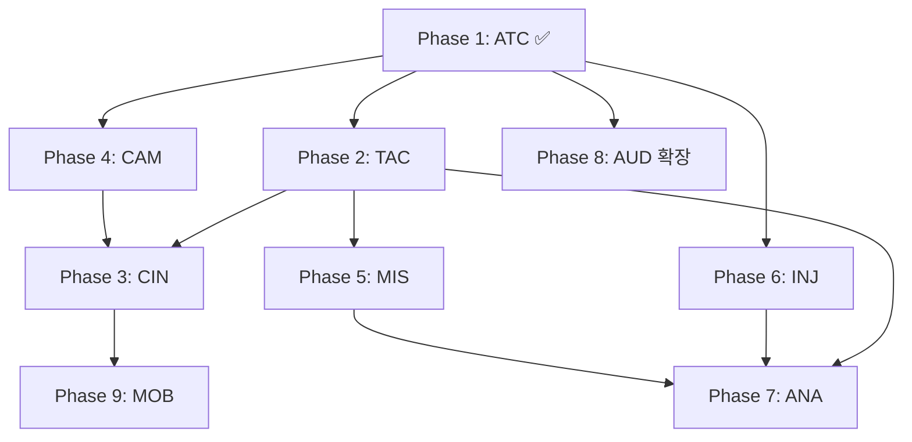

# 🛠 SDACS 시뮬레이터 Phase 2-9 상세 구현 플랜

*Created: 2026-06-04 — Phase 1 ATC 콘솔 완료 후 후속 7개 Phase 명세*

본 문서는 [`SIMULATOR_ULTRA_PLAN.md`](SIMULATOR_ULTRA_PLAN.md)의 9개 트랙(ATC/TAC/CIN/CAM/MIS/INJ/ANA/AUD/MOB) 중 **Phase 1(ATC) 완료** 이후의 후속 Phase별 실행 가능 명세. 각 Phase는 독립 PR로 진행 가능하며, 의존 관계는 §10 참조.

---

## Phase 1 완료 상태 (참고)

✅ ATC 명령 콘솔 (HOLD/RTB/REROUTE/ALT±/SPD±/TURN±/CLEAR)
✅ Web Speech TTS 한국어 어드바이저리
✅ Web Audio 비프 경보 (자동 충돌 임박)
✅ 시안 발광 링 + 헤더 카운터
✅ 명령 감사 로그 패널 + CSV `## ATC_Commands` 시트
✅ Playwright E2E 10/11 통과, 회귀 4,140/4,140
✅ `_sdacs.atcCommand / atcLog / atcControlled / setAtcAudio / clearAllAtc`

---

## Phase 2 — Track TAC: 전술 시각화 (Tactical Visualization)

### 목표
관제사가 현재 상태뿐 아니라 **다음 10초 미래**를 시각적으로 파악할 수 있게 한다. 충돌 책임·회피 전략·우선순위 의도를 한 화면에서 읽을 수 있어야 한다.

### 핵심 산출물 (~600-800 line)

#### TAC-1. 예측 비행경로 라인 (Predicted Trajectory)
- 각 드론의 다음 N초(기본 8초) 궤적을 곡선으로 렌더
- 등속 직선 외에도 APF 회피 결과 시뮬레이션 결과 반영 (sub-step 0.5초 단위)
- 색상: 현재→미래 그라데이션 (white → cyan → fade)
- 데이터 모델:
  ```js
  d._predTrail = {
    points: Float32Array(N * 3),  // (N+1) × xyz
    geometry: BufferGeometry,
    line: THREE.Line,
    horizon: 8.0,                  // seconds
    dirty: true,                   // 마지막 시뮬틱과 다르면 재계산
  };
  ```
- 토글: `tg-pred-trail` 체크박스 (기본 ON, megaMode에서는 자동 OFF)
- LOD: 드론 200대↑에서 horizon=4초, 500대↑에서 자동 OFF
- API: `_sdacs.setPredTrail(on)` / `predHorizon=N`

#### TAC-2. CPA 충돌점 마커 + TTC 라벨
- 위험 쌍별로 `🎯` 마커를 예측 충돌점에 배치
- TTC(Time-To-CPA) 라벨 + 이격거리 표시: `2.4s · 18m`
- 위험도 그라데이션: TTC < 2s 적색·1.5px / 2~5s 황색·1px / 5s+ 회색·반투명
- `_cpaMarkerPool` 재사용 (현재 `_linePool`처럼)
- 데이터 모델:
  ```js
  cpaMarkers: [{ x, y, z, ttc, cpaDist, pair: [aId, bId], severity }]
  ```
- 토글: 기존 `tg-conflict` 체크박스 확장
- Phase 1 어드바이저리 빌보드와 통합 (avoid double-render)

#### TAC-3. 속도 벡터 화살표 (Velocity Arrows)
- 선택된 드론 또는 호버된 드론 위에 `THREE.ArrowHelper`
- 길이 = `speed × 2` (m/s → 2m 시각 단위), 방향 = (vx, vy, vz)
- 색상: 속도 < 5m/s 청색, 5-15 녹색, 15-25 황색, >25 적색
- 토글: `tg-vel-arrow`
- 다중 선택(Shift+클릭) 시 모든 선택 드론에 표시

#### TAC-4. 분리 표준 거품 (Separation Bubble)
- 선택 드론 주변에 수평 거품(`NEAR_MISS_DIST=100m` 반경) + 수직 디스크(`SEPARATION_ALT=20m`)
- 와이어프레임 구체 + 동심 수평 디스크
- 다른 드론이 거품에 진입 시 거품 색상 적색 깜빡임
- 데이터 모델:
  ```js
  bubble = {
    horizMesh: THREE.Mesh,  // SphereGeometry (radius=100) wireframe
    vertMesh: THREE.Mesh,   // CylinderGeometry (h=40m) wireframe
    breachCount: 0,
    flashUntil: 0,
  };
  ```
- 토글: `tg-sep-bubble`

#### TAC-5. 우선순위 심볼
- 드론 위 빌보드에 우선순위 아이콘 (P1=★ 적색 / P3=◆ 황색 / P5+=● 회색)
- 기존 `advisoryGroup` 옆에 배치
- megaMode에서는 자동 비활성

#### TAC-6. 회피 의도선 (APF Vector Preview)
- 선택 드론의 현재 APF 합력 벡터를 화살표로 표시
- 의도 회피 방향 시각화 → 관제사가 자율 행동 예측 가능
- 색상: 회피 강도에 따라 0~1 alpha

### UI Mockup
```
┌────────────────────────────────────────────┐
│ [3D 뷰포트]                                │
│      ↗ DR-007                              │
│      │ V:12.4m/s ↗                        │
│      ◯  ←─────  separation bubble          │
│      │                                     │
│      │   2.4s · 18m  🎯                   │
│      │              ╲                      │
│      │  predicted    DR-013                │
│      ╰──────────╲   ◯                     │
│                  ╲                         │
└────────────────────────────────────────────┘
좌측 패널: [tg-pred-trail ☑] [tg-vel-arrow ☑]
            [tg-sep-bubble ☑] [tg-conflict ☑]
```

### 데이터 모델 변경
```js
// 드론 신규 필드
d._predTrail = null;           // lazy 생성
d._velArrow = null;            // lazy
d._sepBubble = null;           // lazy (선택 시만)
d._priIcon = null;             // 빌보드

// 전역
const _predPool = [];          // BufferGeometry 풀
const _cpaMarkerPool = [];     // sprite 풀
const _arrowPool = [];         // ArrowHelper 풀
```

### E2E 테스트 (10 cases)
1. 예측 라인이 N+1 포인트로 생성되는지
2. 호버 드론에 속도 화살표 표시
3. 토글 OFF 시 즉시 숨김
4. mega 시나리오에서 자동 LOD
5. CPA 마커가 위험쌍 수와 일치
6. TTC < 2s 마커 색상 적색
7. 분리 거품 진입 감지 → 적색 플래시
8. 우선순위 아이콘 P1-P9 매핑
9. 60fps 유지 (300대 시나리오)
10. `_sdacs.cpaMarkers` API 반환

### 의존성 & 리스크
- Three.js BufferGeometry + ArrowHelper (기존 사용 중)
- 리스크: 200대 이상에서 예측선 N×8 포인트가 GC 부담 → 풀 재사용 + horizon LOD로 완화
- 위험도 결정 로직은 기존 `apfCollisionAvoidance` 재사용

### 예상 작업량
- 신규 코드 ~700 line (HTML + JS)
- E2E 테스트 ~250 line
- 1.5 PR (1차 TAC-1/2/3, 2차 TAC-4/5/6)

---

## Phase 3 — Track CIN: 시네마틱 모드 (Cinematic)

### 목표
시연 영상 품질로 끌어올린다. 발표·논문·홍보 영상 제작에 그대로 쓸 수 있는 비주얼.

### 핵심 산출물 (~500-700 line)

#### CIN-1. 동적 태양 + 시간대 슬라이더
- `THREE.DirectionalLight` 위치를 (시간 0-24h)에 따라 호로 이동
- 0시=동쪽 지평선 아래, 12시=정상, 18시=서쪽 지평선
- 천공 색상 그라데이션 (시아노 새벽 → 백색 정오 → 노란 황혼 → 깊은 청 야간)
- 그림자 활성화 (shadow map 1024x1024)
- 데이터 모델:
  ```js
  const sunCycle = {
    enabled: false,
    hour: 12.0,            // 0-24
    autoAdvance: false,    // 1초당 0.1h
    sunLight: DirectionalLight,
    skyMaterial: ShaderMaterial,
  };
  ```
- UI: 상단 ☀️ 토글 + 시간 슬라이더 (0-24)
- API: `_sdacs.setSunHour(h)` / `setSunAuto(true)`

#### CIN-2. 입자 효과 (안개·비·눈)
- 비: 5,000 라인 세그먼트, gravity 18m/s, 카메라 frustum 내 spawn
- 눈: 3,000 sprite, 회전·드리프트
- 안개: `scene.fog = new THREE.FogExp2(0x0a0e16, 0.008)` + 동적 농도
- 마이크로버스트 활성 시 자동 비 강도 ↑
- 토글: 각 효과 독립 토글 + 강도 슬라이더

#### CIN-3. 포스트프로세싱 파이프라인
- `EffectComposer` + `RenderPass`
- `UnrealBloomPass` (강도 0.6, 임계값 0.85) — 드론 글로우·NFZ 마커 강조
- `SMAAPass` 안티앨리어싱
- `SSAOPass` 옵션 (성능 50% 부담)
- 토글: ⚙️ 비주얼 메뉴에 체크박스 3개

#### CIN-4. 영상 녹화 (MediaRecorder)
- `canvas.captureStream(60)` → `MediaRecorder` (VP9/WebM 또는 H.264/MP4)
- 코덱 자동 감지 (`MediaRecorder.isTypeSupported`)
- 녹화 중 빨간 점멸 인디케이터 우측 상단
- 최대 5분 또는 50MB까지 (둘 중 먼저)
- 토글: 🔴 REC 버튼 → 중지 → 자동 다운로드
- API: `_sdacs.startRecording() / stopRecording()`

#### CIN-5. 시네마틱 카메라 프리셋 5종
- `intro`: 5초 dolly-in (외곽→중앙)
- `topdown-orbit`: 30초 톱다운 정면 회전
- `chase`: 가장 빠른 드론 follow (12초)
- `collision-zoom`: 충돌 발생 직전 자동 줌인 → 0.5x 슬로우 (재생 속도 조절)
- `outro`: 카메라 후퇴 + 페이드 아웃
- API: `_sdacs.playCinematic('intro')`

#### CIN-6. 색감 LUT
- 필름 (warm, +saturation)
- 야간투시 (green tint, contrast)
- 열영상 (false-color thermal mapping by speed)
- ShaderPass 적용, 토글 3종

### UI Mockup
```
┌─── 🎬 시네마틱 ────────┐
│ ☀️ [12.0h ▼]  □ Auto  │
│ 🌧 비 [▮▮▮▮▮▯▯▯▯▯] 5/10│
│ ❄ 눈 [▮▮▯▯▯▯▯▯▯▯] 2/10│
│ 🌫 안개 [▮▮▮▮▯▯▯▯▯▯] 4/10│
│ ✨ Bloom    ☑          │
│ 🎯 SMAA     ☑          │
│ 🌑 SSAO     □ (느림)   │
│ ───────────────────── │
│ 🔴 REC      ⏺          │
│ ▶ 시네마틱 [intro ▼]   │
│ 🎨 LUT     [필름 ▼]    │
└────────────────────────┘
```

### E2E 테스트 (8 cases)
1. 태양 시간 변경 시 light.position 호 위치 확인
2. 비 입자 생성 시 정확한 갯수
3. Bloom ON/OFF 시 composer 활성화
4. 녹화 시작 → 1초 후 종료 → blob URL 생성
5. 시네마틱 'intro' 5초간 카메라 보간
6. LUT 변경 시 shader uniform 갱신
7. 안개 농도 변화 → fog.density
8. 녹화 코덱 자동 감지 (mp4 또는 webm)

### 의존성 & 리스크
- Three.js postprocessing addons (CDN: `examples/jsm/postprocessing/`)
- MediaRecorder API — 일부 브라우저(Safari iOS) 제한적, 폴백 메시지
- 리스크: 포스트프로세싱 + 입자 동시 활성 시 60→30fps. LOD 시스템 필요

### 예상 작업량
- 신규 코드 ~600 line
- 새 importmap 항목 5개 (postprocessing addons)
- 1 PR

---

## Phase 4 — Track CAM: 카메라 모드 (Camera Modes)

### 목표
관제사 시점뿐 아니라 **드론 조종사 시점**도 볼 수 있게 한다. 발표·교육·디버깅에 모두 유용.

### 핵심 산출물 (~400-500 line)

#### CAM-1. 1인칭 onboard FPV
- 선택 드론의 위치·자세에 카메라 부착
- 카메라 위치 = `drone.group.position + (0, 0.4, 0.3)` (드론 head)
- 카메라 회전 = drone.heading + drone.pitch
- 미니 HUD 오버레이: 고도·속도·기수·배터리·다음 웨이포인트
- 마우스 wheel → FOV 30-90도 (기본 60)
- 단축키: `1` FPV / `2` chase / `3` orbit / `4` free

#### CAM-2. 추적 카메라 (Chase Cam)
- 드론 뒤 8m, 위 3m 지점 spring-damped follow
- damping factor 0.08, smooth 추종
- 드론 변속 시 카메라 약간 추월 → 가속감
- 다중 선택 시 가중평균 위치 추종

#### CAM-3. 톱다운 / 사이드 빠른 전환
- `T` (top), `S` (side), `O` (orbit), `F` (free), `R` (reset)
- 각 모드에서 OrbitControls target 자동 조정
- 0.4초 보간 (Tween)

#### CAM-4. 다중 카메라 PiP
- 메인 뷰 + 우측 하단 작은 뷰 3개 (160×120)
- 작은 뷰 각각 독립 시점 (예: 군집 중심·충돌 위험 지역·관제사 헬리캠)
- 렌더 비용: 메인 1pass + 3 sub-pass (각 50ms 부담 → 30fps 가능)
- 토글: `PiP ON/OFF` + 위치/개수 설정

#### CAM-5. 카메라 흔들림 (Camera Shake)
- 충돌·근접 발생 시 0.5초 흔들림
- amplitude = severity × 0.3
- 시네마틱 모드에서 자동 활성

### UI Mockup
```
[캐릭터 좌측 하단]
🎥 카메라
 [1] FPV     [2] Chase
 [3] Orbit   [4] Free
 [T]옵      [S]사이드
 [PiP ☑ ×3]
 [흔들림 ☑]
```

### E2E 테스트 (6)
1. FPV 모드: camera.position == drone.position + offset
2. Chase: 드론 이동 시 카메라 spring lag
3. Top/Side 단축키 → 카메라 위치 즉시 변경
4. PiP 활성 시 sub-canvas 3개 렌더
5. FOV 변경 (mouse wheel)
6. 흔들림: collision 후 0.5초간 camera shake amplitude

### 예상 작업량
- ~450 line
- 1 PR

---

## Phase 5 — Track MIS: 임무 계획 UI (Mission Planning)

### 목표
시뮬레이션 중에도 관제사가 새로운 임무를 즉시 발행할 수 있다. UAV 운영자의 실무 워크플로우 재현.

### 핵심 산출물 (~700-900 line)

#### MIS-1. 맵 클릭 → 웨이포인트 추가
- 평면도(top-down) 모드에서 클릭 시 마커 추가
- Shift+클릭: 추가 웨이포인트 누적 (경로 형성)
- 우클릭 마커: 삭제
- 마커는 노란 다이아몬드 + 번호 라벨

#### MIS-2. 임무 할당
- 사이드 패널 "신규 임무" — 시작점·웨이포인트·목적지·할당 드론 선택
- 드론 선택: 드롭다운 (가용 GROUNDED·HOLDING 드론만)
- 시작 버튼 → 드론에 `mission` 필드 주입, phase=ENROUTE
- 데이터 모델:
  ```js
  d.mission = {
    waypoints: [{x, y, z, label}, ...],
    currentIdx: 0,
    dispatched: simTime,
    completion: 0.0,
  };
  ```

#### MIS-3. 실시간 임무 재계획
- 진행 중 임무에 웨이포인트 삽입/삭제 가능
- "긴급 우회" 버튼 → 가장 가까운 안전 지역으로 즉시 변경
- 임무 취소 → ATC HOLD or RTB 자동 전환

#### MIS-4. 자동 우회경로 미리보기
- A* 격자(50m 셀, 100×100) 기반 NFZ·건물 회피 경로 계산
- 점선 라인으로 추천 경로 표시 → 확정 버튼
- RRT 옵션 (대안 경로 3개 후보)

#### MIS-5. 임무 템플릿
- 수색: 격자 패턴 비행 (4×4 셀)
- 정찰: 원형 궤도 (반경 500m)
- 배달: A→B 직선
- 방제: Voronoi 분할 (이미 `src/applications/agri_spray.py` 존재)
- 의료: heap 우선순위 (이미 `src/applications/medical_delivery.py` 존재)

### UI Mockup
```
┌─── 📋 임무 계획 ─────────┐
│ 신규 임무                 │
│ 출발: [DR-005 ▼]          │
│ 목표: 클릭으로 추가        │
│  ─ WP1 (1240, 80, -560)  │
│  ─ WP2 (-340, 120, 800)  │
│  ─ WP3 (0, 50, 0)        │
│ 템플릿: [수색 ▼]          │
│ 자동 우회: ☑              │
│ [시작]  [취소]            │
├──────────────────────────┤
│ 진행 중 임무 (3)          │
│ DR-007 → 75% (WP2/4)     │
│ DR-013 → 12% (WP1/3)     │
│ DR-021 → 100% ✓          │
└──────────────────────────┘
```

### E2E 테스트 (8)
1. 평면도에서 클릭 → waypoint 마커 추가
2. Shift+클릭 → 경로 누적
3. 임무 시작 → d.mission 필드 생성
4. 웨이포인트 도달 → currentIdx 증가
5. 모든 WP 통과 → completion=1.0 → 자동 RTL
6. A* 우회 경로 NFZ 회피 검증
7. 긴급 우회 버튼 → phase 변경
8. 템플릿 "수색" → 16개 WP 자동 생성

### 의존성 & 리스크
- 신규 코드 ~800 line
- A* 격자 — 100×100 셀이면 메모리 OK, 계산 ~5ms
- 리스크: 진행 중 임무에 wp 삽입 시 race condition. mutex 또는 sim-tick 단위 batch update.

---

## Phase 6 — Track INJ: 장애 주입 콘솔 (Fault Injection)

### 목표
5계층 안전망(드론/APF/CPA/ATC/UTM)이 실제로 작동하는지 시연한다. 발표 시연·연구 robustness 검증의 핵심.

### 핵심 산출물 (~400-500 line)

#### INJ-1. 단일 장애 주입
- GPS 손실: `d.gpsLost=true` 5-30초 → wx/wz에 노이즈 ±20m
- 모터 페일: `d.motorFail=true` → maxSpeed = 50%
- 배터리 급강하: 5%/s 소모 → 자동 RTL 트리거
- 통신 두절: `d.commsLost=true` → ATC 명령 무시
- 로그 손상: 텔레메트리 dropout (`d.flightTime` 누적 정지)
- Rogue 드론: 임의 위치 spawn + NFZ 횡단
- 동적 NFZ: 클릭 위치에 임시 NFZ (반경 100m, 60초)

#### INJ-2. 시나리오 일괄 주입
- "도시 EMP": 모든 드론 30% 동시 GPS 손실
- "EMI 폭격": 통신 두절 비율 50% (10초간)
- "배터리 한계": 배터리 < 20% 드론 모두 RTL 강제
- "센서 노이즈": 모든 위치 ±5m 노이즈 (지속)

#### INJ-3. 장애 통계 패널
- 활성 장애 카운터 (GPS lost: 3, motor fail: 1, ...)
- 5계층 안전망 응답 시간 측정
- 안전망 작동 확인 KPI

### UI Mockup
```
┌─── 💥 장애 주입 ─────────┐
│ 대상 드론: [DR-007 ▼]     │
│ ━━━ 단일 장애 ━━━          │
│ [📡 GPS 손실]  [⚙️ 모터]  │
│ [🔋 배터리]   [📵 통신]  │
│ [📊 로그]    [👹 Rogue]  │
│ ━━━ 시나리오 ━━━            │
│ [🌃 도시 EMP]              │
│ [📡 EMI 폭격]              │
│ [🔋 배터리 한계]            │
│ ━━━ 활성 장애 ━━━          │
│ GPS lost   : 3            │
│ motor fail : 1            │
│ comms lost : 2            │
│ rogue       : 1            │
│ ─ NFZ dyn  : 2 (30s, 45s)│
└──────────────────────────┘
```

### E2E 테스트 (10)
1. GPS 손실 주입 → wx/wz 노이즈 검증
2. 모터 페일 → maxSpeed 50%
3. 배터리 급강하 → 5초 후 < 70%
4. 통신 두절 → atcCommand 무시
5. Rogue spawn → 새 드론 생성 + isRogue=true
6. 동적 NFZ → inNFZ(x,z) true
7. EMP 시나리오 → 30% 드론 GPS lost
8. 안전망 응답 시간 < 100ms
9. 장애 해제 시 정상 복구
10. 통계 카운터 정확성

### 예상 작업량
- ~450 line
- 1 PR

---

## Phase 7 — Track ANA: 분석 강화 (Analytics)

### 목표
연구·논문용 데이터 수집과 발표용 비교 시각화. KPI를 자동으로 LaTeX 표로 출력.

### 핵심 산출물 (~500-600 line)

#### ANA-1. 누적 충돌 히트맵
- 세션 전체 동안 위협 발생 위치를 그리드(100×100)에 누적
- decay 옵션 (지수 감쇠, time constant 60s)
- 분석 뷰 Q2에 토글 (instantaneous vs cumulative)
- 색상: viridis colormap

#### ANA-2. 실시간 KPI 오버레이 그래프
- 좌측 사이드 패널에 작은 차트 4개 (각 80x40px)
- 충돌해결률 / 경로효율 / 평균 배터리 / FPS
- 5초 슬라이딩 윈도우
- requestAnimationFrame 무관 (sim-tick 단위 갱신)

#### ANA-3. A·B 시나리오 사이드바이사이드
- 두 시나리오 동시 실행 (각각 절반 viewport)
- 동기 시간축 + 동기 카메라
- KPI 비교 표 자동 생성 (좌 vs 우)

#### ANA-4. LaTeX 표 자동 출력
- 현재 KPI 값을 `\begin{table}\begin{tabular}{...}\end{tabular}\end{table}` 형식으로 출력
- 클립보드 복사 or `.tex` 파일 다운로드
- 시나리오·드론수·기상 변수 메타 헤더 자동 추가

#### ANA-5. 충돌 책임 분석 ✅ 구현 완료
- 분리위반(충돌·근접) 발생 시 통행권 규칙으로 양보 의무 드론 판정 (우선순위 숫자가 큰 쪽이 책임, 동급 시 ID 결정론)
- 결과: "DR-021 (P8) failed to yield to DR-006 (P6)" — 분석 로그 패널 + 책임 드론 적색 발광 링 (5초 펄스)
- 토글 `tg-ana-blame`(기본 OFF) · `_sdacs` API: `setAnaBlame`/`anaBlame`/`anaBlameCount`/`anaBlameActive`/`anaBlameRecords`/`resetAnaBlame`
- GPU/Worker/CPU 3개 충돌 감지 경로 모두에 연결 · E2E 4종 (`test_simulator_mis_ana_mob.py`)

#### ANA-6. 드론별 텔레메트리 CSV
- 각 드론마다 10Hz 샘플 (wx, wy, wz, vx, vy, vz, phase, battery)
- 별도 시트 `## TelemetryPerDrone` 추가 (드론수 × 시간)
- 메모리: 100대 × 600초 × 10Hz × 8필드 = 4.8MB → OK

### UI Mockup
```
┌─── 📊 분석 ─────────────┐
│ 누적 히트맵 ☑           │
│ decay [60s ▼]           │
│ ───────────────────────│
│ A·B 비교 ☑              │
│ 좌: [도시 광주 ▼]        │
│ 우: [고밀도 50 ▼]       │
│ [동기 카메라 ☑]         │
│ ───────────────────────│
│ 출력 형식:               │
│ [📄 LaTeX 표] [📑 CSV]  │
│ [📋 책임 분석]           │
└────────────────────────┘
```

### E2E 테스트 (8)
1. 히트맵 셀 누적 카운트 검증
2. decay 함수 정확성 (e^(-t/tau))
3. KPI 오버레이 차트 5초 윈도우
4. A·B 모드 동기 시간축
5. LaTeX 출력 형식 검증 (\begin{table})
6. 책임 분석: P1 vs P3 → P3 책임
7. 텔레메트리 CSV row 수 (드론×시간×10Hz)
8. 클립보드 복사 동작

---

## Phase 8 — Track AUD: 음성·사운드 확장 (Audio)

### 목표
Phase 1의 ATC 음성 + 비프를 확장해 풀 사운드스케이프 만들기.

### 핵심 산출물 (~250-350 line)

#### AUD-1. 환경 사운드
- 풍속 < 5: 가벼운 바람 화이트노이즈
- 풍속 5-10: 강한 바람
- 풍속 > 10: 돌풍 + 휘파람 효과
- 폭우 / 폭설 / 천둥 (마이크로버스트 발생 시)
- 모두 Web Audio API 합성 (외부 음원 없음)

#### AUD-2. 드론 모터 사운드
- 호버: 60Hz 사인 + 200Hz 하모닉
- 비행: 80-150Hz 변조 (속도 비례)
- 카메라 거리 < 50m 드론만 청취 (FPV 모드에서 강화)
- 최대 8개 동시 (mixing 부하 제한)

#### AUD-3. 임계 알람 톤
- 충돌 임박 (< 0.5s): 480Hz 더블 비프 + 적색 화면 가장자리
- 배터리 < 15%: 880Hz 펄스
- NFZ 침입: 1320Hz 사이렌
- 모두 음성 토글에 묶임

#### AUD-4. 한국어 TTS 확장
- 어드바이저리 풀: 50개 표준 문구 미리 정의
  - "관제 음성 활성화", "긴급 분리 명령", "착륙 허가 발급", ...
- 음성 큐 (queue) — 순차 재생, 끊김 없음

### 예상 작업량
- ~300 line
- 1 PR

---

## Phase 9 — Track MOB: 모바일·터치 지원 (Mobile)

### 목표
태블릿(iPad/Galaxy Tab) 발표용 — 손가락으로 군집 시뮬레이션을 조작.

### 핵심 산출물 (~400-500 line)

#### MOB-1. 터치 제스처
- 핀치 zoom (2 finger)
- 팬 (1 finger drag)
- 더블 탭 → 드론 선택
- 길게 누르기 → 컨텍스트 메뉴 (ATC 명령)
- 3 finger swipe → 시점 전환

#### MOB-2. 반응형 UI
- viewport < 1024px: 사이드 패널 자동 접힘 (햄버거 메뉴)
- 버튼 hit area 최소 44×44px
- 폰트 14px 이상

#### MOB-3. 모바일 자동 LOD
- userAgent 감지 + GPU info
- 모바일 = 최대 100대, megaMode 자동 비활성
- 30fps fallback 시 입자·glow 자동 OFF

#### MOB-4. PWA Manifest
- `manifest.json` + Service Worker
- 오프라인 캐싱 (HTML + Three.js)
- "홈 화면에 추가" 지원
- 풀스크린 모드

### UI Mockup
```
[768px 폭 태블릿]
┌──────────────┐
│ ☰ SDACS   ⋮ │ ← 햄버거 + 메뉴
├──────────────┤
│              │
│   [3D 뷰]    │ ← 풀스크린 뷰포트
│              │
│              │
├──────────────┤
│ ▶ ⏸ ⏮ [시나리오 ▼] │ ← 하단 토스트 컨트롤
└──────────────┘
```

### E2E 테스트 (6)
1. iPad Safari user agent → mobile 모드 활성
2. 핀치 제스처 → 카메라 zoom 변경
3. 더블 탭 → selectDrone 호출
4. 769px viewport → 패널 접힘
5. PWA install prompt 발생
6. Service Worker 캐시 hit

---

## 10. 의존 그래프



권장 진행 순서: **P2 → P4 → P6 → P5 → P3 → P7 → P8 → P9**

## 11. 마일스톤 & KPI

| Phase | 트랙 | 코드 라인 | E2E 케이스 | 예상 PR 수 | 누적 진척 |
|---|---|---|---|---|---|
| ✅ 1 | ATC | +451 | 11 | 1 (완료) | 100% (Phase 1) |
| 2 | TAC | ~700 | 10 | 1-2 | |
| 3 | CIN | ~600 | 8 | 1 | |
| 4 | CAM | ~450 | 6 | 1 | |
| 5 | MIS | ~800 | 8 | 1-2 | |
| 6 | INJ | ~450 | 10 | 1 | |
| 7 | ANA | ~550 | 8 | 1 | |
| 8 | AUD | ~300 | 5 | 1 | |
| 9 | MOB | ~450 | 6 | 1 | |
| **누적** | — | **~4,750** | **~72** | **8-10** | **Phase 1-9 완료** |

## 12. 검증 공통 사항

각 Phase 마다:
1. **Playwright E2E** 신규 테스트 추가 (위 항목별 케이스)
2. **회귀**: `pytest tests/ -v` 전체 통과
3. **JS 구문**: `node --check` 통과
4. **사본 동기화**: `swarm_3d_simulator.html` ↔ `visualization/` ↔ `docs/×2`
5. **성능 회귀**: 50대 기본 시나리오 60fps 유지
6. **메모리 회귀**: 5분 실행 후 메모리 누수 < 50MB

## 13. 외부 의존성 추가 (CDN/모듈)

| Phase | 의존성 |
|---|---|
| 3 (CIN) | `three/addons/postprocessing/EffectComposer.js`, `RenderPass`, `UnrealBloomPass`, `SMAAPass`, `SSAOPass` |
| 3 (CIN 녹화) | MediaRecorder API (브라우저 표준) |
| 4 (CAM) | 없음 |
| 5 (MIS) | A* 격자 알고리즘 — 내부 구현 |
| 8 (AUD) | Web Audio API + Speech Synthesis (브라우저 표준) |
| 9 (MOB) | PWA Manifest + Service Worker |

추가 npm 패키지 없음. 전부 vanilla.

## 14. 리스크 매트릭스

| 리스크 | 영향 | 완화 |
|---|---|---|
| megaMode (1K-10K) 성능 저하 | 높음 | LOD 자동 + 토글로 일부 비주얼 끄기 |
| MediaRecorder Safari 미지원 | 중 | 폴백 메시지 + WebM 대안 |
| Web Speech API 한국어 보이스 부재 | 중 | TTS 비활성 시 자막 표시 |
| 모바일 GPU 약함 | 중 | userAgent 감지 + 자동 LOD |
| A* 격자 메모리 (100×100) | 낮 | 4KB 미만 |
| 다중 카메라 PiP 30fps | 중 | sub-canvas 해상도 50% |
| 시네마틱 + 입자 + Bloom 60→30fps | 높 | 동시 활성 제한 + 경고 |

## 15. 다음 단계 (Phase 2 즉시 시작)

1. `feat/phase2-tac` 브랜치 생성
2. TAC-1 예측 라인 (200 line) → TAC-2 CPA 마커 → TAC-3 속도 화살표 순차
3. E2E 테스트 `tests/e2e/test_simulator_tac.py` 신설
4. PR 분리: 1차 TAC-1/2/3 (필수), 2차 TAC-4/5/6 (선택)

---

## 16. 참고 문서

- [`SIMULATOR_ULTRA_PLAN.md`](SIMULATOR_ULTRA_PLAN.md) — 9 트랙 개요
- [`STATUS_REPORT.md`](../STATUS_REPORT.md) — 본 세션 PR 머지 현황
- [`ULTRA_PLAN.md`](ULTRA_PLAN.md) — Phase 691-755 잔여 5항목
- 시뮬레이터 본체: `swarm_3d_simulator.html` 7,515 line (Phase 1 완료 후)
- ATC 콘솔 구현 커밋: `eecfd81` (2026-06-04)
