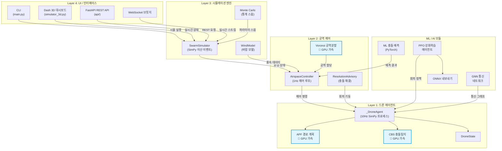
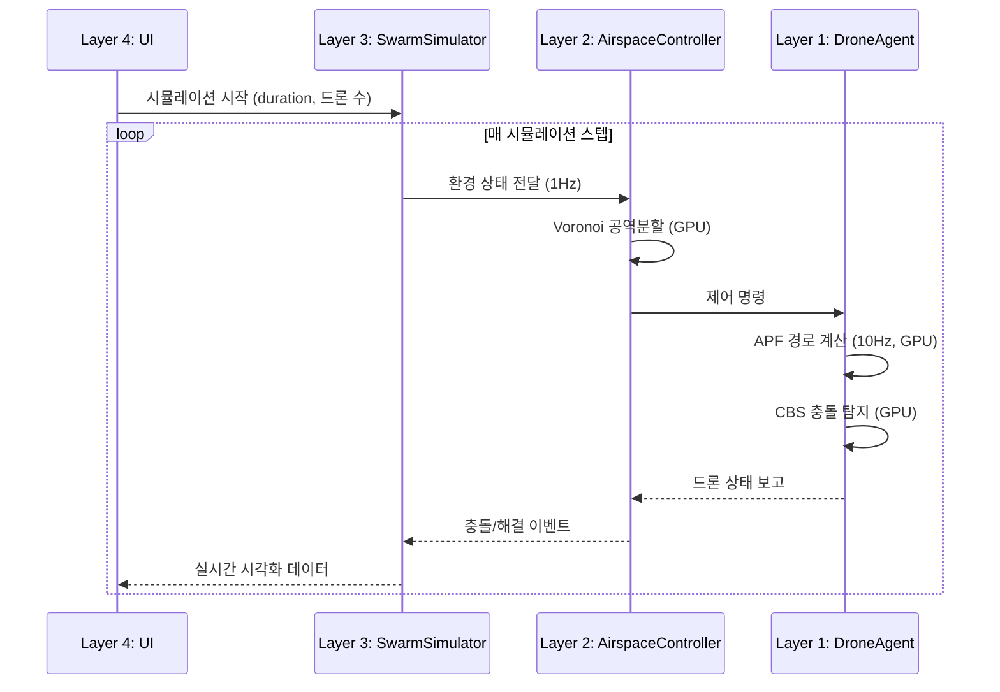

# SDACS 아키텍처

## 4-Layer 아키텍처 개요

## 데이터 흐름

## GPU 가속 모듈

| 모듈 | 설명 | 기술 |
|------|------|------|
| APF 엔진 | 인공 포텐셜 필드 경로 계획 | PyTorch CUDA |
| CBS 충돌탐지 | 다중 에이전트 충돌 감지 | PyTorch CUDA |
| Voronoi 공역분할 | 동적 공역 파티셔닝 | PyTorch CUDA |
| ML 충돌 예측 | 사전 충돌 위험 예측 | PyTorch + FP16 |
| PPO 에이전트 | 강화학습 회피 정책 | PyTorch + ONNX |
