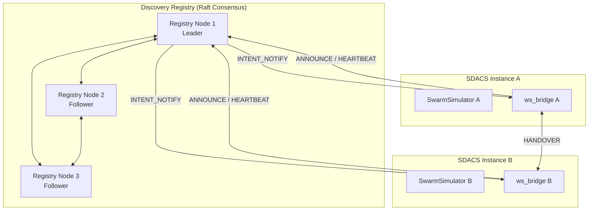

# 🛰 인스턴스 간 디스커버리 프로토콜 (ODYSSEY Phase 421)

*Created: 2026-06-17 · 근거: ASTM F3548-21 (USS Interoperability), GUTMA Global UTM Architecture, ICAO UTM Framework*
*용도: 다중 SDACS 인스턴스 간 탐색·동기화·핸드오버를 위한 프로토콜 사양 초안*
*선행: TRANSCENDENCE Phase 241-260 (다중 사용자), P741 Raft HA, ws_bridge*

---

## 면책 조항

본 문서는 **목포대학교 캡스톤 프로젝트 내부 개발 참고용**입니다.
실 UTM 운영에 직접 적용할 수 없으며, ASTM F3548-21 표준의 완전한 구현을 주장하지 않습니다.
DSS(Discovery and Synchronization Service) 개념을 SDACS 시뮬레이션 환경에 적합하도록 **결정론적 모델**로 단순화한 것입니다.

---

## 1. 배경 및 동기

### 1.1 왜 디스커버리가 필요한가

SDACS Phase 1-300은 **단일 인스턴스** 시뮬레이터를 전제로 설계되었습니다.
한 명의 관제사(ATC)가 하나의 공역을 전담하며, 모든 드론 상태는 단일 `SwarmSimulator` 프로세스 내에서 공유됩니다.

그러나 실 UTM 환경에서는 다음과 같은 시나리오가 발생합니다:

| 시나리오 | 설명 | 기존 SDACS 한계 |
|---|---|---|
| **다중 지역 운영** | 서울·부산 각각 독립 SDACS 인스턴스 운영 | 인스턴스 간 정보 교환 경로 없음 |
| **다중 운영자** | A사·B사가 동일 공역에서 각자 관제 | 충돌 의도(intent) 공유 불가 |
| **수평 확장** | 드론 수 1,000+ 시 단일 프로세스 한계 | 공역 분할 후 경계 핸드오버 미정의 |
| **연합 훈련** | 복수 대학·기관이 연합 시뮬레이션 | ws_bridge가 1:N 단방향 |

### 1.2 기존 자산 활용

| 자산 | 위치 | Phase 421 활용 |
|---|---|---|
| Raft 합의 | `src/raft/cluster.py` | 인스턴스 레지스트리 합의, 리더 선출 |
| WebSocket 브릿지 | `simulation/ws_bridge.py` | 인스턴스 간 메시지 전송 계층 |
| 공역 예약 | `simulation/airspace_reservation.py` | 4D 볼륨 예약 → Operational Intent 기반 |
| K-UTM 프로토콜 | `simulation/kutm_protocol.py` | 한국 UTM 비행계획 포맷 재사용 |
| 다중 사용자 인프라 | TRANSCENDENCE 241-260 | FastAPI + WebSocket 다중 접속 기반 |

---

## 2. ASTM F3548 DSS 개요

ASTM F3548-21 "Standard Specification for UAS Traffic Management (UTM) UAS Service Supplier (USS) Interoperability"는
USS(UAS Service Supplier) 간 상호운용을 위한 3대 핵심 기능을 정의합니다.

### 2.1 Discovery (탐색)

특정 공역 영역에서 활동 중인 **다른 USS 인스턴스를 찾는 메커니즘**입니다.

```
USS-A: "위도 34.8~35.0, 경도 126.3~126.5 구간에서 운영 중인 USS가 있는가?"
  ↓ (DSS 질의)
DSS: "USS-B가 해당 구간에 2건의 Operational Intent를 등록했습니다."
```

### 2.2 Synchronization (동기화)

USS가 자신의 **운영 의도(Operational Intent)**를 DSS에 등록하면, 해당 공역을 구독 중인 다른 USS에게 통보됩니다.

- **Operational Intent Reference (OIR)**: 4D 볼륨 (위도·경도·고도·시간) + 상태(Accepted/Activated/Nonconforming)
- **Subscription**: 관심 영역을 등록하면 해당 영역의 OIR 변경 시 콜백 수신

### 2.3 Conflict Detection (충돌 감지)

동일 4D 볼륨을 점유하려는 복수의 OIR이 존재할 때, DSS가 겹침을 감지하고 관련 USS에게 알림을 전송합니다.
**최종 충돌 해소는 USS 간 협상**으로 이루어지며, DSS는 감지와 통보만 담당합니다.

```
┌─────────────────────────────────────────────────────┐
│                    ASTM F3548 DSS                    │
│                                                     │
│  ┌──────────┐   ┌──────────────┐   ┌─────────────┐ │
│  │ Discovery│   │Synchronization│  │  Conflict   │ │
│  │          │   │              │   │  Detection  │ │
│  │ USS 탐색 │   │  OIR 등록    │   │  볼륨 겹침  │ │
│  │ 구독 관리│   │  구독 통보    │   │  알림 전파  │ │
│  └──────────┘   └──────────────┘   └─────────────┘ │
│         ▲               ▲                ▲          │
│         │               │                │          │
└─────────┼───────────────┼────────────────┼──────────┘
          │               │                │
    ┌─────┴──┐      ┌─────┴──┐       ┌────┴───┐
    │ USS-A  │      │ USS-B  │       │ USS-C  │
    │(SDACS-1)│     │(SDACS-2)│      │(SDACS-3)│
    └────────┘      └────────┘       └────────┘
```

---

## 3. SDACS 디스커버리 모델

ASTM F3548 DSS를 SDACS 시뮬레이션 환경에 맞춰 **결정론적 모델**로 재구성합니다.
실제 DSS는 분산 클라우드 서비스이지만, SDACS에서는 **Raft 합의 기반 인프로세스 레지스트리**로 구현합니다.

### 3.1 아키텍처 개요



### 3.2 레지스트리 기반 디스커버리 (Primary)

**중앙 레지스트리 + Raft 합의** 방식으로 인스턴스를 관리합니다.

| 항목 | 설계 |
|---|---|
| 레지스트리 구성 | 3노드 Raft 클러스터 (`RaftCluster` 재사용) |
| 인스턴스 등록 | `ANNOUNCE` 메시지로 자기 자신을 레지스트리에 등록 |
| 생존 확인 | `HEARTBEAT` 주기: 5초 (시뮬레이션 시계 기준) |
| 타임아웃 | 3회 연속 HEARTBEAT 누락 시 인스턴스를 `OFFLINE` 으로 전이 |
| 영역 정보 | 각 인스턴스가 관리하는 공역 바운딩 박스 (위도·경도·고도 범위) |

**레지스트리 상태 머신:**

```
                 ANNOUNCE
    ┌──────┐  ───────────►  ┌────────┐
    │UNKNOWN│                │ ONLINE │◄─── HEARTBEAT (주기적)
    └──────┘                └────┬───┘
                                 │ 3회 HEARTBEAT 누락
                                 ▼
                            ┌────────┐
                            │OFFLINE │
                            └────┬───┘
                                 │ ANNOUNCE (재등록)
                                 ▼
                            ┌────────┐
                            │ ONLINE │
                            └────────┘
```

### 3.3 피어-투-피어 폴백 (Secondary)

LAN 환경 또는 레지스트리 불가 상황에서는 **mDNS + 가십 프로토콜**로 인스턴스를 탐색합니다.

| 항목 | 설계 |
|---|---|
| 서비스 타입 | `_sdacs-discovery._tcp.local.` |
| 가십 주기 | 10초마다 알려진 피어 목록 교환 |
| 수렴 조건 | 전체 인스턴스 리스트가 동일해질 때까지 교환 반복 |
| 적용 환경 | 동일 서브넷 내 2-5개 인스턴스 (LAN 데모·연합 훈련용) |

### 3.4 Operational Intent Reference (OIR)

ASTM F3548의 OIR을 SDACS 좌표계로 매핑합니다.

```python
@dataclass(frozen=True)
class OperationalIntentRef:
    """4D 운영 의도 참조 — ASTM F3548 OIR의 SDACS 적응."""
    oir_id: str                          # UUID v4
    instance_id: str                     # 발행 인스턴스 ID
    state: OIRState                      # ACCEPTED | ACTIVATED | NONCONFORMING | WITHDRAWN
    volume: Volume4D                     # 4D 바운딩 볼륨
    priority: int                        # 1(최고) ~ 5(최저)
    created_at: float                    # 시뮬레이션 시각 (초)
    expires_at: float                    # 만료 시각
    drone_ids: tuple[str, ...]           # 해당 볼륨 내 드론 ID 목록


@dataclass(frozen=True)
class Volume4D:
    """4차원 공역 볼륨 정의."""
    lat_min: float
    lat_max: float
    lon_min: float
    lon_max: float
    alt_min: float                       # m AGL
    alt_max: float                       # m AGL
    time_start: float                    # 시뮬레이션 시각 (초)
    time_end: float                      # 시뮬레이션 시각 (초)
```

### 3.5 구독 모델

인스턴스는 **관심 영역(Area of Interest, AoI)**을 레지스트리에 등록합니다.
해당 영역의 OIR이 생성·변경·삭제되면 콜백 알림을 수신합니다.

```
Instance A                    Registry                   Instance B
    │                             │                          │
    │──SUBSCRIBE(area=Seoul)─────►│                          │
    │                             │                          │
    │                             │◄──INTENT_PUBLISH(Seoul)──│
    │                             │                          │
    │◄──INTENT_NOTIFY(B의 OIR)────│                          │
    │                             │                          │
```

구독 매칭 알고리즘은 `Volume4D` 간 **AABB(Axis-Aligned Bounding Box) 겹침 검사**를 사용합니다:

```python
def volumes_overlap(a: Volume4D, b: Volume4D) -> bool:
    """두 4D 볼륨의 겹침 여부를 판정합니다."""
    return (
        a.lat_min <= b.lat_max and a.lat_max >= b.lat_min
        and a.lon_min <= b.lon_max and a.lon_max >= b.lon_min
        and a.alt_min <= b.alt_max and a.alt_max >= b.alt_min
        and a.time_start <= b.time_end and a.time_end >= b.time_start
    )
```

---

## 4. 메시지 포맷

모든 메시지는 **JSON over WebSocket** 으로 전송됩니다.
공통 엔벨로프 구조를 따릅니다.

### 4.1 공통 엔벨로프

```json
{
  "protocol": "sdacs-discovery",
  "version": "0.1.0",
  "msg_type": "ANNOUNCE | HEARTBEAT | INTENT_PUBLISH | INTENT_QUERY | CONFLICT_NOTIFY | HANDOVER_REQUEST | HANDOVER_ACK",
  "msg_id": "uuid-v4",
  "timestamp": 1234.56,
  "sender_id": "sdacs-instance-001",
  "payload": { }
}
```

| 필드 | 타입 | 설명 |
|---|---|---|
| `protocol` | string | 고정값 `"sdacs-discovery"` |
| `version` | string | 프로토콜 버전 (SemVer) |
| `msg_type` | string | 메시지 종류 (아래 6종 + 2종) |
| `msg_id` | string | UUID v4, 멱등성 보장용 |
| `timestamp` | float | 시뮬레이션 시각 (초) |
| `sender_id` | string | 발신 인스턴스 ID |
| `payload` | object | 메시지 종류별 페이로드 |

### 4.2 ANNOUNCE — 인스턴스 등록

인스턴스가 레지스트리에 자신의 존재를 알립니다. 최초 등록 및 재등록에 사용합니다.

```json
{
  "protocol": "sdacs-discovery",
  "version": "0.1.0",
  "msg_type": "ANNOUNCE",
  "msg_id": "a1b2c3d4-...",
  "timestamp": 0.0,
  "sender_id": "sdacs-seoul-01",
  "payload": {
    "instance_name": "SDACS Seoul Region 1",
    "endpoint": "ws://10.0.1.10:8765",
    "coverage_volume": {
      "lat_min": 37.4,
      "lat_max": 37.7,
      "lon_min": 126.8,
      "lon_max": 127.2,
      "alt_min": 0,
      "alt_max": 150
    },
    "capabilities": ["APF", "CBS", "CPA", "ATC", "UTM"],
    "max_drones": 200,
    "software_version": "6.0.0"
  }
}
```

### 4.3 HEARTBEAT — 생존 확인

5초 주기로 발송합니다. 레지스트리는 3회 연속 누락 시 해당 인스턴스를 `OFFLINE`으로 전이합니다.

```json
{
  "protocol": "sdacs-discovery",
  "version": "0.1.0",
  "msg_type": "HEARTBEAT",
  "msg_id": "e5f6g7h8-...",
  "timestamp": 15.0,
  "sender_id": "sdacs-seoul-01",
  "payload": {
    "active_drones": 47,
    "active_oirs": 3,
    "load_pct": 23.5,
    "status": "NOMINAL"
  }
}
```

### 4.4 INTENT_PUBLISH — 운영 의도 공유

인스턴스가 새로운 OIR을 레지스트리에 등록합니다. 레지스트리는 해당 영역을 구독 중인 다른 인스턴스에게 `INTENT_NOTIFY`를 전파합니다.

```json
{
  "protocol": "sdacs-discovery",
  "version": "0.1.0",
  "msg_type": "INTENT_PUBLISH",
  "msg_id": "i9j0k1l2-...",
  "timestamp": 30.0,
  "sender_id": "sdacs-seoul-01",
  "payload": {
    "oir": {
      "oir_id": "oir-uuid-001",
      "state": "ACTIVATED",
      "volume": {
        "lat_min": 37.50,
        "lat_max": 37.55,
        "lon_min": 126.90,
        "lon_max": 126.95,
        "alt_min": 30,
        "alt_max": 120,
        "time_start": 30.0,
        "time_end": 330.0
      },
      "priority": 2,
      "drone_ids": ["DR-001", "DR-002", "DR-003"]
    }
  }
}
```

### 4.5 INTENT_QUERY — 볼륨 내 의도 조회

특정 4D 볼륨 내에 등록된 모든 OIR을 레지스트리에 질의합니다.

```json
{
  "protocol": "sdacs-discovery",
  "version": "0.1.0",
  "msg_type": "INTENT_QUERY",
  "msg_id": "m3n4o5p6-...",
  "timestamp": 25.0,
  "sender_id": "sdacs-busan-01",
  "payload": {
    "query_volume": {
      "lat_min": 37.48,
      "lat_max": 37.58,
      "lon_min": 126.88,
      "lon_max": 126.98,
      "alt_min": 0,
      "alt_max": 150,
      "time_start": 0.0,
      "time_end": 600.0
    },
    "include_states": ["ACCEPTED", "ACTIVATED"]
  }
}
```

**응답 (레지스트리 → 질의자):**

```json
{
  "protocol": "sdacs-discovery",
  "version": "0.1.0",
  "msg_type": "INTENT_QUERY_RESPONSE",
  "msg_id": "q7r8s9t0-...",
  "timestamp": 25.01,
  "sender_id": "registry-leader",
  "payload": {
    "query_msg_id": "m3n4o5p6-...",
    "matching_oirs": [
      {
        "oir_id": "oir-uuid-001",
        "instance_id": "sdacs-seoul-01",
        "state": "ACTIVATED",
        "volume": { "...": "..." },
        "priority": 2
      }
    ],
    "total_count": 1
  }
}
```

### 4.6 CONFLICT_NOTIFY — 겹침 감지 알림

레지스트리가 두 OIR의 4D 볼륨 겹침을 감지했을 때 관련 인스턴스에 전송합니다.

```json
{
  "protocol": "sdacs-discovery",
  "version": "0.1.0",
  "msg_type": "CONFLICT_NOTIFY",
  "msg_id": "u1v2w3x4-...",
  "timestamp": 31.0,
  "sender_id": "registry-leader",
  "payload": {
    "conflict_id": "conflict-uuid-001",
    "oir_a": {
      "oir_id": "oir-uuid-001",
      "instance_id": "sdacs-seoul-01",
      "priority": 2
    },
    "oir_b": {
      "oir_id": "oir-uuid-099",
      "instance_id": "sdacs-busan-01",
      "priority": 3
    },
    "overlap_volume": {
      "lat_min": 37.50,
      "lat_max": 37.53,
      "lon_min": 126.90,
      "lon_max": 126.93,
      "alt_min": 60,
      "alt_max": 120,
      "time_start": 30.0,
      "time_end": 180.0
    },
    "suggested_resolution": "PRIORITY_YIELD",
    "deadline": 36.0
  }
}
```

**충돌 해소 전략 (`suggested_resolution`):**

| 전략 | 설명 |
|---|---|
| `PRIORITY_YIELD` | 낮은 우선순위 인스턴스가 양보 |
| `TEMPORAL_SHIFT` | 시간대 분리 (선착순 또는 협상) |
| `ALTITUDE_SPLIT` | 고도대 분리 |
| `VICKREY_AUCTION` | Phase 424 Vickrey 경매 기반 협상 |

### 4.7 HANDOVER_REQUEST / HANDOVER_ACK — 관제권 이양

드론이 인스턴스 경계를 통과할 때 관제권을 이양합니다. 상세 프로토콜은 **섹션 5** 참조.

**HANDOVER_REQUEST (원본 인스턴스 → 대상 인스턴스):**

```json
{
  "protocol": "sdacs-discovery",
  "version": "0.1.0",
  "msg_type": "HANDOVER_REQUEST",
  "msg_id": "y5z6a7b8-...",
  "timestamp": 120.0,
  "sender_id": "sdacs-seoul-01",
  "payload": {
    "handover_id": "ho-uuid-001",
    "target_instance": "sdacs-busan-01",
    "drone_id": "DR-042",
    "drone_state": {
      "position": [37.55, 126.95, 90.0],
      "velocity": [2.1, 5.3, 0.0],
      "battery_pct": 72.3,
      "mission_id": "M-2026-0617-042",
      "remaining_waypoints": [[35.15, 129.05, 60.0]],
      "safety_layer_states": {
        "apf_active": true,
        "cbs_plan_valid": false,
        "cpa_alerts": [],
        "atc_clearance": "CRUISE",
        "utm_approval": "APPROVED"
      }
    },
    "crossing_point": [37.55, 126.95, 90.0],
    "crossing_time": 122.5,
    "reason": "BOUNDARY_CROSSING"
  }
}
```

**HANDOVER_ACK (대상 인스턴스 → 원본 인스턴스):**

```json
{
  "protocol": "sdacs-discovery",
  "version": "0.1.0",
  "msg_type": "HANDOVER_ACK",
  "msg_id": "c9d0e1f2-...",
  "timestamp": 120.5,
  "sender_id": "sdacs-busan-01",
  "payload": {
    "handover_id": "ho-uuid-001",
    "status": "ACCEPTED",
    "assigned_layer": 3,
    "new_atc_clearance": "CRUISE",
    "transfer_effective_at": 122.5
  }
}
```

---

## 5. 핸드오버 프로토콜

> Phase 423 (지역 간 핸드오버)의 선행 정의입니다.

### 5.1 핸드오버 트리거 조건

드론의 현재 위치가 **소속 인스턴스의 `coverage_volume` 경계로부터 일정 거리 이내**에 진입하면 핸드오버 절차를 개시합니다.

| 파라미터 | 값 | 설명 |
|---|---|---|
| `HANDOVER_TRIGGER_DIST` | 500m | 경계까지의 거리가 이 값 이하이면 핸드오버 개시 |
| `HANDOVER_TIMEOUT` | 10초 (시뮬 시간) | ACK 미수신 시 타임아웃 → RTB 명령 |
| `DUAL_CONTROL_WINDOW` | 5초 (시뮬 시간) | 양쪽 인스턴스가 동시에 모니터링하는 구간 |

### 5.2 3단계 핸드셰이크

```
Instance A (원본)              Instance B (대상)
      │                              │
      │  ① HANDOVER_REQUEST          │
      │─────────────────────────────►│
      │                              │ (드론 상태 수신, 수용 가능 여부 판단)
      │  ② HANDOVER_ACK (ACCEPTED)   │
      │◄─────────────────────────────│
      │                              │
      │  ===== DUAL_CONTROL_WINDOW ===== (5초)
      │  (양쪽 모두 드론 모니터링)     │
      │                              │
      │  ③ HANDOVER_TRANSFER         │
      │─────────────────────────────►│
      │  (최종 상태 스냅샷 전달)       │
      │                              │
      │  Instance A: 드론 관제 해제   │
      │  Instance B: 드론 관제 인수   │
```

**단계별 상세:**

1. **REQUEST**: 원본 인스턴스가 대상 인스턴스에 드론의 현재 상태(위치, 속도, 배터리, 미션, 5계층 안전망 상태)를 포함한 이양 요청을 전송합니다.

2. **ACK**: 대상 인스턴스가 수용 가능 여부를 판단합니다.
   - `ACCEPTED`: 관제 인수 가능. 할당 레이어·ATC clearance를 응답에 포함합니다.
   - `REJECTED`: 수용 불가 (공역 포화, NFZ 등). 거부 사유(`reason`)를 포함합니다.
   - `DEFERRED`: 일시 대기. 재시도 시각(`retry_after`)을 포함합니다.

3. **TRANSFER**: 이중 관제 구간(Dual Control Window) 종료 시 원본 인스턴스가 최종 상태 스냅샷을 전송하고 관제를 해제합니다.

### 5.3 실패 처리

| 시나리오 | 처리 |
|---|---|
| ACK 타임아웃 (10초) | 드론에 RTB 명령 발행, 핸드오버 취소 |
| ACK = REJECTED | 드론에 HOLD 명령 → ATC 판단 대기 |
| TRANSFER 중 연결 단절 | 대상 인스턴스가 마지막 수신 상태로 인수, 원본은 OFFLINE 감지 후 로그 기록 |
| 이중 관제 중 충돌 감지 | 양쪽 모두 APF 회피 실행, 원본 인스턴스가 우선 관제권 보유 |

### 5.4 감사 로그

모든 핸드오버 이벤트는 **불변 감사 로그**에 기록됩니다 (Phase 429 연합 감사 로그 선행).

```python
@dataclass(frozen=True)
class HandoverAuditEntry:
    """핸드오버 감사 로그 항목."""
    handover_id: str
    drone_id: str
    source_instance: str
    target_instance: str
    request_time: float
    ack_time: float | None
    transfer_time: float | None
    status: str                  # COMPLETED | TIMEOUT | REJECTED | FAILED
    drone_state_hash: str        # SHA-256 of serialized drone state
```

---

## 6. 보안

### 6.1 인스턴스 간 인증

| 계층 | 메커니즘 | 설명 |
|---|---|---|
| 전송 계층 | **mTLS** (mutual TLS) | 양방향 인증서 검증. 각 인스턴스는 CA가 서명한 X.509 인증서 보유 |
| 메시지 계층 | **JWT Bearer Token** | `msg_id`·`timestamp`·`sender_id`를 서명. RS256 알고리즘 |
| 연합 계층 | **Trust Federation** | 신뢰할 수 있는 CA 목록을 Raft 합의로 관리 |

### 6.2 JWT 토큰 구조

```json
{
  "header": {
    "alg": "RS256",
    "typ": "JWT",
    "kid": "sdacs-seoul-01-key-2026"
  },
  "payload": {
    "iss": "sdacs-seoul-01",
    "sub": "discovery-protocol",
    "aud": "sdacs-registry",
    "iat": 1750176000,
    "exp": 1750179600,
    "scope": ["announce", "intent.publish", "intent.query", "handover"]
  }
}
```

### 6.3 시뮬레이션 환경 간소화

캡스톤 시뮬레이션에서는 실제 TLS·JWT를 구현하지 않을 수 있습니다.
이 경우 다음과 같이 **보안 스텁**을 제공합니다:

- `auth_mode: "SIMULATED"` — 메시지에 `sender_id`만 검증 (서명 생략)
- `auth_mode: "STRICT"` — mTLS + JWT 전체 적용 (향후 격상 대상)
- 보안 모드는 설정 파일(`config/federation.yaml`)에서 전환합니다.

---

## 7. SDACS 모듈 매핑

Phase 421 프로토콜은 기존 SDACS 모듈과 다음과 같이 연결됩니다.

| 프로토콜 기능 | 기존 모듈 | 파일 경로 | 활용 방식 |
|---|---|---|---|
| 합의 기반 레지스트리 | Raft 클러스터 | `src/raft/cluster.py` | 인스턴스 목록을 Raft 로그로 합의·복제 |
| 메시지 전송 계층 | WebSocket 브릿지 | `simulation/ws_bridge.py` | JSON 메시지 직렬화·역직렬화, 다중 클라이언트 관리 |
| 4D 볼륨 관리 | 공역 예약 | `simulation/airspace_reservation.py` | `Reservation` → `Volume4D` 매핑, 겹침 검사 재사용 |
| K-UTM 연동 | K-UTM 프로토콜 | `simulation/kutm_protocol.py` | 비행계획 포맷을 OIR 포맷으로 변환 |
| HA 페일오버 | Raft HA 컨트롤러 | `src/raft/airspace_controller_ha.py` | 리더 장애 시 레지스트리 자동 페일오버 |
| Remote ID | Remote ID 모듈 | `simulation/remote_id.py` | 드론 식별 정보를 핸드오버 메시지에 포함 |

### 7.1 신규 모듈 (Phase 421 구현 시 생성 예정)

| 모듈 (후보) | 경로 (후보) | 역할 |
|---|---|---|
| `DiscoveryRegistry` | `src/federation/discovery_registry.py` | Raft 기반 인스턴스 레지스트리 |
| `IntentManager` | `src/federation/intent_manager.py` | OIR 등록·조회·구독 관리 |
| `HandoverCoordinator` | `src/federation/handover_coordinator.py` | 3단계 핸드셰이크 오케스트레이션 |
| `FederationTransport` | `src/federation/transport.py` | ws_bridge 확장, 인스턴스 간 메시지 라우팅 |
| `ConflictDetector` | `src/federation/conflict_detector.py` | 4D AABB 겹침 검사 + 알림 전파 |

---

## 8. 프로토콜 버전 협상

ODYSSEY 운영 규칙(§3)에 따라 **인스턴스 간 프로토콜은 버전 협상이 필수**입니다.

### 8.1 버전 정책

| 버전 변경 | 호환성 | 예시 |
|---|---|---|
| PATCH (0.1.x) | 완전 호환 | 오타 수정, 설명 추가 |
| MINOR (0.x.0) | 하위 호환 | 선택 필드 추가 |
| MAJOR (x.0.0) | 비호환 | 메시지 구조 변경 |

### 8.2 ANNOUNCE 시 버전 교환

`ANNOUNCE` 메시지의 `payload.software_version` 필드와 엔벨로프의 `version` 필드를 통해 프로토콜 버전을 교환합니다.
레지스트리는 지원하지 않는 MAJOR 버전의 인스턴스를 거부하고, 거부 사유를 `VERSION_MISMATCH` 로 응답합니다.

---

## 9. 관련 링크

| 항목 | 참조 |
|---|---|
| ASTM F3548-21 | [ASTM 표준 페이지](https://www.astm.org/f3548-21.html) |
| GUTMA Global UTM Architecture | [GUTMA 아키텍처 문서](https://gutma.org/global-utm-architecture/) |
| ICAO UTM Framework | ICAO Doc 10019 (Annex 2 보충) |
| InterUSS Platform (오픈소스 DSS 구현) | [github.com/interuss/dss](https://github.com/interuss/dss) |
| SDACS ODYSSEY 로드맵 | `docs/SIMULATOR_ODYSSEY_PLAN.md` — Track 🛰 Phase 421-440 |
| SDACS TRANSCENDENCE 다중 사용자 | `docs/SIMULATOR_TRANSCENDENCE_PLAN.md` — Track 🌐 Phase 241-260 |
| Phase 422 (OIR 교환 포맷) | *미작성 — 본 문서의 OIR 정의를 기반으로 확장 예정* |
| Phase 423 (지역 간 핸드오버) | *미작성 — 섹션 5의 핸드오버 프로토콜을 확장 예정* |
| Phase 424 (연합 충돌 해소) | *미작성 — 섹션 4.6의 충돌 해소 전략을 확장 예정* |

---

*끝.*
