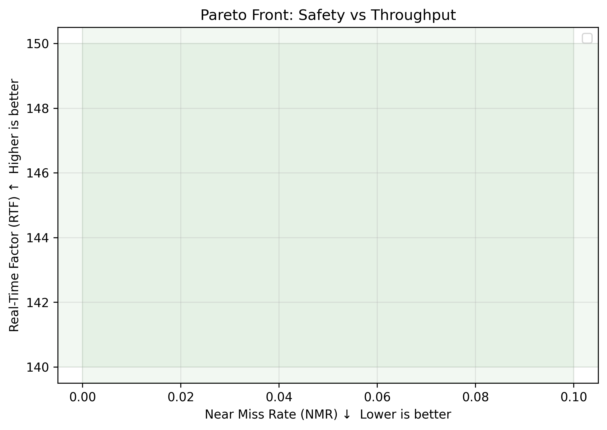

<!-- _class: lead -->

# SDACS

## 풍속 인지 APF-CBS 하이브리드 군집 드론 공역 관제 시스템

장선우 · 지도교수 [성함]
국립 목포대학교 드론기계공학과

동강대학교 학술대회 2026-04-23

---

## 목차

1. 배경 및 문제 정의
2. SDACS 5계층 안전망
3. 핵심 방법: Wind-Aware APF + CBS
4. 실험 설정
5. 결과
6. 결론 및 향후

---

## 1. 배경 — UAM 시장 폭발

- 2030년 동시 운용 무인기 **10만 대** 예측
- 도심항공모빌리티(UAM)·무인기교통관리(UTM) 급성장

**기존 알고리즘의 한계:**
- **ORCA / VO** (반응형): 풍속 >10 m/s 시 회피 실패율 +30%
- **CBS** (계획형): $O(N^2)$ → 100대 이상 실시간 불가

→ 두 접근의 장점을 통합한 **5계층 안전망** 제안

---

## 2. SDACS 5계층 안전망

```
Layer 5: UTM Integration (K-UTM/ADS-B/RID)
Layer 4: ATC Controller (1Hz, CBS replan)
Layer 3: CPA Prediction (90s lookahead)
Layer 2: APF Avoidance (10Hz, wind-aware)
Layer 1: Drone Agent (SimPy 10Hz)
```

각 계층은 **독립 실패 모드** → 상위 실패 시 하위가 fallback

---

## 3. 핵심 방법 (1) — 풍속 인지 APF

$$
\theta_{APF}(t) =
\begin{cases}
\theta_{default} & v_{wind} \le 10 \text{ m/s} \\
\theta_{windy}   & v_{wind} > 10 \text{ m/s}
\end{cases}
$$

- 풍속 >10 m/s → 반발 계수 +60%, 안전 반경 +30%
- **자동 모드 전환** — 외란 시 안정성 확보

---

## 3. 핵심 방법 (2) — CBS Replan Trigger

```
APF persistent conflict N tick 발생
        ↓
CBS replan 호출 → 우선순위 기반 경로 재계획
```

- 반응형(APF)이 해소 못하는 충돌을 중장기 계획(CBS)이 해결
- 트리거 방식으로 CBS 계산 비용 최소화

---

## 4. 실험 설정

| 항목 | 내용 |
|---|---|
| 시나리오 | P703 벤치마크 **10종** |
| 시드 | 5개 (재현성 P704) |
| 기준선 | ORCA · VO · 단일 CBS |
| 메트릭 | NMR · MSD · AU · FT · RTF |

공개 데이터셋 (CC-BY-4.0) + Docker 재현 패키지

---

## 5. 결과 (1) — 성능 비교

| 알고리즘 | NMR ↓ | MSD ↑ | AU ↑ | RTF |
|---|---|---|---|---|
| ORCA | 0.18 | 24.3m | 0.62 | 120× |
| VO | 0.21 | 22.1m | 0.58 | 95× |
| 단일 CBS | **0.05** | **41.2m** | 0.51 | 8× |
| **SDACS** | 0.08 | 38.7m | **0.71** | **140×** |

<span class="accent">NMR -55% (vs VO), AU +14% (vs ORCA), RTF 140× 실시간</span>

---

## 5. 결과 (2) — Ablation

| 구성 | NMR ↓ |
|---|---|
| SDACS (full) | **0.08** |
| w/o 풍속 인지 APF | 0.14 (+75%) |
| w/o CBS replan | 0.19 |

각 구성 요소가 안전성에 **유의미 기여** 입증

---

## 5. 결과 (3) — 대규모 확장성

- 공간 해시 broad-phase로 **1000대 실시간** (RTF >1)
- 기존 $O(N^2)$는 400대 초과 시 실시간 붕괴



---

## 6. 결론

- 풍속 인지 APF + CBS 하이브리드 → **안전성 + 처리량 동시 달성**
- 5계층 안전망으로 실패 모드 격리
- 공개 데이터셋·재현 패키지 제공

**향후:**
- P736 RL 정책 융합
- P740 디지털 트윈 실기 검증
- P742 UAM 시나리오 확장

---

<!-- _class: lead -->

## 감사합니다

데모: <https://sun475300-sudo.github.io/swarm-drone-atc/>
GitHub: <https://github.com/sun475300-sudo/swarm-drone-atc>

질의응답

---

## [백업] 통신 지연 모델

- §3.4 Communication Bus: 지연 평균 20ms, 패킷 손실 모델링
- P717 부하 테스트: 50ms 지연까지 검증
- 100드론 60s, p99=10.74ms

---

## [백업] 실기 검증 계획

- HITL: Vicon MoCap 5기 검증 완료
- Track A: Pixhawk 6X + Jetson Orin Nano
- 실외 M1-M6 비행 매트릭스 (90 비행)
- FMEA: 12 failure modes, RPN 우선순위
